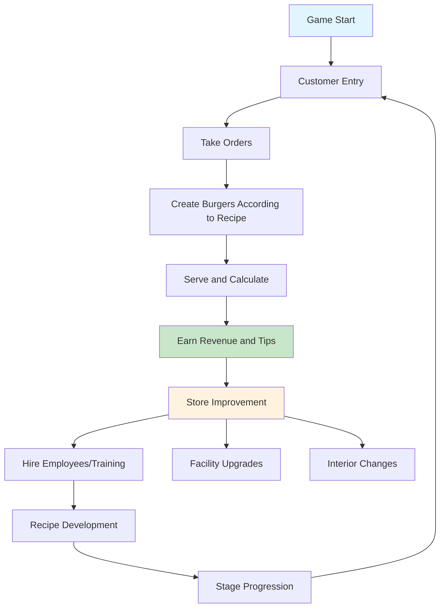

# ChuChuBurger - Burger Store Management Game Overview

## Project Introduction

**ChuChuBurger** is a 2D burger store management simulation game developed on the MapleStory Worlds platform. Players become the owner of a burger store, greeting customers, hiring employees, developing recipes, and growing their store in this management game.

### Game Objectives
- Operate a burger store to increase sales and reputation
- Collect and combine various recipes and ingredients
- Hire and grow employees to improve efficiency
- Progress through stages to unlock new content

## Core Gameplay Loop



### Main Game Flow
1. **Customer Management**: Customers enter to place orders and give tips based on satisfaction
2. **Menu Creation**: Develop recipes and create burgers by combining various ingredients
3. **Employee Operations**: Deploy cook and serving staff for automated store operations
4. **Store Growth**: Use revenue to expand facilities, upgrade equipment, and unlock new features

## Major Functional Systems

### 1. Player Management System
- **Account Management**: Comprehensive management of player progress, currency, achievements, etc.
- **Inventory**: Management of various currencies like gold, hearts, lunch boxes, clovers
- **Progress Status**: Track game progression including stages, levels, achievements, collections

### 2. Customer System
- **AI Customers**: State-based behavior patterns including entry, ordering, waiting, payment, exit
- **Preference System**: Order decisions and satisfaction calculations based on individual customer preferences
- **Spawn Management**: Dynamic customer generation and queue management based on store attractiveness

### 3. Employee System
- **Employee AI**: Automated task processing for cook and serving staff
- **Growth System**: Ability improvement through level-ups, skill unlocks, equipment wearing
- **Management Functions**: Comprehensive employee management including hiring, deployment, salary, training, transfers

### 4. Recipe Creation System
- **Ingredient Combination**: Develop unique recipes by combining various ingredients and buns
- **Balance Management**: Recipe optimization considering taste, spiciness, and balance scores
- **Trend Reflection**: Revenue bonuses for recipes matching market trends

### 5. Store Operations System
- **Facility Management**: Upgrade kitchen appliances, counters, displays, and other facilities
- **Expansion System**: Store space expansion, interior changes, decoration
- **Settlement Management**: Daily/monthly revenue analysis and cost management

## Project Structure

### Folder Structure Overview
```
ChuChuBurger/
├── RootDesk/MyDesk/           # Core game logic
│   ├── 00. Player/            # Player management system
│   ├── 01. Lobby/             # Lobby and store environment
│   ├── 02. Employee/          # Employee system
│   ├── 03. KitchenAppliance/  # Kitchen appliance management
│   ├── 04. Recipe/            # Recipe system
│   ├── 05. Customer/          # Customer system
│   ├── 06. Training/          # Employee training
│   ├── 07. Menu/              # Menu management
│   ├── 08. Event/             # Events and dialogue
│   ├── 09. Management/        # Store management
│   ├── 10. Trial/             # Competition system
│   └── [Other systems...]
├── ui/                        # UI group definitions
├── map/                       # Game maps (by stage)
├── Global/                    # Global settings and models
└── docs/                      # Documentation
```

### Core Component Structure
All major features of the project are registered as components on the player entity in `Global/DefaultPlayer.model`:

- **Data Management**: PlayerDBManager, PlayerInventory, PlayerRecipe
- **Game Systems**: CustomerManager, EmployeeManager, MenuManager  
- **Progress Management**: PlayerStage, PlayerAchievement, PlayerEvent
- **Special Features**: PlayerTrainingManager, PlayerTrial, PlayerVIPOrder

## MapleStory Worlds Platform Characteristics

### Architecture Features
- **Client-Server Separation**: Execution space distinction with `@ExecSpace("ServerOnly")`, `@ExecSpace("ClientOnly")`
- **Component-based**: Modular system design with Entity-Component structure  
- **Event-driven**: Utilization of lifecycle events like OnBeginPlay, OnUpdate, OnMapEnter
- **Automatic Synchronization**: Provides automatic data synchronization between server and client

### Data Management
- **DB System**: Preserve player progress with automatic save/load system
- **CSV Data**: Manage game balance and settings with CSV files
- **Resource Management**: Resource optimization for atlases, animations, sounds, etc.

## Beginner Developer Guide

### Prerequisites
1. **MapleStory Worlds Development Environment** installation and setup
2. **Lua Scripting** basic knowledge (including mlua extension syntax)
3. **Game Design Patterns** understanding (Entity-Component, State Machine, etc.)

### Development Starting Steps
1. **Understand Project Structure**: Learn the role of each folder and main components
2. **Analyze Core Systems**: Learn operating principles of main systems like CustomerManager, EmployeeManager
3. **Track Data Flow**: Understand DB save/load, UI updates, event processing flow
4. **Start with Small Features**: Gradually add features by referencing existing systems

### Key Learning Points
- **State Management**: Customer and employee state-based AI systems
- **Data-driven Design**: Game balance management through CSV data
- **UI System**: Reusable UI component patterns
- **Performance Optimization**: Large list processing and resource management

### Debug and Development Tools
The project includes various tools for development efficiency:
- **Debug Monitor**: Real-time game state monitoring
- **Cheat System**: Cheat commands for development and testing
- **Editor Tools**: Map editing and data configuration tools

## Code Reference

### Core Initialization Systems
- `RootDesk/MyDesk/00. Player/PlayerDBManager.mlua :: OnBeginPlay()` — DB loading and initialization at game start
- `RootDesk/MyDesk/01. Lobby/LobbyManager.mlua :: RequestInit()` — Lobby environment initialization
- `RootDesk/MyDesk/01. Lobby/TimeManager.mlua :: OnUpdate()` — Game time system

### Main Gameplay Systems  
- `RootDesk/MyDesk/05. Customer/CustomerManager.mlua :: SpawnCustomer()` — Customer creation and management
- `RootDesk/MyDesk/02. Employee/EmployeeManager.mlua :: UpdateEmployee()` — Employee status management
- `RootDesk/MyDesk/04. Recipe/PlayerRecipe.mlua :: CreateRecipe()` — Recipe creation system
- `RootDesk/MyDesk/07. Menu/MenuManager.mlua :: UpdateMenu()` — Menu management system

### UI and User Experience
- `RootDesk/MyDesk/Common/UIScript/UIGroupManager.mlua :: OpenUIGroup()` — UI group management
- `RootDesk/MyDesk/08. Event/EventManager.mlua :: CallEvent()` — Event system
- `RootDesk/MyDesk/08. Event/TutorialManager.mlua :: StartTutorial()` — Tutorial system

---

This document provides an overall overview of the ChuChuBurger project. Detailed implementation of each system is covered in the respective system documentation.
