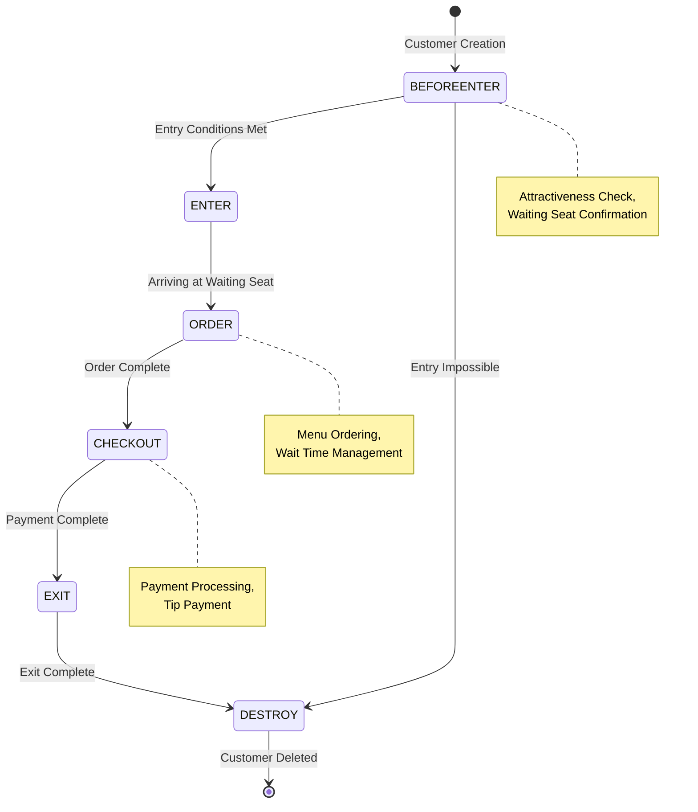
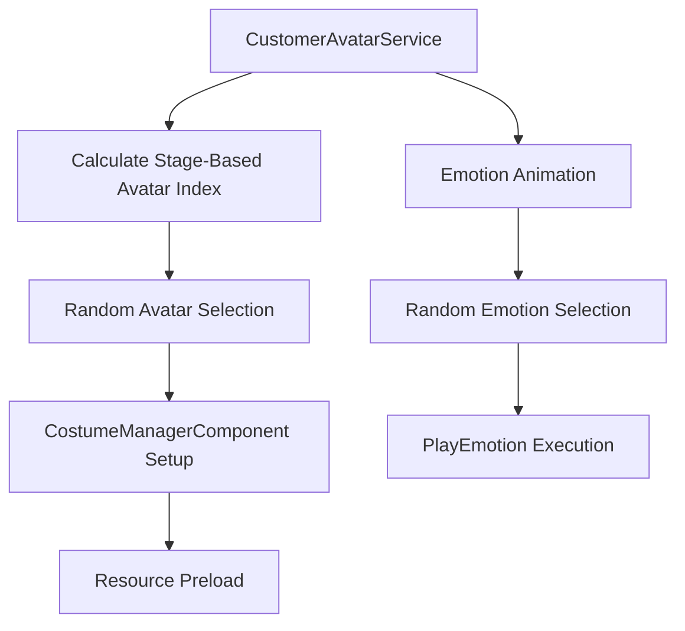
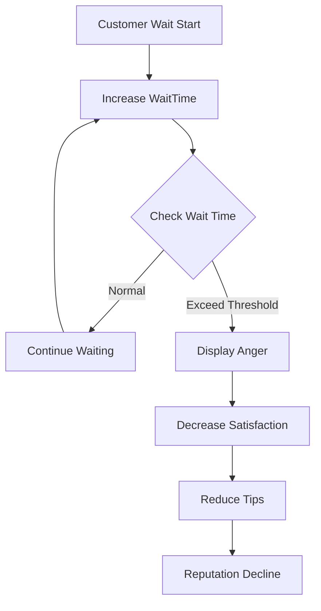

# Customer Entry and Ordering System

## System Overview

ChuChuBurger's customer system operates with an AI-based state machine, naturally managing the entire process from customer entry to ordering, checkout, and exit. Each customer has individual preferences, and their behavior patterns are determined by the store's attractiveness and menu composition.

## Customer Behavior State Machine

### State Diagram

### Detailed Actions by State

#### 1. BEFOREENTER (Before Entry)
- **Purpose**: Check conditions for customer entry into the store
- **Key Processing**:
  - Check entry eligibility based on store attractiveness
  - Check waiting seat availability
  - Verify existence of intended menu items
- **Result**: Transition to ENTER if conditions met, to DESTROY if not

#### 2. ENTER (Entry)
- **Purpose**: Move customer from entrance to waiting seat
- **Key Processing**:
  - Path movement from entrance to waiting seat
  - Adjust rendering layer order (reflecting wait sequence)
  - Display preference UI then auto-hide
- **Result**: Transition to ORDER when reaching waiting seat

#### 3. ORDER (Ordering)
- **Purpose**: Process customer orders and display order UI
- **Key Processing**:
  - Validate ordered menu and verify data
  - Create order UI (display order quantity and menu tags)
  - Increase wait time and manage satisfaction
- **Result**: Transition to CHECKOUT when order complete

#### 4. CHECKOUT (Checkout)
- **Purpose**: Process payment and calculate tips
- **Key Processing**:
  - Check and deduct burger inventory
  - Calculate sales and tips
  - Process rewards based on customer satisfaction
- **Result**: Transition to EXIT when payment complete

#### 5. EXIT (Exit)
- **Purpose**: Exit customer from store
- **Key Processing**:
  - Move to exit location
  - Release waiting seat
  - Clean up related UI
- **Result**: Transition to DESTROY when exit complete

## Customer Appearance Management System

### CustomerAvatarData Structure
Customer appearance is systematically managed through multiple parts:

- **Body**: Body avatar RUID
- **Face**: Face avatar RUID  
- **Hair**: Hair avatar RUID
- **Longcoat**: Longcoat avatar RUID
- **Shoes**: Shoes avatar RUID
- **Cap**: Cap avatar RUID

### CustomerAvatarService Features

#### Stage-Based Appearance Management

#### Key Features
- **Stage-Based**: 30 unique avatars per stage (PC) or 10 (mobile)
- **Dynamic Loading**: Selective preload of only necessary avatar resources
- **Emotion Expression**: Various emotion animations including Smile, Cheers, Glitter, Chu, Love, Shine

## Customer Preference System

### Preference Processing Mechanism
Customers have individual preference tags that affect ordering decisions and satisfaction:

1. **Preference Tags**: Each customer prefers specific menu tags
2. **Menu Matching**: Search for items matching preferences among store menus
3. **Satisfaction Calculation**: Adjust satisfaction and tips based on preference alignment

### Feedback System
- **Satisfaction**: When providing menus matching preferences
- **Dissatisfaction**: Absence of preferred menus, long wait times, insufficient attractiveness, etc.

## Wait Time and Satisfaction Management

### Wait Time System

### Satisfaction Influencing Factors
- **Service Time**: Fast service → High satisfaction
- **Menu Match**: Providing preferred menu → Bonus satisfaction
- **Store Environment**: High attractiveness → Base satisfaction increase

## Tip Payment System

### Tip Calculation Formula
Tips are calculated comprehensively considering multiple factors:

1. **Base Tip**: Fixed percentage relative to menu price
2. **Satisfaction Adjustment**: Increase/decrease based on customer satisfaction
3. **Service Time Adjustment**: Bonus for fast service
4. **Preference Adjustment**: Additional bonus for providing preferred menu

### Special Situation Handling
- **VIP Customers**: High base tip rate
- **Regular Customers**: Bonus based on loyalty
- **Event Period**: Increased tips during special events

## Performance Optimization

### Resource Management
- **Avatar Preload**: Selective loading of only necessary avatars when entering stage
- **Resource Cache**: Cache used avatar resources for improved reuse efficiency
- **Mobile Optimization**: Adjust avatar count based on platform

### State Machine Optimization
- **Timer-Based**: Check states at regular intervals (prevent unnecessary updates)
- **Conditional Execution**: Stop state changes when time flow is paused
- **Memory Management**: Complete cleanup of related resources when deleting customers

## Code References

### Core Customer AI System
- `RootDesk/MyDesk/05. Customer/CustomerAIScript.mlua :: StateManager()` — State machine main loop
- `RootDesk/MyDesk/05. Customer/CustomerAIScript.mlua :: Create()` — Customer creation and initialization
- `RootDesk/MyDesk/05. Customer/CustomerAIScript.mlua :: BEFOREENTER()` — Pre-entry condition check
- `RootDesk/MyDesk/05. Customer/CustomerAIScript.mlua :: ORDER()` — Order processing logic
- `RootDesk/MyDesk/05. Customer/CustomerAIScript.mlua :: CHECKOUT()` — Payment and tip processing

### Appearance Management System
- `RootDesk/MyDesk/05. Customer/CustomerAvatarService.mlua :: SetRandomCostume()` — Apply random costume by stage
- `RootDesk/MyDesk/05. Customer/CustomerAvatarService.mlua :: ResetCustomerAvatarResources()` — Avatar resource management
- `RootDesk/MyDesk/05. Customer/CustomerAvatarData.mlua :: Load()` — Load avatar info from CSV data

### UI and Interaction
- `RootDesk/MyDesk/05. Customer/CustomerService.mlua :: SetEmotion()` — Customer emotion animation
- `RootDesk/MyDesk/05. Customer/CustomerUIService.mlua :: CreateOrderUI()` — Order UI creation
- `RootDesk/MyDesk/05. Customer/CustomerUIService.mlua :: UpdatePeedbackUI()` — Feedback UI update

---

This document explains the structure and operating principles of ChuChuBurger's customer entry and ordering system. It provides understanding of how detailed logic for each state, appearance management, preference processing, and other complex systems work together to create a natural customer experience.
