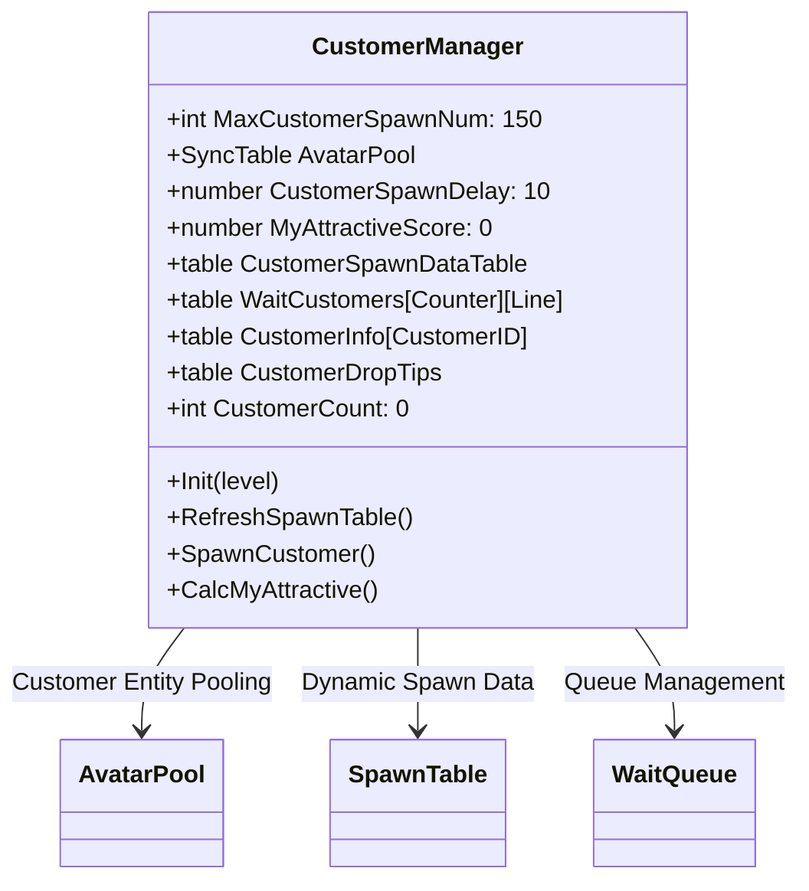
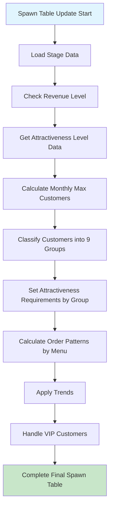
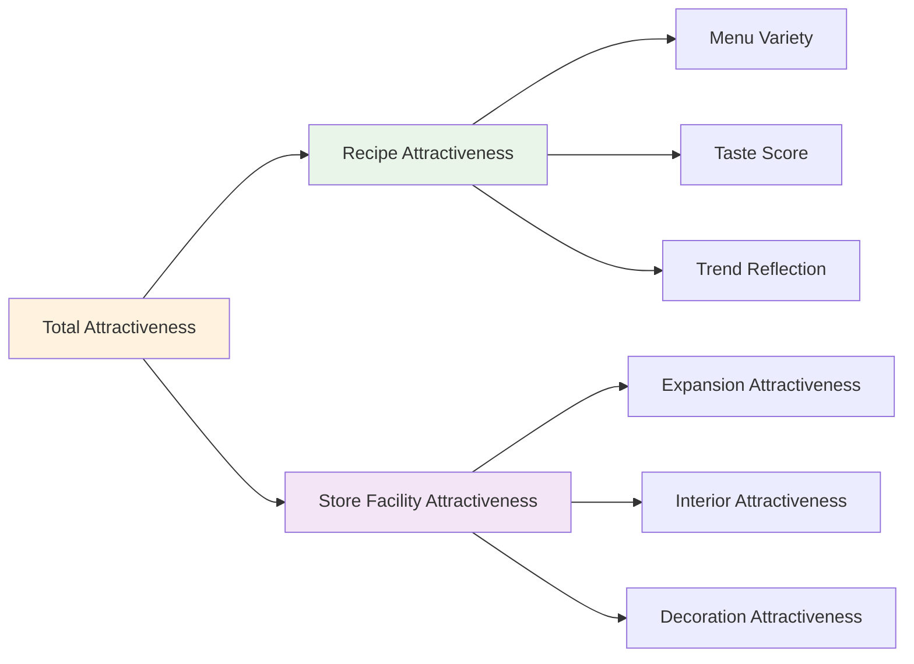
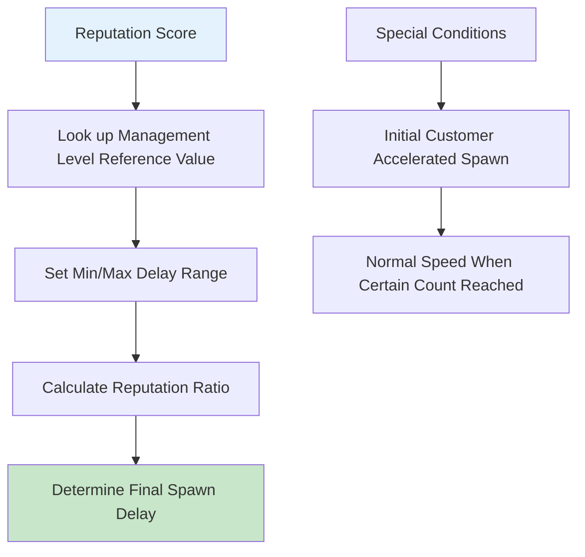
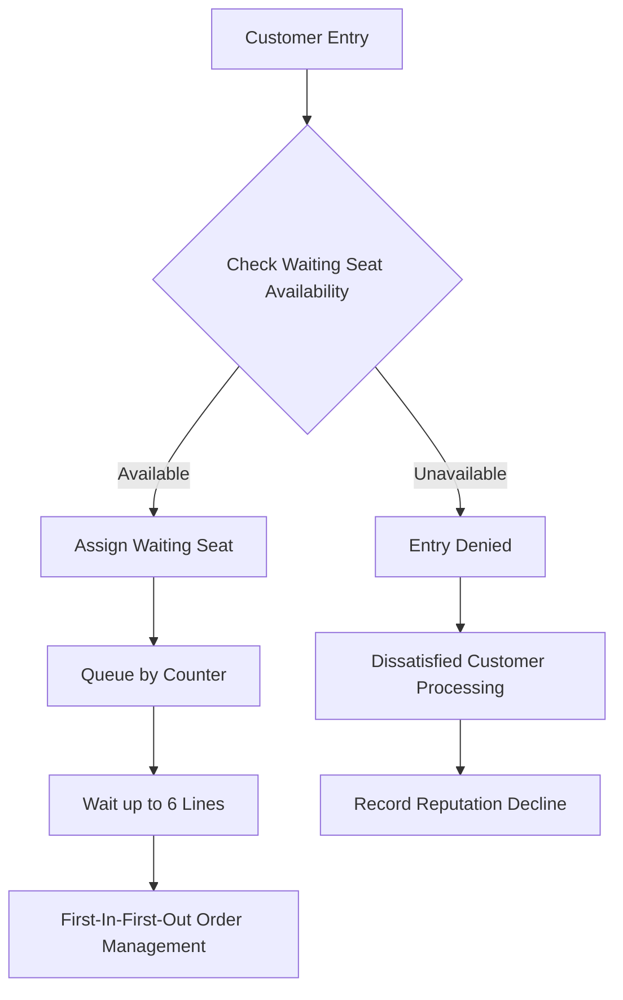
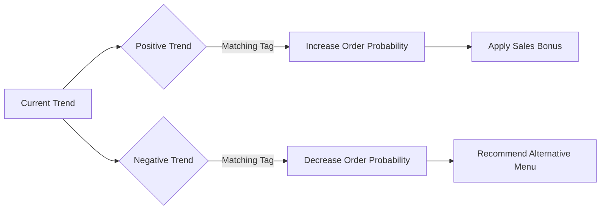
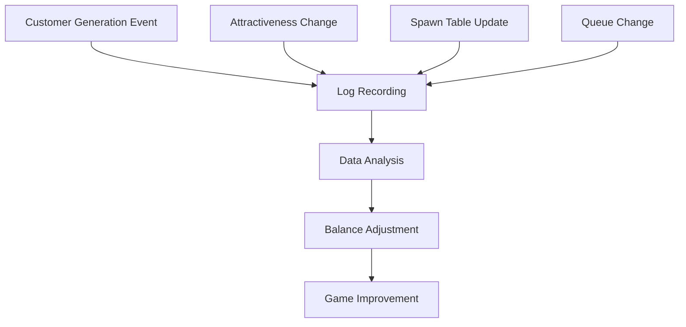

# Customer Generation and Management System

## System Overview

ChuChuBurger's customer generation and management system operates around the `CustomerManager` component. This system dynamically generates and manages customers by comprehensively considering various factors such as store attractiveness, reputation, management level, and trends.

## CustomerManager Core Structure

### Key Properties and Data


### Customer Object Pooling System
For performance optimization, customer entities are pre-created and managed in a pool:

- **Pool Size**: Maximum 150 customer entities
- **Reuse**: Return departed customer entities to pool for reuse
- **Initialization**: Create all customer entities in inactive state when entering lobby

## Dynamic Spawn Table System

### RefreshSpawnTable Mechanism


### Customer Group Classification System
Customers are classified into 9 groups (G1~G8 + Special) based on attractiveness requirements:

1. **Groups G1-G7**: Regular customers (increasing attractiveness requirements)
2. **Group G8**: High attractiveness requirement customers
3. **Special Group**: VIP customers and event customers

### Monthly Customer Count Calculation Formula
```
Monthly Customers = Base Customers × (1 + Additional Rate) × Remaining Days Rate + 1
```

- **Base Customer Count**: Reference customer count by attractiveness level
- **Additional Rate**: Configurable bonus rate
- **Remaining Days Rate**: More customers generated earlier in the month

## Attractiveness-Based Customer Generation

### Attractiveness Calculation System


### Customer Access Patterns by Attractiveness
- **High Attractiveness**: Upper group customer influx, short spawn delay
- **Low Attractiveness**: Only lower group customers enter, long spawn delay
- **Threshold System**: Minimum attractiveness requirements for each group

## Spawn Delay Control System

### Reputation-Based Delay Calculation


### Delay Calculation Formula
```
Spawn Delay = Max Delay × (1 - Reputation Ratio) + Min Delay
```

- **Reputation Ratio**: Current Reputation ÷ Max Reputation
- **Management Level**: Higher levels allow faster base speed
- **Acceleration System**: Initial certain number of customers spawn at fast speed

## Queue Management System

### Waiting Seat Structure


### Waiting Seat Expansion System
- **Base**: Up to 3 lines wait per counter
- **After Expansion**: Expand to 6 lines when lobby level 6 or higher
- **Dynamic Management**: Real-time waiting seat status tracking

## Order Pattern Determination System

### Order Ratio Calculation by Menu
Determine customer order patterns based on currently set menus:

1. **Guaranteed Orders**: Minimum order guarantee for each menu
2. **Preference Matching**: Match customer preference tags with menu tags
3. **Random Distribution**: Assign random menus to remaining customers
4. **Order Quantity**: Weight-based selection in 1-3 range

### Trend Reflection System


## Special Customer System

### VIP Customer Processing
- **Generation Conditions**: When certain attractiveness is achieved
- **Special Benefits**: High tips, special orders
- **Priority Processing**: Priority service over regular customers

### Tutorial Customers
- **Customers Under 1 Year**: Manage special order tag list
- **Gradual Unlocking**: Progressive menu unlocking according to tutorial progress
- **Guidance Role**: Learning support for new players

## Performance Optimization and Management

### Memory Management
- **Object Pooling**: Memory efficiency through customer entity reuse
- **Data Cleanup**: Initialize all customer data when moving maps
- **Timer Management**: Resource conservation through unnecessary timer cleanup

### Dynamic Updates
- **Real-time Calculation**: Dynamically create spawn tables as needed
- **Condition Change Detection**: Automatic recalculation when attractiveness or reputation changes
- **Error Recovery**: Automatic recovery mechanism for data inconsistencies

## Debugging and Monitoring

### Developer Tools
- **Customer Info Monitor**: Real-time customer status tracking
- **Spawn Table Viewer**: Current spawn data visualization
- **Attractiveness Calculator**: Display current attractiveness score
- **Delay Adjustment**: Adjust spawn speed during development

### Logging System


## Code References

### Core Management System
- `RootDesk/MyDesk/05. Customer/CustomerManager.mlua :: RefreshSpawnTable()` — Dynamic spawn table creation
- `RootDesk/MyDesk/05. Customer/CustomerManager.mlua :: SpawnCustomer()` — Customer creation and spawn processing  
- `RootDesk/MyDesk/05. Customer/CustomerManager.mlua :: CalcMyAttractive()` — Attractiveness calculation
- `RootDesk/MyDesk/05. Customer/CustomerManager.mlua :: SetCustomerSpawnDelay()` — Spawn delay setting

### Attractiveness Calculation System
- `RootDesk/MyDesk/05. Customer/CustomerManager.mlua :: CalcAttractiveRecipe()` — Recipe attractiveness calculation
- `RootDesk/MyDesk/05. Customer/CustomerManager.mlua :: CalcAttractiveExpension()` — Expansion attractiveness calculation
- `RootDesk/MyDesk/05. Customer/CustomerManager.mlua :: CalcAttractiveInterior()` — Interior attractiveness calculation
- `RootDesk/MyDesk/05. Customer/CustomerManager.mlua :: CalacAttractiveDeco()` — Decoration attractiveness calculation

### Queue and Spawn Management
- `RootDesk/MyDesk/05. Customer/CustomerManager.mlua :: ReturnWaitSeat()` — Waiting seat assignment logic
- `RootDesk/MyDesk/05. Customer/CustomerManager.mlua :: AddWaitCustomer()` — Queue addition
- `RootDesk/MyDesk/05. Customer/CustomerManager.mlua :: InitCustomerSpawner()` — Spawn system initialization

### Reputation and Balance System
- `RootDesk/MyDesk/01. Lobby/Reputation/ReputationDataSetLogic.mlua :: ReturnSpawnDelay()` — Reputation-based delay calculation
- `RootDesk/MyDesk/01. Lobby/StoreInfo/StoreInfoDataSetLogic.mlua :: ReturnPlayerScoreByCustomerReviewId()` — Review score calculation
- `RootDesk/MyDesk/Common/Balance/BalanceDataSetLogic.mlua :: GetStoreAttractiveLevelData()` — Attractiveness level data

---

This document details the complex mechanisms of ChuChuBurger's customer generation and management system. It provides understanding of how various factors like attractiveness, reputation, and trends interact to create a dynamic and balanced customer experience.
