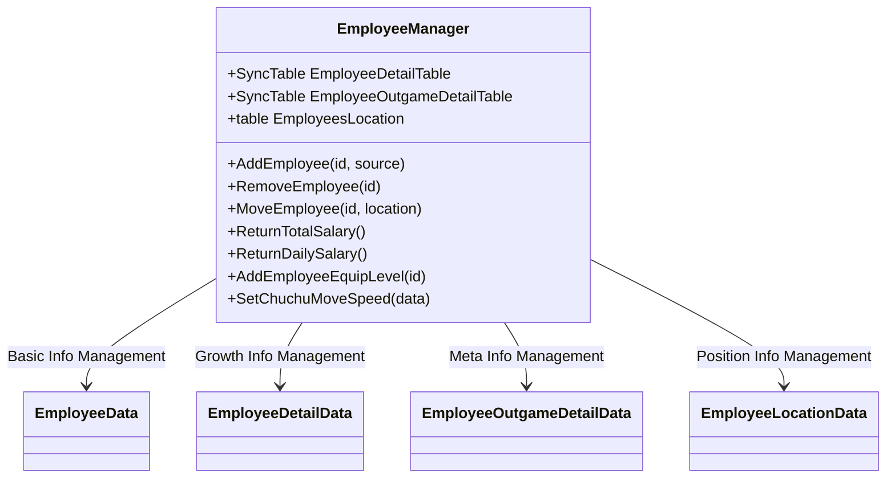
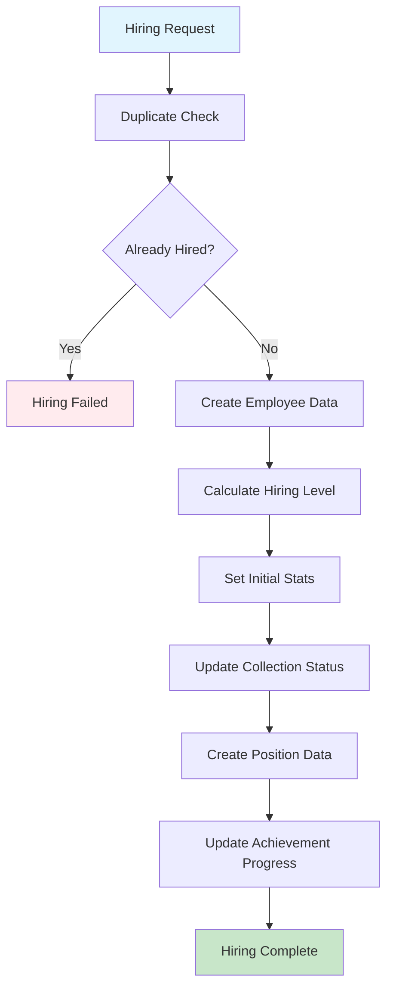
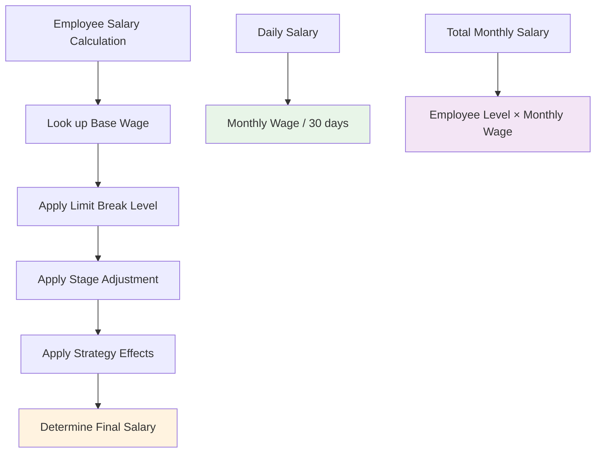
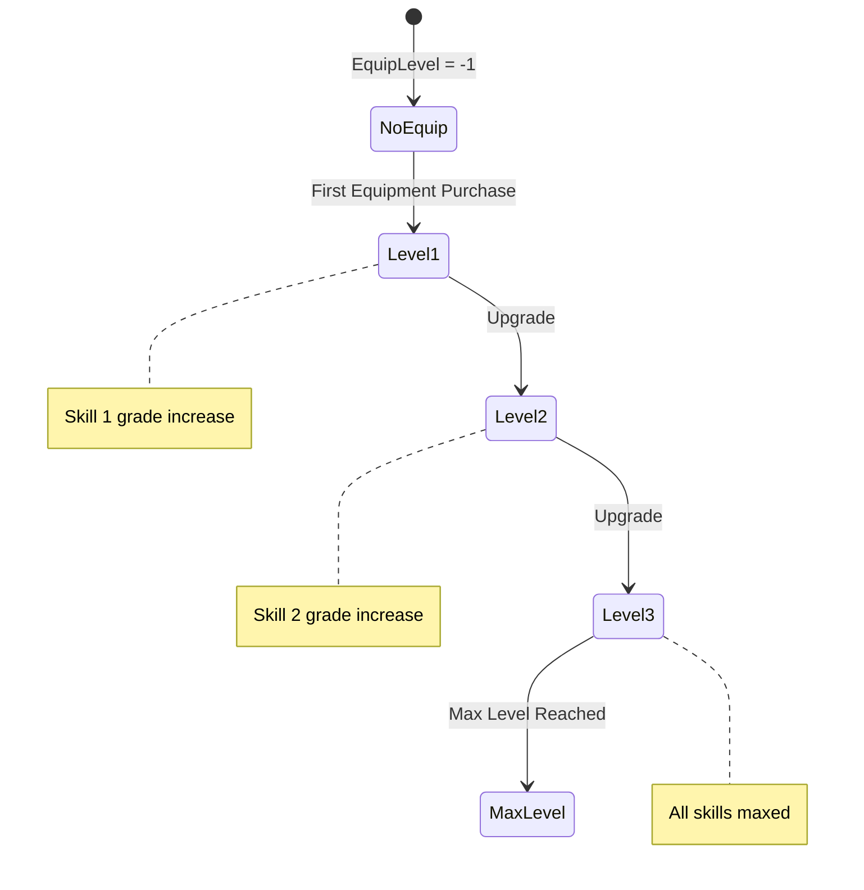
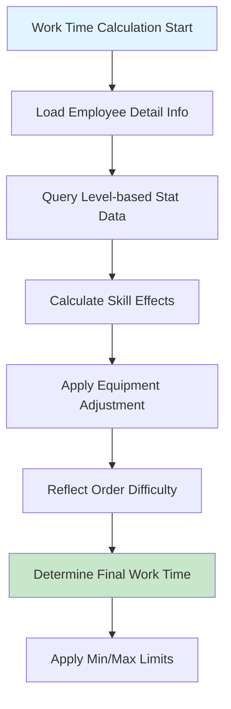
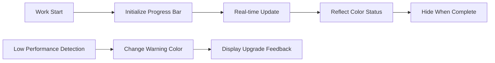
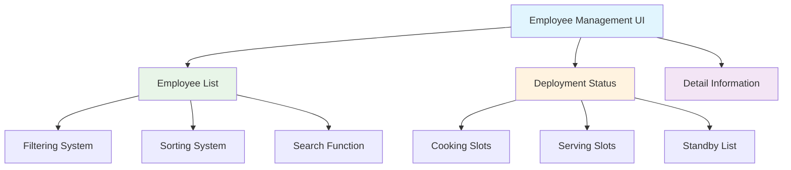
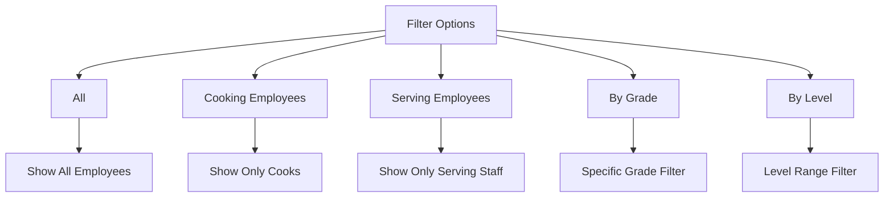
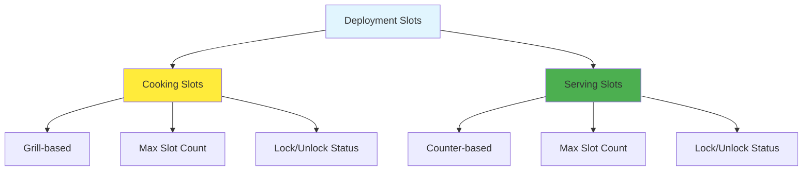
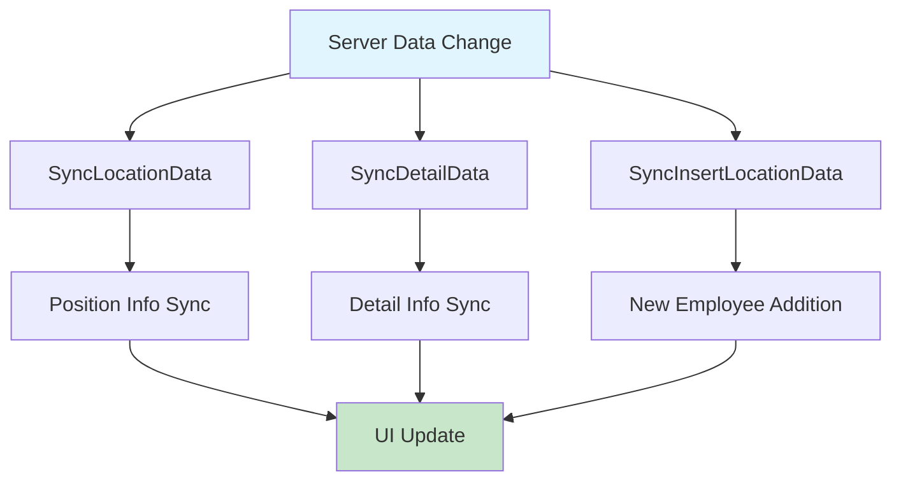

# Employee Management and Deployment System

## System Overview

ChuChuBurger's employee management and deployment system is built around the `EmployeeManager` component, handling all employee-related operations from hiring to deployment, growth, and salary management. It also supports intuitive UI for players to easily manage and deploy employees.

## EmployeeManager Core Functions

### Comprehensive Employee System Management


### Data Structure Relationships
- **EmployeeDetailTable**: Level, experience, limit break information
- **EmployeeOutgameDetailTable**: Equipment, skill grade, collection status
- **EmployeesLocation**: Current deployment positions of employees (standby, cooking, serving)

## Employee Creation and Management

### Employee Hiring System


#### Detailed Hiring Process
**Employee Hiring Processing:**  
method AddEmployee(string id, table source)  
→ After duplicate check, create employee data and set initial stats.

- **Level Calculation**: Determine initial abilities based on hiring level  
- **Type-based Settings**: Differentiated initialization for cooking/serving employees

<details>
<summary>Related Code</summary>

```lua
-- EmployeeManager.mlua :: AddEmployee()
detailData.EmploymentLevel = calculatedLevel
if data.Type == Cook then
    detailData.CookLevel = level
else
    detailData.ServingLevel = level
end
```
</details>

### Employee Termination System
- **Transfer Processing**: Employee termination through UI
- **Severance Calculation**: Refund based on limit break level
- **Collection Status**: Maintain collection records even after termination
- **Achievement Update**: Auto-adjust employee count related achievements

## Salary System

### Salary Calculation Structure


### Salary Calculation Formula
**Salary Calculation Process:**  
method ReturnTotalSalary()  
→ Calculate and return the sum of all employees' monthly wages.

- **Basic Formula**: Monthly Wage = Base Wage[Limit Break Level] × (1 + Stage Adjustment) × (1 - Salary Saving Strategy)  
- **Daily Conversion**: Daily Wage = (Employee Level × Monthly Wage) ÷ 30 days

<details>
<summary>Related Code</summary>

```lua
-- EmployeeManager.mlua :: ReturnTotalSalary()
method number ReturnTotalSalary()
    local totalSalary = 0
    -- Logic for summing all employee salaries
    return totalSalary
end
```
</details>

#### Key Salary-Related Methods
- **ReturnTotalSalary()**: Total monthly wage sum for all employees
- **ReturnDailySalary()**: Daily wage sum  
- **ReturnEmployeeWage()**: Individual employee base wage
- **ReturnTransferRefundJemCost()**: Severance upon termination

## Equipment Upgrade System

### Equipment Level Management


### Equipment Upgrade Effects
- **Skill Grade Improvement**: Auto-adjust skill grades based on equipment level
- **Visual Changes**: Animation changes when equipment is worn
- **Performance Enhancement**: Increased work speed and efficiency
- **Collection Integration**: Track equipment upgrade progress

## EmployeeService - Business Logic

### Work Duration Calculation System


#### Work Time Calculation Formula
**Work Efficiency Calculation:**  
method ReturnWorkDuration(table employeeDetailData, table orderData)  
→ Calculate work time by combining employee stats and order difficulty.

- **Multi-stage Adjustment**: Base Time × Level Adjustment × Skill Adjustment × Equipment Adjustment  
- **Range Limitation**: Final determination within min/max time limits

<details>
<summary>Related Code</summary>

```lua
-- EmployeeService.mlua :: ReturnWorkDuration()
local workDuration = WorkDurationMax * levelCorrection * skillCorrection
return math.max(minTime, math.min(maxTime, workDuration))
```
</details>

### Low-Performance Employee Detection System
Real-time monitoring of employee work efficiency to automatically detect employees needing upgrades:

- **Cooking Employees**: Warning when exceeding set standard time
- **Serving Employees**: Warning when lacking order processing capability  
- **UI Feedback**: Visual alerts for low-performance employees
- **Upgrade Guidance**: Suggest appropriate upgrade directions

## EmployeeUIService - UI Management

### Progress UI System


### UI Feedback System
- **ProgressUIInit()**: Initial progress bar setup
- **ProgressUIUpdate()**: Real-time progress update
- **PeedbackUIUpdate()**: Status-based feedback messages
- **PreogressUIOff()**: UI cleanup when work complete

## Employee Deployment Management System

### UI Structure Overview


### UIEmployeeManageService - Comprehensive Management
Core service that integrates all employee management UI functions:

- **UIOpen()/UIClose()**: Open/close management screen
- **UIRefresh()**: Overall UI refresh
- **RefreshTotalSalary()**: Update total salary display
- **SelectEmp()**: Employee selection and detail info display
- **StatSort()**: Employee list sorting processing

### UIEmployeeManageList - Employee List Management

#### Filtering System


#### Sorting System
- **By Level**: High/low level order
- **By Grade**: Sort by employee grade
- **By Hire Date**: Order of hiring
- **By Type**: Classify cooking/serving employees

#### Key Features
- **RefreshList()**: Apply filter/sort and refresh list
- **UpdateSlotOutline()**: Highlight selected employee
- **RegisterRecycleScrollLayoutCallback()**: Optimize large list handling

### UIEmployeeManageDeployList - Deployment Slot Management

#### Slot Structure


#### Slot Management Logic
- **Init()**: Set slot count based on upgrade level
- **RefreshList()**: Reflect current deployment situation
- **Dynamic Slot Creation**: Expand slots according to upgrades
- **Lock System**: Deactivate slots until upgrades

### UIEmployeeManageDeployListRenderer - Individual Slots

#### Slot Status Management
- **Empty Slot**: Available empty position
- **Deployed**: Employee deployed state  
- **Locked**: Slot requiring upgrade
- **Selected**: Currently selected slot

#### Visual Representation
- **Portrait**: Display face of deployed employee
- **Level Display**: Current employee level
- **Type Icon**: Cooking/serving distinction icon
- **Outline**: Visual feedback for selection state

## Data Synchronization System

### Client-Server Synchronization


### Real-time Updates
- **Position Changes**: Immediate sync when employee deployment changes
- **Level Up**: Real-time reflection of experience gain and level up
- **Equipment Changes**: Immediate application when equipment upgrades
- **Salary Changes**: Auto-calculate salary-related changes

## Performance Optimization

### Large List Handling
- **RecycleScrollView**: Memory efficiency through virtualized scroll view
- **Filtering Optimization**: Reduce network load with client-side filtering
- **LazyLoading**: Selective loading of only necessary data

### Memory Management
- **Object Pooling**: Minimize garbage collection through slot UI reuse
- **Data Caching**: Cache frequently referenced employee data
- **Event Cleanup**: Clean up event listeners when UI closes

## Code References

### Core Management System
- `RootDesk/MyDesk/02. Employee/EmployeeManager.mlua :: AddEmployee()` — Employee hiring processing
- `RootDesk/MyDesk/02. Employee/EmployeeManager.mlua :: ReturnTotalSalary()` — Total salary calculation
- `RootDesk/MyDesk/02. Employee/EmployeeManager.mlua :: AddEmployeeEquipLevel()` — Equipment upgrade processing
- `RootDesk/MyDesk/02. Employee/EmployeeManager.mlua :: SyncLocationData()` — Position data synchronization

### Business Logic Service
- `RootDesk/MyDesk/02. Employee/EmployeeService.mlua :: ReturnWorkDuration()` — Work duration calculation
- `RootDesk/MyDesk/02. Employee/EmployeeService.mlua :: IsStatLevelLow()` — Low-performance employee detection
- `RootDesk/MyDesk/02. Employee/EmployeeService.mlua :: GetData()` — Employee basic data query
- `RootDesk/MyDesk/02. Employee/EmployeeService.mlua :: GetStatLevelData()` — Level-based stat data query

### UI Management Service
- `RootDesk/MyDesk/02. Employee/EmployeeUIService.mlua :: ProgressUIUpdate()` — Progress UI update
- `RootDesk/MyDesk/02. Employee/EmployeeUIService.mlua :: PeedbackUIUpdate()` — Feedback UI update
- `RootDesk/MyDesk/02. Employee/EmployeeUIService.mlua :: ProgressUIInit()` — Progress UI initialization

### Deployment Management UI System
- `RootDesk/MyDesk/02. Employee/Manage/UIEmployeeManageService.mlua :: UIRefresh()` — Overall UI refresh
- `RootDesk/MyDesk/02. Employee/Manage/UIEmployeeManageService.mlua :: SelectEmp()` — Employee selection processing
- `RootDesk/MyDesk/02. Employee/Manage/UIEmployeeManageList.mlua :: RefreshList()` — Employee list refresh
- `RootDesk/MyDesk/02. Employee/Manage/UIEmployeeManageDeployList.mlua :: RefreshList()` — Deployment status refresh

### Individual UI Components
- `RootDesk/MyDesk/02. Employee/Manage/UIEmployeeManageListRenderer.mlua :: Set()` — Employee slot data setting
- `RootDesk/MyDesk/02. Employee/Manage/UIEmployeeManageDeployListRenderer.mlua :: Set()` — Deployment slot data setting

---

This document explains the comprehensive structure of ChuChuBurger's employee management and deployment system. It provides understanding of how all processes from employee hiring to growth, deployment, and salary management are systematically managed and delivered to players through intuitive UI.
