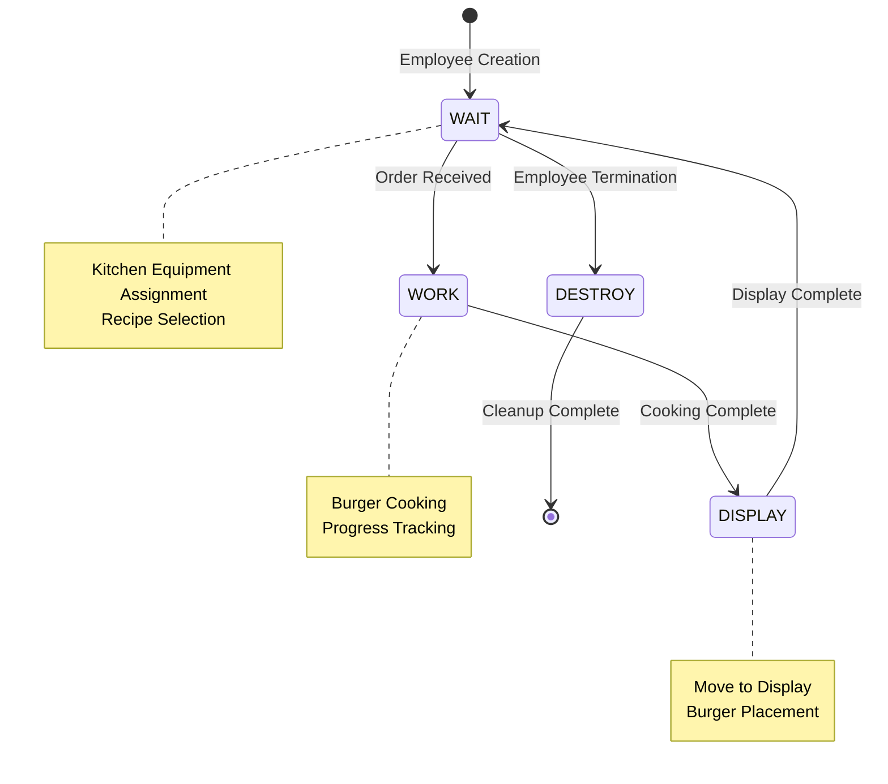
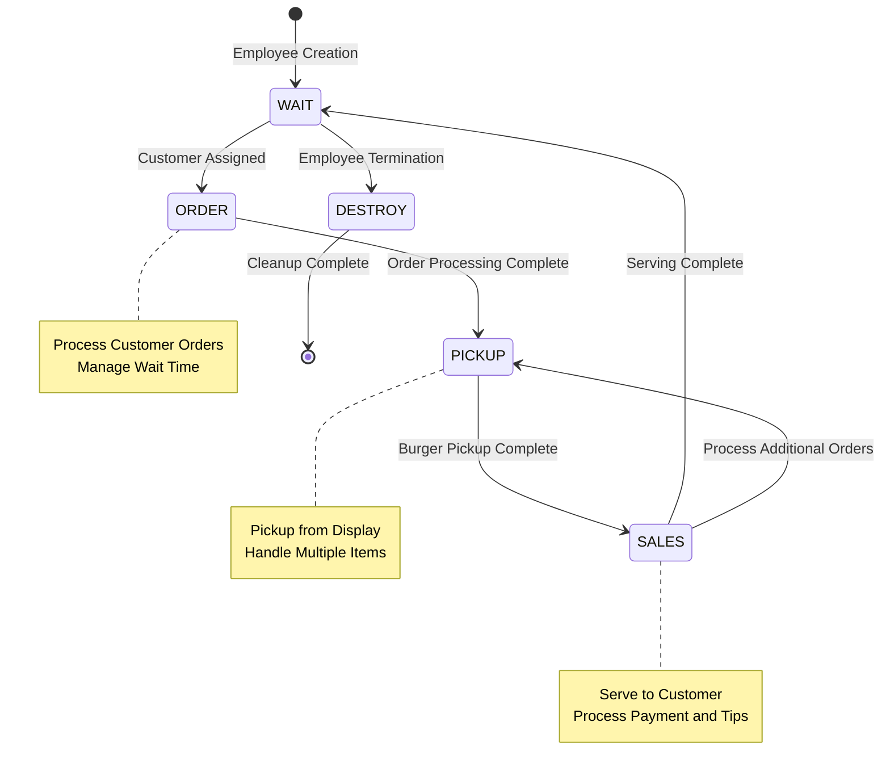
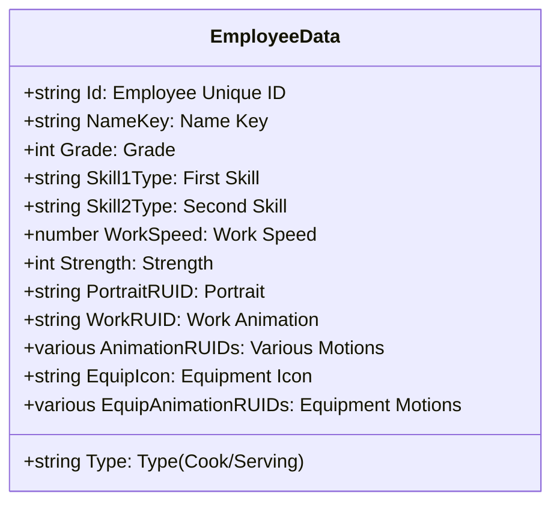
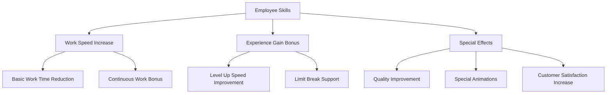
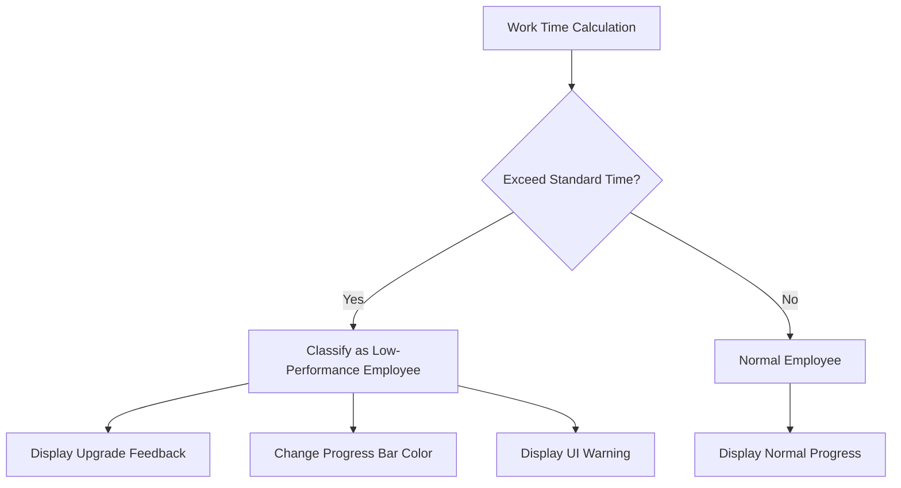
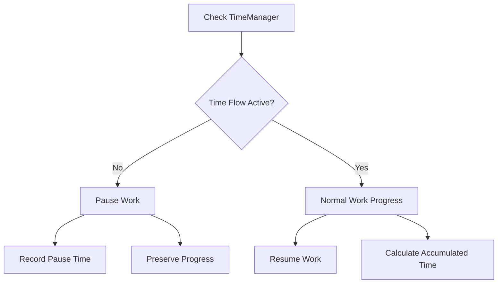

# Employee Roles and Behavior System

## System Overview

ChuChuBurger's employee system consists of two main types of employees: **Cook Employees** and **Serving Employees**. Each employee operates through an independent AI state machine to autonomously perform tasks, and players can hire and deploy employees to automate their stores.

## Employee Types and Roles

### Cook Employee
- **Primary Role**: Hamburger creation in the kitchen
- **Work Area**: Grill equipment
- **Responsibilities**: Burger cooking according to recipes, display placement

### Serving Employee
- **Primary Role**: Customer serving and checkout processing
- **Work Area**: Counter equipment
- **Responsibilities**: Customer order reception, burger pickup, serving, payment processing

## Employee AI State Machine System

### Cook Employee State Machine (CookEmployeeAIScript)


#### Detailed Actions by State

**1. WAIT (Standby State)**
- Assign available kitchen equipment (grill)
- Select recipe to create from currently set menu
- Check nearest display ID
- Transition to WORK state when work conditions are met

**2. WORK (Working State)**
- Start burger creation according to selected recipe
- Display and update work progress UI
- Apply work speed based on employee skills and level
- Transition to DISPLAY state when cooking complete

**3. DISPLAY (Display State)**
- Move to display with completed burger
- Place burger on display
- Update inventory and reflect in UI
- Return to WAIT state after completing work

### Serving Employee State Machine (ServingEmployeeAIScript)


#### Detailed Actions by State

**1. WAIT (Standby State)**
- Check and assign waiting customers
- Assign available counter equipment
- Transition to ORDER state when customer assigned

**2. ORDER (Order Processing State)**
- Check assigned customer's order information
- Display order processing progress
- Manage customer wait time
- Transition to PICKUP state when work complete

**3. PICKUP (Pickup State)**
- Pickup burgers ordered by customer from display
- Process multiple orders sequentially
- Display feedback for insufficient inventory
- Transition to SALES state when required quantity secured

**4. SALES (Serving State)**
- Deliver burgers to customer
- Execute additional PICKUP if order quantity is large
- Process payment when all orders complete
- Calculate tips and record sales

## Employee Data Structure

### EmployeeData (Basic Information)


### EmployeeDetailData (Growth Information)
Structure managing employee level and experience:

- **CookLevel/ServingLevel**: Level for each field (1-10)
- **CookExp/ServingExp**: Accumulated experience
- **MaxLevel**: Current maximum level limitation
- **OverLimitLevel**: Limit break level
- **EmploymentLevel**: Level at time of hiring

### EmployeeOutgameDetailData (Meta Information)
Structure managing game-external elements:

- **EquipLevel**: Equipment wearing level (-1: Not equipped)
- **Skill1Grade/Skill2Grade**: Skill grades
- **MoveSpeed**: Movement speed level
- **InCollection**: Collection inclusion status
- **CanBuyEquip**: Equipment purchase availability

## Employee Skill System

### Skill Types and Effects
Employees have 2 skill slots, and each skill has different effects based on grade:



### Skill Grade System
- **Grade 1**: Basic effects
- **Grade 2**: Increased effect amounts
- **Grade 3**: Additional special effects
- **Grade 4**: Highest grade, all effects maximized

## Work Progress and Performance System

### Work Time Calculation
```
Final Work Time = Base Time × (1 - Skill Correction) × (1 - Level Correction) × (1 - Equipment Correction)
```

### Performance Indicators
- **WorkSpeed**: Basic work speed (higher = faster)
- **Strength**: Continuous work time capability
- **Level Correction**: Efficiency improvement based on level
- **Equipment Correction**: Additional bonus based on equipped gear

### Low-Performance Employee Detection System


## Employee Animation System

### Basic Animations
- **Stand**: Basic standing pose
- **Move**: Movement animation
- **Work**: Work animation (cooking/serving)
- **Chat**: Conversation/interaction
- **Love**: Joy expression
- **Cry**: Sadness expression
- **Sleep**: Rest/standby
- **Stunned**: Stunned/surprised

### Equipment Animations
When employees equip gear, all animations switch to equipment versions:
- **EquipStand**, **EquipMove**, **EquipWork**, etc.
- Unique motions and effects per equipment
- Visual representation of performance improvements

## Time Flow and Pause System

### Time Control Integration


### Pause Processing
- **isPauseWork**: Pause state flag
- **workTimeBeforePause**: Record work time before pause
- **ResumeWorkTime**: Work resume time
- Manage accumulated time for accurate work time calculation

## Performance Optimization

### State Machine Optimization
- **Timer-based Updates**: Check states at regular intervals (EmployeeStateTick)
- **Conditional Execution**: Stop state changes in unnecessary situations
- **Arrival Status Check**: Proceed to next step after confirming movement completion

### Memory Management
- **Component Reuse**: Recycle entities even when employees are terminated
- **Timer Cleanup**: Remove unnecessary timers during state transitions
- **Resource Release**: Clean up all references in DESTROY state

## Debugging and Monitoring

### Developer Tools
- **Employee Info Monitor**: Real-time employee status and progress display
- **Work Time Tracking**: Record time taken for each work stage
- **Performance Analysis**: Compare efficiency between employees
- **Skill Effect Verification**: Check performance differences before/after skill application

## Code References

### Cook Employee AI System
- `RootDesk/MyDesk/02. Employee/CookEmployeeAIScript.mlua :: StateManager()` — Cook employee state machine main loop
- `RootDesk/MyDesk/02. Employee/CookEmployeeAIScript.mlua :: WAIT()` — Standby state processing and recipe selection
- `RootDesk/MyDesk/02. Employee/CookEmployeeAIScript.mlua :: WORK()` — Burger cooking work processing
- `RootDesk/MyDesk/02. Employee/CookEmployeeAIScript.mlua :: DISPLAY()` — Display placement processing

### Serving Employee AI System
- `RootDesk/MyDesk/02. Employee/ServingEmployeeAIScript.mlua :: StateManager()` — Serving employee state machine main loop
- `RootDesk/MyDesk/02. Employee/ServingEmployeeAIScript.mlua :: WAIT()` — Customer assignment and standby processing
- `RootDesk/MyDesk/02. Employee/ServingEmployeeAIScript.mlua :: ORDER()` — Order reception and processing
- `RootDesk/MyDesk/02. Employee/ServingEmployeeAIScript.mlua :: PICKUP()` — Burger pickup processing
- `RootDesk/MyDesk/02. Employee/ServingEmployeeAIScript.mlua :: SALES()` — Customer serving and payment processing

### Employee Data Structure
- `RootDesk/MyDesk/02. Employee/EmployeeData.mlua :: Load()` — Basic employee information loading
- `RootDesk/MyDesk/02. Employee/EmployeeDetailData.mlua :: ConvertToDBTable()` — Growth data saving
- `RootDesk/MyDesk/02. Employee/EmployeeOutgameDetailData.mlua :: SetFromTable()` — Meta data loading

### Employee Service and Management
- `RootDesk/MyDesk/02. Employee/EmployeeService.mlua :: ReturnWorkDuration()` — Work time calculation
- `RootDesk/MyDesk/02. Employee/EmployeeService.mlua :: IsStatLevelLow()` — Low-performance employee detection
- `RootDesk/MyDesk/02. Employee/EmployeeUIService.mlua :: ProgressUIUpdate()` — Progress UI update

---

This document details how each employee in ChuChuBurger's employee system performs work independently, and how their behaviors are managed through complex state machines and data structures. Employee AI, growth systems, and skill effects all work together to provide players with an automated store operation experience.
