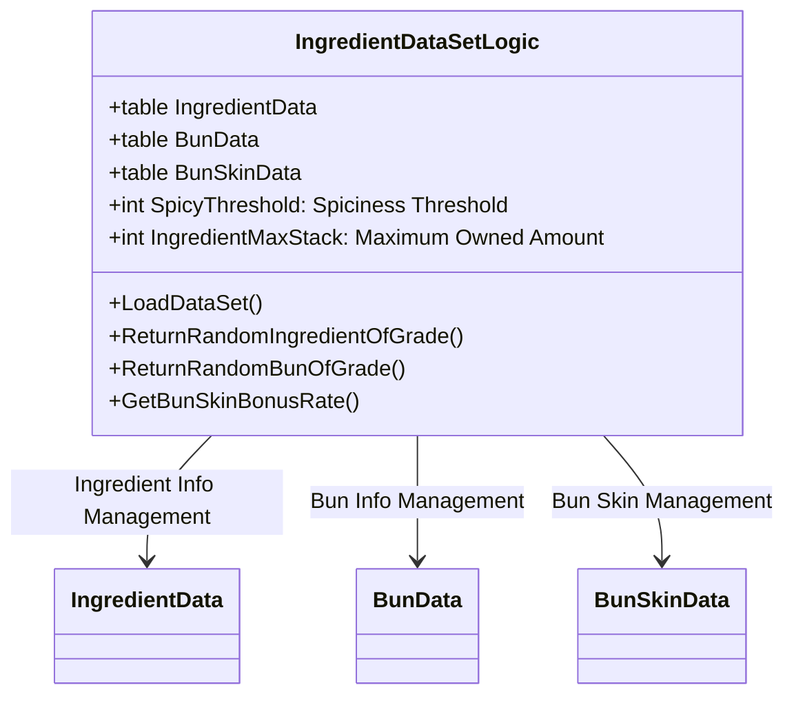
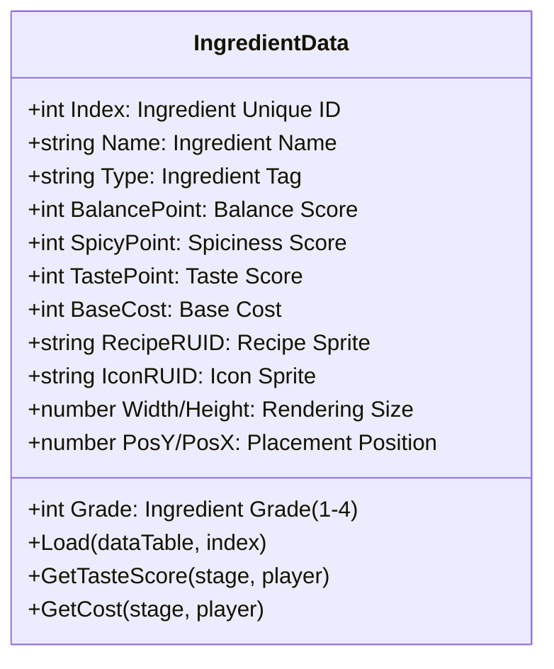
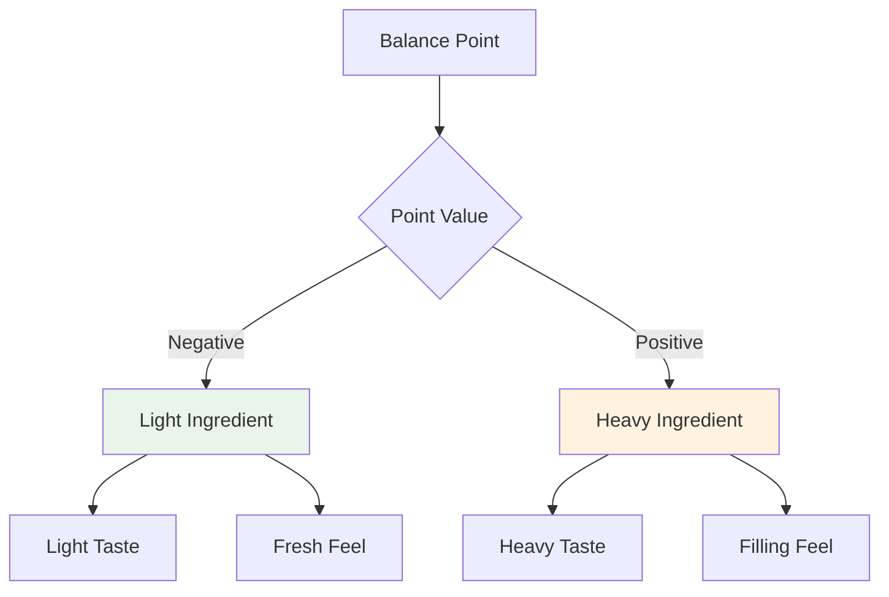
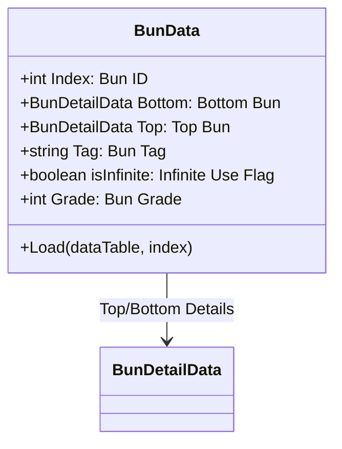
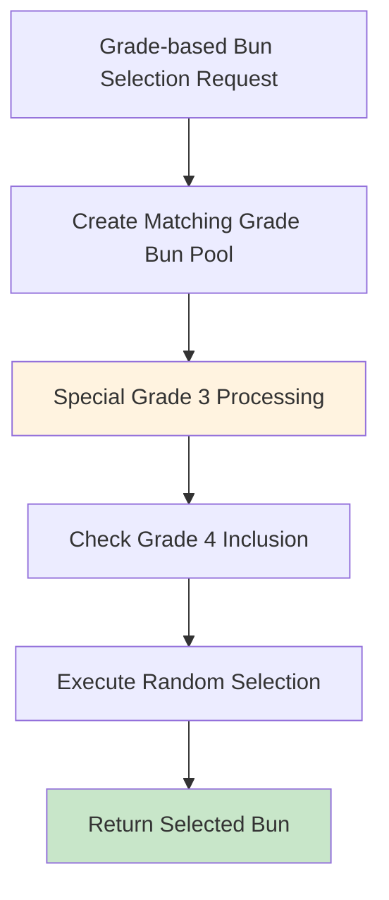
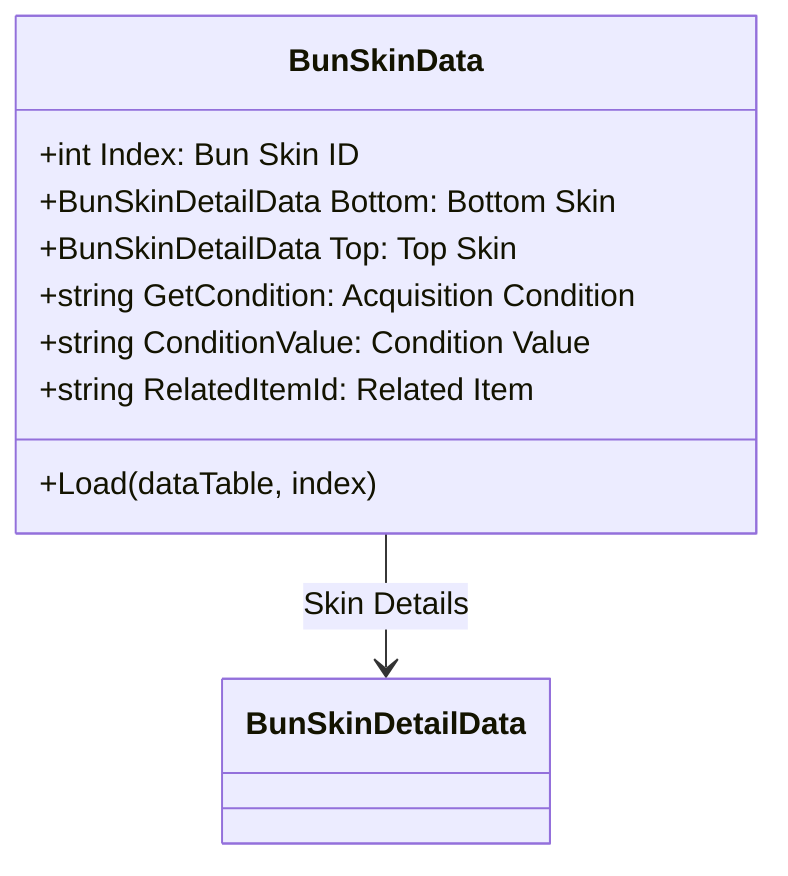
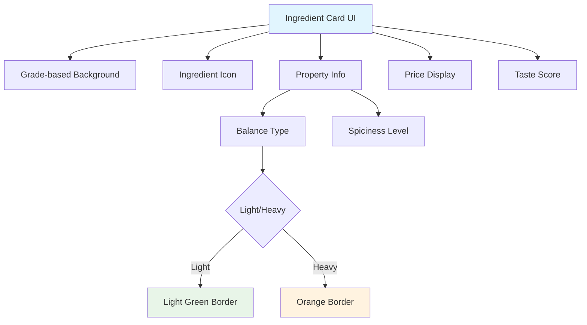
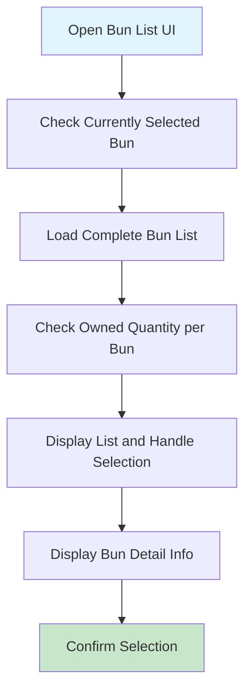
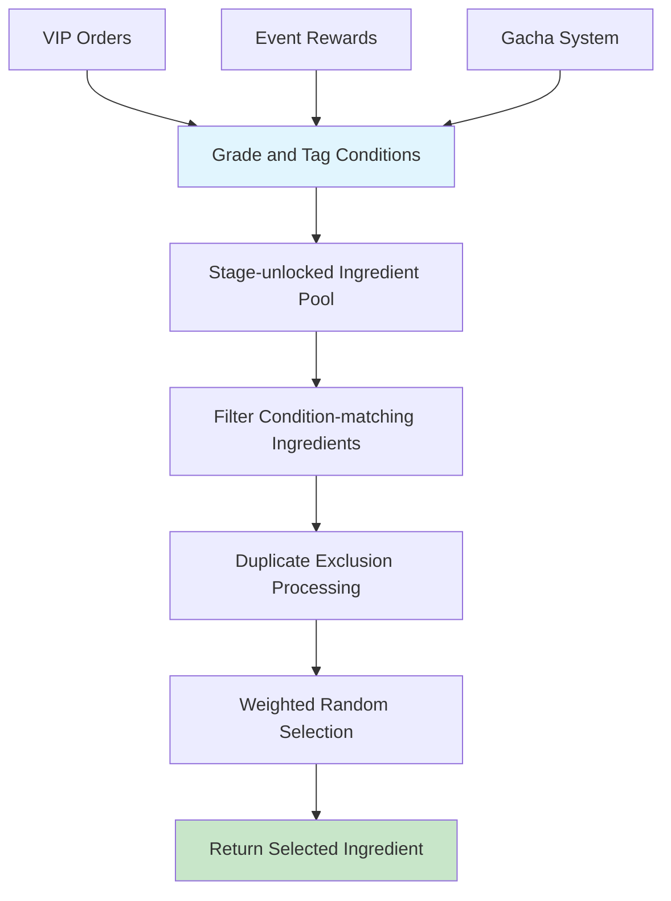
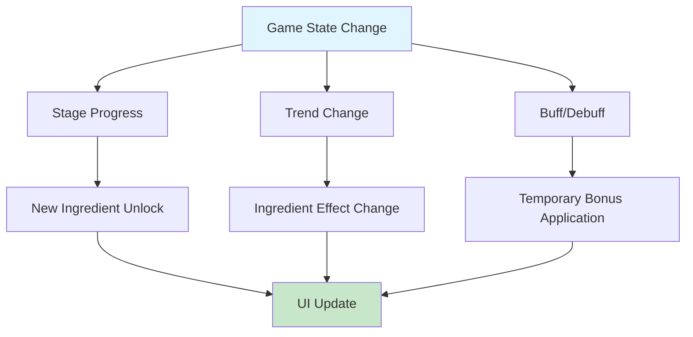

# Ingredient and Bun Management System

## System Overview

ChuChuBurger's ingredient and bun management system is the core foundation for recipe creation. It supports players in creating creative and strategic recipes through various grades of ingredients and buns, as well as special bun skins. All ingredient data is systematically managed around `IngredientDataSetLogic`.

## IngredientDataSetLogic - Ingredient System Management

### Core Data Structure


### Data Initialization Process
`IngredientDataSetLogic.LoadDataSet()`  
→ Initialization process that loads CSV data and converts it to structured data

- **Ingredient Data Loading**: Create each ingredient object with `ingreData:Load(ingreDataSet, i)`
- **Bun Data Loading**: Separate and store by Top/Bottom type

<details>
<summary>Related Code</summary>

```lua
-- IngredientDataSetLogic.mlua
-- Ingredient data loading
for i = 1, ingreDataSet:GetRowCount() do
    local ingreData = IngredientData()
    ingreData:Load(ingreDataSet, i)
    self.IngredientData[ingreData.Index] = ingreData
end

-- Bun data loading (separate Top/Bottom processing)
for i = 1, bunDataSet:GetRowCount() do
    local type = bunDataSet:GetRow(i):GetItem("Type")
    bunDatas[index][type] = bunDataSet:GetRow(i)
end
```
</details>

## IngredientData Structure System

### Ingredient Property System


#### Ingredient Grade System
Ingredients are classified into 4 grade levels, determining quality and effects:

- **Grade 1 (Common)**: Basic ingredients, low effects
- **Grade 2 (Advanced)**: Improved taste and balance
- **Grade 3 (Rare)**: High effects, special properties
- **Grade 4 (Legendary)**: Highest grade, maximized effects

#### Ingredient Property System
Each ingredient has the following major properties:

**Balance Point**


**Spiciness Point**
- **0**: Regular ingredient
- **1-15**: Slightly spicy ingredient
- **16+**: Very spicy ingredient (based on SpicyThreshold)

**Taste Point**
- Base score contributing to overall recipe taste score
- Dynamic adjustment based on stage and player status

### Ingredient Tag System
Ingredients are classified through tags and used for combos and trends:

- **Meat**: Meat-based ingredients
- **Chicken**: Chicken-based ingredients  
- **Seafood**: Seafood-based ingredients
- **Veggie**: Vegetable-based ingredients
- **Spicy**: Spicy ingredients (based on spiciness points)

## BunData and Bun Management System

### Bun Structure Design


#### Bun Detail Data (BunDetailData)
`BunData.Load(dataTable, index)`  
→ Structure that loads top and bottom buns separately to enhance visual completion

- **Bottom Bun**: Load Bottom data with `bottomData:Load(dataTable["Bottom"])`
- **Top Bun**: Load Top data with `topData:Load(dataTable["Top"])`

<details>
<summary>Related Code</summary>

```lua
-- BunData.mlua
local bottomData = BunDetailData()
bottomData:Load(dataTable["Bottom"], index)
self.Bottom = bottomData

local topData = BunDetailData()
topData:Load(dataTable["Top"], index) 
self.Top = topData
```
</details>

#### Basic Bun System
- **Index 1**: Basic bun with infinite use (isInfinite = true)
- **Advanced Buns**: Limited quantity, provide special effects
- **Grade Classification**: Buns also apply same grade system as ingredients

### Grade-based Random Selection System


`IngredientDataSetLogic.ReturnRandomBunOfGrade(integer grade)`  
→ Dynamic pool creation system for grade-based bun selection

- **Grade Correction**: Include grade 4 when grade 3 requested with `grade == 3 and 4 or 0`
- **Pool Creation**: Add only matching condition buns to gradePool

<details>
<summary>Related Code</summary>

```lua
-- IngredientDataSetLogic.mlua
method integer ReturnRandomBunOfGrade(integer grade)
    local gradePool = {}
    local correctedGrade = grade == 3 and 4 or 0  -- Include grade 4 when grade 3 requested
    
    for k, v in pairs(self.BunData) do
        if data.Grade == grade or data.Grade == correctedGrade then
            table.insert(gradePool, k)
        end
    end
    
    local randomIndex = _UtilLogic:RandomIntegerRange(1, #gradePool)
    return randomIndex
end
```
</details>

## BunSkinData - Bun Skin System

### Bun Skin Structure


### Acquisition Condition System
Bun skins can be acquired when various conditions are met:

- **GetCondition**: Acquisition condition type
  - Achievement: Achievement completion
  - Stage: Stage clear
  - Collection: Collection completion
  - Purchase: Purchase
- **ConditionValue**: Specific condition value
- **RelatedItemId**: Related item or currency

### Collection Bonus System
`IngredientDataSetLogic.GetBunSkinBonusRate(Entity player)`  
→ Calculate game-wide bonus effects based on bun skin collection

- **Collection Count Calculation**: Check collection status from PlayerCollection.BunSkinCollection
- **Bonus Calculation**: Apply bonus proportional to collection count with `count * bonus`

<details>
<summary>Related Code</summary>

```lua
-- IngredientDataSetLogic.mlua
method number GetBunSkinBonusRate(Entity player)
    local count = 0
    for i, data in pairs(self.BunSkinData) do
        if player.PlayerCollection.BunSkinCollection[i] == true then
            count += 1
        end
    end
    
    local bonus = _GetConfigDataLogic:GetConfigNumDataByKey("BunSkinCollectBonusAmountPerCount")
    return count * bonus  -- Collected skins count × bonus per skin
end
```
</details>

## Ingredient Selection UI System

### UIIngreCard - Ingredient Card Interface


#### Ingredient Card Visual Representation
`UIIngreCard.Refresh()`  
→ Handle dynamic UI changes based on ingredient properties

- **Light Ingredients**: Display light green card when `balancePoint < 0`
- **Heavy Ingredients**: Display orange card when `balancePoint >= 0`

<details>
<summary>Related Code</summary>

```lua
-- UIIngreCard.mlua
-- UI change based on balance points
if balancePoint < 0 then
    -- Light ingredient: light green card
    self.IngreCardBtn.SpriteGUIRendererComponent.ImageRUID = "429ea5587d4046bfbfda7311954a743f"
    self.NameText.OutlineColor = _ColorCodeEnum:GetColor("#5f6f16")
    type = "light"
else
    -- Heavy ingredient: orange card
    self.IngreCardBtn.SpriteGUIRendererComponent.ImageRUID = "226068cf32474d35b343bda0202df635"
    self.NameText.OutlineColor = _ColorCodeEnum:GetColor("#a17407")
    type = "heavy"
end
```
</details>

#### Dynamic Information Display
- **Buff Status**: Display in golden color when trend or event buffs apply
- **Spiciness Info**: Display "+SpicyValue" for spicy ingredients
- **Real-time Price**: Real-time price reflecting stage and bonuses
- **Taste Score**: Actual taste score in current situation

### UIBunList - Bun Selection Interface
Dedicated UI system for bun selection:



#### Bun Selection Features
- **Quantity Display**: Real-time display of current owned quantity for each bun
- **Infinite Display**: Display "∞" mark for basic buns
- **Shortage Warning**: Display buns with 0 quantity in red
- **Selection Feedback**: Outline display for currently selected bun

### UIIngreCardSetting - Ingredient Setting Management
Higher-level component managing overall ingredient selection process:

- **Card Combination Management**: Track combinations of selected ingredient cards
- **Balance Calculation**: Real-time balance point calculation and display
- **VIP Order Integration**: Filter ingredients matching special orders
- **Auto Setting**: AI-based optimal ingredient combination suggestions

## Advanced Ingredient Management Features

### Tag Matching System
`IngredientDataSetLogic.ReturnIsTagMatch()`  
→ System to automatically filter ingredients matching specific requirements

- **Stage Check**: Check ingredient unlock status with `IsStageUnlocked()`
- **Tag Matching**: Verify match between required tags and ingredient tags
- **Spicy Special Processing**: Identify spicy ingredients with `SpicyPoint > 0` condition

<details>
<summary>Related Code</summary>

```lua
-- IngredientDataSetLogic.mlua
method boolean ReturnIsTagMatch(string requireTag, IngredientData ingreData, 
                                boolean includeEtc, boolean includeVeggie, Entity player)
    -- Check stage-based ingredient unlock status
    local stageUnlocked = self:IsStageUnlocked(ingreData.RelatedStage, player.PlayerStage.NowStage)
    
    -- Check tag match
    if requireTag == _RecipeTagEnum.All or requireTag == _RecipeTagEnum.None then
        return stageUnlocked
    end
    
    -- Special spiciness processing
    if requireTag == _RecipeTagEnum.Spicy then
        return (ingreData.SpicyPoint > 0) and stageUnlocked
    end
    
    return (ingreData.Type == requireTag) and stageUnlocked
end
```
</details>

### Grade-based Random Selection
Smart ingredient selection utilized in various game systems:



#### Use Cases
- **VIP Orders**: Require ingredients of specific grades and tags
- **Event Rewards**: Provide balanced ingredient combinations
- **Gacha System**: Probability-based ingredient acquisition
- **Auto Recommendation**: AI-based recipe suggestions

### VIP Order Integration System
Ingredient management for responding to special orders:

- **Order-based Filtering**: Display only ingredients matching VIP customer requirements
- **Grade Limitation**: Only ingredients above minimum grade selectable
- **Tag Enforcement**: Mandatory inclusion of specific tag ingredients
- **Reward Multiplier**: Additional rewards for completing VIP orders

## Performance Optimization and Data Management

### Memory Efficiency
- **Data Caching**: Cache frequently used ingredient data
- **Lazy Loading**: Load detailed data at necessary points
- **Resource Sharing**: Share visual resources for same-grade ingredients

### Dynamic Data Updates


### User Experience Improvement
- **Intuitive Visualization**: Express ingredient properties through colors and icons
- **Real-time Feedback**: Immediately check effects of selected ingredients
- **Smart Filtering**: Auto-hide ingredients that don't fit the situation
- **Recommendation System**: Ingredient combination guide for beginners

## Code References

### Core Data Management
- `RootDesk/MyDesk/04. Recipe/Data/IngredientDataSetLogic.mlua :: LoadDataSet()` — Load ingredient/bun/bun skin data
- `RootDesk/MyDesk/04. Recipe/Data/IngredientDataSetLogic.mlua :: ReturnRandomIngredientOfGrade()` — Grade-based random ingredient selection
- `RootDesk/MyDesk/04. Recipe/Data/IngredientDataSetLogic.mlua :: ReturnRandomBunOfGrade()` — Grade-based random bun selection
- `RootDesk/MyDesk/04. Recipe/Data/IngredientDataSetLogic.mlua :: GetBunSkinBonusRate()` — Bun skin collection bonus calculation

### Ingredient Data Structure
- `RootDesk/MyDesk/04. Recipe/Data/IngredientData.mlua :: Load()` — Ingredient data loading
- `RootDesk/MyDesk/04. Recipe/Data/IngredientData.mlua :: GetTasteScore()` — Taste score calculation
- `RootDesk/MyDesk/04. Recipe/Data/IngredientData.mlua :: GetCost()` — Ingredient cost calculation

### Bun System
- `RootDesk/MyDesk/04. Recipe/Data/BunData.mlua :: Load()` — Bun data loading
- `RootDesk/MyDesk/04. Recipe/Data/BunSkinData.mlua :: Load()` — Bun skin data loading
- `RootDesk/MyDesk/04. Recipe/Data/BunSkinDetailData.mlua` — Bun skin detail info

### UI Interface
- `RootDesk/MyDesk/04. Recipe/UIScript/IngreCardSetting/UIIngreCard.mlua :: Refresh()` — Ingredient card UI update
- `RootDesk/MyDesk/04. Recipe/UIScript/IngreCardSetting/UIBunList.mlua :: RefreshList()` — Bun list update
- `RootDesk/MyDesk/04. Recipe/UIScript/IngreCardSetting/UIBunSelectBtn.mlua :: Refresh()` — Bun selection button update

### Tag and Filtering System
- `RootDesk/MyDesk/04. Recipe/Data/IngredientDataSetLogic.mlua :: ReturnIsTagMatch()` — Tag matching verification
- `RootDesk/MyDesk/04. Recipe/Data/IngredientDataSetLogic.mlua :: ReturnIsTagExclusive()` — Tag exclusivity verification

---

This document comprehensively explains the overall structure and operating principles of ChuChuBurger's ingredient and bun management system. It provides understanding of how various grades of ingredients and buns, and the special bun skin system interconnect to provide a rich recipe creation experience.
