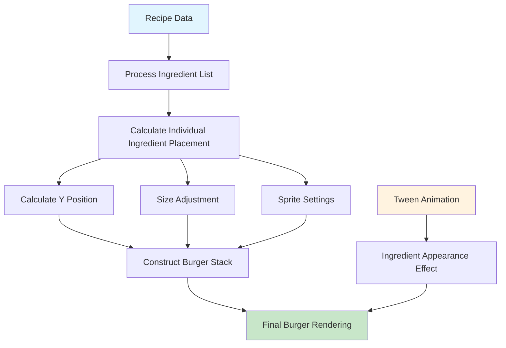
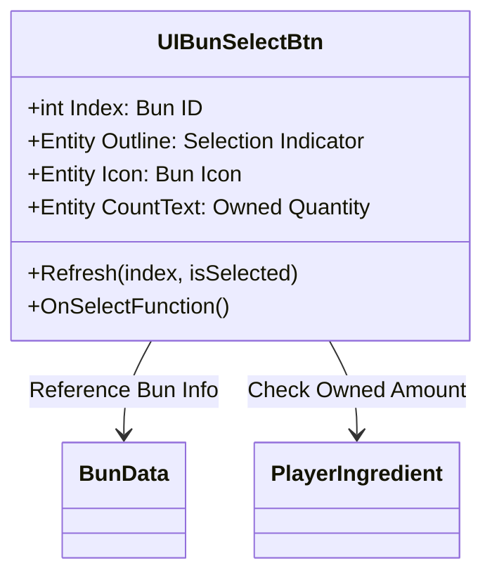
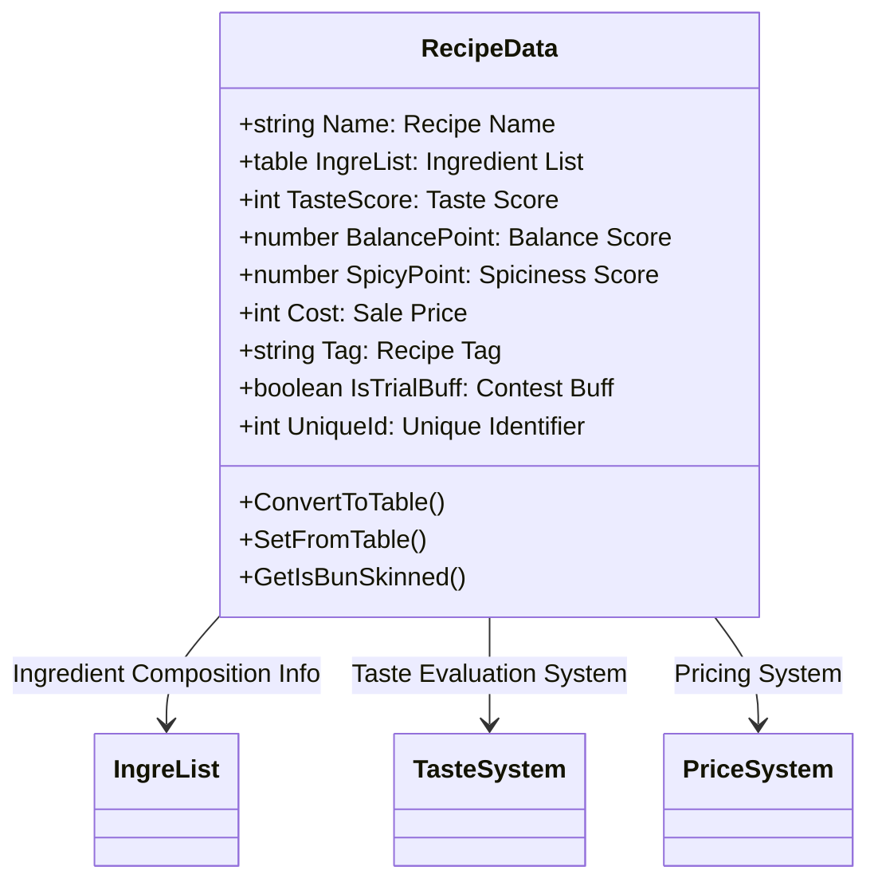
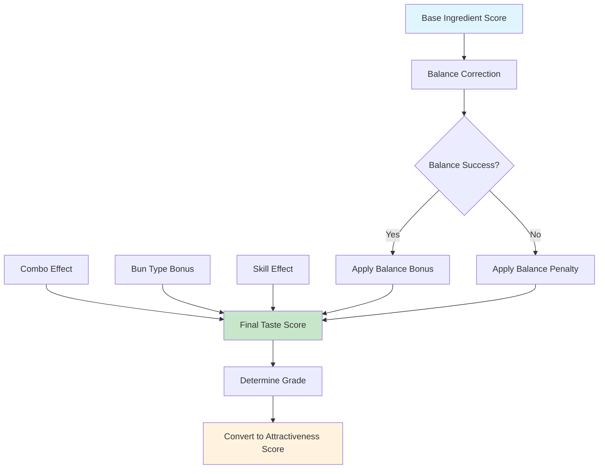
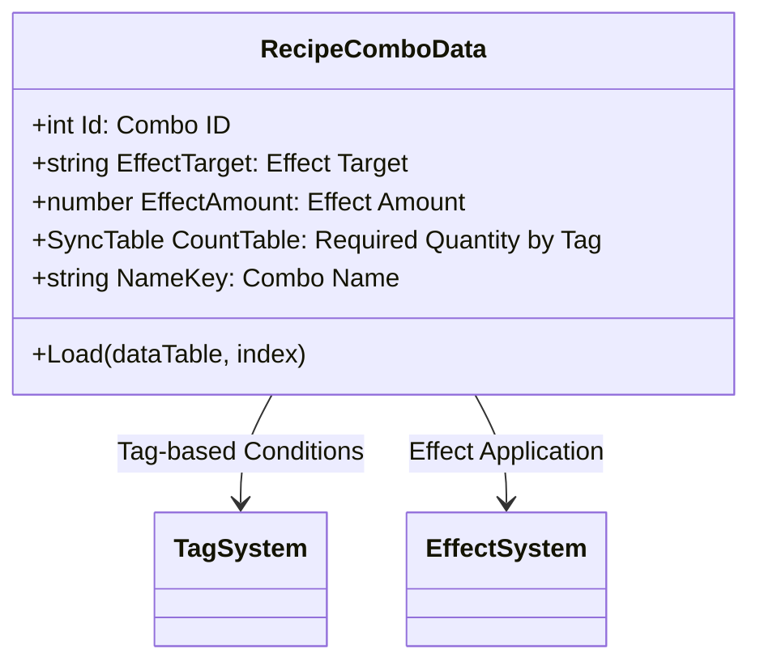
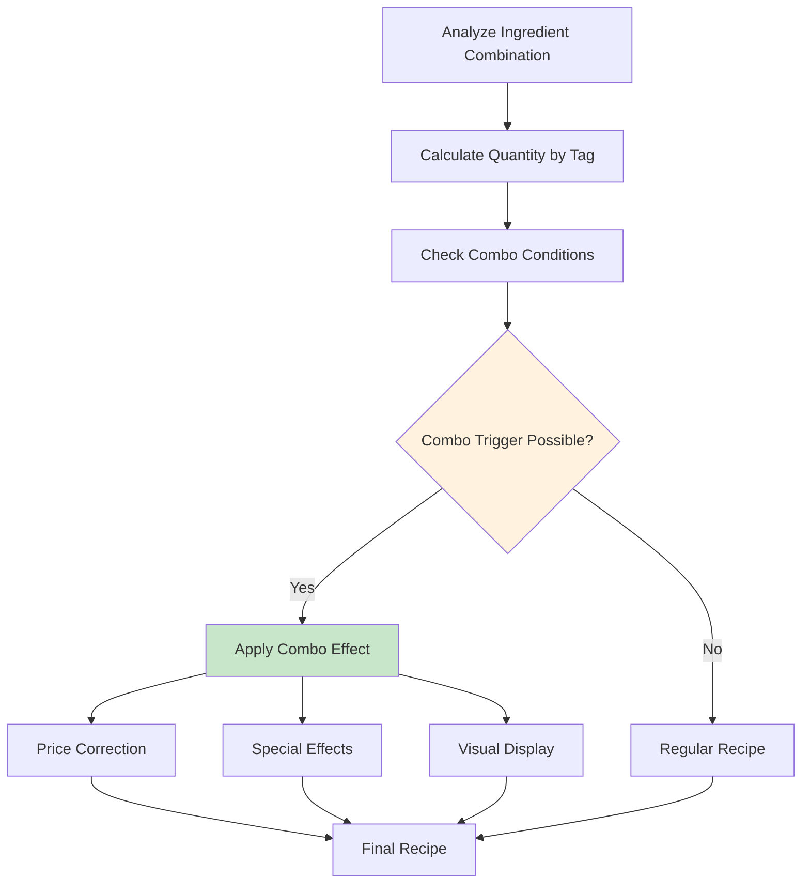
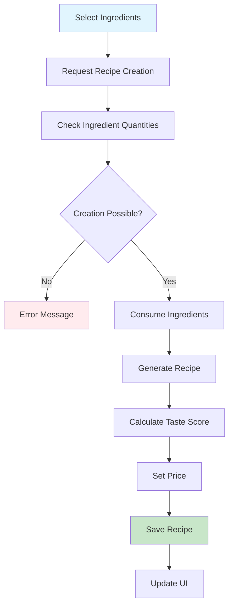
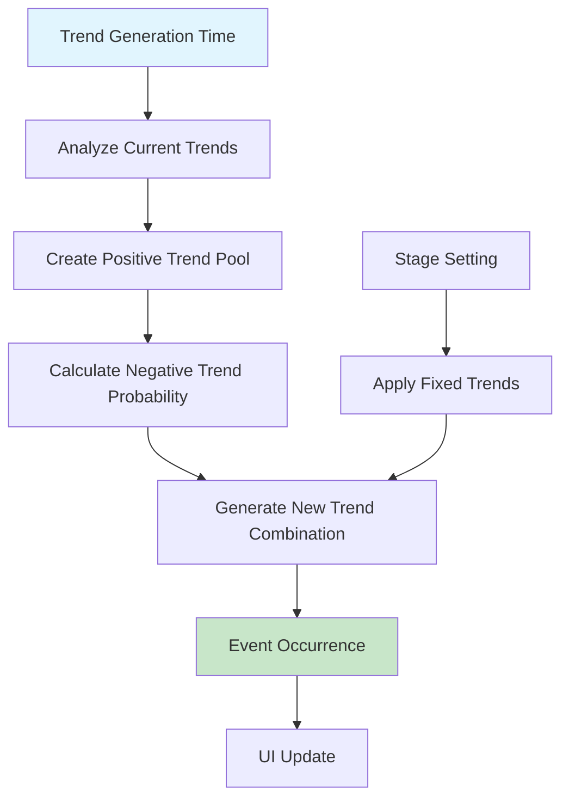

# Recipe Creation System

## System Overview

ChuChuBurger's recipe creation system is a core feature that allows players to create unique hamburger recipes by combining various ingredients. A complex system of ingredient selection, burger rendering, balance adjustment, and taste score calculation provides a deep recipe creation experience.

## Recipe Creation UI System

### DrawBurgerUIService - Burger Visual Rendering


#### Burger Rendering Core Mechanism
- **Hierarchical Placement**: Sequential placement of ingredients along Y-axis
- **Dynamic Size Adjustment**: Automatic burger size adjustment based on screen size
- **Animation Effects**: Natural appearance effects when adding ingredients
- **Real-time Preview**: Real-time view of burger appearance during creation

### Ingredient Selection System

#### UIBunSelectBtn - Bun Selection Interface


#### Bun Selection Features
- **Grade-based Display**: Background color distinction by bun grade
- **Quantity Display**: Real-time update of current owned quantity
- **Infinite Ingredients**: Display "∞" mark for basic ingredients
- **Shortage Warning**: Red warning display when owned quantity is 0

#### UIIngreCard - Ingredient Selection Interface
Intuitive ingredient selection system through ingredient cards:

- **Card Format**: Visualize each ingredient in card format
- **Grade Display**: Visual distinction by ingredient grade
- **Effect Information**: Display effects ingredient has on burger
- **Quantity Management**: Check available ingredient quantities

## RecipeData Structure System

### Core Data Structure


### Ingredient Composition System
Recipes are composed of combinations of various ingredients:

- **Buns**: Top and bottom buns and bun skins
- **Ingredients**: Various ingredients including meat, vegetables, sauces
- **Layer Structure**: Burger shape determined by ingredient placement order
- **Visual Representation**: Sprite rendering through each ingredient's RUID

## Balance and Taste Score System

### Taste Score Calculation Mechanism


#### TasteGradeDataSetLogic - Taste Grade Management
`TasteGradeDataSetLogic.ReturnGradeDataByScore(number score)`  
→ Core system that determines recipe grade based on score

- **Grade Iteration**: Iterate through TasteGradeData array to find grade matching score
- **Threshold Comparison**: Determine grade with `gradeData.GradeValue > score` condition

<details>
<summary>Related Code</summary>

```lua
-- TasteGradeDataSetLogic.mlua
method TasteGradeData ReturnGradeDataByScore(number score)
    local gradeIndex = 0
    for i = 1, #self.TasteGradeData do
        if gradeData.GradeValue > score then break end
        gradeIndex = i
    end
    return self.TasteGradeData[gradeIndex]
end
```
</details>

### Balance Point System
Each ingredient has balance points, and bonuses are earned when overall balance is achieved:

- **Balance Success**: Bonus when achieving balance within set range
- **Balance Failure**: Penalty applied when exceeding range
- **Strategy Effect**: Bonus adjustment based on side menu strategy
- **Skill Integration**: Balance calculation correction based on employee skills

### Spiciness Point System
Special effects based on using spicy ingredients:

- **Spiciness Accumulation**: Points increase when using spicy ingredients
- **Customer Preference**: Target customer segments that prefer spiciness
- **Special Effects**: Additional bonuses based on spiciness level
- **Risk Factor**: Possibility of customer departure due to excessive spiciness

## Combo System

### RecipeComboData - Combo Effect Management


#### Combo Trigger Conditions
Combos trigger when using a certain quantity or more of ingredients with specific tags:

- **Tag Classification**: Meat, Chicken, Seafood, Veggie, Spicy
- **Quantity Requirements**: Minimum required quantity for each tag
- **Effect Application**: Price increase, attractiveness bonus, etc.
- **Visual Feedback**: Special UI effects when combo triggers

### Combo Effect System


## PlayerRecipe Management System

### Recipe Creation Process


#### Creation Condition Verification
`PlayerRecipe.CheckCanStartRecipeMaking(table cards)`  
→ Comprehensively verify recipe creation feasibility.

- **Ingredient Quantity Verification**: Check owned amount of each ingredient through PlayerIngredient component  
- **Space Check**: Check recipe box free space with `recipeCount >= recipeMaxCount` condition

<details>
<summary>Related Code</summary>

```lua
-- PlayerRecipe.mlua
method void CheckCanStartRecipeMaking(table cards)
    -- Check ingredient quantities
    for k, v in pairs(countTable) do
        local error = self.Entity.PlayerIngredient:CanUseIngredientCard(k, v)
        if error ~= 0 then break end
    end
    
    -- Check recipe box space
    if recipeCount >= recipeMaxCount then
        canStart = 4  -- Insufficient space
    end
end
```
</details>

### Auto Menu Setting System
`PlayerRecipe.AutoSetRecipe()`  
→ Automatically select optimal combinations from owned recipes and place them in menu slots

- **Price Priority Sort**: Prioritize high-price recipes with `a.Cost > b.Cost` condition
- **Slot Limitation**: Auto-set recipes up to recipeSlotLimit

<details>
<summary>Related Code</summary>

```lua
-- PlayerRecipe.mlua
method void AutoSetRecipe()
    table.sort(canSetRecipes, function(a, b)
        return a.Cost > b.Cost  -- High price priority
    end)
    
    for i = 1, recipeSlotLimit do
        self:SetRecipe(i, playerRecipeIndex)
    end
end
```
</details>

## Trend System

### MakeNewTrend - Dynamic Trend Generation


#### Trend Types and Effects
- **Positive Trends**: Price increase for recipes with specific tags
- **Negative Trends**: Demand decrease for recipes with specific tags  
- **Combination Effects**: Complex influence of positive/negative trends
- **Duration**: Maintain trends for set period

### Annual Planning System
Pre-plan trend occurrences for predictable market changes:

- **YearlyPlan**: Annual trend occurrence schedule
- **Seasonal Reflection**: Trend patterns for specific periods
- **Strategic Response**: Encourage player preparation in advance
- **Event Integration**: Link special events with trends

## Reroll and Optimization System

### Recipe Reroll Feature
System for recreating unsatisfactory recipes:

- **Cost System**: Cost increases with number of rerolls
- **Ingredient Conservation**: Maintain used ingredients while recalculating only results
- **Probability Element**: Possibility of obtaining different results on reroll
- **Limitations**: Cost increase to prevent unlimited rerolls

### Employee Skill Integration
Effect of cooking employee skills on recipe creation:

- **Taste Score Bonus**: Score improvement based on cooking skills
- **Balance Correction**: Skilled employee balance adjustment ability
- **Special Effects**: Special recipe effects from advanced skills
- **Success Rate Improvement**: Reduced failure probability based on skill level

## Performance Optimization and User Experience

### UI Optimization
- **Object Pooling**: Performance improvement through ingredient UI entity reuse
- **Dynamic Loading**: Selective loading of only necessary resources
- **Animation Optimization**: Tween optimization for 60fps maintenance
- **Memory Management**: Automatic release of unused UI entities

### User Experience Improvement
- **Intuitive Control**: Drag-and-drop ingredient selection
- **Real-time Feedback**: Immediate result preview when selecting ingredients
- **Guide System**: Recipe creation guide for beginners
- **Auto-save**: Prevent unintended data loss during creation process

## Code References

### Burger Rendering System
- `RootDesk/MyDesk/04. Recipe/DrawBurgerUIService.mlua :: DrawBurgerUI()` — Burger visual rendering
- `RootDesk/MyDesk/04. Recipe/DrawBurgerUIService.mlua :: TweenIngredientUI()` — Ingredient addition animation
- `RootDesk/MyDesk/04. Recipe/DrawBurgerUIService.mlua :: ReturnIngreData()` — Ingredient placement calculation

### Recipe Data System
- `RootDesk/MyDesk/04. Recipe/Data/RecipeData.mlua :: ConvertToTable()` — Recipe data serialization
- `RootDesk/MyDesk/04. Recipe/Data/RecipeData.mlua :: SetFromTable()` — Data deserialization
- `RootDesk/MyDesk/04. Recipe/Data/RecipeData.mlua :: GetIsBunSkinned()` — Check bun skin application

### Player Recipe Management
- `RootDesk/MyDesk/00. Player/PlayerRecipe.mlua :: CheckCanStartRecipeMaking()` — Verify creation feasibility
- `RootDesk/MyDesk/00. Player/PlayerRecipe.mlua :: AutoSetRecipe()` — Auto menu setting
- `RootDesk/MyDesk/00. Player/PlayerRecipe.mlua :: MakeNewTrend()` — Trend generation

### Taste Score and Combo System
- `RootDesk/MyDesk/04. Recipe/Data/TasteGradeDataSetLogic.mlua :: ReturnGradeDataByScore()` — Taste grade calculation
- `RootDesk/MyDesk/04. Recipe/Data/TasteGradeDataSetLogic.mlua :: GetFinalComboBonus()` — Combo bonus calculation
- `RootDesk/MyDesk/04. Recipe/Data/RecipeComboData.mlua :: Load()` — Combo data load

### UI Interface
- `RootDesk/MyDesk/04. Recipe/UIScript/IngreCardSetting/UIBunSelectBtn.mlua :: Refresh()` — Bun selection UI update
- `RootDesk/MyDesk/04. Recipe/UIScript/IngreCardSetting/UIIngreCard.mlua` — Ingredient card UI management

### Trend System
- `RootDesk/MyDesk/04. Recipe/Data/RecipeDataSetLogic.mlua :: IsRecipeTrend()` — Check recipe trend
- `RootDesk/MyDesk/04. Recipe/Data/RecipeDataSetLogic.mlua :: GetTrendData()` — Trend data query

---

This document comprehensively covers all aspects of ChuChuBurger's recipe creation system. It provides understanding of how the entire process from ingredient selection to final recipe completion is implemented, and how each system interconnects to create deep gameplay.
