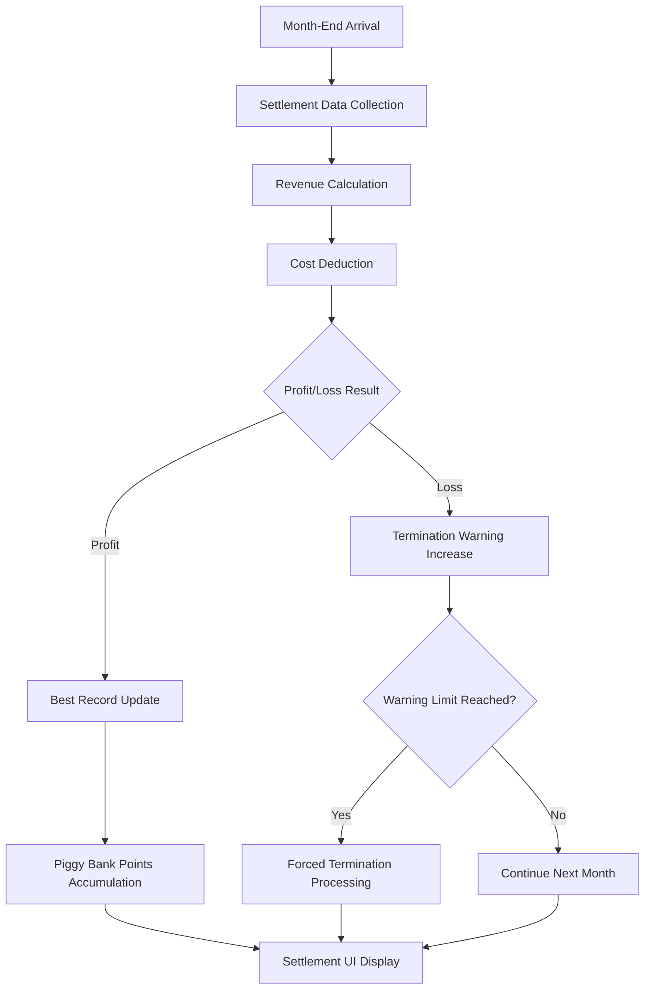

# Sales and Profit Management

ChuChuBurger's sales and profit management system is a core system that processes the player's store operation performance monthly and systematically manages revenue and costs. This system applies realistic business operation mechanisms to the game, allowing players as managers to understand their financial status and make informed decisions.

## System Overview

The core of the sales and profit management system is **month-end settlement**. At the end of each month, settlement proceeds automatically, calculating the player's revenue and costs to determine the final profit or loss. During this process, various follow-up actions occur, such as termination warnings if deficits occur, or profit accumulation in the piggy bank if profits are achieved.



## Core Components

### PlayerSettlement

The core component that oversees the game's settlement system.

**Key Properties:**
- `SettlementDatas`: Stores settlement data for up to 7 months
- `BestRecipeEarnings`: Best recipe earnings record 
- `ResignWarningCount`: Termination warning count (maximum 3)
- `PiggyBankEarnings`: Accumulated piggy bank earnings

**Core Methods:**
- `Settlement()`: Month-end settlement processing
- `AddValueForSettlement()`: Real-time settlement data accumulation
- `CreateNewMonthSettlementData()`: New month data initialization

### SettlementData

Data structure containing monthly settlement information.

**Revenue Items:**
- `P_RecipeTotal`: Recipe (burger) sales revenue
- `P_Training`: Revenue from business trips 
- `P_Etc`: Other revenue

**Cost Items:**
- `M_AccumSalary`: Accumulated employee wages
- `M_AccumMaintenance`: Accumulated facility maintenance costs
- `M_ChuchuEmployment`: Employee hiring costs
- `M_Upgrade`: Upgrade costs
- `M_Etc`: Other expenses

**Operational Indicators:**
- `CustomerCount`: Number of visiting customers
- `BurgerCount`: Number of burgers sold
- `IsMinusBudget`: Whether deficit occurred

## Settlement Processing Flow

### 1. Data Collection
When month-end arrives, settlement is automatically triggered by the `TimeManager`'s time system. All revenue and cost data for the current month are collected and the final profit/loss is calculated.

### 2. Cost Deduction
Total costs combining wages and maintenance costs are deducted from the player's held funds. During this process, `PlayerInventory:SubMoneyUnderZero()` checks whether there are insufficient funds.

### 3. Deficit Processing
`PlayerSettlement.Settlement()`  
→ When funds are insufficient, emergency funding support in early stages, warning accumulation processing in later stages

- **Early Protection**: Emergency funding support when `NowStage <= 2` 
- **Warning System**: Increase `ResignWarningCount` in later stages

<details>
<summary>Related Code</summary>

```lua
-- PlayerSettlement.mlua :: Settlement()
if self.Entity.PlayerStage.NowStage <= 2 then
    if self.Entity.PlayerManagement.ManagementLevel <= emergencyFundMLevel then
        local emergencyFund = _GetConfigDataLogic:GetConfigNumDataByKey("EmergencyFundManagementLevel"..self.Entity.PlayerManagement.ManagementLevel)
        self.Entity.PlayerInventory:ModifyMoney(emergencyFund, "Emergency fund", "Settlement popup")
    end
else
    self.ResignWarningCount = self.ResignWarningCount + 1		
end
```
</details>

### 4. Termination System
When 3 warnings accumulate due to consecutive deficits, employee termination proceeds automatically. This provides realistic management pressure.

## Revenue Records and Rewards

### Best Record Management
When monthly recipe revenue surpasses existing best records, it's saved as a new record and additional rewards are given through achievement system integration.

### Piggy Bank System
`PlayerSettlement.AddValueForSettlement()`  
→ Long-term revenue system that accumulates part of profits in the piggy bank when achieving profitability

- **Stage Limitation**: Piggy bank accumulation only active when `NowStage > 1`
- **Revenue Integration**: Add piggy bank points with `_PaidLogic:AddEarnings_PiggyBank()`

<details>
<summary>Related Code</summary>

```lua
-- PlayerSettlement.mlua :: AddValueForSettlement()
if self.Entity.PlayerStage.NowStage > 1 then
    _PaidLogic:AddEarnings_PiggyBank(addValue, self.Entity.PlayerComponent.UserId)
end
```
</details>

The piggy bank serves as a long-term revenue system that converts to diamonds when certain criteria are met.

### Achievement Integration
`PlayerSettlement.Settlement()`  
→ Link monthly customer count and burger sales to the achievement system for recording

- **Progress Check**: Check current achievement progress with `ReturnAchievementProgress()`
- **Record Update**: Update best record with `customerProgress < customerCount` condition

<details>
<summary>Related Code</summary>

```lua
-- PlayerSettlement.mlua :: Settlement()
local customerProgress = self.Entity.PlayerAchievement:ReturnAchievementProgress(_RecordAchievementTypeEnum.MonthlyCustomerCount)
if customerProgress < customerCount then
    self.Entity.PlayerAchievement:ChangeProgress(_RecordAchievementTypeEnum.MonthlyCustomerCount, customerCount)
end
```
</details>

## UI System

### Settlement Panel (UISettlementPanel)
The main UI that visually displays month-end settlement results. It appears with slide animations and provides the following information:

- Year/month information for the period
- Recipe revenue and other revenue analysis
- Maintenance costs and total cost breakdown  
- Whether best record was achieved
- Character emotional expressions based on deficit/profit status

### Progress Graph (UISettlementProgressGraphLine)
Displays revenue trends for the past 7 months as a bar graph. Each bar is composed as follows:

- **Height**: Ratio of that month's revenue to best record
- **Color**: Profit/deficit status indication
- **Icon**: Best record achievement month indicator (`BEST` icon)
- **Deficit Indication**: Minus icon for deficit months

### Store Information Integration
The settlement system integrates with store information UI, allowing players to check past settlement records at any time.

## Real-time Data Collection

While settlement occurs only at month-end, data collection proceeds in real-time:

- **Customer Purchases**: Recipe revenue accumulation
- **Employee Wage Payment**: Wage cost accumulation  
- **Facility Upgrades**: Upgrade cost recording
- **Business Trip Completion**: Business trip revenue addition

Through this real-time data collection, players can understand their current revenue situation even mid-month.

## Data Management

### Save and Load
All settlement data is saved to the database in JSON format and perfectly restored when the game restarts.

### Data Retention Policy
For performance reasons, only 7 months of data is retained, and when a new month begins, the oldest data is automatically deleted.

## Balance Adjustment and Difficulty

The settlement system is a core element for balancing the game:

- **Early Stages**: Emergency funding support provides learning opportunities
- **Intermediate Stages**: Gradual increase in management pressure  
- **Advanced Stages**: Strict profitability requirements

Through this, players can learn management skills step by step while experiencing continuous challenge and growth.

---

## Code References

**Core Files:**
- `RootDesk/MyDesk/00. Player/PlayerSettlement.mlua :: Settlement()` — Month-end settlement core logic
- `RootDesk/MyDesk/01. Lobby/Settlement/SettlementData.mlua :: ConvertToTable()` — Settlement data structure  
- `RootDesk/MyDesk/01. Lobby/Settlement/UISettlementPanel.mlua :: Open()` — Settlement result UI display
- `RootDesk/MyDesk/01. Lobby/Settlement/UISettlementProgressGraphLine.mlua :: Refresh()` — Graph line rendering
- `RootDesk/MyDesk/01. Lobby/TimeManager.mlua :: OnMonthChanged()` — Month-end settlement trigger
- `RootDesk/MyDesk/00. Player/PlayerOutgameManager.mlua :: AddPiggyBankPoint()` — Piggy bank point accumulation
- `RootDesk/MyDesk/Shop/BMCommon/PaidLogic.mlua :: AddEarnings_PiggyBank()` — Piggy bank earnings processing
