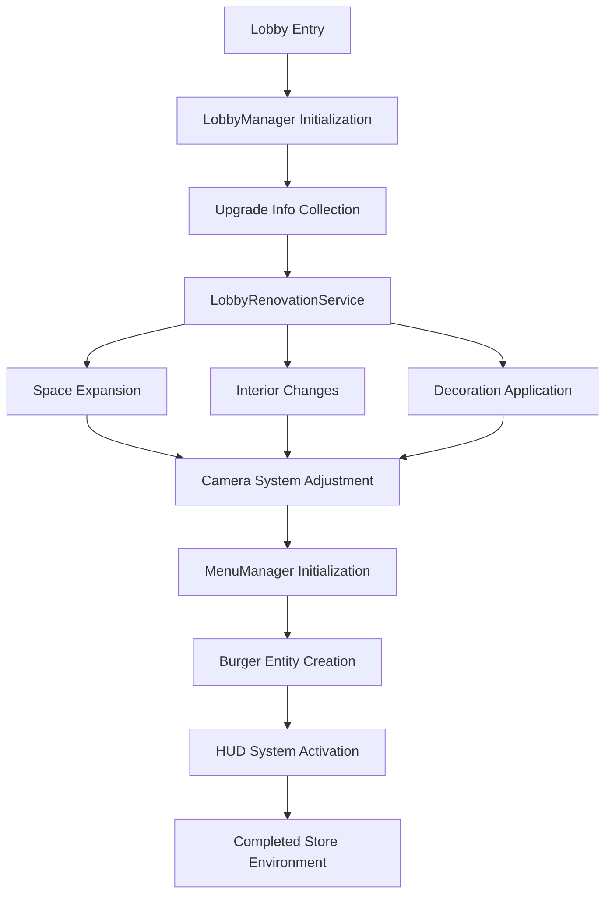

# Store Environment and Atmosphere

ChuChuBurger's store environment and atmosphere system is a core mechanism that allows players to create their own unique hamburger restaurants. This system provides an immersive store management experience through lobby management, menu visualization, camera control, and HUD display.

## System Overview

The store environment system is divided into **Physical Environment** and **Visual Representation**. The physical environment changes the actual space of the store through expansion, interior design, and decoration, while the visual representation provides players with a dynamic experience through menu displays, UI elements, and camera angles.



## Lobby Management System

### LobbyManager

The core component that manages the overall lobby (interior of the store) of the game.

**Initialization Process:**
`LobbyManager.RequestInit()`  
→ Collects the player's upgrade level information to initialize the lobby

- **Expansion Level**: Check ExpansionStep value with `ReturnCurrentPlayerValue()`
- **Interior Level**: Check InteriorLevel upgrade status
- **Decoration Level**: Check StoreDeco upgrade status

<details>
<summary>Related Code</summary>

```lua
-- LobbyManager.mlua :: RequestInit()
local expansionLv = _UpgradeDataSetLogic:ReturnCurrentPlayerValue(player, _UpgradeTypeEnum.ExpansionStep)
local interiorLv = _UpgradeDataSetLogic:ReturnCurrentPlayerLevel(player, _UpgradeTypeEnum.InteriorLevel) 
local decoLv = _UpgradeDataSetLogic:ReturnCurrentPlayerLevel(player, _UpgradeTypeEnum.StoreDeco)
```
</details>

The lobby initialization proceeds through the following stages:

1. **Upgrade Level Collection**: Check expansion, interior, and decoration levels
2. **Kitchen Equipment Information Collection**: Identify the number of grills, displays, and counters
3. **Client Initialization**: Visual changes through renovation service
4. **UI and Service Initialization**: Activate HUD, camera, employee management, etc.

### LobbyRenovationService

The core service that changes the physical environment of the store.

**Key Features:**
- **ExpandLobby()**: Space expansion according to expansion level
- **RedesignInterior()**: Interior theme changes
- **UpdateExteriorObject()**: Exterior object placement
- **UpdateWaitSeatPos()**: Customer waiting seat position adjustment

**Expansion System:**
`LobbyRenovationService.ExpandLobby()`  
→ Readjust kitchen equipment, pathways, and customer positions according to expansion level

- **Kitchen Equipment Placement**: Adjust equipment visibility with `VisibleKitAppsEntity()`
- **Path Initialization**: Set paths for new spaces with `_PathFinder:InitNodes()`
- **Customer Position Adjustment**: Update spawn positions with `UpdateCustomerSpawnPos()`

<details>
<summary>Related Code</summary>

```lua
-- LobbyRenovationService.mlua :: ExpandLobby() 
_KitchenAppService:VisibleKitAppsEntity(expansionLv,interiorLv,grillCount,displayCount,counterCount)
_PathFinder:InitNodes(expansionLv)
player.CustomerManager:UpdateCustomerSpawnPos(expansionLv)
```
</details>

When expansion proceeds, kitchen equipment placement, pathfinding nodes, and customer spawn positions are all readjusted to match the new space.

## Menu Visualization System

### MenuManager

A component that manages the state of all menus (burgers) sold in the store.

**Core Data Structure:**
- `DisplayBurger`: Displayed burgers [RecipeID][SlotIdx] = Count
- `SalesBurger`: Tracking sold burger quantities
- `CookingBurger`: Current cooking burger quantities
- `BurgerEntityPool`: Burger entity recycling pool

**Menu Change Processing:**
`MenuManager.RefreshDisplayBurger()`  
→ When menu changes, rearrange existing displayed burgers according to new settings

- **Recipe Search**: Match recipes based on uniqueID using `findRecipe()` function
- **Slot Rearrangement**: Move existing burgers to appropriate new slots

<details>
<summary>Related Code</summary>

```lua  
-- MenuManager.mlua :: RefreshDisplayBurger()
local findRecipe = function(uniqueID)
    for slotIdx,curRecipeId in pairs(self.CurrentSetRecipes) do		
        local setRecipeUniqueID = self:ReturnRecipeUniqueID(curRecipeId)
        if uniqueID == setRecipeUniqueID then 
            return slotIdx 
        end
    end
    return -1
end
```
</details>

### BurgerComponent

A component responsible for the visual representation of individual burger entities.

**Visual Stack Representation:**
`BurgerComponent.OnBurgerEntity()`  
→ Every time burgers are stacked, increase sprite vertical size to represent physical stacking

- **Size Calculation**: Dynamic size adjustment using `0.75 + 0.25 * (self.burgerCount - 1)` formula

<details>
<summary>Related Code</summary>

```lua
-- BurgerComponent.mlua :: OnBurgerEntity()
self.spriteRendererComponent.TiledSize.y = 0.75 + 0.25 * (self.burgerCount - 1)
```
</details>

Every time burgers are stacked, the sprite's vertical size increases to visually represent the physical stack.

**Quantity Management:**
- `AddBurgerEntity()`: Update visual size when adding burgers
- `SubstractBurgerEntity()`: Reduce size when removing burgers and deactivate when count reaches 0
- `OffBurgerEntity()`: Handle cooking burger quantity deduction

### MenuService

A service responsible for creation, recycling, and position management of burger entities.

**Entity Pooling System:**
`MenuService.CreateBurgerEntity()`  
→ Recycle burger entities through pooling for efficient memory usage

- **Pool Reuse**: Use existing entities with `#burgerEntityPool > 0` condition
- **Create New**: Create with `_SpawnService:SpawnByModelId()` when pool is empty

<details>
<summary>Related Code</summary>

```lua
-- MenuService.mlua :: CreateBurgerEntity()
if #burgerEntityPool > 0 then 
    burger = burgerEntityPool[1]
    burger:AttachTo(parent)
    table.remove(burgerEntityPool,1)	
elseif menuManager.CurBurgerEntityNum < self.MaxBurgerEntityNum then 
    local id = _EntryService:GetModelIdByName("Model_SpawnBurger")
    burger = _SpawnService:SpawnByModelId(id, "burger"..menuManager.BurgerIdx, Vector3(0,0,0), parent)
```
</details>

Recycle burger entities through pooling for efficient memory usage.

**Status Adjustment During Menu Changes:**
`MenuService.ChangeMenuRecipe()`  
→ When changing menus, reset customer and employee states to synchronize the system

- **Customer Status**: Clean up waiting customers with `ExitWaitCustomer()`
- **Employee Status**: Restart with `EmployeeStateStop()` followed by `EmployeeStateStart()`

<details>
<summary>Related Code</summary>

```lua
-- MenuService.mlua :: ChangeMenuRecipe()
player.CustomerManager:ExitWaitCustomer() 
player.EmployeeManager:EmployeeStateStop() 
player.EmployeeManager:EmployeeStateStart()
```
</details>

## HUD and UI System

### LobbyHUDService

A comprehensive service that manages all HUD elements in the lobby.

**Managed HUD Elements:**
- **Currency UI**: Gold, Hearts, Clover, Diamonds
- **Training Tokens**: Gauge and timer display
- **Store Information**: Monthly sales, customer count, maintenance costs
- **Trend Information**: Display currently active trends
- **Tip Storage**: Tip collection and usage UI
- **VIP Orders**: Special order status display

**HUD Initialization:**
`LobbyHUDService.OpenHUD()`  
→ Activate lobby HUD elements and update with initial data

- **HUD Group Activation**: Activate entire HUD with `EnableLobbyHUDGroup(true)`
- **Currency UI**: Update money information with `UpdateMoneyUI()`
- **Management Information**: Display management data with `ManagementUI.Refresh()`

<details>
<summary>Related Code</summary>

```lua
-- LobbyHUDService.mlua :: OpenHUD()
_UIGroupManager:EnableLobbyHUDGroup(true)
_UIMoneyBarLogic:UpdateMoneyUI(player.PlayerInventory.Money)
self.ManagementUI.UIHUDManagement:Refresh()
self:UpdateTrainingTokenUI(player.PlayerInventory.LunchBox)
```
</details>

### Report System

`LobbyHUDService.UpdateStoreInfoReportUI()`  
→ Display real-time events occurring in the store on the HUD

- **Report Entity Creation**: Create new report UI with `SpawnByEntity()`
- **Message Setting**: Set report content with `clone.TextComponent.Text`

<details>
<summary>Related Code</summary>

```lua
-- LobbyHUDService.mlua :: UpdateStoreInfoReportUI()
local clone = _SpawnService:SpawnByEntity(self.ReportOrigin, "Report"..tostring(self._T.reportIndex), Vector3.zero, self.StoreInfoReportLayout)
clone.TextComponent.Text = message
```
</details>

Manages a maximum of 5 reports cyclically to prevent screen clutter.

## Camera System

### LobbyCameraService

A camera system that allows observation of the store environment from various angles.

**Camera Types:**
- **FullView**: Default camera overlooking the entire store
- **MovingCamera**: Camera directly controllable by the player
- **Expansion-Specific Cameras**: Viewpoints optimized for each expansion level

**Camera Adjustment by Expansion Level:**
`LobbyCameraService.SetCamerasForExpansion()`  
→ When expansion level changes, automatically adjust camera boundaries and positions to match the new space

- **Camera Data**: Query expansion level-specific camera settings with `GetLobbyCameraData()`
- **Boundary Adjustment**: Set left-bottom boundary with `CustomBoundLB`

<details>
<summary>Related Code</summary>

```lua
-- LobbyCameraService.mlua :: SetCamerasForExpansion()
local cameraData = _CameraDataSetLogic:GetLobbyCameraData(expansionLevel)
for k, cameraComponent in pairs(self.lobbyCameras) do
    if typeData.CustomBoundLB ~= nil then
        cameraComponent.LeftBottom = Vector2(typeData.CustomBoundLB.x, typeData.CustomBoundLB.y)
    end
end
```
</details>

When expansion level changes, camera boundaries and positions are automatically adjusted to match the new space.

**Touch Control Support:**
Provides camera movement and zoom features through touch controls for mobile play.

## Environment Interaction

### Entity Reference Management

All important entities in the lobby are systematically managed:

- **Customer Spawn Points**: Position changes dynamically according to expansion
- **Employee Work Positions**: Linked to kitchen equipment placement
- **Burger Display Positions**: Accurate placement by menu slot
- **Decoration Objects**: Placement according to interior themes

### Atmosphere Production

**Emotional Feedback:**
- Special visual effects when achieving best records
- Character sad expressions when losses occur
- Celebration animations when successful day ends

**Sound System:**
- Environmental sounds: Grill sounds from kitchen, customer conversation sounds
- Sound effects: Burger completion, money earning, level up feedback
- Background music: Comfortable BGM matching store atmosphere

## Performance Optimization

### Entity Pooling

`MenuService.ResetBurgerEntity()`  
→ Pooling system for efficient management of large numbers of burger entities

- **Entity Initialization**: Deactivate with `Enable = false` then reset position
- **Pool Return**: Return to pool for reuse with `table.insert(burgerEntityPool, burger)`

<details>
<summary>Related Code</summary>

```lua
-- MenuService.mlua :: ResetBurgerEntity()
burger:AttachTo(parent)
burger.Enable = false
burger.TransformComponent.WorldPosition = Vector3(0,0,0)
table.insert(burgerEntityPool,burger)
```
</details>

### Conditional Rendering

Optimize performance by deactivating elements not visible on screen:

- Deactivate objects in non-expanded areas
- Hide burger slots not set in menu
- Remove UI elements that don't meet conditions

## User Experience Enhancement

### Intuitive Information Display

- **Color Coding**: Intuitive information delivery with profit (green), loss (red), neutral (gray) colors
- **Icon System**: Use clear icons instead of complex text
- **Animation**: Smooth transition effects for important changes

### Accessibility Considerations

- **Various Screen Ratios**: Support for mobile, tablet, PC and other various environments
- **Touch-Friendly UI**: Appropriate button sizes and spacing
- **Clear Feedback**: Immediate visual/audio feedback for all interactions

---

## Code References

**Core Files:**
- `RootDesk/MyDesk/01. Lobby/LobbyManager.mlua :: InitClient()` — Overall lobby initialization
- `RootDesk/MyDesk/01. Lobby/LobbyRenovationService.mlua :: ExpandLobby()` — Apply expansion/interior/decoration
- `RootDesk/MyDesk/07. Menu/MenuManager.mlua :: RefreshDisplayBurger()` — Menu display management
- `RootDesk/MyDesk/07. Menu/BurgerComponent.mlua :: OnBurgerEntity()` — Burger visualization
- `RootDesk/MyDesk/07. Menu/MenuService.mlua :: CreateBurgerEntity()` — Burger entity creation/recycling
- `RootDesk/MyDesk/01. Lobby/LobbyHUDService.mlua :: OpenHUD()` — HUD system management
- `RootDesk/MyDesk/01. Lobby/Camera/LobbyCameraService.mlua :: SetCamerasForExpansion()` — Camera system adjustment
