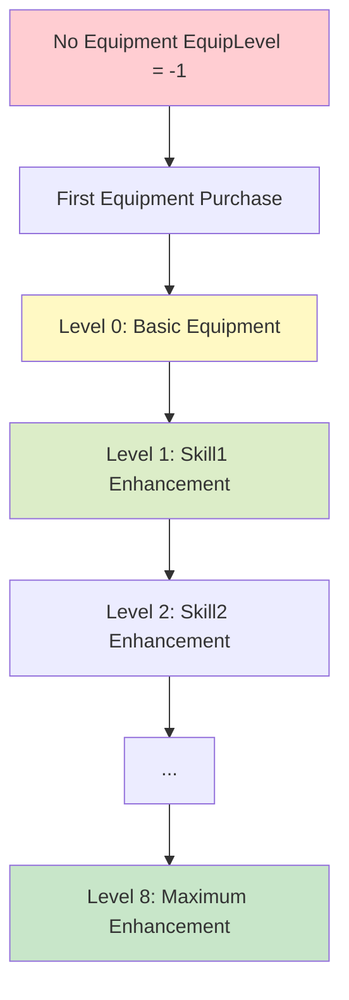

# Employee Equipment and Customization

ChuChuBurger's employee equipment system is a core growth mechanism that provides both performance enhancement and visual customization of employees. Through probability-based upgrades and various appearance changes, it offers players deep nurturing enjoyment.

## 1. Equipment System Overview

### 1.1 Equipment Level Structure



### 1.2 Equipment Effects

When equipment is equipped, the following changes occur:
- **Performance Enhancement**: Improved work efficiency through skill grade increases
- **Visual Changes**: All animations switch to equipped versions
- **Collection Progress**: Contributes to overall collection percentage

## 2. Equipment Data System

### 2.1 Equipment Upgrade Data

`EmployeeEquipUpgradeData` manages equipment information for each level.

**Related Files:**
- `RootDesk/MyDesk/Shop/EmployeeEquip/Data/EmployeeEquipUpgradeData.mlua`
- `RootDesk/MyDesk/Shop/EmployeeEquip/EmployeeEquipUpgradeDataLogic.mlua`

**Equipment Data Structure:**  
struct EmployeeEquipUpgradeData  
→ Data structure defining skill grades, upgrade costs, and success rates by equipment level.

<details>
<summary>Related Code</summary>

```lua
@Struct
script EmployeeEquipUpgradeData
    property integer EquipLevel = 0        -- Equipment level
    property integer Skill1Grade = 0       -- First skill grade
    property integer Skill2Grade = 0       -- Second skill grade
    property integer UpgradeCost = 0       -- Upgrade cost
    property integer UpgradeProb = 0       -- Upgrade success rate
    property string EquipLevelDescKey = "" -- Equipment description key
end
```
</details>

### 2.2 Maximum Upgrade Level

Currently, **Level 8** is set as the maximum upgrade level in the system.

## 3. Equipment Purchase System

### 3.1 First Equipment Purchase

Special items are required when employees purchase equipment for the first time.

**Related Files:**
- `RootDesk/MyDesk/Shop/BMCommon/PaidLogic.mlua`

**Equipment Purchase Processing:**  
method void RequestPurchaseEmployeeEquip(string employeeId, string userId)  
→ Consumes equipment purchase items to provide first equipment to employees who don't own any.

<details>
<summary>Related Code</summary>

```lua
@ExecSpace("Server")
method void RequestPurchaseEmployeeEquip(string employeeId, string userId)
    -- Only when equipment hasn't been purchased yet (EquipLevel == -1)
    if employeeOutgameDetailData.EquipLevel ~= -1 then
        return -- Already owns equipment
    end
    
    -- Consume equipment purchase item and set level to 0
    userEntity.PlayerInventory:RemoveItem(_ItemDataEnum.EmployeeEquipOpenItemId, 1, "Employee Equip Open")
    userEntity.EmployeeManager:AddEmployeeEquipLevel(employeeId)
end
```
</details>

First equipment purchase requires special purchase items, and upon completion, EquipLevel changes from -1 to 0.

### 3.2 Post-Purchase Processing

Upon equipment purchase completion, the following processes occur:
- **Animation Updates**: Switch to equipped animations
- **Badge Progress**: Increase equipment purchase badge progress
- **Logging**: Record equipment purchase logs

## 4. Equipment Upgrade System

### 4.1 Probability-based Upgrades

Equipment upgrades proceed based on probability.

**Upgrade Execution:**  
method void RequestUpgradeEmployeeEquip(string employeeId, string userId, string currencyId)  
→ Deducts costs and determines equipment upgrade success/failure based on probability.

<details>
<summary>Related Code</summary>

```lua
@ExecSpace("Server")
method void RequestUpgradeEmployeeEquip(string employeeId, string userId, string currencyId)
    local equipUpgradeData = _EmployeeEquipUpgradeDataLogic:GetEmployeeEquipUpgrageData(nextEquipLevel)
    local upgradeCost = equipUpgradeData.UpgradeCost
    local upgradeProb = equipUpgradeData.UpgradeProb
    
    -- Deduct cost then determine success/failure through probability calculation
    userEntity.PlayerInventory:RemoveItem(currencyId, upgradeCost, "Employee Equip Upgrade")
    local res = self:UpgradeProcess(upgradeProb)
    
    if res then
        userEntity.EmployeeManager:AddEmployeeEquipLevel(employeeId) -- Success
    end
end
```
</details>

Upgrades use a probability-based system where items are consumed even upon failure.

### 4.2 Probability Calculation System

Upgrade success is determined by a sophisticated random seed system:

**Probability Calculation System:**  
method boolean UpgradeProcess(integer upgradeProb)  
→ Generates unpredictable random results through complex seed generation.

<details>
<summary>Related Code</summary>

```lua
@ExecSpace("Server")
method boolean UpgradeProcess(integer upgradeProb)
    -- Complex seed generation ensures unpredictable randomness
    local seedOffset = 1
    for i=1, 10 do
        seedOffset = math.random(1, 100000)
    end
    local seed = os.time() * 1000000 + os.clock() * 1000000 + seedOffset
    math.randomseed(seed)
    
    local res = math.random(1, 100)
    
    -- Success if result is within probability range
    if res <= upgradeProb then
        return true
    end
    
    return false
end
```
</details>

### 4.3 Upgrade Costs

Upgrades consume the following costs:
- **Scroll Items**: Different quantities required by level
- **Level-based Increase**: Higher levels require more costs
- **Consumption on Failure**: Items are consumed even when upgrade fails

## 5. Skill Grade System

### 5.1 Equipment Level and Skill Grade Integration

Skill grades automatically increase as equipment levels rise.

**Related Files:**
- `RootDesk/MyDesk/02. Employee/EmployeeManager.mlua`

**Skill Grade Update:**  
method void AddEmployeeEquipLevel(string employeeId)  
→ Automatically updates employee skill grades when equipment level increases.

<details>
<summary>Related Code</summary>

```lua
@ExecSpace("ServerOnly")
method void AddEmployeeEquipLevel(string employeeId)
    self.EmployeeOutgameDetailTable[employeeId].EquipLevel += 1
    
    local equipLevel = self.EmployeeOutgameDetailTable[employeeId].EquipLevel
    local data = _EmployeeEquipUpgradeDataLogic:GetEmployeeEquipUpgrageData(equipLevel)
    
    -- Automatically update skill grades
    self.EmployeeOutgameDetailTable[employeeId].Skill1Grade = data.Skill1Grade
    self.EmployeeOutgameDetailTable[employeeId].Skill2Grade = data.Skill2Grade
end
```
</details>

### 5.2 Effects by Skill Grade

Higher skill grades provide the following effects:
- **Work Speed Enhancement**: Reduced cooking/serving times
- **Special Effects**: Increased probability of advanced skill activation
- **Efficiency Increase**: Overall work performance improvement

## 6. Visual Customization

### 6.1 Animation Transitions

When equipment is equipped, all animations switch to equipped versions.

**Related Files:**
- `RootDesk/MyDesk/02. Employee/EmployeeData.mlua`
- `RootDesk/MyDesk/02. Employee/EmployeeUIService.mlua`

**Animation Resource Structure:**  
Different animation resources are used based on equipment status.

<details>
<summary>Related Code</summary>

```lua
-- Basic animations
property string StandRUID = ""     -- Standing pose
property string ChatRUID = ""      -- Chat motion  
property string MoveRUID = ""      -- Movement motion
property string WorkRUID = ""      -- Work motion

-- Equipped animations
property string EquipStandRUID = "" -- Equipped standing pose
property string EquipChatRUID = ""  -- Equipped chat motion
property string EquipMoveRUID = ""  -- Equipped movement motion
property string EquipWorkRUID = ""  -- Equipped work motion
```
</details>

### 6.2 Portrait System

Equipment status is also reflected in UI:

**Portrait Equipment Processing:**  
method void DrawPortraitWithEquip(Entity portraitEntity, Entity equipEntityParent, EmployeeData data)  
→ Displays appropriate images in UI portraits based on employee equipment status.

<details>
<summary>Related Code</summary>

```lua
@ExecSpace("ClientOnly")
method void DrawPortraitWithEquip(Entity portraitEntity, Entity equipEntityParent, EmployeeData data)
    local outgameData = player.EmployeeManager:GetEmployeeOutgameDetail(data.Id)
    
    local hasEquip = false
    if isvalid(outgameData) and outgameData.EquipLevel >= 0 then
        equipEntity.SpriteGUIRendererComponent.ImageRUID = data.EquipStandRUID
        hasEquip = true
    else
        equipEntity.SpriteGUIRendererComponent.ImageRUID = _IconRuidEnum.Empty
    end
end
```
</details>

### 6.3 Equipment Icons and Names

Each employee has unique equipment design:
- **EquipIcon**: Equipment icon resource
- **EquipNameKey**: Equipment name localization key

## 7. Equipment Shop UI

### 7.1 Shop Interface

`UIEmployeeEquipShop` manages equipment purchase and upgrade UI.

**Related Files:**
- `RootDesk/MyDesk/Shop/EmployeeEquip/UIEmployeeEquipShop.mlua`

**Key Features:**
- **Equipment Purchase**: First equipment purchase processing
- **Upgrades**: Probability-based equipment enhancement
- **Cost Display**: Shows required items and success rates
- **Result Feedback**: Upgrade success/failure animations

### 7.2 Upgrade Result Processing

**Upgrade Result Notification:**  
method void NotifyUpgradeEmployeeEquipToClient(boolean res, string itemId, integer count, integer equipLevel, string employeeId)  
→ Delivers upgrade results to client and synchronizes employee data.

<details>
<summary>Related Code</summary>

```lua
@ExecSpace("Client")
method void NotifyUpgradeEmployeeEquipToClient(boolean res, string itemId, integer count, integer equipLevel, string employeeId)
    self.UIEmployeeEqiupShop:OnUpgradeEquipCompleted(res, itemId, count, equipLevel)
    -- Synchronize employee detail data
    local player = _UserService.LocalPlayer
    player.EmployeeManager:CallbackAfterSyncDetailTable(player.EmployeeManager:GetEmployeeDetail(employeeId))
end
```
</details>

## 8. Collection System Integration

### 8.1 Collection Progress Calculation

Equipment upgrades are directly integrated with the collection system.

**Weight System:**
- **Employee Collection**: Weight 1
- **Equipment Ownership**: Weight 3

Employees with equipment have 3x weight in collection, directly affecting clover bonus calculations.

### 8.2 Badge System Integration

Equipment-related activities affect the following badge progress:
- **EmployeeEquipBuyCount**: Number of equipment purchases
- **EmployeeEquipUpgradeCount**: Number of successful equipment upgrades
- **EmployeeEquipUpgradeLevel**: Highest equipment level achieved

## 9. Economic System Integration

### 9.1 Cost Structure

**First Equipment Purchase:**
- Special item consumption (EmployeeEquipOpenItemId)
- One-time cost

**Upgrades:**
- Scroll item consumption
- Level-based cost increases
- Item consumption even on failure

### 9.2 Investment Returns

Equipment investment provides the following returns:
- **Work Efficiency**: Performance increase through skill grade improvements
- **Clover Bonus**: Bonus from collection progress contribution
- **Long-term Investment**: Permanent effects once upgraded

## 10. Developer Tools and Simulation

### 10.1 Upgrade Simulator

Simulators are provided to verify probability systems during development:

**Single Level Simulation:**  
method void EmployeeEquipUpgradeSimulator1(integer equipLevel, integer tryCount, string userId)  
→ Attempts multiple upgrades at specified level to verify actual success rates.

<details>
<summary>Related Code</summary>

```lua
@ExecSpace("ServerOnly")
method void EmployeeEquipUpgradeSimulator1(integer equipLevel, integer tryCount, string userId)
    local data = _EmployeeEquipUpgradeDataLogic:GetEmployeeEquipUpgrageData(equipLevel)
    local upgradeProb = data.UpgradeProb
    
    local successCount = 0
    for i=1, tryCount do
        if self:UpgradeProcess(upgradeProb) then
            successCount += 1
        end
    end
    
    local text = string.format("Attempted +%d enhancement %d times with %d successes. (Rate: %d%% / Actual: %.2f%%)", 
        equipLevel, tryCount, successCount, upgradeProb, successCount/tryCount * 100)
end
```
</details>

### 10.2 Complete Simulation

Simulators for calculating total consumption costs to maximum level are also provided.

## 11. Logging and Analysis

### 11.1 Detailed Logging

All equipment-related activities are recorded in detailed logs:
- **Purchase Logs**: Equipment purchase time and cost
- **Upgrade Logs**: Success/failure, probability, cost, item quantities
- **Result Logs**: Level comparison before and after upgrade

### 11.2 Balance Analysis

The following analyses are possible through log data:
- **Actual vs Theoretical Probability** comparison
- **Player Investment Pattern** analysis
- **Item Consumption** tracking
- **Success Rate Distribution** verification

Through this comprehensive equipment system, players can strategically enhance their employees while gaining both visual satisfaction and performance improvements. The probability-based system provides tension while being designed to give a sense of progress even upon failure.
