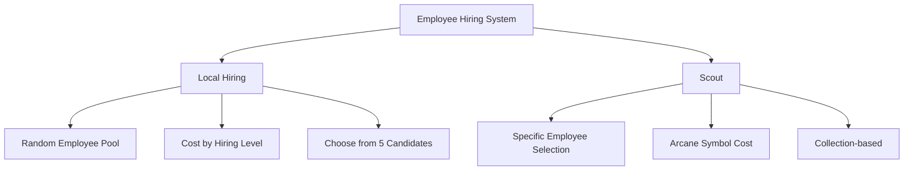

# Employee Hiring and Management

ChuChuBurger's employee hiring and management system is a comprehensive human resource management system that allows players to recruit employees through various methods and manage them efficiently.

## 1. Hiring System Overview

### 1.1 Hiring Method Classification

Employee hiring is divided into two main methods:



### 1.2 Hiring State Management

The `PlayerEmployment` component manages all hiring processes.

**Related Files:**
- `RootDesk/MyDesk/11. Employment/PlayerEmployment.mlua`

**Hiring States:**
- **LevelButtonList**: Hiring type selection stage
- **OnProcessing**: Local hiring in progress
- **Scout**: Scout hiring in progress
- **EmployeeList**: Employee list display and selection

## 2. Local Hiring System

### 2.1 Hiring Process

**Local Hiring Processing:**  
method void OnProcessingRecruit(integer employmentId)  
→ Checks tutorial status and selects 5 employees from the random employee pool without duplication to present hiring candidates.

<details>
<summary>Related Code</summary>

```lua
@ExecSpace("ServerOnly")
method void OnProcessingRecruit(integer employmentId)
    -- Provide fixed employee during tutorial
    if self.Entity.PlayerStage.NowStage == 1 then
        if self.Entity.PlayerAchievement:ReturnAchievementProgress(_TutorialAchievementTypeEnum.EmploymentCount) < 1 then
            self:Recruit_Fix(employmentId, _EmployeeTypeEnum.Serving)
            return
        end
    end
    
    -- Select 5 employees from random pool
    local empIdRandomBox = self:ReturnEmploymentChuchuPool(employmentId)
    for i = 1, self.DEFINE_EMPNUM do
        -- Select 5 without duplication
        local idx = _UtilLogic:RandomIntegerRange(1, #empIdRandomBox)
        local newEmployeeId = empIdRandomBox[idx]
        empList[i] = newEmployeeId
        table.remove(empIdRandomBox, idx)
    end
end
```
</details>

### 2.2 Hiring Level System

As hiring progresses, the hiring level increases, improving the probability of encountering higher-grade employees.

**Level Up Conditions:**
- Employment level +1 on successful local hiring
- Scout level +1 on successful scout hiring

**Hiring Cost Calculation:**  
method integer ReturnCostByEmploymentLv()  
→ Calculates local hiring cost based on current employment level by querying the data table.

<details>
<summary>Related Code</summary>

```lua
method integer ReturnCostByEmploymentLv()
    local employmnetLv = math.min(self.EmploymentLv, self.MaxEmploymentCount)
    local costData = _DataService:GetTable("EmploymentLevelDataSet")
    local row = costData:FindRow("EmployementLevel", _StringUtilLogic:NumToString(employmnetLv))
    local employmentCost = _StringUtilLogic:StringToInt(row:GetItem("EmployementRandomCost"))
    return employmentCost
end
```
</details>

### 2.3 Deposit System

When hiring employees, a deposit must be paid, which is partially refunded upon dismissal.

**Related Files:**
- `RootDesk/MyDesk/02. Employee/EmployeeService.mlua`

**Deposit Calculation:**  
method integer ReturnDeposit(Entity player, integer employmentType)  
→ Calculates deposit based on hiring type and level, applying stage-specific corrections.

<details>
<summary>Related Code</summary>

```lua
method integer ReturnDeposit(Entity player, integer employmentType)
    local deposit = 0
    local depositDataSet = _DataService:GetTable("EmploymentLevelDataSet")
    
    if employmentType == 1 then -- Local hiring
        local employmentLv = math.min(player.PlayerEmployment.EmploymentLv, player.PlayerEmployment.MaxEmploymentCount)
        deposit = depositDataSet:GetRow(employmentLv):GetItem("RandomDepositCost")
    elseif employmentType == 2 then -- Scout
        local scoutLv = math.min(player.PlayerEmployment.ScoutLv, player.PlayerEmployment.MaxEmploymentCount)
        deposit = depositDataSet:GetRow(scoutLv):GetItem("ScoutDepositCost")
    end
    
    -- Apply stage-specific correction
    local stageConfig = _BalanceDataSetLogic:GetStageConfigData(player.PlayerStage.NowStage).EmploymentCostRate
    deposit = math.floor(deposit * (1 + stageConfig))
    
    return deposit
end
```
</details>

## 3. Scout System

### 3.1 Specific Employee Scouting

Scouting is a system that allows direct hiring of specific desired employees from the collection.

**Process:**
1. Pay Arcane Symbol cost
2. Select employee from collection
3. Immediate hiring completion

**Scout Processing:**  
method void OnSelectChuchuInCollection(string chuchuId)  
→ Immediately hires the selected employee from the collection using Arcane Symbol cost.

<details>
<summary>Related Code</summary>

```lua
@ExecSpace("Server")
method void OnSelectChuchuInCollection(string chuchuId)
    local cost = self:ReturnCostByScoutLv()
    if self.Entity.PlayerInventory:ModifyArcaneSymbol(-cost, "Employment fee", "Select employeement type popup") then
        local empList = {}
        table.insert(empList, chuchuId)
        self.NewEmployeeIdList = empList
        self.EmploymentId = 2
        self:OnFinishRecruiting(self.NewEmployeeIdList, self.EmploymentId)
    end
end
```
</details>

### 3.2 Scout Cost

Scout costs increase based on scout level and are paid with Arcane Symbols.

## 4. Employee Transfer System

### 4.1 Transfer UI

Employees can be dismissed (transferred) through `UITransfer`.

**Related Files:**
- `RootDesk/MyDesk/11. Employment/UITransfer.mlua`
- `RootDesk/MyDesk/02. Employee/EmployeeManager.mlua`

**Transfer Execution:**  
method void TransferChuChu()  
→ Requests transfer of the selected employee and closes the UI.

<details>
<summary>Related Code</summary>

```lua
@ExecSpace("ClientOnly")
method void TransferChuChu()
    local player = _UserService.LocalPlayer
    player.EmployeeManager:RequestTransferEmployee(self.EmployeeId, true, "Transfer")
    self:CloseUI()
end
```
</details>

### 4.2 Transfer Compensation

When dismissing employees, the following compensation can be received:

**Transfer Compensation Payment:**  
method void RewardTransfer(string employeeId, integer refundHeart, table refundJem)  
→ Processes partial refund of hearts and experience items invested in the dismissed employee.

<details>
<summary>Related Code</summary>

```lua
@ExecSpace("ServerOnly")
method void RewardTransfer(string employeeId, integer refundHeart, table refundJem)
    -- Heart refund
    player.PlayerInventory:ModifyHeart(refundHeart, "Transfer fee", "Transfer popup")
    -- Experience item refund
    player.PlayerInventory:AddItem(jemItemId, jemCost, "Transfer fee", "Transfer popup")
end
```
</details>

**Refund Items:**
- **Hearts**: A certain percentage of invested hearts
- **Experience Potions**: Portion of used experience items

### 4.3 Transfer Restrictions

Transfers are restricted in some situations:
- During tutorial progression
- While achieving specific milestones
- For employees on scooter delivery

## 5. Hiring UI System

### 5.1 Main Hiring UI

`UIEmployment` manages all hiring-related UI.

**Related Files:**
- `RootDesk/MyDesk/11. Employment/UIEmployment.mlua`

**Key Features:**
- **Hiring Type Selection**: Local hiring vs Scout
- **Employee List Display**: Shows selectable employees
- **Cost Information**: Displays hiring costs and deposits
- **Employee Details**: Stats, skills, and appearance preview

### 5.2 Employee Selection Interface

**Employee Information Display:**
- Employee name and grade
- Cooking/Serving/Movement speed stats
- Skill information
- 3D model preview

**Employee Selection Confirmation:**  
method void OnCilckEmpListButton(Entity selectedButton)  
→ Checks hiring availability for the selected employee and starts the hiring process.

<details>
<summary>Related Code</summary>

```lua
@ExecSpace("Client")
method void OnCilckEmpListButton(Entity selectedButton)
    local player = _UserService.LocalPlayer
    player.PlayerEmployment:CheckCanEmployChuchu(selectedButton.UIEmployeeManageListRenderer.EmployeeId)
end
```
</details>

### 5.3 Hiring Result Processing

**Successful Hiring Processing:**  
method void SuccessEmploy(string employeeId)  
→ Closes UI upon successful hiring, displays success message, and updates Red Dot status.

<details>
<summary>Related Code</summary>

```lua
@ExecSpace("Client")
method void SuccessEmploy(string employeeId)
    self:CloseUI()
    local empData = _EmployeeService:GetData(employeeId)
    local name = _LocalizationService:GetText(empData.NameKey)
    _ReportMessageMaker:RequestAddToReportQueue(2003, name, "", "")
    _MainMenuRedDotManager:EnableEmploymentRedDot(false)
    _MainMenuRedDotManager:EnableEmployeeManageRedDot(true)
end
```
</details>

**On Failure:**
- Insufficient funds notification
- Hiring cancellation processing

## 6. Employee Management System

### 6.1 Employee Status Management

`EmployeeManager` oversees the status of all employees.

**Management Information:**
- **Location Info**: Current placement position of each employee
- **Work Status**: Cooking/Serving/Standby status
- **Stat Information**: Level, experience, skill grades
- **Equipment Information**: Equipped items and levels

### 6.2 Employee AI Status Control

**Employee Work Start:**  
method void EmployeeStateStart()  
→ Adds appropriate AI components to all placed employees to start their work.

<details>
<summary>Related Code</summary>

```lua
@ExecSpace("ClientOnly")
method void EmployeeStateStart()
    for idx, data in pairs(self.EmployeesLocation) do
        local locationData = data
        local employee = _UserService.LocalPlayer.CurrentMap:GetChildByName(locationData.Id)
        if isvalid(employee) then
            employee:AddComponent("EmployeeMoveScript")
            if locationData.Location == _EmployeeTypeEnum.Cook then
                employee:AddComponent("CookEmployeeAIScript")
            elseif locationData.Location == _EmployeeTypeEnum.Serving then
                employee:AddComponent("ServingEmployeeAIScript")
            end
        end
    end
end
```
</details>

**Work Stop:**
- Remove AI components
- Clear burgers in progress
- Release movement scripts

### 6.3 Employee Placement Management

**Placement System:**
- Cooking employees: Placed at kitchen equipment
- Serving employees: Placed in serving areas
- Automatic optimal placement feature
- Manual position adjustment available

## 7. Tutorial Integration

### 7.1 Beginner Support

Special tutorial support is provided for the first stage:

**Fixed Employee Provision:**
- First hiring: Fixed serving employee provided
- Second hiring: Fixed cooking employee provided
- Special discount pricing applied

### 7.2 Achievement Integration

Hiring activities are linked to various achievements:
- **Total Hirings**: Tracks number of hired employees
- **Job-specific Hiring**: Separate counts for cooking/serving employees
- **Hiring Level**: Development of hiring system

## 8. Economic System Integration

### 8.1 Cost Structure

**Local Hiring:**
- Deposit: Paid with gold
- Cost increase by hiring level
- Stage-specific corrections applied

**Scout:**
- Scout cost: Paid with Arcane Symbols
- Cost increase by scout level
- Guaranteed hiring of specific employees

### 8.2 Settlement System Integration

Salaries of hired employees are automatically deducted in monthly settlements:
- Individual employee salary calculation
- Salary increase based on limit break level
- Risk of employee dismissal during deficit

### 8.3 Investment Returns

Employee hiring provides clear investment returns:
- **Work Efficiency**: Increased throughput from more employees
- **Advanced Employees**: Higher performance from high-stat employees
- **Long-term Investment**: Continuous performance improvement through level-ups

## 9. Hiring Data Management

### 9.1 Data Storage

All hiring-related information is safely stored in the database:

**Hiring Data Storage:**  
method void SaveToDB(table saveData)  
→ Converts all hiring-related information including hiring status, levels, and employee lists to strings for storage.

<details>
<summary>Related Code</summary>

```lua
@ExecSpace("ServerOnly")
method void SaveToDB(table saveData)
    local employmentTotal = {}
    employmentTotal["NewEmployeeIdList"] = _UtilLogic:TableToString(self.NewEmployeeIdList)
    employmentTotal["EmploymentState"] = self.EmploymentState
    employmentTotal["EmploymentLv"] = tostring(self.EmploymentLv)
    employmentTotal["ScoutLv"] = tostring(self.ScoutLv)
    employmentTotal["RerollCount"] = tostring(self.RerollCount)
    saveData["EmploymentData"] = employmentTotal
end
```
</details>

### 9.2 Logging System

All hiring activities are recorded in detailed logs:
- Hiring type and results
- Cost and compensation details
- Employee information and stats

Through this comprehensive hiring and management system, players can strategically recruit employees and manage them efficiently to achieve success in store operations.
