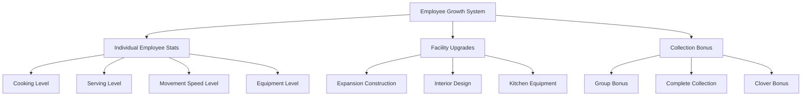
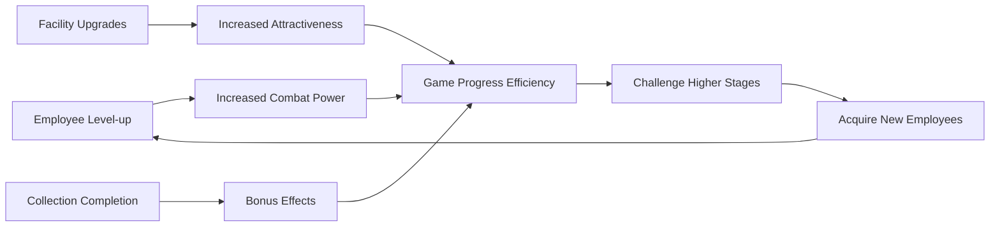

# Employee Level-up and Skills

ChuChuBurger's employee growth system is a comprehensive growth mechanism that includes level-ups using experience items, store improvements through facility upgrades, and bonus effects through employee collection.

## 1. Employee Level-up System Overview

### 1.1 Growth Structure

Employee growth consists of the following hierarchical structure:



## 2. Individual Employee Level-up

### 2.1 Experience Item System

Employee level-ups are achieved using experience potions.

**Related Files:**
- `RootDesk/MyDesk/02. Employee/Upgrade/EmployeeUpgradeService.mlua`

**Potion Types:**
- **Cooking Potions**: M0001~M0005 (Cooking stat enhancement)
- **Serving Potions**: M1001~M1005 (Serving stat enhancement)
- **Movement Speed Potions**: Dedicated items by stat type

**Level-up Calculation:**  
method table CalcNextUpgradeData(string statType, string empId, number potionExp, Entity player)  
→ Combines current experience with potion experience to calculate the next level.

<details>
<summary>Related Code</summary>

```lua
method table CalcNextUpgradeData(string statType, string empId, number potionExp, Entity player)
    local detail = player.EmployeeManager:GetEmployeeDetail(empId):ConvertToTable()
    local empStatExp = detail[statType.."Exp"]
    local empStatLevel = math.max(1,detail[statType.."Level"])
    -- Calculate experience and determine next level
    local nextLevel = self:ReturnNextLevelOfExpSum(curExp,statType, player)
end
```
</details>

### 2.2 Level-up Calculation System

**Experience Accumulation Method:**
1. **Current Experience** + **Potion Experience** = **Total Experience**
2. Calculate **New Level** based on **Total Experience**
3. Check **Maximum Level** limit
4. Handle **Excess Experience**

**Auto Level-up Feature:**
- Automatically calculate required potions for target level setting
- Suggest maximum achievable level with available potions
- Adjust to achievable range if insufficient

### 2.3 Limit Break System

Additional enhancement becomes available after employees reach maximum level.

**Limit Break Effects:**
- **Stage 1**: Unlock 1 skill
- **Stage 2**: Unlock 2 skills  
- **Stage 3**: Unlock 3 skills

**Skill Unlock Calculation:**  
method integer ReturnSkillNumByOverLimitLevel(integer overLimitLevel)  
→ Determines the number of skills unlocked based on limit break stage.

<details>
<summary>Related Code</summary>

```lua
method integer ReturnSkillNumByOverLimitLevel(integer overLimitLevel)
    if overLimitLevel == 0 or overLimitLevel == 1 then
        return 1
    elseif overLimitLevel == 2 then
        return 2
    elseif overLimitLevel == 3 then
        return 3
    end
end
```
</details>

## 3. Equipment Upgrade System

### 3.1 Equipment Level Management

Each employee has individual equipment levels that directly affect skill grades.

**Related Files:**
- `RootDesk/MyDesk/02. Employee/EmployeeManager.mlua`

**Equipment Level Increase:**  
method void AddEmployeeEquipLevel(string employeeId)  
→ Increases employee equipment level and updates skill grades.

<details>
<summary>Related Code</summary>

```lua
@ExecSpace("ServerOnly")
method void AddEmployeeEquipLevel(string employeeId)
    self.EmployeeOutgameDetailTable[employeeId].EquipLevel += 1
    local equipLevel = self.EmployeeOutgameDetailTable[employeeId].EquipLevel
    local data = _EmployeeEquipUpgradeDataLogic:GetEmployeeEquipUpgrageData(equipLevel)
    self.EmployeeOutgameDetailTable[employeeId].Skill1Grade = data.Skill1Grade
    self.EmployeeOutgameDetailTable[employeeId].Skill2Grade = data.Skill2Grade
end
```
</details>

### 3.2 Skill Grade System

Skill effects improve as equipment levels increase:
- **Skill1Grade**: Effect level of the first skill
- **Skill2Grade**: Effect level of the second skill

### 3.3 Equipment Upgrade Integration

When equipment is upgraded, the following systems are integrated:
- **Collection Percentage** recalculation
- **Badge Progress** updates
- **Client Synchronization**

## 4. Facility Upgrade System

### 4.1 Upgrade Manager

The `PlayerUpgrade` component manages all facility upgrades.

**Related Files:**
- `RootDesk/MyDesk/00. Player/PlayerUpgrade.mlua`

**Management Targets:**
- **Expansion Construction**: Store size expansion
- **Interior Design**: Floor and wall decoration
- **Decoration**: Ornament placement
- **Kitchen Equipment**: Grills, displays, counters

### 4.2 Upgrade Execution Process

**Upgrade Execution Process:**  
method void RequestApplyUpgradeDataServer(integer typeId, boolean isCheat)  
→ Calls appropriate services by upgrade type to improve facilities and update related achievements.

<details>
<summary>Related Code</summary>

```lua
@ExecSpace("ServerOnly")
method void RequestApplyUpgradeDataServer(integer typeId, boolean isCheat)
    -- Process by upgrade type
    if typeId == _UpgradeTypeEnum.ExpansionStep then
        _LobbyRenovationService:ExpandLobby(expansionLv,interiorLv,decoLv,grillCount,displayCount,counterCount,self.Entity)
        self.Entity.CustomerManager:CalcMyAttractive()
    elseif typeId == _UpgradeTypeEnum.InteriorLevel then
        _LobbyRenovationService:RedesignInterior(interiorLv,expansionLv, decoLv)
        self.Entity.PlayerAchievement:ChangeProgress(_AchievementTypeEnum.Interior, level)
    end
end
```
</details>

### 4.3 Upgrade Effects

**Expansion Construction:**
- Increased customer capacity
- Expanded employee placement space
- Unlock new features

**Interior Upgrades:**
- Increased store attractiveness
- Improved customer satisfaction
- Visual improvements

**Kitchen Equipment:**
- Enhanced cooking efficiency
- Increased display capacity
- Improved serving speed

## 5. Employee Collection System

### 5.1 Collection Database

`ChuchuCollectionDB` manages all employee collections.

**Related Files:**
- `RootDesk/MyDesk/02. Employee/ChuchuCollection/ChuchuCollectionDB.mlua`

**Stored Information:**
- **Employee Collection Status**: Collection status by employee
- **Stage-wise Progress**: Collection completion by stage
- **Group Level**: Achievement level by employee group
- **Reward Status**: Collection reward acquisition status

### 5.2 Collection Progress Calculation

**Collection Progress Calculation:**  
method void CountCollectionPercent()  
→ Calculates overall collection completion percentage by applying weights to employee collection and equipment ownership.

<details>
<summary>Related Code</summary>

```lua
@ExecSpace("ServerOnly")
method void CountCollectionPercent()
    local chuchuData = _EmployeeService.EmployeeData
    local maxCount = #table.keys(chuchuData) * (self.EquipCountWeight + self.ChuchuCountWeight)
    local count = 0
    -- Employee collection: weight 1
    -- Equipment ownership: weight 3
    local percent = (count / maxCount)
    self.CollectionPercent = percent * 100
end
```
</details>

**Collection Bonus:**
- **Clover Bonus**: Increased clover acquisition proportional to collection progress
- **Group Bonus**: Movement speed bonus upon completing specific groups

### 5.3 Group Level System

Each employee group's level is determined by the following conditions:

**Group Level Calculation:**  
method integer CalcGroupLevel(integer groupId)  
→ Determines group level by checking collection and equipment level conditions of all employees in the group.

<details>
<summary>Related Code</summary>

```lua
method integer CalcGroupLevel(integer groupId)
    -- All group employees must be collected
    -- Equipment level conditions: 0, 2, 4, 6, 8
    local conditionLevelList = {0, 2, 4, 6, 8}
    -- All employees must achieve corresponding equipment level for each stage
end
```
</details>

**Group Bonus Effects:**
- **Movement Speed per Level**: Certain movement speed increase per group level
- **Maximum Level 6**: When all employees achieve equipment level 8

### 5.4 Collection Rewards

**Individual Employee Rewards:**
- **50 Diamonds** awarded upon collecting new employee
- Rewards given immediately upon collection

**Stage-wise Rewards:**
- **50% Achievement**: 1000 Diamonds
- **100% Achievement**: 2000 Diamonds

**Group Level Rewards:**
- Stage-wise rewards upon achieving each group level
- Prevention of duplicate acquisition using bitmask

## 6. Growth System Interactions

### 6.1 Integrated Growth Structure

All growth systems are organically connected:



### 6.2 Achievement System Integration

Growth activities affect the following achievement progress:
- **Interior Upgrades**: Interior level achievements
- **Equipment Enhancement**: Equipment upgrade badge progress
- **Facility Expansion**: Expansion-related achievements
- **Collection**: Collection-related achievements

### 6.3 Automation Features

**Auto Level-up:**
- Automatically calculate required potions when setting target level
- Suggest optimal level-up within available resources

**Auto Settings:**
- Suggest maximum possible upgrade level
- Analyze cost-effectiveness ratio

## 7. Economic System Integration

### 7.1 Cost Management

**Level-up Costs:**
- Experience potion consumption
- Efficiency differences by potion grade

**Upgrade Costs:**
- Various currencies including gold, hearts, diamonds
- Cost increase curve by level

**Collection Costs:**
- Employee hiring costs
- Equipment upgrade costs

### 7.2 Investment Returns

Each growth system provides clear investment returns:
- **Employee Level-up**: Improved work efficiency
- **Facility Upgrades**: Increased customer capacity and satisfaction
- **Collection**: Continuous bonus effects

Through this comprehensive growth system, players can develop their stores in various directions, with each investment designed to provide substantial benefits to gameplay.
