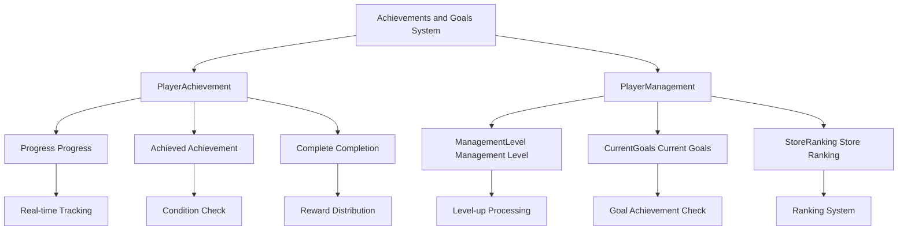

# Achievements and Goals

ChuChuBurger's achievements and goals system is a core mechanism that tracks and rewards player accomplishments. This system provides clear objectives for various game activities and delivers appropriate rewards upon completion to encourage continuous play motivation.

## System Overview

The achievements and goals system consists of the **Achievement System** and **Management Goal System**. The achievement system tracks individual accomplishments, while the management goal system manages systematic management level progression.



## Achievement System (PlayerAchievement)

### Achievement Status Management

The achievement system consists of 3-stage status:

**1. Progress (Progress)**  
method void ChangeProgress(number type, number value)  
→ Tracks cumulative progress of all game activities in real-time and automatically checks achievement status.

<details>
<summary>Related Code</summary>

```lua
-- PlayerAchievement.mlua :: ChangeProgress()
self.Progress[type] = value
_AchievementLogic:CheckAchievementAchieved(self.Entity, type)
```
</details>

**2. Achieved (Achievement)**
Manages the status of achievements that have met their conditions. Rewards become available once achieved.

**3. Complete (Completion)**
Manages the status of achievements that have received rewards. Integrates with Red Dot system.

### Achievement Processing

**Progress Update:**  
method void ChangeProgress(number type, number value)  
→ Automatically processes achievement condition checks and management goal integration when achievement progress changes.

<details>
<summary>Related Code</summary>

```lua
-- PlayerAchievement.mlua :: ChangeProgress()
self.Progress[type] = value
_AchievementLogic:CheckAchievementAchieved(self.Entity, type)
self.Entity.PlayerManagement:SetCurrentGoalsProgress()
self.Entity.PlayerManagement:CheckGoalsAchieved()
```
</details>

**Reward Distribution:**  
method void SetComplete(number id)  
→ Automatically distributes rewards for achieved achievements and updates related UI.

<details>
<summary>Related Code</summary>

```lua
-- PlayerAchievement.mlua :: SetComplete()
local rewardDataTable = _AchievementDataSetLogic:GetAchievementData(id).RewardData
self.Entity.PlayerInventory:AddItems(rewardDataTable, "Achievement Reward", "Achievement popup")
```
</details>

### Achievement Type Management

**Tutorial Achievements:**  
method boolean IsEventOccured(string eventGroupId)  
→ Routes tutorial achievements (starting with "T") to be managed by separate system.

<details>
<summary>Related Code</summary>

```lua
-- PlayerAchievement.mlua :: IsEventOccured()
if string.sub(eventGroupId, 1, 1) == "T" then
    return self.Entity.PlayerTutorialEvent:IsEventOccured(eventGroupId)
end
```
</details>

**General Achievements:**
- Revenue achievement
- Customer count achievement
- Employee hiring
- Recipe development
- Facility upgrades

### Real-time UI Integration

method void OnSyncProperty(string name)  
→ Automatically updates related UIs when achievement status changes to provide consistent user experience.

<details>
<summary>Related Code</summary>

```lua
-- PlayerAchievement.mlua :: OnSyncProperty()
if name == "Complete" then
    self:RequestUpdateUIAchievement()
    self:SetAchievementRedDot()
elseif name == "Achieved" then
    _UIButtonUnlockLogic:SetButtonsUnlock()
    _ToDoManager:RefreshToDoList()
end
```
</details>

**Integrated Systems:**
- Red Dot notification system
- Button unlock system
- ToDo management system
- HUD updates

## Management Goal System (PlayerManagement)

### Management Level Management

Management level is an indicator representing the player's overall management capability.

**Level-wise Goal Structure:**  
method void SetCurrentGoalsProgress()  
→ Calculates current progress of detailed goals to be achieved for each management level.

<details>
<summary>Related Code</summary>

```lua
-- PlayerManagement.mlua :: SetCurrentGoalsProgress()
local nextLevel = self.ManagementLevel + 1
local levelData = _ManagementDataSetLogic:GetManagementGoalData(self.Entity.PlayerStage.NowStage, nextLevel)

local indexDatas = levelData.IndexData
for k, v in pairs(indexDatas) do
    local achiType = indexData.AchievementType
    local achiCurrValue = self.Entity.PlayerAchievement:ReturnAchievementProgress(achiType)
    local achiGoalValue = _AchievementLogic:GetFixedTypeValue(self.Entity, achiType, indexData.TypeValue)
end
```
</details>

### Management Level-up Process

**1. Goal Achievement Check**  
method void ManagementLevelUp()  
→ Verifies that all goals must be achieved for level-up to be possible.

<details>
<summary>Related Code</summary>

```lua
-- PlayerManagement.mlua :: ManagementLevelUp()
self:SetCurrentGoalsProgress()
for k, v in pairs(self.CurrentGoals) do
    if v == false then
        return  -- Cannot level up if there are unachieved goals
    end
end
```
</details>

**2. Level Increase and Rewards**  
method void SetManagementLevel(number managementLevel)  
→ Distributes diamond rewards and updates related systems upon level-up.

<details>
<summary>Related Code</summary>

```lua
-- PlayerManagement.mlua :: SetManagementLevel()
self.ManagementLevel = managementLevel
self.Entity.PlayerAchievement:ChangeProgress(_AchievementTypeEnum.ManagementLevel, self.ManagementLevel)

if 0 < managementLevel and managementLevel < 6 then
    local diamondReward = _GetConfigDataLogic:GetConfigNumDataByKey("DiamondRewardManagementLevel"..managementLevel)
    self.Entity.PlayerOutgameManager:ModifyDiamond(diamondReward, false, "Management Level Up", "Management Level Up")
end
```
</details>

### Goal Data Structure

**Management Goal Data:**  
struct ManagementGoalData
→ Data structure that manages goal information and detailed achievement conditions for each management level.

**Goal Index Data:**  
struct ManagementGoalIndexData  
→ Structure that defines achievement types and target values for individual goals.

<details>
<summary>Related Code</summary>

```lua
-- ManagementGoalData.mlua
property integer Level = 0
property table IndexData = {}

-- ManagementGoalIndexData.mlua  
property integer AchievementType = 0  -- Achievement type
property integer TypeValue = 0        -- Target value
```
</details>

Each management level consists of multiple detailed goals (IndexData).

### Goal Achievement Tracking

**Real-time Goal Check:**  
method void CheckGoalsAchieved()  
→ Compares current progress with target values to check achievement status and immediately generates reports.

<details>
<summary>Related Code</summary>

```lua
-- PlayerManagement.mlua :: CheckGoalsAchieved()
local achiCurrValue = self.Entity.PlayerAchievement:ReturnAchievementProgress(achiType)
local achiGoalValue = _AchievementLogic:GetFixedTypeValue(self.Entity, achiType, indexData.TypeValue)

if achiCurrValue >= achiGoalValue then
    self.GoalsAchieved[saveId] = true
    _ManagementDataSetLogic:MakeGoalCompleteReport(achiType, achiGoalValue, self.Entity.PlayerComponent.UserId)
end
```
</details>

Reports are immediately generated upon goal achievement to notify players.

## Store Ranking System

### Ranking Calculation

Store ranking is determined based on player's management performance:

- **StoreRanking**: Current ranking
- **LastStoreRanking**: Previous ranking
- **Surroundings**: Surrounding store information

### Ranking Announcement

**Ranking Announcement System:**  
property string RankingAnnounceDate  
→ Manages regular ranking announcement dates for players to check ranking changes.

<details>
<summary>Related Code</summary>

```lua
-- PlayerManagement.mlua
property string RankingAnnounceDate = "12/10"  -- Ranking announcement date
```
</details>

### Annual Revenue Tracking

**Annual Revenue Tracking:**  
property number YearlyIncome  
→ Annual revenue is accumulated and used as long-term performance indicator.

## Red Dot System

### Notification Display

method void SetAchievementRedDot()  
→ Notifies with Red Dot when there are achieved achievements or completable goals.

<details>
<summary>Related Code</summary>

```lua
-- PlayerAchievement.mlua :: SetAchievementRedDot()
local hasAchievedNotCompleted = false
for id, isAchieved in pairs(self.Achieved) do
    if isAchieved and not self:IsAchievementComplete(id) then
        hasAchievedNotCompleted = true
        break
    end
end
```
</details>

### UI Button Unlock

method void OnSyncProperty()  
→ New features are unlocked step by step according to achievement completion, allowing players gradual access to all features.

<details>
<summary>Related Code</summary>

```lua
-- PlayerAchievement.mlua :: OnSyncProperty()
_UIButtonUnlockLogic:SetButtonsUnlock()
```
</details>

## Data Version Management

method void OnLoadedDataFromDB()  
→ Manages data versions of achievement system to ensure compatibility during updates.

<details>
<summary>Related Code</summary>

```lua
-- PlayerAchievement.mlua :: OnLoadedDataFromDB()
if archievementTotalTable["Version"] == self.Version then
    -- Load current version data
else
    -- Convert old version data
end
```
</details>

## Logging and Analysis

method void LogValue()  
→ Records all achievement completions and management level-ups in detail for analytical purposes.

<details>
<summary>Related Code</summary>

```lua
-- PlayerManagement.mlua :: ManagementLevelUp()
_LogStorageLogic:LogValue(self.Entity.PlayerComponent.UserId, _LogEnumType.ManageLevel, tostring(self.ManagementLevel), {
    year = tostring(utc.Year),
    month = tostring(utc.Month),
    manageLevel = tostring(self.ManagementLevel),
    playerLevel = playerLevel,
    storeName = storeName
})
```
</details>

**Recorded Information:**
- Achievement time
- Player information
- Achievement conditions
- Current progress status

## Performance Optimization

### Batch Processing

method void RequestGainAllReward()  
→ Provides batch processing feature to optimize performance by handling multiple achievements simultaneously.

<details>
<summary>Related Code</summary>

```lua
-- PlayerAchievement.mlua :: RequestGainAllReward()
for id, isAchieved in pairs(self.Achieved) do
    if not self:IsAchievementComplete(id) and self:IsAchievementAchieved(id) then
        table.insert(completedIds, id)
    end
end

self:RequestSetMultipleComplete(completedIds)
```
</details>

### Initial Value Setting

method void OnLoadedDataFromDB()  
→ Automatically sets initial achievement progress for new players to facilitate smooth game entry.

<details>
<summary>Related Code</summary>

```lua
-- PlayerAchievement.mlua :: OnLoadedDataFromDB()
self:ChangeProgress(_TutorialAchievementTypeEnum.FirstAccess, 1)
self:SetInitialTypeValue()
```
</details>

---

## Code References

**Core Files:**
- `RootDesk/MyDesk/00. Player/PlayerAchievement.mlua :: ChangeProgress()` — Achievement progress management
- `RootDesk/MyDesk/00. Player/PlayerAchievement.mlua :: SetComplete()` — Achievement completion processing
- `RootDesk/MyDesk/00. Player/PlayerManagement.mlua :: SetCurrentGoalsProgress()` — Management goal progress setting
- `RootDesk/MyDesk/00. Player/PlayerManagement.mlua :: ManagementLevelUp()` — Management level-up processing
- `RootDesk/MyDesk/09. Management/ManagementGoalData.mlua :: Load()` — Management goal data structure
- `RootDesk/MyDesk/Common/Achievement/AchievementLogic.mlua :: CheckAchievementAchieved()` — Achievement achievement check
