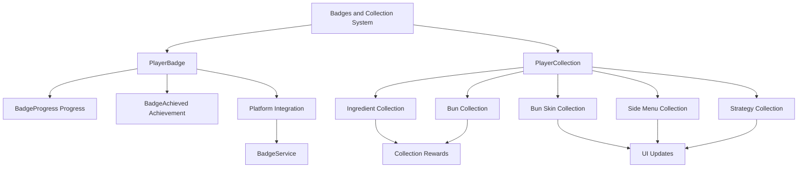

# Badges and Collection

ChuChuBurger's badges and collection system is a system that visually represents player achievements and provides long-term play objectives through collecting various content. The badge system provides official certification through integration with external platforms, while the collection system tracks the collection status of various in-game elements.

## System Overview

The badges and collection system consists of the **Badge System** and **Collection System**. Badges provide official certification for specific achievements, while collections manage the collection status of various in-game elements.



## Badge System (PlayerBadge)

### Badge Status Management

The badge system consists of a 2-stage status:

**1. BadgeProgress (Progress)**  
method void ChangeProgress(number typeId, number typeValue)  
→ Tracks badge-wise progress, ensures no regression, and automatically checks achievement status.

<details>
<summary>Related Code</summary>

```lua
-- PlayerBadge.mlua :: ChangeProgress()
if self.BadgeProgress[typeId] >= typeValue then
    return  -- Ignore if less than or equal to current progress
end

self.BadgeProgress[typeId] = typeValue
self:CheckBadgeAchieved(typeId, typeValue)
```
</details>

**2. BadgeAchieved (Achievement)**
Manages badge achievement status and synchronizes with external platforms.

### Badge Achievement Process

**Progress-based Check:**  
method void CheckBadgeAchieved(number typeId, number typeValue)  
→ Checks all badges of the same type to verify achievement conditions and automatically processes achievement.

<details>
<summary>Related Code</summary>

```lua
-- PlayerBadge.mlua :: CheckBadgeAchieved()
local badgeList = _BadgeDataSetLogic:GetBadgeListByTypeId(typeId)

for _, badgeId in pairs(badgeList) do
    local badgeData = _BadgeDataSetLogic:GetBadgeData(badgeId)
    if badgeData.TypeValue <= typeValue then
        self:SetBadgeAchieved(badgeId)
    end
end
```
</details>

**Platform Badge System Integration:**  
method void SetBadgeAchieved(string badgeId)  
→ Awards official badges through MapleStory Worlds platform's BadgeService and handles achievement logs and sound effects.

<details>
<summary>Related Code</summary>

```lua
-- PlayerBadge.mlua :: SetBadgeAchieved()
local result = _BadgeService:AwardBadgeAndWait(self.Entity.PlayerComponent.UserId, badgeId)
if result == true then
    self.BadgeAchieved[badgeId] = true
    self:BadgeLog(badgeId)
    _SoundService:PlaySound(_ResourceManager.SFXTable["System_AttendGift_Stamp_01"], 1, self.Entity.PlayerComponent.UserId)
end
```
</details>

### Badge Data Structure

**BadgeData Structure:**  
Badges consist of attributes such as BadgeId, TypeId, TypeValue, IsProgressVisible, IsHideOnUI, Grade, controlling platform integration and UI display.

<details>
<summary>Related Code</summary>

```lua
-- BadgeData.mlua
property string BadgeId = ""         -- Platform badge ID
property integer TypeId = 0          -- Badge type 
property integer TypeValue = 0       -- Achievement target value
property boolean IsProgressVisible = false  -- Progress display flag
property boolean IsHideOnUI = true   -- UI hide processing
property integer Grade = 0           -- Badge grade (Normal/Rare/Epic)
```
</details>

**Badge Grade System:**
- **Normal (0)**: Basic grade
- **Rare (1)**: Rare grade  
- **Epic (2)**: Epic grade

### Platform Synchronization

method void GetBadgeAchievedFromPlatform()  
→ Synchronizes badges already achieved on platform at game start to reflect badge achievement status from other devices.

<details>
<summary>Related Code</summary>

```lua
-- PlayerBadge.mlua :: GetBadgeAchievedFromPlatform()
_BadgeService:UserHasBadgeAsync(self.Entity.PlayerComponent.UserId, badgeId, function(userId, badgeId, isAchieved)
    self.BadgeAchieved[badgeId] = isAchieved
end)
```
</details>

### Stage Progress and Badge Integration

method void SetStageProgress()  
→ Automatically updates badge system when stage progress changes, performing systematic management with stage ID-based badge type ID.

<details>
<summary>Related Code</summary>

```lua
-- PlayerStage.mlua :: SetStageProgress()
self.StageProgress[stageId] = progress
local enum = tonumber(string.format("1000%d", stageId))
self.Entity.PlayerBadge:ChangeProgress(enum, progress)
```
</details>

## Collection System (PlayerCollection)

### Various Collection Types

PlayerCollection manages 5 main collections:

**1. Ingredient Collection (IngredientCollection)**  
method void AddIngredientCollection(number ingreId)  
→ Adds ingredients to collection by checking duplication prevention and stage-wise restrictions.

<details>
<summary>Related Code</summary>

```lua
-- PlayerCollection.mlua :: AddIngredientCollection()
if self.IngredientCollection[ingreId] == true then
    return  -- Skip already collected ingredients
end

if ingreData.RelatedStage ~= 0 and ingreData.RelatedStage ~= self.Entity.PlayerStage.NowStage then
    return  -- Check stage-wise restrictions
end

self.IngredientCollection[ingreId] = true
```
</details>

**2. Bun Collection (BunCollection)**
Manages collection status of buns, which are basic burger ingredients.

**3. Bun Skin Collection (BunSkinCollection)**
Collects visual customization elements for buns.

**4. Side Menu Collection (SideMenuCollection)**
Collects side menus, which are strategic elements of the game.

**5. Strategy Collection (StrategyCollection)**
Tracks collection status of various game strategies.

### Collection Reward System

**Reward Status Management:**  
property SyncTable<integer, boolean> IngredientCollectionGetReward  
→ Manages reward collection status separately for each collection item.

<details>
<summary>Related Code</summary>

```lua
-- PlayerCollection.mlua (Properties)
property SyncTable<integer, boolean> IngredientCollectionGetReward
property SyncTable<integer, boolean> BunCollectionGetReward
```
</details>

**Collection Completion Calculation:**  
method number GetIngredientCollectionPercentage()  
→ Calculates completion rate by determining the ratio of collected ingredients among collectible ones.

<details>
<summary>Related Code</summary>

```lua
-- PlayerCollection.mlua :: GetIngredientCollectionPercentage()
local collectedCnt = 0
local totalCnt = 0

for ingreId, data in pairs(_IngredientDataSetLogic.IngredientData) do
    if self:CheckCanCollectIngre(ingreId) == 0 then
        totalCnt += 1
        if self.IngredientCollection[ingreId] == true then
            collectedCnt += 1
        end
    end
end

return math.floor((collectedCnt / math.max(totalCnt, 1)) * 100)
```
</details>

### Real-time UI Integration

method void OnSyncProperty(string name)  
→ Related UIs are automatically updated when collection status changes, providing consistent user experience.

<details>
<summary>Related Code</summary>

```lua
-- PlayerCollection.mlua :: OnSyncProperty()
if name == "BunSkinCollection" then
    -- Refresh bun skin collection UI
    _UICollectionLogic.uiIngreBunCollection:RefreshList()
    _UILobbyManager:RefreshMenuInfo()
    
elseif name == "IngredientCollectionGetReward" then
    -- Refresh reward collection status UI
    _UICollectionLogic.uiIngreBunCollection:CheckCanGetReward()
    _UICollectionLogic:SetIngreBunCollectionMenuBtnRedDot()
end
```
</details>

**Integrated UI Elements:**
- Collection list UI
- Recipe creation UI
- Menu information UI
- Red Dot notification system

## Badge UI System

### Badge List Management (UIBadgeList)

**Filtering System:**  
method void SetFilter(number filterType)  
→ Filters and displays badge list by all/incomplete/complete categories.

<details>
<summary>Related Code</summary>

```lua
-- UIBadgeList.mlua :: SetFilter()
self.NowFilter = filterType
-- 0: All, 1: Incomplete, 2: Complete
```
</details>

**Sorting Options:**
- By achievement status
- By grade
- By progress

**Progress Display:**  
method void UpdateProgress()  
→ Updates slider and percentage text based on number of achieved badges and total badges.

<details>
<summary>Related Code</summary>

```lua
-- UIBadgeList.mlua :: UpdateProgress()
self.ProgressSlider.Value = (achievedCount / math.max(totalCount, 1))
self.ProgressText.Text = string.format("%d / %d", achievedCount, totalCount)
self.ProgressPercentText.Text = string.format("%.1f%%", (achievedCount / math.max(totalCount, 1)) * 100)
```
</details>

### Badge Slot Display (UIBadgeSlot)

Each badge is displayed in dedicated slots, including the following information:

- Badge icon
- Grade display
- Achievement status
- Progress (if applicable)

## Collection UI System

### Collection List (UIIngreBunCollection)

**Tab System:**
- Ingredient collection tab
- Bun collection tab  
- Bun skin collection tab

**Reward Effects:**  
method void DropDiamondAndMoveToMoneyBar()  
→ Provides visual effect of diamonds moving to money bar when collecting collection rewards.

<details>
<summary>Related Code</summary>

```lua
-- UICollectionLogic.mlua :: DropDiamondAndMoveToMoneyBar()
local moveTargetPos = _UIMoneyBarLogic.DiamondUI:GetChildByName("Icon").UITransformComponent.WorldPosition
icon.UITweenPop:StartPop(Vector3(targetPosX, targetPosY, startPos.z), 0.3, true, 0.15, moveTargetPos, 0.55)
```
</details>

### Collection Slot (UIIngreBunCollectionSlot)

**Collection Status Display:**  
method void RefreshIngre()  
→ Changes icon material based on collection status to display uncollected items in grayscale.

<details>
<summary>Related Code</summary>

```lua
-- UIIngreBunCollectionSlot.mlua :: RefreshIngre()
local collected = player.PlayerCollection.IngredientCollection[ingreId]
local materialId = collected and _IconRuidEnum.EmptyMaterial or _IconRuidEnum.GrayScaleMaterial
self.Icon.SpriteGUIRendererComponent:ChangeMaterial(materialId)
```
</details>

**Red Dot System:**

<details>
<summary>Related Code</summary>

```lua
-- UIIngreBunCollectionSlot.mlua :: RefreshIngre()
local isRedDotEnable = function()	
    local getReward = player.PlayerCollection.IngredientCollectionGetReward[ingreId]
    return collected and not getReward	-- When collected but reward not received
end
self.RewardDot.Enable = isRedDotEnable()
```
</details>

## Red Dot Management System

### Menu Button Red Dot

<details>
<summary>Related Code</summary>

```lua
-- UICollectionLogic.mlua :: SetIngreBunCollectionMenuBtnRedDot()
local isRedDotEnable = self.uiIngreBunCollection:ReturnCanGetReward(1) or self.uiIngreBunCollection:ReturnCanGetReward(2)
_MainMenuRedDotManager:EnableIngreBunCollectionRedDot(isRedDotEnable)
```
</details>

Red Dot is displayed in main menu when there are collectable collection rewards.

### Strategy-related Red Dot

Side menu collection and strategy setting UI are integrated:

<details>
<summary>Related Code</summary>

```lua
-- PlayerCollection.mlua :: OnSyncProperty()
elseif name == "SideMenuChecked" then
    _StrategyDataSetLogic.UIStageSettingStrategy:RefreshSideMenuTabRedDot()
```
</details>

## Logging System

### Badge Achievement Log

<details>
<summary>Related Code</summary>

```lua
-- PlayerBadge.mlua :: BadgeLog()
_LogStorageLogic:LogValue(userId, _LogEnumType.BadgeFlow, _HttpService:JSONEncode({
    badgeTypeValue = tostring(badgeData.TypeValue),
    badgeName = badgeData.Name
}), {
    badgeId = badgeId,
    badgeTypeId = tostring(badgeData.TypeId),
    badgeGrade = tostring(badgeData.Grade),
    playerLevel = self.Entity.PlayerStage:GetPlayerLastStageProgress()
})
```
</details>

### Collection Log

<details>
<summary>Related Code</summary>

```lua
-- PlayerCollection.mlua :: IngreCollectionFlowLog()
_LogStorageLogic:LogValue(userId, _LogEnumType.CollectionFlow, ...)
```
</details>

All collection activities are recorded for analysis.

## Data Version Management

<details>
<summary>Related Code</summary>

```lua
-- PlayerCollection.mlua :: OnLoadedDataFromDB()
if collectionTable["Version"] == self.Version then
    -- Process current version data
else
    -- Migrate old version data
end
```
</details>

Ensures compatibility of existing collection data even during system updates.

---

## Code References

**Core Files:**
- `RootDesk/MyDesk/00. Player/PlayerBadge.mlua :: ChangeProgress()` — Badge progress management
- `RootDesk/MyDesk/00. Player/PlayerBadge.mlua :: SetBadgeAchieved()` — Platform badge awarding
- `RootDesk/MyDesk/00. Player/PlayerCollection.mlua :: AddIngredientCollection()` — Add ingredient collection
- `RootDesk/MyDesk/18. Badge/BadgeData.mlua :: Load()` — Badge data structure
- `RootDesk/MyDesk/18. Badge/UIBadgeList.mlua :: Open()` — Badge UI management
- `RootDesk/MyDesk/17. Collection/UICollectionLogic.mlua :: SetIngreBunCollectionMenuBtnRedDot()` — Collection Red Dot management
