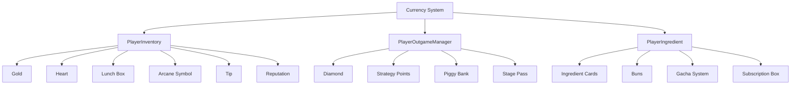

# Currency and Items

ChuChuBurger's currency and items system is the foundation of the game economy, systematically managing various resources to support player growth and game progression. This system is divided into basic currency, meta currency, and special materials, each serving their unique roles.

## System Overview

The currency and items system consists of **Basic Game Currency**, **Meta Game Currency**, and **Material System**. Each has different storage methods and purposes, organically connecting to form the game's economic ecosystem.



## Basic Game Currency (PlayerInventory)

### Gold (Money)

The main currency of the game and core resource for store operations.

**Usage:**
- Employee salaries and hiring costs
- Facility maintenance and upgrades
- General store purchases

**Acquisition Methods:**
- Revenue from customer serving
- Event rewards
- Other game activities

**Insufficient Balance Handling:**  
method boolean SubMoneyUnderZero(number expense, string source, string logSource)  
→ Activates emergency funding or employee dismissal warning systems when gold is insufficient during monthly settlement.

- **Auto Processing**: Provides temporary solution through low-interest loan system integration  
- **Warning System**: Employee dismissal warning during persistent funding shortage

<details>
<summary>Related Code</summary>

```lua
-- PlayerInventory.mlua :: SubMoneyUnderZero()
local result = self.Entity.PlayerInventory:SubMoneyUnderZero(expense,"Settlement store manage fee","Settlement popup")
-- Handle low-interest loan or dismissal warning
```
</details>

### Heart

Special currency used for employee-related activities.

**Usage:**
- Employee level-ups
- Employee skill enhancements
- Special employee hiring

**Features:**
- Maintains scarcity through limited acquisition paths
- Closely related to employee system

### Lunch Box (LunchBox)

Dedicated currency for the delivery system.

**Management System:**  
method void ModifyLunchBox(number count)  
→ Safely manages lunch box quantities by changing amounts and applying maximum capacity limits.

- **Range Restriction**: Limits between 0 and maximum value to prevent exception situations  
- **Stack Management**: Integrates with jewel cancel and auto recovery systems

<details>
<summary>Related Code</summary>

```lua
-- PlayerInventory.mlua :: ModifyLunchBox()
self.LunchBox = math.max(0, math.min(self.LunchBox + count, self.MaxLunchBoxNum))
```
</details>

**Features:**
- Maximum capacity limit (`MaxLunchBoxNum`)
- Consumed as delivery entry cost
- Auto recovery over time

### Arcane Symbol

Currency used for ingredient-related activities.

**Usage:**
- Ingredient gacha purchases
- Ingredient synthesis costs
- Advanced recipe unlocks

### Tip

Bonus currency acquired when serving customers.

**Tip Storage System:**  
method void ModifyTip(number count)  
→ Adds/removes tips while applying upgraded storage capacity limits to prevent overflow.

- **Dynamic Limits**: Query storage capacity based on upgrade level  
- **Auto Level**: Automatically adjust quantity when exceeding maximum

<details>
<summary>Related Code</summary>

```lua
-- PlayerInventory.mlua :: ModifyTip()
local maxTip = _UpgradeDataSetLogic:ReturnCurrentPlayerValue(self.Entity,_UpgradeTypeEnum.TipStorageLevel)
if self.Tip + count > maxTip then
    count = maxTip - self.Tip
end
```
</details>

**Features:**
- Storage capacity increase through upgrades
- Auto collection available upon reaching certain amount
- Linked to customer satisfaction

### Reputation

Indicator representing store reputation.

**Reputation System:**
- Fluctuates based on customer serving quality
- Changes in customer visit frequency based on reputation
- Access condition for specific content

## Meta Game Currency (PlayerOutgameManager)

### Diamond

The game's premium currency, distinguished between free and paid.

**Diamond Types:**  
method void AddDiamond(number diamond, boolean isPaid)  
→ Adds free and paid diamonds separately and manages respective accumulations.

- **Type Distinction**: Separate storage for paid/free diamonds  
- **Usage Order**: Prioritize free diamonds when consuming

<details>
<summary>Related Code</summary>

```lua
-- PlayerOutgameManager.mlua :: AddDiamond()
if isPaid then
    self.DiamondPaid += diamond
else
    self.DiamondFree += diamond  
end
```
</details>

**Usage Priority:**  
method boolean SubDiamond(number diamond)  
→ Prioritizes free diamonds when consuming and deducts shortage from paid diamonds.

- **Priority**: Use free diamonds first, then paid diamonds  
- **Auto Calculation**: Automatically deduct shortage from paid diamonds

<details>
<summary>Related Code</summary>

```lua
-- PlayerOutgameManager.mlua :: SubDiamond()
local diamondFreeUse = diamond
local diamondPaidUse = 0
if self.DiamondFree < diamond then
    diamondFreeUse = self.DiamondFree
    diamondPaidUse = diamond - diamondFreeUse
end
```
</details>

**Usage:**
- Premium product purchases
- Progress time reduction
- Special content access
- Store name changes

### Strategy Points

Special currency used in the strategy system.

**Acquisition Methods:**
- Stage clear rewards
- Special event completion
- Achievement accomplishment

**Usage:**
- Side menu activation
- Strategy effect purchases
- Advanced feature unlocks

### Piggy Bank System

Long-term revenue accumulation system.

**Piggy Bank Level Management:**  
method void AddPiggyBankLevel()  
→ Converts accumulated points to diamonds when piggy bank is full and progresses to next level.

- **Point Conversion**: Convert accumulated points to paid diamonds  
- **Level Progress**: Reset piggy bank with level-up processing

<details>
<summary>Related Code</summary>

```lua
-- PlayerOutgameManager.mlua :: AddPiggyBankLevel()
self:AddDiamond(self.PiggyBankPoint, true, source, source)
self:ResetPiggyBankPoint()
self.PiggyBankLevel += 1
```
</details>

**Operation Principle:**
1. Accumulate certain percentage of revenue to piggy bank
2. Convert to diamonds when piggy bank is full
3. Increase savings efficiency through level-ups

## Material System (PlayerIngredient)

### Ingredient Cards

Core items used for recipe creation.

**Ingredient Card Management:**  
method void AddIngredientCard(string ingreId, number count, string source)  
→ Adds ingredient cards while applying stack limits to prevent excessive accumulation.

- **Stack Limits**: Limit not to exceed maximum capacity per ingredient  
- **Collection Integration**: Update collection progress when acquiring new ingredients

<details>
<summary>Related Code</summary>

```lua
-- PlayerIngredient.mlua :: AddIngredientCard()
self.IngredientCards[ingreId] += count
if self.IngredientCards[ingreId] > _IngredientDataSetLogic.IngredientMaxStack then
    self.IngredientCards[ingreId] = _IngredientDataSetLogic.IngredientMaxStack
end
```
</details>

**Features:**
- Stack limits prevent excessive accumulation
- Integration with collection system
- Differential management by grade

### Bun System

Manages buns, basic burger ingredients.

**Bun Management:**
- Stack system similar to ingredient cards
- Customization through bun skins
- Collection effect application

### Gacha System

System to randomly acquire ingredients.

**Gacha Processing:**  
method void ProcessIngredientGacha(string gachaType, table results)  
→ Adds ingredient cards or buns to respective inventories based on gacha results.

- **Type-based Processing**: Handle ingredient (IN) and bun (BN) gachas differently  
- **Batch Processing**: Process multiple results with loops

<details>
<summary>Related Code</summary>

```lua
-- PlayerIngredient.mlua :: ProcessIngredientGacha()
for id, count in pairs(results) do
    if gachaType == "IN" then
        self:AddIngredientCard(id, count,"IngreGacha")
    elseif gachaType == "BN" then
        self:AddBun(id, count,"IngreGacha")
    end
end
```
</details>

**Gacha Types:**
- **Ingredient Gacha (IN)**: Acquire ingredient cards
- **Bun Gacha (BN)**: Acquire bun types

### Subscription Box System

System for regular ingredient supply.

**Subscription Box Processing:**  
method void GetIngreSubscriptionBox()  
→ Adds subscription box ingredients to inventory, displays reward UI, and cleans up used box.

- **Item Distribution**: Add box contents to inventory  
- **UI Display**: Guide acquired items through reward UI

<details>
<summary>Related Code</summary>

```lua
-- PlayerIngredient.mlua :: GetIngreSubscriptionBox()
self.Entity.PlayerInventory:AddItems(self.IngreSubscriptionBox,"Get IngreMailBox","Lobby HUD")
_UIItemRewardService:SetItemRewardUI(self.IngreSubscriptionBox, "IngreSubscription", self.Entity.PlayerComponent.UserId)
table.clear(self.IngreSubscriptionBox)
```
</details>

**Features:**
- Provided in mailbox format
- Auto supply at regular intervals
- Differential items based on subscription level

## Item ID System

All game items are managed with systematic IDs:

**Currency IDs:**
- `G0001`: Gold
- `G0002`: Lunch Box
- `G0004`: Arcane Symbol
- `G0005`: Heart
- `G1001`: Free Diamond
- `G1002`: Paid Diamond

**Special Processing:**  
method void AddItem(string itemId, number count, string source)  
→ Calls dedicated processing functions for each currency type based on item ID for consistent management.

- **ID-based Branching**: Branch to appropriate processing functions through item ID  
- **Dedicated Functions**: Execute processing logic specialized for each currency type

<details>
<summary>Related Code</summary>

```lua
-- PlayerInventory.mlua :: AddItem()
if itemId == "G0001" then
    self:ModifyMoney(count,source,modMapNameForNxLog)
elseif itemId == "G0002" then
    self:ModifyLunchBox(count,source,modMapNameForNxLog)
end
```
</details>

## Storage System Separation

**In-game vs Out-game Storage:**  
method number GetItemCount(string itemId)  
→ Queries quantities from appropriate storage locations based on item importance and characteristics.

- **Storage Location Decision**: Branch based on item data's SaveToOutgameDB setting  
- **Consistent Interface**: Access with same interface regardless of storage location

<details>
<summary>Related Code</summary>

```lua
-- PlayerInventory.mlua :: GetItemCount()
if itemData.SaveToOutgameDB == true then
    count = self.Entity.PlayerOutgameManager.OutgameInventory[itemId]
else
    count = self.Items[itemId]
end
```
</details>

Storage location is determined by item importance and characteristics:

- **In-game DB**: Temporary and highly variable items
- **Out-game DB**: Permanent and important items

## Real-time Synchronization

**Real-time Synchronization:**  
method void OnSyncProperty(string name)  
→ Real-time synchronization of all currency changes with client and generation of related events.

- **Property-based Events**: Generate corresponding events based on changed properties  
- **Global Notifications**: Process for related systems to immediately recognize currency changes

<details>
<summary>Related Code</summary>

```lua
-- PlayerInventory.mlua :: OnSyncProperty()
if name == "Money" then
    local moneyChangedEvent = PlayerMoneyChangedEvent()
    player:SendEvent(moneyChangedEvent)
elseif name == "Items" then
    local inventoryItemChanged = PlayerInventoryItemChangedEvent()
    player:SendEvent(inventoryItemChanged)
end
```
</details>

**Event Integration:**
Related systems are automatically updated when currency changes:

- UI display updates
- Achievement progress checks
- ToDo list updates
- Button activation/deactivation

## Logging System

**Logging System:**  
method void ResourceFlow(...)  
→ Records all currency changes in detail for analysis to collect game balance and economic data.

- **Detailed Logging**: Record all information including pre/post change quantities, source, occurrence location  
- **Analysis Support**: Data collection for game economic analysis

<details>
<summary>Related Code</summary>

```lua
-- PlayerOutgameManager.mlua :: AddDiamond()
self.Entity.PlayerLog:ResourceFlow(logValue, flowType, modresourcename, modresourcechangecnt, modresourceaftcnt, modresourcemakerdefinetag, modmapname)
```
</details>

**Log Information:**
- Pre/post change quantities
- Change reason (source)
- Occurrence location
- Flow type (acquisition/consumption)

## Security and Validation

**Server Validation:**
**Server Validation:**  
method number CanUseIngredientCard(string ingreId, number count)  
→ Validates all currency changes on server to prevent cheating and fraud.

- **Quantity Validation**: Check if usage quantity doesn't exceed holdings  
- **Error Codes**: Return appropriate error codes on validation failure

<details>
<summary>Related Code</summary>

```lua
-- PlayerIngredient.mlua :: CanUseIngredientCard()
if self.IngredientCards[ingreId] < count then 
    return 3  -- Insufficient ingredients
end
```
</details>

**Maximum Value Limits:**
Maximum holding amounts are set for each currency to prevent excessive accumulation.

---

## Code References

**Core Files:**
- `RootDesk/MyDesk/00. Player/PlayerInventory.mlua :: AddItem()` — Basic currency management
- `RootDesk/MyDesk/00. Player/PlayerOutgameManager.mlua :: ModifyDiamond()` — Meta currency management
- `RootDesk/MyDesk/00. Player/PlayerIngredient.mlua :: AddIngredientCard()` — Ingredient card management
- `RootDesk/MyDesk/00. Player/PlayerIngredient.mlua :: ProcessIngredientGacha()` — Gacha system
- `RootDesk/MyDesk/00. Player/PlayerInventory.mlua :: OnSyncProperty()` — Real-time synchronization
