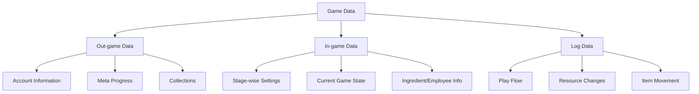
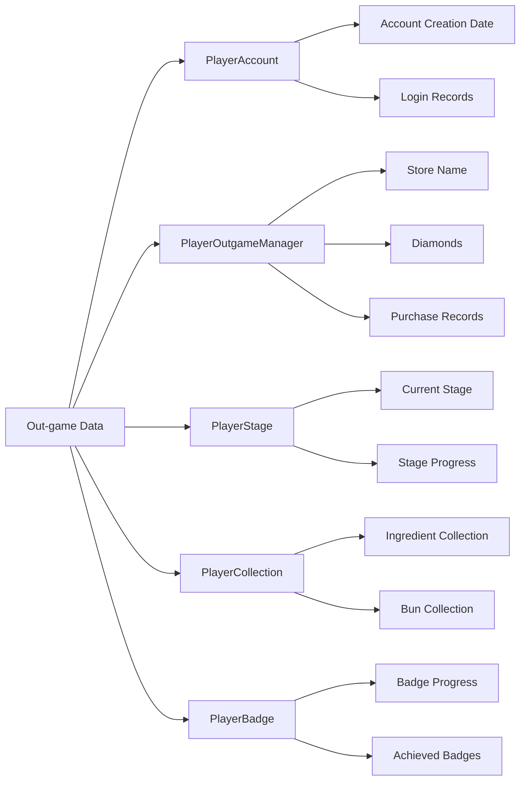

# Game Data Saving

ChuChuBurger's game data saving system is a core system that safely stores all player game progress and settings. It manages out-game and in-game data separately and collects player behavior data through a comprehensive logging system.

## 1. Data Saving System Overview

### 1.1 Data Classification Structure

Game data is classified and managed as follows:



## 2. Database Manager (PlayerDBManager)

### 2.1 Core Functions

`PlayerDBManager` is the central manager that handles all player data saving and loading.

**Related Files:**
- `RootDesk/MyDesk/00. Player/PlayerDBManager.mlua`

**Main Methods:**  
method void SaveToDB(boolean isWait)  
→ Saves out-game and in-game data separately, and selectively saves in-game data based on stage progress status.

<details>
<summary>Related Code</summary>

```lua
@ExecSpace("ServerOnly")
method void SaveToDB(boolean isWait)
    -- Save out-game data
    local outgameSaveData = {}
    self.Entity.PlayerAccount:SaveToDB(outgameSaveData)
    self.Entity.PlayerOutgameManager:SaveToDB(outgameSaveData)
    
    -- Save in-game data (only when on stage)
    if self.IsOnStage == true then
        local ingameSaveData = {}
        self.Entity.PlayerIngameManager:SaveToDB(ingameSaveData)
        -- ... (other in-game components)
    end
end
```
</details>

### 2.2 Data Saving Schedule

- **Auto Save**: Automatically saves to database every 5 minutes
- **Manual Save**: Immediate save at important game event points
- **Logout Save**: Saves all data when player logs out

### 2.3 DB Version Management

Each player's data is managed with unique keys in the format `UserID_Version` to enable safe migration even when data structure changes.

## 3. Out-game Data Management

### 3.1 Stored Information

Out-game data consists of meta information that should be maintained regardless of game sessions.

**Related Files:**
- `RootDesk/MyDesk/00. Player/PlayerOutgameManager.mlua`
- `RootDesk/MyDesk/00. Player/PlayerAccount.mlua`
- `RootDesk/MyDesk/00. Player/PlayerStage.mlua`
- `RootDesk/MyDesk/00. Player/PlayerCollection.mlua`

**Stored Items:**
- **Account Info**: Registration date, last login/logout time
- **Store Info**: Store name, management level, reputation
- **Currency**: Diamonds, strategy points, purchase records
- **Collections**: Ingredients, buns, skins, side menus, strategy collections
- **Badges**: List of achieved badges
- **Employees**: Owned employees and promotion info

### 3.2 Out-game Data Structure



## 4. In-game Data Management

### 4.1 Stage-wise Data Separation

In-game data is managed independently for each stage, supporting players to progress on multiple stages simultaneously.

**Related Files:**
- `RootDesk/MyDesk/00. Player/PlayerIngameManager.mlua`
- `RootDesk/MyDesk/00. Player/PlayerRecipe.mlua`
- `RootDesk/MyDesk/00. Player/PlayerInventory.mlua`

**In-game Data Saving:**  
method void SaveToDB(table saveData)  
→ Converts stage-wise in-game settings to strings for database storage.

<details>
<summary>Related Code</summary>

```lua
@ExecSpace("ServerOnly")
method void SaveToDB(table saveData)
    local total = {}
    total["StageIngredient"] = _UtilLogic:TableToString(self.StageIngredient)
    total["StageStartingEmployee"] = _UtilLogic:TableToString(self.StageStartingEmployee)
    total["StageStrategy"] = _UtilLogic:TableToString(self.StageStrategy)
    total["StageSideMenu"] = self.StageSideMenu
    saveData["PlayerIngameData"] = total
end
```
</details>

### 4.2 In-game Settings Management

Elements that players can configure for each stage:
- **Ingredient Cards**: Select ingredients to use in stage
- **Employee Placement**: Select employees to be placed at start
- **Strategy Cards**: Applied strategies and levels
- **Side Menus**: Side menus to sell

### 4.3 Temporary Settings System

When players change stage settings but haven't applied them yet, they are saved as temporary settings to protect against accidental loss.

## 5. Logging System

### 5.1 Log Classification

The `PlayerLog` component records all important game activities.

**Related Files:**
- `RootDesk/MyDesk/00. Player/PlayerLog.mlua`

**Log Types:**
1. **Play Flow Logs**: Game activities such as recipe usage, deliveries, VIP orders
2. **Resource Flow Logs**: Currency changes including gold, hearts, arcane symbols
3. **Item Flow Logs**: Item acquisition/usage history

### 5.2 Play Flow Logging

**Play Flow Logging:**  
method void PlayflowLog(string category, string flowType)  
→ Records game activities and player status in JSON format for use as analytical data.

<details>
<summary>Related Code</summary>

```lua
@ExecSpace("ServerOnly")
method void PlayflowLog(string category, string flowType)
    -- Collect current player status information
    local manageLv = string.format("%d", self.Entity.PlayerManagement.ManagementLevel)
    local money = string.format("%d",self.Entity.PlayerInventory.Money)
    -- ... (other currency info)
    
    _LogStorageLogic:LogValue(userId, logName, 
        _HttpService:JSONEncode({
            money = money,
            clover = arcaneSymbol,
            heart = heart,
            -- ... (currency info)
        }),
        {
            category = category,
            flowType = flowType,
            deviceType = deviceType,
            playerLevel = playerLevel
        })
end
```
</details>

### 5.3 Resource Change Logging

All currency changes are recorded in detail for game balance analysis and fraud detection:
- **Pre/Post Change Amounts**
- **Change Reason** (purchase, reward, consumption, etc.)
- **Related Map/Feature**
- **Current Player Level**

## 6. Data Integrity Assurance

### 6.1 Error Handling

Systematic handling of errors that may occur during data load/save processes:
- **DB Connection Failure**: Retry logic and user notification
- **Data Corruption**: Backup data recovery system
- **Version Mismatch**: Automatic migration processing

### 6.2 Synchronization Mechanism

Client-server data synchronization:
- **@TargetUserSync**: Personal data synchronized only to specific players
- **Real-time Sync**: Immediate reflection to client on important data changes
- **Conflict Resolution**: Server data priority policy for simultaneous modifications

### 6.3 Backup and Recovery

- **Regular Backups**: Create player data backups at regular intervals
- **Incremental Backups**: Improve efficiency by backing up only changed data
- **Recovery System**: Restore to recent backup in case of data loss

## 7. Performance Optimization

### 7.1 Asynchronous Processing

Asynchronous processing is utilized to avoid affecting gameplay when handling large amounts of data.

### 7.2 Data Compression

- **JSON Encoding**: Efficient storage of complex data structures
- **String Compression**: Minimize size of repetitive data
- **Selective Saving**: Save only data different from default values

### 7.3 Caching Strategy

Frequently accessed data is cached in memory to minimize DB access frequency.

## 8. Developer Tools

### 8.1 Debug Monitoring

Tools are provided to monitor data save/load status in real-time during development phase.

### 8.2 Data Analysis

Collected log data is analyzed for:
- **Game Balance Adjustment**
- **Player Behavior Pattern Analysis**
- **Monetization Optimization**
- **Bug and Exploit Detection**

Through this comprehensive data saving system, ChuChuBurger provides a safe and reliable gaming experience while enabling data-driven decision making for continuous game improvement.
