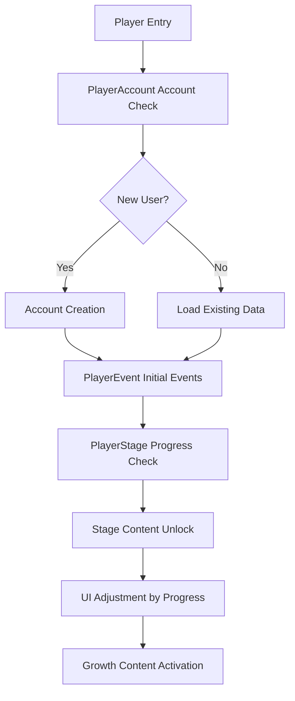

# Game Progress and Growth

ChuChuBurger's game progress and growth system is a core mechanism that manages the player's overall game journey. This system is designed to enable players to grow progressively and experience new content through account management, stage progression, and event tracking.

## System Overview

The game progress system consists of **Account Information Management**, **Stage Progress Tracking**, and **Event Status Management**. These are organically connected to provide a consistent growth experience for players.



## Account Management System

### PlayerAccount

Component that manages basic player account information and connection records.

**Core Data:**
- `Date_Create`: Account creation date (Unix timestamp)
- `Date_Login`: Last login date
- `Date_Logout`: Last logout date

**Account Creation Process:**  
method void OnCreated()  
→ Saves current time in UTC standard when creating new account to record accurate creation time.

- **Timestamp Storage**: Store creation date as Unix timestamp  
- **UTC Standard**: Accurate time recording independent of timezone

<details>
<summary>Related Code</summary>

```lua
-- PlayerAccount.mlua :: OnCreated()
method void OnCreated()
    self.Date_Create = os.time(os.date("!*t"))
end
```
</details>

**Login/Logout Processing:**  
method void OnLogin()  
→ Processes all connection information only on server and synchronizes with client to analyze connection patterns.

- **Server-only Processing**: Security design to prevent client manipulation  
- **Pattern Analysis**: Player behavior analysis through connection history

<details>
<summary>Related Code</summary>

```lua
-- PlayerAccount.mlua :: OnLogin()
method void OnLogin()
    self.Date_Login = os.time(os.date("!*t"))
end
```
</details>

### Database Management

**PlayerDBManager** oversees all player data saving and loading:

**Auto Save System:**  
method void OnBeginPlay()  
→ Automatically saves player data to database every 5 minutes to prevent data loss.

- **Periodic Saving**: Timer set to repeat every 5 minutes  
- **Safety Guarantee**: Data protection against unexpected termination situations

<details>
<summary>Related Code</summary>

```lua
-- PlayerDBManager.mlua :: OnBeginPlay()  
local period = 60 * 5  -- Auto save every 5 minutes
self._T.saveTimer = _TimerService:SetTimerRepeat(function()
    self:SaveToDB(false)
end, period, period)
```
</details>

**Component Initialization Order:**  
method void InitComponents()  
→ Systematically initializes all player components at game start to prevent dependency issues.

- **Sequential Initialization**: Initialization order considering component dependencies  
- **State Synchronization**: All components start in consistent state

<details>
<summary>Related Code</summary>

```lua
-- PlayerDBManager.mlua :: InitComponents()
self.Entity.PlayerEvent:InitComponent()
self.Entity.PlayerStage:InitComponent()  
self.Entity.PlayerAchievement:InitComponent()
self.Entity.PlayerInventory:InitComponent()
```
</details>

## Stage Progress System

### PlayerStage

Core component that manages stage-wise progress in the game.

**Progress Management:**
- `NowStage`: Currently playing stage
- `StageProgress`: Stage-wise progress (0-6 range)
- `ClearedStageData`: Clear status by stage

**Progress Setting and Rewards:**  
method void SetStageProgress(number stageId, number progress)  
→ Updates stage progress and automatically distributes rewards by integrating with badge system.

- **Badge Integration**: Automatically update badge progress when progress changes  
- **Auto Rewards**: Immediately distribute rewards upon achieving clear conditions

<details>
<summary>Related Code</summary>

```lua
-- PlayerStage.mlua :: SetStageProgress()
self.StageProgress[stageId] = progress
if progress >= _StageDataSetLogic:GetStageClearProgress(stageId) then
    self:GetStageClearReward(stageId)
end
```
</details>

**ChuStar Level Calculation:**  
method number GetChustarLevel()  
→ Calculates player's ChuStar (overall progress) level based on number of cleared stages.

- **Cumulative Calculation**: Determine level by checking clear status of all stages  
- **Progress Criteria**: Compare with clear standard stage set for each stage

<details>
<summary>Related Code</summary>

```lua
-- PlayerStage.mlua :: GetChustarLevel()
for id, progress in pairs(self.StageProgress) do	
    if progress >= _StageDataSetLogic:GetStageClearProgress(id) then
        level += 1
    end
end
```
</details>

**Stage Clear Rewards:**
Various rewards are automatically distributed upon stage clear:

- **Diamonds**: `stageData.StageClearRewardDiamond`
- **Strategy Points (SP)**: Set SP reward amount
- **Side Menu Unlock**: New side menus meeting conditions 
- **Strategy Unlock**: Strategies unlocked in corresponding stage

### Stage Movement System

**Loading System:**  
method void MoveToLoadingMap()  
→ Provides smooth transitions and UI cleanup by going through dedicated loading map when moving between stages.

- **UI Cleanup**: Clean up all existing UI before activating loading UI  
- **Map Transition**: Move to dedicated loading map for data loading processing

<details>
<summary>Related Code</summary>

```lua
-- PlayerStage.mlua :: MoveToLoadingMap()
self:ClearUI(self.Entity.PlayerComponent.UserId)
_UIGroupManager:EnableStageLoadingGroup(true, self.Entity.PlayerComponent.UserId)
_TeleportService:TeleportToEntityPath(self.Entity, "/maps/DataLoading/TeleportPoint")
```
</details>

**Data Synchronization:**  
method void OnSyncProperty(string name)  
→ Automatically updates related UI and event systems when stage information changes.

- **UI Updates**: Update lobby HUD stage movement button status  
- **Event Generation**: Broadcast stage change events to entire system

<details>
<summary>Related Code</summary>

```lua
-- PlayerStage.mlua :: OnSyncProperty()
if name == "NowStage" then
    _LobbyHUDService:UpdateMoveNextStageBtn()
    local e = PlayerNowStageChangedEvent()
    self.Entity:SendEvent(e)
end
```
</details>

## Event Tracking System

### PlayerEvent

System that tracks and manages game progress in detail.

**Event Status Management:**
- `Events`: Status map of occurred events
- `EventQueue`: Event queue for sequential execution
- `DayEventQueue`: Event queue managed on daily basis
- `EventReferKey`: Event reference key data

**Event Occurrence Check:**  
method boolean IsEventOccured(string eventGroupId)  
→ Checks occurrence status by distinguishing between tutorial events and general events.

- **Type Distinction**: Separate tutorial and general events by "T" prefix  
- **Status Query**: Check status from appropriate component for each event type

<details>
<summary>Related Code</summary>

```lua
-- PlayerEvent.mlua :: IsEventOccured()
if string.sub(eventGroupId, 1, 1) == "T" then
    return self.Entity.PlayerTutorialEvent:IsEventOccured(eventGroupId)
end
return self.Events[eventGroupId] == true
```
</details>

**Event Queue System:**  
method void AddToEventQueue(string eventGroupId)  
→ Manages queue system to prevent event duplication and ensure sequential execution.

- **Duplication Prevention**: Don't add already occurred events to queue  
- **Sequential Execution**: Process events in queue order to ensure consistency

<details>
<summary>Related Code</summary>

```lua
-- PlayerEvent.mlua :: AddToEventQueue()
if self:IsEventOccured(eventGroupId) == true then
    return  -- Don't add already occurred events to queue
end
table.insert(self.EventQueue, eventGroupId)
```
</details>

**ToDo Assistant System Integration:**  
method void OnSyncProperty(string name)  
→ Automatically updates ToDo assistant and UI unlock system when event occurrence status changes.

- **UI Unlock**: Button and feature unlocks based on event progress  
- **ToDo Update**: Automatic update of assistant system task list

<details>
<summary>Related Code</summary>

```lua
-- PlayerEvent.mlua :: OnSyncProperty()
if name == "Events" then
    _UIButtonUnlockLogic:SetButtonsUnlock()
    _ToDoManager:RefreshToDoList()
end
```
</details>

### PlayerEventFunction

Component that manages various functions executed in events.

**Function Registration System:**  
method void OnBeginPlay()  
→ Registers callable functions from event data in advance to prepare for dynamic execution.

- **Pre-registration**: Register all functions to be used in events at startup  
- **Dynamic Processing**: Designed to find and execute functions by string keys

<details>
<summary>Related Code</summary>

```lua
-- PlayerEventFunction.mlua :: OnBeginPlay()
self:RegisterFunc("GetItem", self.GetItem)
self:RegisterFunc("AddSubscription", self.AddSubscription)
self:RegisterFunc("GetStoreRankingReward", self.GetStoreRankingReward)
```
</details>

**Dynamic Function Execution:**  
method void CommandFunc(table eventGroupData)  
→ Dynamically executes functions defined in event group data to implement flexible event processing.

- **Function-Parameter Pairs**: Find and execute function names and parameters from data  
- **Iterative Processing**: Execute multiple functions sequentially to handle compound effects

<details>
<summary>Related Code</summary>

```lua
-- PlayerEventFunction.mlua :: CommandFunc()
local rewardData = eventGroupData.funcRewardPairs
for k, v in pairs(rewardData) do
    local funcName = v[1]
    local commandFunc = self.commandToFunc[string.lower(funcName)]
    commandFunc(self, v[2])
end
```
</details>

## UI Button Unlock System

**Progress-based UI Control:**  
method SetButtonsUnlock()  
→ Controls progressive feature disclosure by unlocking UI buttons step by step according to game progress.

- **Step-wise Unlock**: Unlock features sequentially based on progress  
- **Auto Control**: Automatically update UI status when event status changes

<details>
<summary>Related Code</summary>

```lua
-- PlayerEvent.mlua :: OnSyncProperty()
if name == "Events" then
    _UIButtonUnlockLogic:SetButtonsUnlock()
end
```
</details>

**Tutorial Integration:**
Features are gradually disclosed in integration with tutorial progress:

- Initial stage: Basic cooking functions only
- Intermediate stage: Employee hiring, upgrades
- Advanced stage: Special functions, advanced content

## Growth Content Activation

### Stage-based Content Unlock

**Stage-based Unlock:**
- **Stage 1-2**: Basic menu creation and employee management
- **Stage 3-5**: Upgrade and expansion content
- **Stage 6+**: Advanced management elements and special systems

**Event-based Unlock:**
New features are activated upon achieving specific events:

- First revenue achievement: Upgrade system
- First customer serving: Reputation system
- Specific revenue targets: VIP order system

### Progress Visualization

**Red Dot System:**
Provides visual notifications when new content or incomplete tasks exist:

- New upgrades available
- Unreceived rewards exist
- Tutorial progress available

**Progress Display:**
Player's overall progress is displayed in various ways:

- ChuStar level (overall progress)
- Stage-wise star rating (0-6 points)
- Collection completion percentage

## Data Consistency Guarantee

### Synchronization System

Important progress data is synchronized in real-time between client and server:

- `@TargetUserSync`: Synchronized only to corresponding user
- `@Sync`: Synchronized to all clients

### Backup and Recovery

**Auto Backup:**
All progress data is automatically saved to database every 5 minutes.

**Data Verification:**
Verifies data integrity during load, and initializes missing data with default values.

---

## Code References

**Core Files:**
- `RootDesk/MyDesk/00. Player/PlayerAccount.mlua :: OnLogin()` — Login/logout record management
- `RootDesk/MyDesk/00. Player/PlayerDBManager.mlua :: InitComponents()` — Database overall management  
- `RootDesk/MyDesk/00. Player/PlayerStage.mlua :: SetStageProgress()` — Stage progress management
- `RootDesk/MyDesk/00. Player/PlayerStage.mlua :: GetChustarLevel()` — ChuStar level calculation
- `RootDesk/MyDesk/00. Player/PlayerEvent.mlua :: RequestCallEvent()` — Event occurrence processing
- `RootDesk/MyDesk/00. Player/PlayerEventFunction.mlua :: CommandFunc()` — Event function execution
