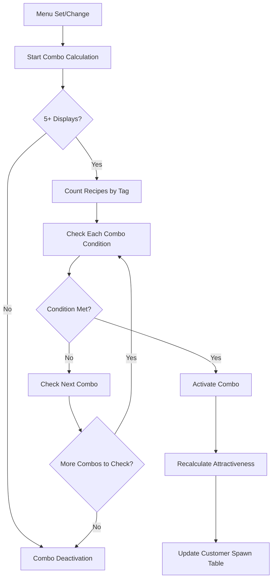
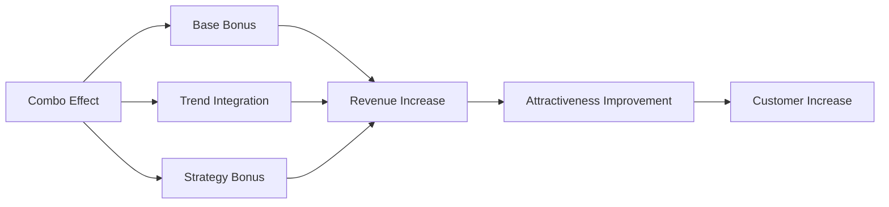

# Combos and Special Effects

## Overview

The ChuChu Burger combo system is an advanced mechanism that analyzes tag combinations of menus set by players to provide special bonus effects. Players can maximize profits through strategic menu composition and gain additional benefits through synergy with the trend system.

## Combo System Structure

### RecipeComboData Structure

```lua
-- RootDesk/MyDesk/04. Recipe/Data/RecipeComboData.mlua
@Struct
script RecipeComboData
    property integer Id = 0
    property string EffectTarget = ""           -- Effect target tag
    property number EffectAmount = 0            -- Effect magnitude (ratio)
    property SyncTable<string, integer> CountTable  -- Required count by tag
    property string NameKey = ""               -- Combo name key
```

### Combo Activation System



## Combo Activation Conditions

### Basic Requirements
Implemented in `PlayerRecipe :: CalculateActiveRecipeCombo()`:

1. **Display Slots**: Requires 5 or more (`DisplayCount` upgrade)
2. **Tag Combination**: Meet minimum count of specified tags for each combo
3. **Priority**: When multiple combo conditions are met, activate the first discovered combo

### Combo Condition Check Algorithm

```lua
-- Count tags of currently set recipes
local tagCountTable = {}
for i, recipeId in pairs(self.SetRecipes) do
    local recipeData = self.Recipes[recipeId]
    local tag = recipeData.Tag
    tagCountTable[tag] = (tagCountTable[tag] or 0) + 1
end

-- Check each combo condition
for comboId, comboData in pairs(_RecipeTagDataSetLogic.RecipeComboData) do
    local isCombo = true
    for tag, requiredCount in pairs(comboData.CountTable) do
        if (tagCountTable[tag] or 0) < requiredCount then
            isCombo = false
            break
        end
    end
    if isCombo then
        self.ActiveRecipeCombo = comboId
        return
    end
end
```

## Combo Effect System

### Price Bonus
Applied in `RecipeDataSetLogic :: GetRecipeCost()`:

```lua
if isComboBonusApplied then
    local isRecipeCombo = _RecipeTagDataSetLogic:IsRecipeComboActiveForTag(player, recipeData.Tag)
    if isRecipeCombo then
        local comboData = _RecipeTagDataSetLogic.RecipeComboData[player.PlayerRecipe.ActiveRecipeCombo]
        local comboBonus = comboData.EffectAmount
        cost = math.floor(cost * (1 + comboBonus + strategyBonus))
    end
end
```

### Effect Application Target

1. **Specific Tag**: Apply only to recipes with tag specified by `EffectTarget`
2. **Universal Application**: Apply to all recipes when `EffectTarget` is "All"
3. **No Application**: No effect when `EffectTarget` is "None"

### Trend Integration Bonus

Synergy effect between combos and trends:
- When active combo's `EffectTarget` matches positive trend's `TargetTag`
- Additional application of `_StrategyEnum.TrendMenuComboBonus` strategy effect

## UI Display System

### UIRecipeComboInfo Component

**Main Features**:
- Display all combo lists
- Prioritize display of currently active combos
- Provide detailed information for each combo

**Core Methods**:
- `Refresh()`: Update and sort combo list

### UIRecipeComboInfoSlot Component

**Display Information**:
- Combo name and description
- Visualize required tag combinations
- Effect magnitude (percentage display)
- Active status display

**Visual Distinction**:
```lua
-- Active combo colors
self.NameText.TextComponent.OutlineColor = _ColorCodeEnum:GetColor("#d98a1a")
self.DescText.TextComponent.FontColor = _ColorCodeEnum:GetColor("#93640a")
self.TopBG.SpriteGUIRendererComponent.Color = _ColorCodeEnum:GetColor("#fac629")

-- Inactive combo colors  
self.NameText.TextComponent.OutlineColor = _ColorCodeEnum:GetColor("#919191")
self.DescText.TextComponent.FontColor = _ColorCodeEnum:GetColor("#737171")
self.TopBG.SpriteGUIRendererComponent.Color = _ColorCodeEnum:GetColor("#d3d3d3")
```

## Combo Management System

### Auto Combo Calculation
Auto-recalculate combos when menu changes:
- `SetRecipe()` - When setting menu
- `UnsetRecipe()` - When removing menu
- `ClearSetRecipes()` - When clearing all menus

### Combo Activation Effects
Chain reaction when combo activates:
1. **Achievement Progress**: Increase `_TutorialAchievementTypeEnum.MenuComboCount`
2. **Attractiveness Recalculation**: Call `CustomerManager:CalcMyAttractive()`
3. **Spawn Table Update**: Call `CustomerManager:RefreshSpawnTable()`
4. **Assistant Information Update**: Update empty display-related ToDos

## Strategic Utilization

### Combo Optimization Strategy

1. **Tag Balance**: Try to simultaneously meet multiple combo conditions by combining various tags
2. **Trend Integration**: Utilize situations where positive trends and combo effect targets match
3. **Strategy Integration**: Secure additional bonuses with `TrendMenuComboBonus` strategy

### Combo Synergy Elements



## Special Effect System

### Combo Discovery System
When new combo conditions are achieved:
- Automatically activate combo
- Update tutorial progress
- Provide visual feedback

### Hidden Combo Mechanism
- All combos defined in data table are discoverable in game
- Players discover new combos through experimenting with various tag combinations

## Code Reference

### Core Data Structure
- `RootDesk/MyDesk/04. Recipe/Data/RecipeComboData.mlua :: RecipeComboData` — Combo data structure
- `RootDesk/MyDesk/04. Recipe/Data/RecipeTagDataSetLogic.mlua :: LoadDataSet()` — Combo data loading

### Combo Calculation Logic
- `RootDesk/MyDesk/00. Player/PlayerRecipe.mlua :: CalculateActiveRecipeCombo()` — Combo activation calculation
- `RootDesk/MyDesk/04. Recipe/Data/RecipeTagDataSetLogic.mlua :: IsRecipeComboActiveForTag()` — Tag-specific combo activation check

### Combo Effect Application
- `RootDesk/MyDesk/04. Recipe/Data/RecipeDataSetLogic.mlua :: GetRecipeCost()` — Apply combo bonus
- `RootDesk/MyDesk/00. Player/PlayerRecipe.mlua :: SetRecipe()` — Menu setting and combo calculation

### UI Implementation
- `RootDesk/MyDesk/04. Recipe/UIScript/RecipeCombo/UIRecipeComboInfo.mlua :: Refresh()` — Combo list UI
- `RootDesk/MyDesk/04. Recipe/UIScript/RecipeCombo/UIRecipeComboInfoSlot.mlua :: Refresh()` — Individual combo slot UI
