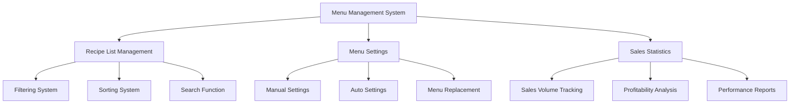

# Menu Settings and Management

The menu settings and management system in ChuChu Burger is a comprehensive system that allows players to efficiently manage their created recipes, select menus to sell in the store, and track sales performance.

## 1. Menu Management System Overview

### 1.1 System Structure



### 1.2 Core Components

**Player Recipe Management:**
- `PlayerRecipe`: Manages all player-owned recipes and configured menus
- `MenuManager`: Manages displayed burgers and sales statistics
- `UIRecipeList`: Recipe list UI and filtering system
- `UIRecipeBook`: Menu configuration UI and auto-configuration features

## 2. Recipe List Management (UIRecipeList)

### 2.1 Filtering System

`UIRecipeList` can filter recipes by various conditions.

**Related Files:**
- `RootDesk/MyDesk/04. Recipe/UIScript/RecipeList/UIRecipeList.mlua`

**Recipe Filtering:**  
method table FilterRecipes(SyncTable<string, string> filters)  
→ Filters and returns only recipes matching various conditions such as required ingredients, VIP orders, etc.

<details>
<summary>Related Code</summary>

```lua
@ExecSpace("ClientOnly")
method table FilterRecipes(SyncTable<string, string> filters)
    local reqIngre = tonumber(filters["ReqIngre"])
    local orderSlot = tonumber(filters["VIPOrder"])
    
    local recipes = _UserService.LocalPlayer.PlayerRecipe.Recipes
    local drawList = {}
    for i = 1, #table.keys(recipes) do
        local recipeData = recipes[i]
        local canDraw = true
        
        -- Required ingredient filtering
        if reqIngre ~= nil then
            local isContained = _RecipeDataSetLogic:IsRecipeIncludeIngredient(recipeData.IngreList, reqIngre)
            if isContained == false then
                canDraw = false
            end
        end
        
        -- VIP order filtering
        if orderSlot ~= nil then
            canDraw = _VIPOrderDataSetLogic:IsRecipeCorrectForOrder(_UserService.LocalPlayer, orderSlot, recipeData)
        end
        
        if canDraw then
            table.insert(drawList, i)
        end
    end
    
    return drawList
end
```
</details>

**Filter Types:**
- **Tag-based Filter**: Display only recipes with specific tags
- **Ingredient-based Filter**: Display only recipes containing specific ingredients
- **VIP Order Filter**: Display only recipes matching VIP order conditions
- **Trial Filter**: Display only recipes valid in trial mode

### 2.2 Sorting System

Recipes can be sorted by various criteria:

**Recipe Sorting:**  
method integer SortRecipes(string sortKey, table recipes, integer recipeId, string listKey)  
→ Sorts recipe list by specified criteria, considering bonuses in trial mode.

<details>
<summary>Related Code</summary>

```lua
@ExecSpace("ClientOnly")
method integer SortRecipes(string sortKey, table recipes, integer recipeId, string listKey)
    if sortKey == "Latest" then
        table.sort(recipes, function(a, b) return a > b end)
    elseif sortKey == "Cost" then
        -- Sort by cost
        table.sort(recipes, function(a, b)
            local aRecipe = playerRecipes[a]
            local bRecipe = playerRecipes[b]
            if aRecipe.Cost == bRecipe.Cost then
                return a > b
            else
                return aRecipe.Cost > bRecipe.Cost
            end
        end)
    elseif sortKey == "TasteScore" then
        -- Sort by taste score (including trial bonuses)
        table.sort(recipes, function(a, b)
            local aScore = aRecipe.TasteScore
            local bScore = bRecipe.TasteScore
            
            if listKey == "Trial" then
                if isvalid(aRecipe.TrialSkillBonus) then
                    aScore = aScore * (1 + aRecipe.TrialSkillBonus)
                end
                if isvalid(bRecipe.TrialSkillBonus) then
                    bScore = bScore * (1 + bRecipe.TrialSkillBonus)
                end
            end
            
            return aScore > bScore
        end)
    end
end
```
</details>

**Sorting Criteria:**
- **Latest**: Most recently created order
- **Cost**: Sale price order
- **TasteScore**: Taste score order
- **Tag**: Category by tag
- **VIPOrder**: VIP order compatibility order

### 2.3 Empty List Handling

Displays appropriate guidance messages when filtering results are empty:
- **No complete list**: "Create a recipe first"
- **No filtering results**: "No recipes match the criteria"

## 3. Menu Configuration System (UIRecipeBook)

### 3.1 Menu Book Interface

`UIRecipeBook` is the central hub for managing currently configured menus.

**Related Files:**
- `RootDesk/MyDesk/04. Recipe/UIScript/UIRecipeBook.mlua`

**Menu Book Refresh:**  
method void Refresh()  
→ Updates currently configured menu slots and displays trend and combo information.

<details>
<summary>Related Code</summary>

```lua
@ExecSpace("ClientOnly")
method void Refresh()
    local player = _UserService.LocalPlayer
    local setRecipes = player.PlayerRecipe.SetRecipes
    local slotLimit = _UpgradeDataSetLogic:ReturnCurrentPlayerValue(player, _UpgradeTypeEnum.DisplayCount)
    
    -- Display recipe for each slot
    for i = 1, _RecipeDataSetLogic.MaxRecipeSetSlot do
        local entity = _UIEntityService:GetOrCreateEntityOfModel("Model_RecipeBurgerSlot", i, self.RecipeList)
        entity.UIRecipeBurgerSlot.SlotIndex = i
        
        if i > slotLimit then
            entity.UIRecipeBurgerSlot:Refresh(true, nil, false, nil) -- Locked state
        else
            if setRecipes[i] == nil then
                entity.UIRecipeBurgerSlot:Refresh(false, nil, false, nil) -- Empty slot
            else
                entity.UIRecipeBurgerSlot:Refresh(false, setRecipes[i], false, nil) -- Set recipe
            end
        end
    end
    
    -- Refresh trend info, combo info, recipe count bar
    self.TrendInfo.UITrendInfoBar:Refresh(false)
    self:RefreshComboInfo()
    self.RecipeCountBar.UIRecipeCountBar:Refresh()
end
```
</details>

### 3.2 Auto Menu Configuration

Players can automatically select optimal menus instead of manually configuring menus:

**Auto Menu Configuration:**  
method void OnClickAutoSetBtn()  
→ Automatically configures optimal menu considering current trends and combo effects.

<details>
<summary>Related Code</summary>

```lua
@ExecSpace("ClientOnly")
method void OnClickAutoSetBtn()
    local player = _UserService.LocalPlayer
    local playerRecipe = player.PlayerRecipe
    playerRecipe:RequestAutoSetRecipe()
end
```
</details>

**Auto Configuration Criteria:**
- Prioritize recipes with high taste scores
- Select recipes matching current trends
- Consider combinations with combo effects
- Take into account ingredient inventory levels

### 3.3 Menu Replacement and Deletion

**Complete Menu Reset:**  
method void ClearFunction()  
→ Removes all configured menus and disconnects connection status.

<details>
<summary>Related Code</summary>

```lua
@ExecSpace("ClientOnly")
method void ClearFunction()
    _UserService.LocalPlayer.PlayerRecipe:RequestUnsetRecipe(0, true)
    _UserService.LocalPlayer.PlayerRecipe:ChangeConnectingStatus(false)
end
```
</details>

## 4. Recipe Count Management (UIRecipeCountBar)

### 4.1 Recipe Quantity Display

`UIRecipeCountBar` displays the current number of recipes owned and maximum quantity.

**Related Files:**
- `RootDesk/MyDesk/04. Recipe/UIScript/UIRecipeCountBar.mlua`

**Recipe Quantity Processing:**  
method boolean Refresh()  
→ Compares current recipe count with maximum quantity to display Red Dot.

<details>
<summary>Related Code</summary>

```lua
@ExecSpace("ClientOnly")
method boolean Refresh()
    local playerRecipe = _UserService.LocalPlayer.PlayerRecipe
    local recipeCount = #table.keys(playerRecipe.Recipes)
    local recipeMaxCount = _UpgradeDataSetLogic:ReturnCurrentPlayerValue(_UserService.LocalPlayer, _UpgradeTypeEnum.RecipeBoxCount)
    
    self.CountText.Text = recipeCount.."/"..recipeMaxCount
    
    if recipeCount >= recipeMaxCount then
        self.CountText.OutlineColor = _ColorCodeEnum:GetColor("#fa5246") -- Red warning
        self.RedDot.Enable = true
        return true
    else
        self.CountText.OutlineColor = _ColorCodeEnum:GetColor("#a87811") -- Default color
        self.RedDot.Enable = false
        return false
    end
end
```
</details>

### 4.2 Upgrade Integration

Direct connection to upgrade UI when recipe box is full:
- **Red Dot Display**: Warning display when quantity exceeded
- **Upgrade Button**: Navigate to recipe box expansion UI
- **Click for Recipe List**: Navigate to complete recipe list

## 5. Sales Statistics Management (MenuManager)

### 5.1 Menu-specific Sales Tracking

`MenuManager` tracks sales volume for each menu in real-time.

**Related Files:**
- `RootDesk/MyDesk/07. Menu/MenuManager.mlua`

**Sales Statistics Processing:**  
method void AddSaleBurgerCount(integer uniqueId, integer amount)  
→ Provides functionality to track and query sales volume for each menu in real-time.

<details>
<summary>Related Code</summary>

```lua
-- Add sold burger count
@ExecSpace("Server")
method void AddSaleBurgerCount(integer uniqueId, integer amount)
    if not isvalid(self.SalesBurger[uniqueId]) then
        self.SalesBurger[uniqueId] = 0
    end
    self.SalesBurger[uniqueId] = self.SalesBurger[uniqueId] + amount
end

-- Query sales volume by recipe ID
@ExecSpace("Client")
method integer ReturnSalesBurgerByRecipeID(integer recipeId)
    local uniqueId = self:ReturnRecipeUniqueID(recipeId)
    local count = self.SalesBurger[uniqueId]
    if isvalid(count) then
        return count
    else
        return 0
    end
end
```
</details>

### 5.2 Display Management

Manages handling of existing displayed burgers when menu changes:

**Display Burger Management:**  
method void RefreshDisplayBurger()  
→ Deletes burgers of removed menus among existing displayed burgers when menu changes.

<details>
<summary>Related Code</summary>

```lua
-- Refresh display burgers (when menu changes)
@ExecSpace("ClientOnly")
method void RefreshDisplayBurger()
    local findRecipe = function(uniqueID)
        for slotIdx, curRecipeId in pairs(self.CurrentSetRecipes) do
            local setRecipeUniqueID = self:ReturnRecipeUniqueID(curRecipeId)
            if uniqueID == setRecipeUniqueID then
                return slotIdx
            end
        end
        return -1
    end
    
    -- Delete burgers removed from menu
    for uniqueID, slotAmountData in pairs(self.DisplayBurger) do
        local menuSlotIdx = findRecipe(uniqueID)
        if menuSlotIdx == -1 then
            if not isvalid(self.DeleteBurger[uniqueID]) then
                self.DeleteBurger[uniqueID] = 0
            end
            self.DeleteBurger[uniqueID] += amount
        end
    end
end
```
</details>

### 5.3 Deleted Burger Processing

Burgers from recipes removed from menu are automatically disposed of and reported:
- Record disposed burger quantities
- Generate disposal reports
- Trigger tutorial events

## 6. Menu Flow Logging

### 6.1 Menu Change Tracking

All menu changes are logged in detail.

**Related Files:**
- `RootDesk/MyDesk/00. Player/PlayerLog.mlua`

**Menu Change Logging:**  
method void MenuFlow(SyncTable<integer, integer> lastMenu, SyncTable<integer, integer> CurMenu)  
→ Records menu changes in detail to analyze player menu management patterns.

<details>
<summary>Related Code</summary>

```lua
@ExecSpace("ServerOnly")
method void MenuFlow(SyncTable<integer, integer> lastMenu, SyncTable<integer, integer> CurMenu)
    local recipeTable = {}
    for k, v in pairs(CurMenu) do
        local recipeData = self.Entity.PlayerRecipe.Recipes[v]
        table.insert(recipeTable, {
            recipeId = tostring(recipeData.UniqueId),
            recipeName = recipeData.Name,
            price = tostring(recipeData.Cost),
            tag = recipeData.Tag,
            grade = tostring(_TasteGradeDataSetLogic:ReturnGradeDataByScore(recipeData.TasteScore).Index)
        })
    end
    
    -- Determine menu change type
    local flowType = ""
    if #table.keys(lastMenu) < #table.keys(CurMenu) then
        flowType = "1" -- Menu addition
    elseif #table.keys(lastMenu) > #table.keys(CurMenu) then
        flowType = "2" -- Menu removal
    elseif #table.keys(lastMenu) == #table.keys(CurMenu) then
        flowType = "3" -- Menu replacement
    end
end
```
</details>

### 6.2 Log Data

Menu logs include the following information:
- **Recipe Information**: ID, name, price, tag, grade
- **Change Type**: Addition/removal/replacement
- **Combo Status**: Currently active combos
- **Trend Information**: Currently applied trends
- **Player Status**: Stage, management level

## 7. Performance Analysis System

### 7.1 Profitability Calculation

Calculate profitability for each recipe in real-time:
- **Sales Volume × Unit Price**: Total revenue calculation
- **Ingredient Cost vs Profit Rate**: Net profit analysis
- **Sales Speed**: Sales per hour
- **Customer Satisfaction**: Ratings and reviews

### 7.2 Trend Impact Analysis

Track sales performance changes based on trends:
- **Trend Bonus**: Increased revenue for matching recipes
- **Trend Penalty**: Decreased revenue for non-matching recipes
- **Seasonal Effects**: Sales pattern analysis for specific periods

### 7.3 Optimization Suggestions

System automatically provides menu optimization suggestions:
- **Low Performance Menu Identification**: Display recipes with low sales volume
- **High Revenue Recipe Recommendations**: Suggest recipes matching current trends
- **Inventory Management**: Menu composition considering ingredient inventory levels

## 8. UI/UX Optimization

### 8.1 Intuitive Interface

- **Drag and Drop**: Directly drag recipes to slots for configuration
- **One-Click Configuration**: Save and apply frequently used menu combinations
- **Visual Feedback**: Immediate preview of results when configuration changes

### 8.2 Performance Optimization

- **Lazy Loading**: Selectively load only necessary recipe information
- **Caching System**: Memory cache frequently accessed data
- **Batch Processing**: Process multiple menu changes at once

### 8.3 Accessibility Improvements

- **Search Function**: Quick search by recipe name or ingredients
- **Favorites**: Bookmark frequently used recipes
- **Recent Usage**: History of recently configured menus

## 9. Scalability and Future Plans

### 9.1 Advanced Features

- **A/B Testing**: Compare performance of two menu configurations
- **Simulation**: Calculate expected revenue before menu changes
- **Auto Optimization**: AI automatically suggests optimal menu configurations

### 9.2 Social Features

- **Menu Sharing**: Share menu configurations with other players
- **Ranking System**: Display popular menu rankings
- **Community Rating**: Player menu rating system

This comprehensive menu settings and management system allows players to efficiently operate their stores and maximize profits through data-driven decision making.
