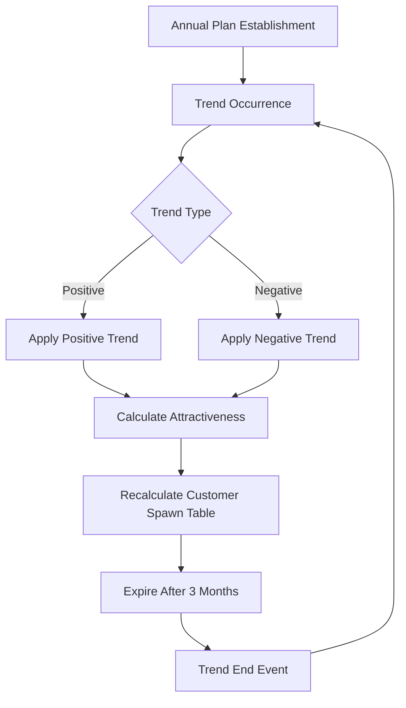

# Trends and Market Response

## Overview

The ChuChu Burger trend system is a core mechanism that simulates market changes within the game. Customer preferences for specific food tags change over time, and players must identify these trends to adjust their menu composition accordingly.

## Trend System Structure

### TrendData Structure

**Trend Data Structure:**  
struct TrendData  
→ Data structure that defines basic trend information and event integration.

<details>
<summary>Related Code</summary>

```lua
-- RootDesk/MyDesk/04. Recipe/Data/TrendData.mlua
@Struct
script TrendData
    property integer Id = 0
    property string Type = ""           -- "Positive" or "Negative"
    property string TargetTag = ""      -- Target recipe tag
    property string OccurEvent = ""     -- Event when trend occurs
    property string EndEvent = ""       -- Event when trend ends
```
</details>

### Trend Management System



## Trend Occurrence Mechanism

### Trend Creation Conditions
- **Timing**: Annually (Year > 1)
- **Stage**: Stage 2 or higher
- **Occurrence**: 100% positive trend + 30% probability negative trend

### Trend Creation Algorithm
Implemented in `PlayerRecipe :: MakeNewTrend()`:

1. **Positive Trend Selection**: Random selection from pool excluding current active trends
2. **Negative Trend Selection**: 30% probability selection from tags different from positive trend
3. **End Existing Trends**: End existing trends when new trends occur
4. **Event Occurrence**: Call trend start/end events

## Game Effects of Trends

### Attractiveness Score Impact

**Negative Trend Penalty:**  
method CalcRecipeAttractive()  
→ Reduces attractiveness score of recipes matching negative trends to lower customer selection probability.

<details>
<summary>Related Code</summary>

```lua
-- Negative trend impact
if recipeData.Tag == negativeTrendTag then
    recipeAttractiveScore = recipeAttractiveScore * (1 - penaltyForNegativeTrend)
end
```
</details>

### Combo Bonus Integration
Trend and combo integration in `RecipeDataSetLogic :: GetRecipeCost()`:
- Apply strategy bonus when positive trend tag matches combo effect target
- Utilize `_StrategyEnum.TrendMenuComboBonus` strategy effect

### Review System Integration
Customer review score calculation in `StoreInfoDataSetLogic`:
- **Positive Trend**: 60 point deduction if no menu with corresponding tag
- **Negative Trend**: 60 point deduction if menu with corresponding tag exists

## UI Display System

### UITrendInfo Component
- **Function**: Display individual trend information (positive/negative)
- **Implementation**: Color coding by trend type (#FFE92C / #863205)

### UITrendInfoBar Component  
- **Function**: Display all current active trends
- **Location**: Top bar of recipe-related UI

## Trend Lifecycle Management

### Trend Progress
`PlayerRecipe :: ChangeTrendProgress()` - Monthly progress increase

### Trend Expiration
`PlayerRecipe :: CheckTrendExpiry()` - Auto-expire after 3 months:
- Expiration condition: `progress >= TrendExpireMonth (3)`
- End event occurs upon expiration

### Annual Plan
`PlayerRecipe :: SetYearlyPlan()` - Set annual trend occurrence schedule

## Event System Integration

### Trend Occurrence Events
- Call events specified by `OccurEvent` field
- Pass `TargetTag` as event reference key

### Trend End Events  
- Call events specified by `EndEvent` field
- Auto-execute when trend expires

## Strategic Utilization

### Player Response Strategies
1. **Trend Monitoring**: Identify current trends through UI
2. **Menu Adjustment**: Add positive trend tag menus, remove negative trend tag menus
3. **Combo Utilization**: Maximize combo bonuses linked with trends

### Balance Settings
- `NegativeTrendWeight = 30`: Negative trend occurrence probability
- `TrendExpireMonth = 3`: Trend duration
- `AttractiveScoreDownForNegativeTrendRecipe`: Negative trend penalty

## Code Reference

### Core Implementation
- `RootDesk/MyDesk/04. Recipe/Data/TrendData.mlua :: TrendData` — Trend data structure
- `RootDesk/MyDesk/04. Recipe/Data/RecipeDataSetLogic.mlua :: LoadDataSet()` — Trend data loading
- `RootDesk/MyDesk/00. Player/PlayerRecipe.mlua :: MakeNewTrend()` — Trend creation logic
- `RootDesk/MyDesk/05. Customer/CustomerManager.mlua :: CalcRecipeAttractive()` — Trend effect application

### UI Implementation
- `RootDesk/MyDesk/04. Recipe/UIScript/Trend/UITrendInfo.mlua :: Refresh()` — Trend information display
- `RootDesk/MyDesk/04. Recipe/UIScript/Trend/UITrendInfoBar.mlua :: Refresh()` — Trend bar update

### Time Management
- `RootDesk/MyDesk/01. Lobby/TimeManager.mlua :: OnYearChanged()` — Annual plan setting
- `RootDesk/MyDesk/00. Player/PlayerRecipe.mlua :: CheckTrendExpiry()` — Trend expiration check
