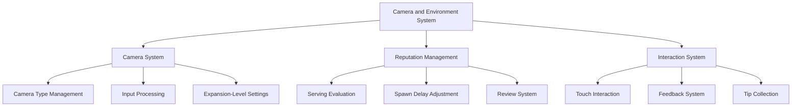

# Camera and Environment

## Overview

The ChuChu Burger camera and environment system is a comprehensive system that provides players with optimal store observation experience, adds depth to the game through reputation management, and maximizes immersion with intuitive interactions. Through dynamic camera control, real-time reputation feedback, and various object interactions, it delivers a living store operation experience.

## System Components



## Camera System (LobbyCameraService)

### Camera Type Management

`LobbyCameraService` dynamically manages various camera types:

```lua
-- RootDesk/MyDesk/01. Lobby/Camera/LobbyCameraService.mlua
@Logic
script LobbyCameraService extends Logic
    property SyncTable<string, CameraComponent> lobbyCameras  -- Camera component management
    property string nowCamera = ""                           -- Current active camera
    property number cameraMoveSpeed = 0.8                    -- Camera movement speed
    property Vector2 cameraBoundLB = Vector2(0,0)           -- Camera bounds (bottom-left)
    property Vector2 cameraBoundRT = Vector2(0,0)           -- Camera bounds (top-right)
```

### Camera Switching System

#### Dynamic Camera Switching
```lua
-- Switch to specified key camera
method void ChangeCameraTo(string key)
    self.nowCamera = key
    local nowCamera = self.lobbyCameras[key]
    
    -- Use MovingCamera as default
    if _CameraService:GetCurrentCameraComponent() ~= self.lobbyCameras["MovingCamera"] then
        _CameraService.TransitionBlendTime = 0
        _CameraService:SwitchCameraTo(self.lobbyCameras["MovingCamera"])
    end
    
    if key ~= "MovingCamera" then
        self:SetCameraSetting("MovingCamera", nowCamera.Entity.TransformComponent.Position, nowCamera.ZoomRatio)
    end
end
```

#### Camera Settings by Expansion Level
```lua
-- Apply camera settings based on expansion level
method void SetCamerasForExpansion(integer expansionLevel)
    local cameraData = _CameraDataSetLogic:GetLobbyCameraData(expansionLevel)
    
    for k, cameraComponent in pairs(self.lobbyCameras) do
        local typeData = cameraData.CameraTypeData[k]
        
        -- Set camera bounds
        if typeData.CustomBoundLB ~= nil then
            cameraComponent.LeftBottom = Vector2(typeData.CustomBoundLB.x, typeData.CustomBoundLB.y)
            self.cameraBoundLB = Vector2(typeData.CustomBoundLB.x, typeData.CustomBoundLB.y)
        end
        
        -- Set camera position and zoom
        if typeData.PosX ~= nil and typeData.PosY ~= nil then
            cameraComponent.Entity.TransformComponent.Position = Vector3(typeData.PosX, typeData.PosY, cameraComponent.Entity.TransformComponent.Position.z)
        end
    end
    
    self:ChangeCameraTo("FullView")  -- Default to full view camera
end
```

### Input Processing System

#### Keyboard Input
```lua
-- Camera movement via arrow keys
property boolean UpInput = false
property boolean DownInput = false  
property boolean LeftInput = false
property boolean RightInput = false

method void MoveMovingCamera(number delta)
    local dirX = self.RightInput and 1 or (self.LeftInput and -1 or 0)
    local dirY = self.UpInput and 1 or (self.DownInput and -1 or 0)
    
    local moveX = dirX * delta * self.cameraMoveSpeed
    local moveY = dirY * delta * self.cameraMoveSpeed
    
    -- Move after boundary check
    self:ForceCorrectPos()
    movingCamera.Entity.TransformComponent:Translate(moveX, moveY)
end
```

#### Touch Input
```lua
-- Camera movement via touch
property Vector2 lastTouchPoint = Vector2(0,0)
property Vector2 curTouchPoint = Vector2(0,0)
property number touchCameraMoveSpeed = 0.4

method void MoveMovingCameraByTouchPoint(number delta)
    -- Calculate touch points and apply camera movement
    -- Allow movement only within bounds
end
```

### Camera Boundary Management

#### Dynamic Boundary Calculation
```lua
-- Calculate camera movement range based on expansion level
local xLength = self.cameraBoundRT.x - self.cameraBoundLB.x
local yLength = self.cameraBoundRT.y - self.cameraBoundLB.y
self.moveBoundLimit = Vector2(xLength/4, yLength/4)

-- Allow movement only within boundary range
if (nowPosX+moveX) < self.cameraBoundLB.x + self.moveBoundLimit.x or 
   (nowPosX+moveX) > self.cameraBoundRT.x - self.moveBoundLimit.x then
    moveX = 0
end
```

## Reputation Management System (ReputationDataSetLogic)

### Serving-Based Reputation System

#### Reputation Change Based on Serving Time
```lua
-- Calculate star rating and reputation change based on serving time
method number ReturnReputationChangeByServingTime(number servingTime, Entity player)
    local getStarGrade = function(e)
        if e < configValue(5) then return 6
        elseif configValue(5) <= e and e < configValue(4) then return 5
        elseif configValue(4) <= e and e < configValue(3) then return 4
        elseif configValue(3) <= e and e < configValue(2) then return 3
        elseif configValue(2) <= e and e < configValue(1) then return 2
        elseif configValue(1) <= e then return 1
        end
    end
    
    local starGrade = getStarGrade(servingTime)
    local reputationChange = reviewStarScore * adjustRate
    return reputationChange
end
```

#### Customer Spawn Delay Adjustment Based on Reputation
```lua
-- Adjust customer visit frequency based on reputation
method number ReturnSpawnDelay(Entity player)
    local reputation = player.PlayerInventory.Reputation
    local maxReputation = storeAttractiveData.MaxReputation
    local myReputationRate = reputation/maxReputation
    
    -- Higher reputation reduces spawn delay (more customer visits)
    local spawnDelay = maxSpawnDelay * (1 - myReputationRate) + minSpawnDelay
    return spawnDelay
end
```

### Reputation Effect System

#### Reputation Change Visual Effects
```lua
-- Play reputation change effects in HUD
method void PlayReputationChangeEffectHUD(boolean isUp)
    local randDir = Vector2(_UtilLogic:RandomIntegerRange(-10, 10)/10, 2)
    local entity = _UIEntityService:GetOrCreateEntityOfModel("UISprite", self._T.effectIdx, parent)
    
    -- Show different icons based on reputation increase/decrease
    if isUp then
        entity.SpriteGUIRendererComponent.ImageRUID = "d9d9547d80954b18839f66db7674f3ed"  -- Increase icon
    else
        entity.SpriteGUIRendererComponent.ImageRUID = "c25f96f836ab40e38bd039e268600a8b"  -- Decrease icon
    end
    
    -- Visual effects with tween animation
    _TweenLogic:PlayTween(entity.UITransformComponent.anchoredPosition, randDir*moveAmount, effDuration, EaseType.CubicEaseOut, ...)
end
```

#### Map Reputation Effects
```lua
-- Show reputation change effects near customers or staff
method void PlayReputationChangeEffectMap(boolean isUp, Entity parent)
    local entity = _SpawnService:SpawnByModelId(modelId, "ReputationEffect", parent.TransformComponent.WorldPosition + Vector3(0, 0.3, 0), parent)
    -- Visualize reputation changes in 3D space
end
```

### Management Level Integration

#### Reputation Adjustment by Stage
```lua
-- Adjust reputation scores based on management level and stage
local level = _UserService.LocalPlayer.PlayerManagement.ManagementLevel
local adjustRate = 1
if player.PlayerStage.NowStage == 6 then
    adjustRate = _GetConfigDataLogic:GetConfigNumDataByKey(string.format("ReputationReviewScoreRateLevel%dForStage6", level))
else
    adjustRate = _GetConfigDataLogic:GetConfigNumDataByKey(string.format("ReputationReviewScoreRateLevel%d", level))
end
```

## Interaction System

### InteractionScript - Basic Interaction

#### Interaction by Entity Type
```lua
-- RootDesk/MyDesk/01. Lobby/Interaction/InteractionScript.mlua
@Component
script InteractionScript extends Component
    property string Type = ""  -- "Customer", "Employee", "Deco" etc.
    
    method void OnBeginPlay()
        -- Auto-determine type by entity name
        if string.find(self.Entity.Name,"Deco") then 
            self.Type = string.sub(self.Entity.Name,5,#self.Entity.Name)
        elseif string.find(self.Entity.Name,"Customer") then 
            self.Type ="Customer"
        else
            self.Type = "Employee"
        end
    end
    
    method void OnTouch()
        if self.Type =="Customer" then
            -- Show customer debug information
            local debugMonitorUICustomer = _UserService.LocalPlayer.PlayerDebugMonitor.CustomerInfoMonitor:GetChildByName("InfoLayout").DebugMonitorUICustomer
            debugMonitorUICustomer:SetSelectedCustomer(self.Entity)
        elseif self.Type =="Employee" then 
            -- Open staff information UI
            _InteractionUIService:OpenUIEmployeeInfo(self.Entity.EmployeeInfoScript.Id,_UserService.LocalPlayer)
        end
    end
end
```

### InteractionTipScript - Tip Collection System

#### Tip Drop and Collection
```lua
-- RootDesk/MyDesk/01. Lobby/Interaction/InteractionTipScript.mlua
@Component
script InteractionTipScript extends Component
    property integer amount = 0    -- Tip amount
    property integer OwnerID = 0   -- Tip owner ID
    
    -- Create tip
    method void Create(integer ownerID, integer amount, number removeTime)
        self.OwnerID = ownerID
        self.amount = amount
        
        -- Use gold item icon
        self.Entity.SpriteRendererComponent.SpriteRUID = _ItemDataSetLogic:GetItemData("G0005").IconRUID
        
        -- Set auto-removal timer
        if removeTime ~= nil then
            self.Entity:Destroy(removeTime)
        end
    end
    
    -- Collect tip
    method void GetItem(Entity player)
        _CustomerService:RequestGainDropTip(self.OwnerID, self.amount, player)
        _CustomerUIService:CreateTipProductionUI(self.Entity, string.format("%d", self.amount))
        self.Entity:Destroy()
    end
end
```

### InteractionUIService - Interaction UI Management

#### Unified UI Management
```lua
-- RootDesk/MyDesk/01. Lobby/Interaction/InteractionUIService.mlua  
@Logic
script InteractionUIService extends Logic
    property Entity UIEmployeeInfo = "..."      -- Employee info UI
    property Entity UIKitchenAppInfo = "..."     -- Kitchen appliance info UI
    property Entity UIKitchenAppNone = "..."     -- No kitchen appliance UI
    
    -- Manage switching between interaction UIs
    method void OpenUIEmployeeInfo(string employeeId, Entity player)
        -- Close other UIs
        self:CloseUIKitchenAppNone()
        self:CloseUIUIKitchenAppInfo()
        
        -- Open employee info UI and set data
    end
end
```

## Subscription Postbox System

### SubscriptionPostBox - Subscription Service Integration

Special interaction object for receiving subscription-related items:

```lua
-- Show subscription item collection UI when touching subscription postbox
-- Auto-adjust position based on expansion level
-- Provide visual feedback based on subscription status
```

## System Integration

### Camera-Reputation Integration
- Camera automatically focuses on relevant area when reputation changes
- Camera zoom and highlight for important reputation events

### Reputation-Interaction Integration  
- Show customer satisfaction and expected reputation change when touching customers
- Check staff serving performance and reputation contribution when touching employees

### Camera-Interaction Integration
```lua
-- Pause camera movement during touch input
if _InputService:IsPointerOverUI() then 
    self:SetEnableCameraZoom(false)
    return
end

-- Disable camera control when UI is open
if player.TimeManager:CheckCanTimeFlows() == false or _InputService:IsPointerOverUI() then
    self:SetEnableCameraZoom(false)
    return
end
```

## Performance Optimization

### Camera Optimization
- Minimize blending time during camera transitions (`TransitionBlendTime = 0.2`)
- Prevent unnecessary camera updates
- Cache boundary calculations

### Reputation System Optimization
- Reputation change effect pooling system
- Distribute performance load through timer-based delayed processing
- Memory management with 7-day log data limit

### Interaction Optimization
- Touch duplication prevention flag (`isTouch`)
- Prevent unnecessary processing through UI status check
- Cache entity types

## Code Reference

### Camera System
- `RootDesk/MyDesk/01. Lobby/Camera/LobbyCameraService.mlua :: ChangeCameraTo()` — Camera switching
- `RootDesk/MyDesk/01. Lobby/Camera/LobbyCameraService.mlua :: SetCamerasForExpansion()` — Expansion-specific camera settings
- `RootDesk/MyDesk/01. Lobby/Camera/LobbyCameraService.mlua :: MoveMovingCamera()` — Camera movement processing

### Reputation Management
- `RootDesk/MyDesk/01. Lobby/Reputation/ReputationDataSetLogic.mlua :: ReturnReputationChangeByServingTime()` — Serving reputation calculation
- `RootDesk/MyDesk/01. Lobby/Reputation/ReputationDataSetLogic.mlua :: ReturnSpawnDelay()` — Reputation-based spawn delay
- `RootDesk/MyDesk/01. Lobby/Reputation/ReputationDataSetLogic.mlua :: PlayReputationChangeEffectHUD()` — Reputation visual effects

### Interaction System
- `RootDesk/MyDesk/01. Lobby/Interaction/InteractionScript.mlua :: OnTouch()` — Basic touch interaction
- `RootDesk/MyDesk/01. Lobby/Interaction/InteractionTipScript.mlua :: GetItem()` — Tip collection processing
- `RootDesk/MyDesk/01. Lobby/Interaction/InteractionUIService.mlua` — Interaction UI unified management
