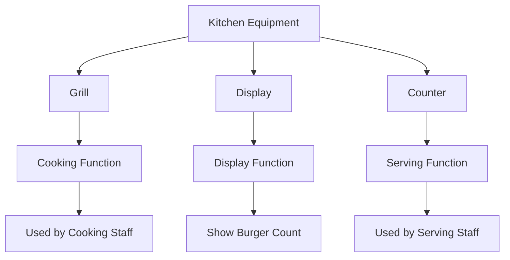

# Kitchen Equipment Management

## Overview

The ChuChu Burger kitchen equipment management system is a comprehensive system that manages the usage status, visual representation, and staff integration of three core appliances: grills, displays, and counters. Through real-time appliance assignment, dynamic sprite updates, and expansion-level appliance management, it provides an immersive store operation experience.

## Kitchen Equipment System Structure

### Equipment Types



### KitchenAppData Structure

```lua
-- RootDesk/MyDesk/03. KitchenAppliance/KitchenAppData.mlua
@Struct
script KitchenAppData
    property string Id = ""             -- Equipment ID (e.g. "Grill1", "Display3")
    property string Group = ""          -- Equipment group
    property integer Level = 0          -- Equipment level
    property string EffectType = ""     -- Effect type
    property integer EffectValue = 0   -- Effect value
```

## Equipment Usage Management System (KitchenAppManager)

### Equipment Assignment Mechanism

`KitchenAppManager` tracks real-time equipment usage status on the client:

```lua
-- Equipment user table structure
property table AppUser = {
    ["Grill"] = {1="Staff ID1", 2="Staff ID2", ...},
    ["Display"] = {1="", 2="Staff ID3", ...},
    ["Counter"] = {1="Staff ID4", 2="", ...}
}
```

### Core Management Functions

#### Equipment Assignment/Release
- `AssignApp(appType, appIdx, assignerName)`: Assign specific equipment to staff
- `ReleaseApp(appType, appIdx)`: Release equipment usage

#### Available Equipment Search
- `ReturnAvailableApp()`: Return first available equipment sequentially
- `ReturnRandomAvailableApp()`: Select available equipment randomly

```lua
-- Check available equipment count
local grillCount = _UpgradeDataSetLogic:ReturnCurrentPlayerValue(player, _UpgradeTypeEnum.GrillCount)
local displayCount = _KitchenAppService:ReturnDisplayNum(player)
local counterCount = _UpgradeDataSetLogic:ReturnCurrentPlayerValue(player, _UpgradeTypeEnum.CounterCount)
```

## Visual Management System (KitchenAppService)

### Display Sprite System

#### Dynamic Burger Display
Implemented in `ReturnDisplayRUID(tag, themeLv, burgerNum)`:

1. **Burger Count Ratio Calculation**:
```lua
local ratio = burgerNum / displayMaxCount * 100
-- 0%: BurgerNum0, ~50%: BurgerNum1, ~75%: BurgerNum2, ~95%: BurgerNum3, 100%: BurgerNum4
```

2. **Sprite Data Lookup**:
- Get sprite RUID from `DisplaySpritreDataSet` using `Tag+ThemeLevel` combination
- Example: `Meat1` (meat tag + theme level 1) → 5 different sprites by burger count

#### Full Display Update
Batch update all displays in `UpdateAllDisplaySprite()`:

```lua
-- Check burger information for each slot
local returnSlotAmount = function(slotIdx)
    for uniqueID, slotAmountData in pairs(menuManger.DisplayBurger) do
        if slotAmountData[slotIdx] > 0 then
            return {uniqueID, slotAmountData[slotIdx]}
        end
    end
    return {nil, 0}
end
```

### Equipment Animation System

#### Sprites by Usage Status
Managed in `ReturnKitchenAppRUID(type, isUsed, interior)`:

- **Grill**: `OnAnimGrill1~3` / `OffAnimGrill1~3`
- **Counter**: `OnCounter1~3` / `OffCounter1~3`
- Different animations applied by interior level

#### Position and Offset Management
```lua
-- Offset data by equipment type
self.KAppsOffset[_KitchenAppEnumType.Grill] = {{0,0}, {0.0,0}, {0.0,0}}
self.KAppsOffset[_KitchenAppEnumType.Display] = {{0,-0.3}, {0.0,-0.3}, {0.0,-0.3}}
self.KAppsOffset[_KitchenAppEnumType.Counter] = {{-0.02,0}, {0,0}, {0,0}}
```

## Staff Integration System

### Cooking Staff Integration (CookEmployeeAIScript)

#### Equipment Assignment Process
```lua
-- Equipment assignment in WAIT state
if self.WorkAppID == 0 then
    self.WorkAppID = _UserService.LocalPlayer.EmployeeManager:SetKitchenAppId(self.Entity.Name)
    if self.WorkAppID == 0 then
        return  -- No available equipment
    end
end
```

#### Equipment Usage Status Change
```lua
-- Activate equipment when entering WORK state
_KitchenAppService:KitchenAppProductionByID(self.WorkAppID, true, _KitchenAppEnumType.Grill)
```

#### Display Selection
```lua
-- Select nearest display based on grill position
local decoPos = _LobbySpawnPositionLogic.EmployeeUseKitchenAppPosGroup[_KitchenAppEnumType.Grill][self.WorkAppID]
self.TargetDisplayID = _EmployeeService:GetNearestDisplayId(self.UniqueRecipeID, self.WorkAppID, _EmployeeTypeEnum.Cook, decoPos.x)
```

### Serving Staff Integration (ServingEmployeeAIScript)

- `WorkAppID`: Assigned counter equipment ID
- `TargetDisplayId`: Display ID to pickup from
- Update display sprites when picking up burgers

## Equipment Management by Expansion Level

### Equipment Visibility Control
Equipment display by expansion level in `VisibleKitAppsEntity()`:

```lua
-- Create equipment groups by expansion level
local entityName = "KitchenApp_Level" .. expansionLv
local group = _SpawnService:SpawnByModelId(modelId, entityName, Vector3.zero, lobby)

-- Show equipment below upgrade level as empty slots
if hasAppNum[appType] < kitAppIdx then
    decoKApp.SpriteRendererComponent.SpriteRUID = _IconRuidEnum.KitchenNoneRUID
    -- Apply empty slot offset
    decoKApp.TransformComponent.WorldPosition.x = tonumber(data:GetItem("PosX")) + self.KAppsNoneOffset[appType][1]
end
```

### Position Data Management
- `KitchenAppPosDataSet`: Position data by stage and equipment type
- `InsertKitAppOffsetDataSet()`: Auto-generate position data from editor

## Display Data Structure

### DisplaySpritreDataSet Example
```csv
Id,BurgerNum0,BurgerNum1,BurgerNum2,BurgerNum3,BurgerNum4
Veggie1,empty_sprite,low_sprite,mid_sprite,high_sprite,full_sprite
Meat1,empty_sprite,low_sprite,mid_sprite,high_sprite,full_sprite
Seafood1,empty_sprite,low_sprite,mid_sprite,high_sprite,full_sprite
```

### Burger Count Display Logic
1. **Check Current Display Max Capacity** (`DisplaystandLevel` upgrade)
2. **Calculate Actual Burger Count / Max Capacity** ratio
3. **5-Level Visual Distinction**: 0%, ~50%, ~75%, ~95%, 100%
4. **Apply Tag-Specific Sprites** (Veggie, Meat, Seafood, Chicken, Spicy)

## Performance Optimization

### Real-Time Update Strategy
- **Individual Update**: `UpdateDisplaySpriteByID()` - Update specific display only
- **Batch Update**: `UpdateAllDisplaySprite()` - Full update on expansion/theme changes
- **Status Change**: `KitchenAppProductionByID()` - Individual equipment usage status change

### Memory Management
- Pre-load equipment-specific offset data
- Cache sprite RUIDs
- Destroy unused equipment entities

## Code Reference

### Core Management System
- `RootDesk/MyDesk/03. KitchenAppliance/KitchenAppManager.mlua :: AssignApp()` — Equipment assignment
- `RootDesk/MyDesk/03. KitchenAppliance/KitchenAppManager.mlua :: ReturnAvailableApp()` — Available equipment search
- `RootDesk/MyDesk/03. KitchenAppliance/KitchenAppService.mlua :: LoadData()` — Equipment data loading

### Visual Management
- `RootDesk/MyDesk/03. KitchenAppliance/KitchenAppService.mlua :: ReturnDisplayRUID()` — Display sprite determination
- `RootDesk/MyDesk/03. KitchenAppliance/KitchenAppService.mlua :: UpdateAllDisplaySprite()` — Display batch update
- `RootDesk/MyDesk/03. KitchenAppliance/KitchenAppService.mlua :: VisibleKitAppsEntity()` — Equipment visibility control

### Staff Integration
- `RootDesk/MyDesk/02. Employee/CookEmployeeAIScript.mlua :: WAIT()` — Cooking staff equipment assignment
- `RootDesk/MyDesk/02. Employee/CookEmployeeAIScript.mlua :: WORK()` — Equipment usage status activation
- `RootDesk/MyDesk/02. Employee/EmployeeManager.mlua :: EmployeeStateStop()` — Equipment usage status reset

### Data Structure
- `RootDesk/MyDesk/03. KitchenAppliance/KitchenAppData.mlua :: KitchenAppData` — Equipment data structure
- `RootDesk/MyDesk/03. KitchenAppliance/DisplaySpritreDataSet.csv` — Display sprite data
