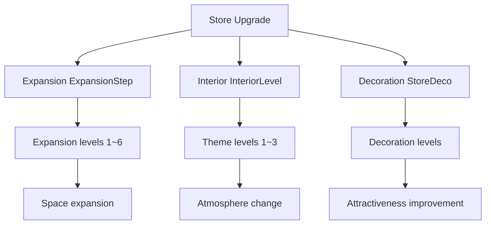

# Store Expansion and Renovation

## Overview

The ChuChu Burger store expansion and renovation system is a core mechanism that allows players to expand their store size and upgrade interior design to accommodate more customers and improve attractiveness. Through expansion, interior changes, and decoration upgrades, it provides step-by-step growth and visual satisfaction.

## System Structure

### Upgrade Types



### PlayerUpgrade Component

Manages all player upgrade information:

```lua
-- RootDesk/MyDesk/00. Player/PlayerUpgrade.mlua
@Component
script PlayerUpgrade extends Component
    @TargetUserSync
    property SyncTable<integer, integer> Upgrades    -- Upgrade level by type
    @TargetUserSync  
    property SyncTable<string, integer> Subscriptions -- Subscription service status
```

## Expansion System (ExpansionStep)

### Space Changes by Expansion Level

Complete expansion process handled by `LobbyRenovationService :: ExpandLobby()`:

1. **Tilemap Update**: `UpdateLobbyTileMap()` - Floor and wall layout changes
2. **Exterior Object Refresh**: `UpdateExteriorObject()` - Exterior appearance changes
3. **Postbox Position Adjustment**: `UpdatePostBox()` - Position adjustment by expansion level
4. **Kitchen Appliance Repositioning**: Calling `_KitchenAppService:VisibleKitAppsEntity()`
5. **Path Recalculation**: `_PathFinder:InitNodes()` - AI pathfinding updates
6. **Interior Application**: `RedesignInterior()` - Theme application
7. **Customer Position Updates**: Waiting seat and spawn position readjustment

### Tilemap Management System

#### Wall Management by Stage
```lua
-- Wall activation based on expansion level
for i = 1, #self.StageWalls do 
    if i == expansionLv then 
        self.StageWalls[i].Enable = true 
    else
        self.StageWalls[i].Enable = false 
    end
end
```

#### Floor Tile Setup by Area
```lua
local space = {"Kitchen","Cash"}  -- Kitchen, cashier areas
local tileSprite = {"kitchen","cash1","cash2","cash3","HalfFloor"}

-- Tile placement for each area
for i = 1, #space do
    local bottomPos = _LobbySpawnPositionLogic.ExpansionTileGroup[space[i]][expansionLv]["Bottom"]
    local topPos = _LobbySpawnPositionLogic.ExpansionTileGroup[space[i]][expansionLv]["Top"]
    -- Calculate area size then set tiles
end
```

## Interior System (InteriorLevel)

### Visual Changes by Theme

Interior theme application in `RedesignInterior()`:

```lua
-- Theme-specific tileset RUID
if themeLv == 1 then 
    ruid = "tileset://9c83666b-7388-4664-a444-3ee19e1e7980"
elseif themeLv == 2 then 
    ruid = "tileset://660f086b-019f-4423-8d9a-874099926c53"
elseif themeLv == 3 then 
    ruid = "tileset://362cff79-7315-493d-bf04-1656dfb05207"
end
```

### Interior Entity Management

#### Dynamic Interior Creation
```lua
-- Destroy existing interior entities
for _, entity in pairs(lobby.Children) do
    if _UtilLogic:Contains(entity.Name, "Interior") then
        entity:Destroy(0)
    end
end

-- Spawn new interior entities
local decoEntityName = "Interior_Theme"..themeLv.."_Level"..expansionLv
local decoEntity = _SpawnService:SpawnByModelId(decoModelId, decoEntityName, Vector3.zero, lobby)
```

#### Interior Object Layer Settings
- Adjust rendering order for each interior element
- Set transparency and color
- Configure collision detection areas

## Decoration System (StoreDeco)

### Decoration Upgrades

Decoration level application in `UpdateInteriorObject()`:
- Add/remove decorative elements
- Direct impact on attractiveness
- Place premium furniture and decorations

### Attractiveness Integration
```lua
-- Recalculate attractiveness upon decoration upgrade
self.Entity.CustomerManager:CalcMyAttractive()
```

## Upgrade Process

### Upgrade Execution Steps

Processing sequence in `PlayerUpgrade :: UpgradeFunction()`:

1. **Condition Check**:
   - Max level verification
   - Cost verification (`self.Entity.PlayerInventory.Money`)
   - Upgrade availability (`_UpgradeDataSetLogic:CanUpgrade()`)

2. **Cost Payment**:
```lua
local cost = nextLevelData:GetUpgradeCost(self.Entity)
self.Entity.PlayerInventory:ModifyMoney(-cost, "Upgrade", "Upgrade popup")
```

3. **Level Up Application**:
```lua
self.Upgrades[typeId] = nextLevel
```

4. **Special Processing**:
   - **Expansion**: Event C8001 trigger → Construction progress presentation
   - **Interior**: Event C8002 trigger → Redesign presentation
   - **Decoration**: Event C8003 trigger → Decoration update

### Special Effects by Upgrade Type

#### Expansion Upgrade (ExpansionStep)
```lua
if typeId == _UpgradeTypeEnum.ExpansionStep then
    if isCheat == false then
        _UpgradeDataSetLogic:RequestCloseUpgradeUI(self.Entity.PlayerComponent.UserId)
        _EventManager:SetEventReferKeyData("C8001", "Expansion", self.Entity.PlayerComponent.UserId)
        self.Entity.PlayerEvent:RequestCallEvent("C8001")
    else
        -- Immediate expansion application (cheat mode)
        _LobbyRenovationService:ExpandLobby(expansionLv, interiorLv, decoLv, grillCount, displayCount, counterCount, self.Entity)
    end
end
```

#### Interior Upgrade (InteriorLevel)
```lua
if typeId == _UpgradeTypeEnum.InteriorLevel then 
    if isCheat == false then
        _EventManager:SetEventReferKeyData("C8002", "Interior", self.Entity.PlayerComponent.UserId)
        self.Entity.PlayerEvent:RequestCallEvent("C8002")
    else
        _LobbyRenovationService:RedesignInterior(interiorLv, expansionLv, decoLv)
    end
end
```

## Visual Effects System

### Step-by-Step Construction Progress

Staged presentation through upgrade events:
1. **Close Upgrade UI**
2. **Display Construction Progress Dialog**
3. **Apply Actual Renovation**
4. **Completion Notification**

### Preview System

Preview functionality before upgrade:
- Display expansion area through ghost entities
- Preview interior changes
- Pre-evaluate cost versus benefit

## Interior Wall Management System

### Dynamic Wall Creation

Wall management through `AddBoxTile()` and `RemoveTile()`:

```lua
-- Add interior walls for cashier area
local displayInnerWallY = topPos.y + 2
_LobbyRenovationService:AddBoxTile(expansionLv, Vector2(startX, displayInnerWallY), Vector2(endX, displayInnerWallY), player, self.insideWallCenterTileImg)

-- Counter area interior walls
local counterInnerWallY = topPos.y  
_LobbyRenovationService:AddBoxTile(expansionLv, Vector2(startX, counterInnerWallY), Vector2(endX, counterInnerWallY), player, self.insideWallCenterTileImg)
```

### Wall Tile Types
- `insideWallCenterTileImg`: Center wall tile
- `insideWallLeftSideTileImg`: Left wall tile  
- `insideWallRightSideTileImg`: Right wall tile
- `SingleWallTileImg`: Single wall tile

## Performance Optimization

### Entity Management
- Disable walls for unused expansion levels
- Dynamic creation/destruction of interior entities
- Pre-disable ghost entities

### Memory Management
```lua
-- Clean entity references
table.clear(self.InteriorEntities)
for _, ie in pairs(self.NowInteriorEntity.Children) do
    self.InteriorEntities[ie.Name] = ie
end
```

## Integration Systems

### Kitchen Appliance Integration
Kitchen appliance repositioning during expansion:
- Update grill, display, counter positions
- Control appliance visibility by expansion level
- Recalculate staff movement paths

### Customer System Integration
Customer-related updates during expansion:
- Readjust waiting seat positions: `UpdateWaitSeatPos()`
- Update customer spawn positions: `UpdateCustomerSpawnPos()`
- Recalculate customer movement paths

### Camera System Integration
```lua
-- Camera settings by expansion level
_LobbyCameraService:SetCamerasForExpansion(expansionLv)
```

## Code Reference

### Core Renovation System
- `RootDesk/MyDesk/01. Lobby/LobbyRenovationService.mlua :: ExpandLobby()` — Complete expansion process
- `RootDesk/MyDesk/01. Lobby/LobbyRenovationService.mlua :: RedesignInterior()` — Interior redesign
- `RootDesk/MyDesk/01. Lobby/LobbyRenovationService.mlua :: UpdateLobbyTileMap()` — Tilemap updates

### Upgrade Management
- `RootDesk/MyDesk/00. Player/PlayerUpgrade.mlua :: UpgradeFunction()` — Upgrade execution
- `RootDesk/MyDesk/00. Player/PlayerUpgrade.mlua :: ForceSetUpgradeLevel()` — Force level setting
- `RootDesk/MyDesk/01. Lobby/LobbyManager.mlua :: InitClient()` — Initial renovation application

### Tile Management
- `RootDesk/MyDesk/01. Lobby/LobbyRenovationService.mlua :: AddBoxTile()` — Wall tile addition
- `RootDesk/MyDesk/01. Lobby/LobbyRenovationService.mlua :: RemoveTile()` — Tile removal
- `RootDesk/MyDesk/01. Lobby/LobbyRenovationService.mlua :: UpdateInteriorObject()` — Interior object updates

### Integration Systems
- `RootDesk/MyDesk/01. Lobby/LobbyRenovationService.mlua :: UpdatePostBox()` — Postbox position adjustment
- `RootDesk/MyDesk/01. Lobby/LobbyRenovationService.mlua :: UpdateWaitSeatPos()` — Waiting seat position updates
