# Employee Training System

## System Overview

The ChuChuBurger employee training system is an advanced system that allows the player's employees to grow through real field experience. Centered on **PlayerTrainingManager**, it provides an interesting and strategic training experience through the complex integration of spot selection, roulette mini-games, and hint systems.

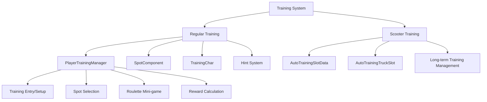

## PlayerTrainingManager - Core Training System Management

### Core Data Structure
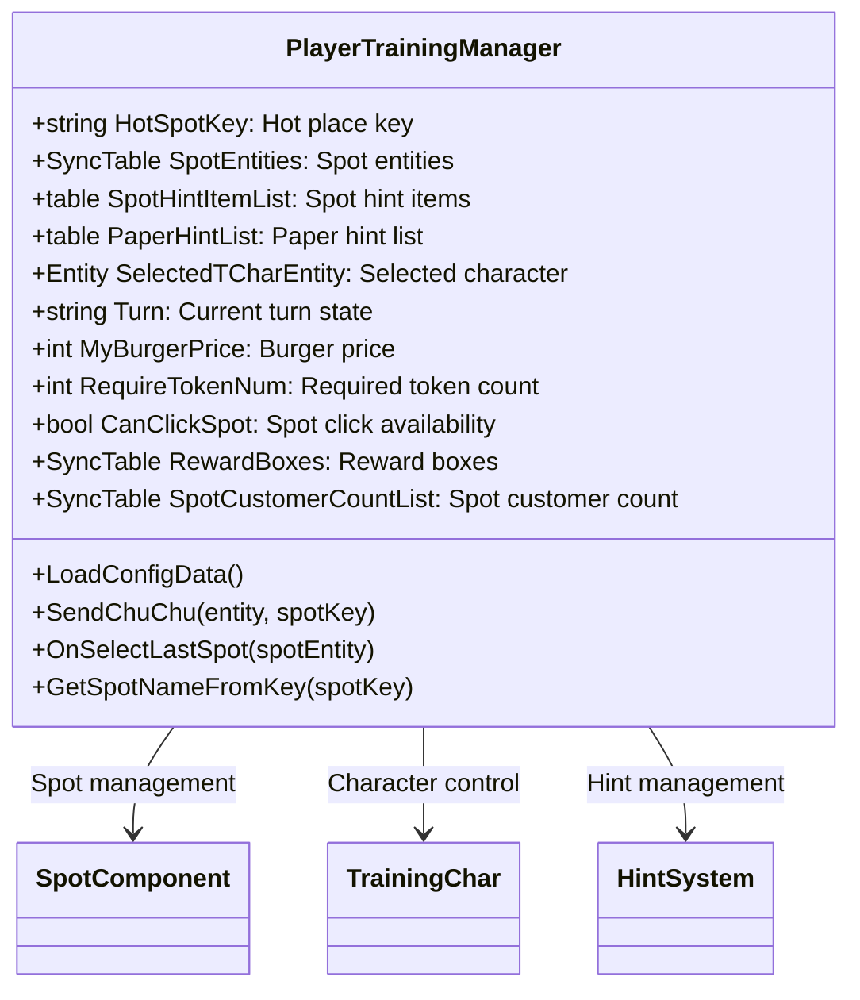

### Training Progress System

**Turn-based System:**
```lua
-- PlayerTrainingManager.mlua
property string Turn = ""    -- "FirstMorning", "SecondMorning", etc.
```

**Training Phases:**
1. **Preparation Phase**: Character selection and initial setup
2. **First Morning**: Spot exploration and hint collection
3. **Second Morning**: Final spot selection and burger sales
4. **Reward Phase**: Reward distribution based on performance

### Spot Selection Mechanism

**Spot Characteristics:**
- **HotSpotKey**: Currently popular hot place
- **SpotHintItemList**: Hints discoverable at each spot
- **SpotCustomerCountList**: Expected customer count by spot

**Selection Conditions:**
```lua
-- PlayerTrainingManager.mlua :: CanClickSpot
if _UserService.LocalPlayer.PlayerTrainingManager.CanClickSpot == false then
    return  -- Spot click unavailable state
end
```

## SpotComponent - Training Location Management

### Spot System

**SpotComponent Structure:**
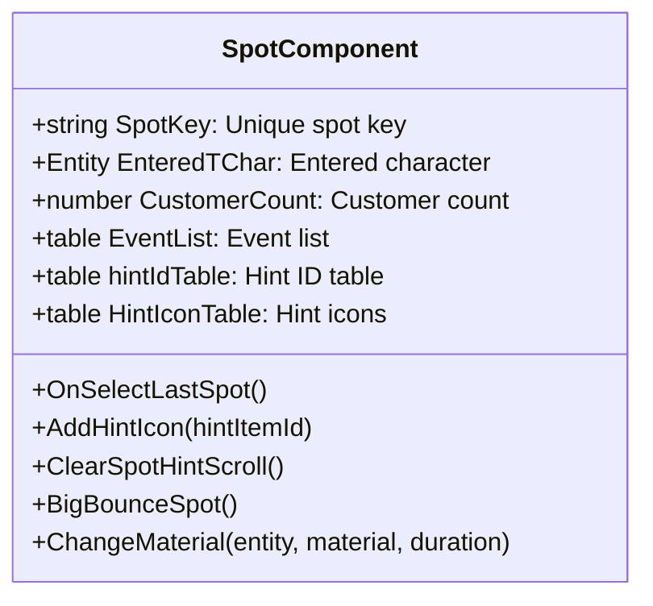

### Hint System Integration

**Hint Icon Management:**
```lua
-- SpotComponent.mlua :: OnBeginPlay()
local hintScrollView = _EntityService:GetEntityByPath(self.Entity.Path.."/HintScroll")
for i = 1, 3 do
    local hintIconEntity = hintScrollView:GetChildByName("HintIcon".._StringUtilLogic:NumToString(i))
    table.insert(self.HintIconTable, hintIconEntity)
    hintIconEntity:ConnectEvent(ButtonClickEvent, function() 
        _SoundService:PlaySound(_ResourceManager.SFXTable["Eff_FindItemHint"], 1)
        self:OnClickHintIcon(i) 
    end)
end
```

**Visual Feedback:**
```lua
-- SpotComponent.mlua :: BigBounceSpot()
self:ChangeMaterial(self.Entity, _IconRuidEnum.ChuChuMovementMaterial, 5)
```

When important information or events exist at a spot, visual emphasis is provided through bounce animation.

### Spot Interaction

**Click Event Processing:**
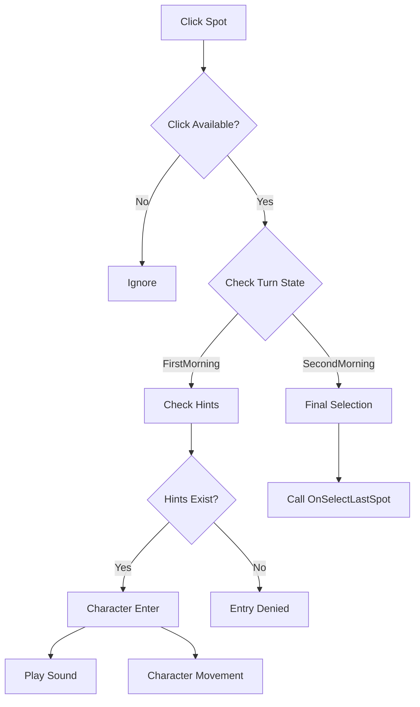

## TrainingChar - Character Management

### Character State System

**TrainingChar Structure:**
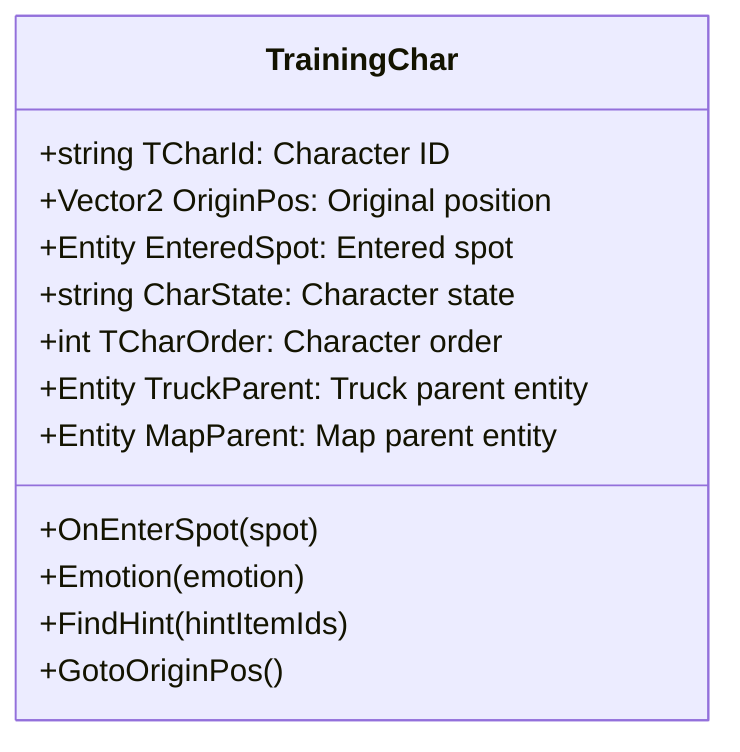

### Spot Entry System

**OnEnterSpot Processing:**
```lua
-- TrainingChar.mlua :: OnEnterSpot()
if isvalid(self.EnteredSpot) then
    self.EnteredSpot.SpotComponent:ClearEnteredTChar()  -- Clear existing spot
end

self.EnteredSpot = spot

if isvalid(self.EnteredSpot) then
    self.Entity:AttachTo(self.EnteredSpot)  -- Attach to spot
    self.Entity.UITransformComponent.anchoredPosition = Vector2(0, 160)
    local player = _UserService.LocalPlayer
    player.PlayerTrainingManager:SendChuChu(self.Entity, self.EnteredSpot.SpotComponent.SpotKey)
else
    self:GotoOriginPos()  -- Return to original position
end
```

### Emotion Animation System

**Multi-view Emotion Expression:**
```lua
-- TrainingChar.mlua :: Emotion()
local img1 = _EntityService:GetEntityByPath("/ui/TrainingGroup/PlacePanel/Foothold/Foot/Truck/CharImage".._StringUtilLogic:NumToString(self.TCharOrder))
local img2 = _EntityService:GetEntityByPath("/ui/TrainingGroup/PlacePanel/Foothold_HotPlace/Foot/Truck/CharImage".._StringUtilLogic:NumToString(self.TCharOrder))

_TrialLogic:PlayUIEmployeeAnim(self.Entity, self.TCharId, emotion, true, _UserService.LocalPlayer)
_TrialLogic:PlayUIEmployeeAnim(img1, self.TCharId, emotion, true, _UserService.LocalPlayer)
_TrialLogic:PlayUIEmployeeAnim(img2, self.TCharId, emotion, true, _UserService.LocalPlayer)
```

**Emotion Types:**
- **Joy**: When finding good hints
- **Surprise**: When special events occur  
- **Focus**: While searching for hints
- **Satisfaction**: Upon training completion

## TrainingCustomerComponent - Training Customer System

### Virtual Customer Management

Customer system to simulate real-world situations in the training environment.

**Main Functions:**
- **Hot Place Location Setting**: Customer distribution based on popular locations
- **Walking Animation**: Natural customer movement
- **Random Outfits and Emotions**: Diverse customer visualization
- **Action Animation**: Various reactions like ordering, waiting, satisfaction

**Customer Distribution System:**
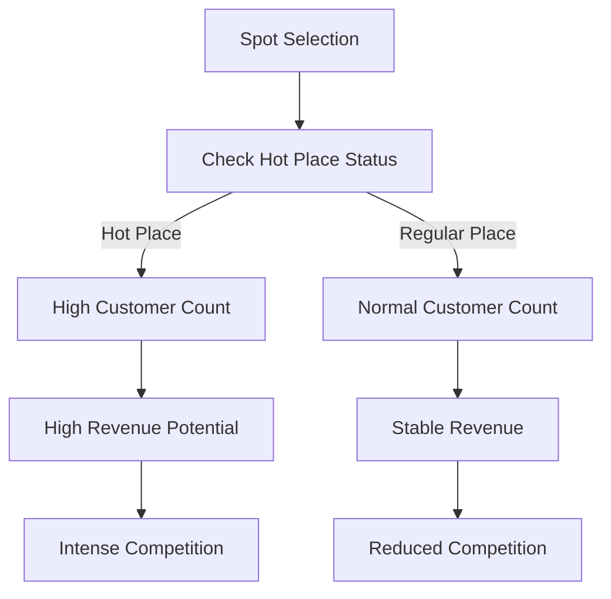

## Hint System

### HintItemData - Hint Item Management

**Hint Classification System:**
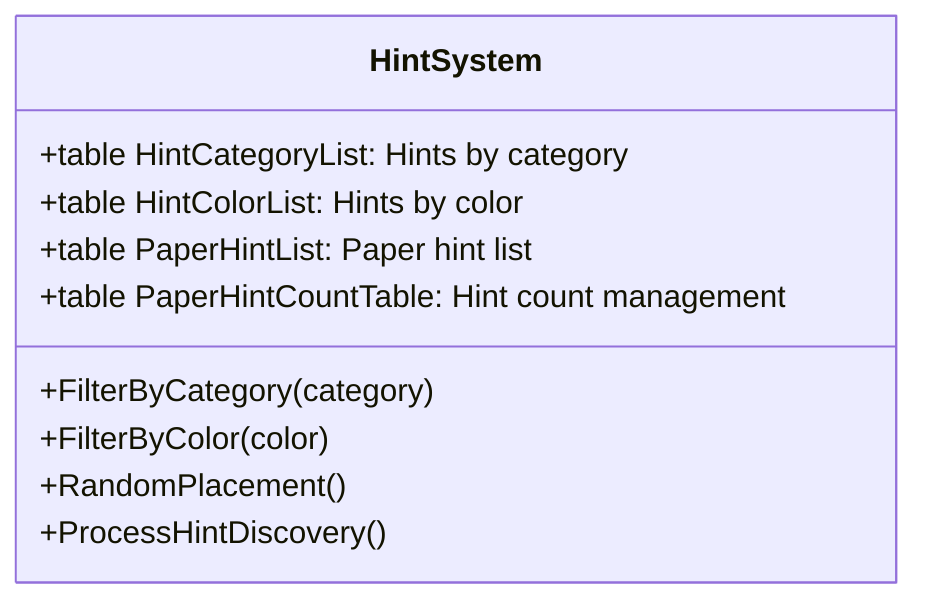

### Hint Discovery Mechanism

**PaperHintComponent Processing:**
- **Color Filtering**: Display only specific color hints
- **Category Filtering**: Distinguish cooking/serving related hints
- **Random Placement**: Different hint placement each session
- **Discovery Processing**: Collection and information provision when hints are touched

**Hint Utilization Strategy:**
1. **Information Collection**: Understand characteristics of each spot
2. **Risk Avoidance**: Identify problematic spots
3. **Opportunity Capture**: Discover hidden bonuses
4. **Optimization**: Find most efficient spots

## Roulette Mini-game System

### Mini-game Structure

**Gameplay Flow:**
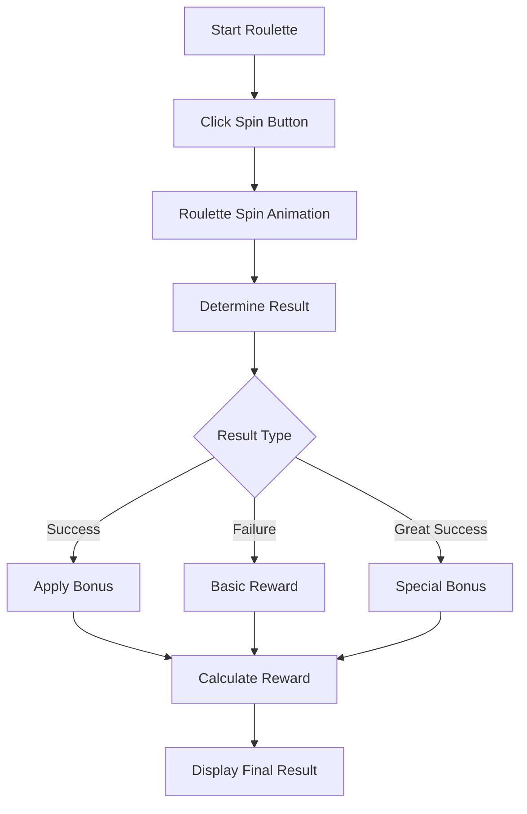

### Probability System

**Result Weights:**
```lua
-- PlayerTrainingManager.mlua
property bool IsSpinning = false              -- Prevent spin while in progress
property table BurgerPriceBonusTable         -- Price bonus table
```

**Reward Calculation Elements:**
- **Base Burger Price**: Based on MyBurgerPrice
- **Upgrade Bonus**: Apply UpgradeBurgerPrice
- **Roulette Result**: Apply multiplier effect
- **Spot Bonus**: Special effects of selected spot

## Scooter Training System

### AutoTrainingSlotData - Slot Management

**Scooter Training Structure:**
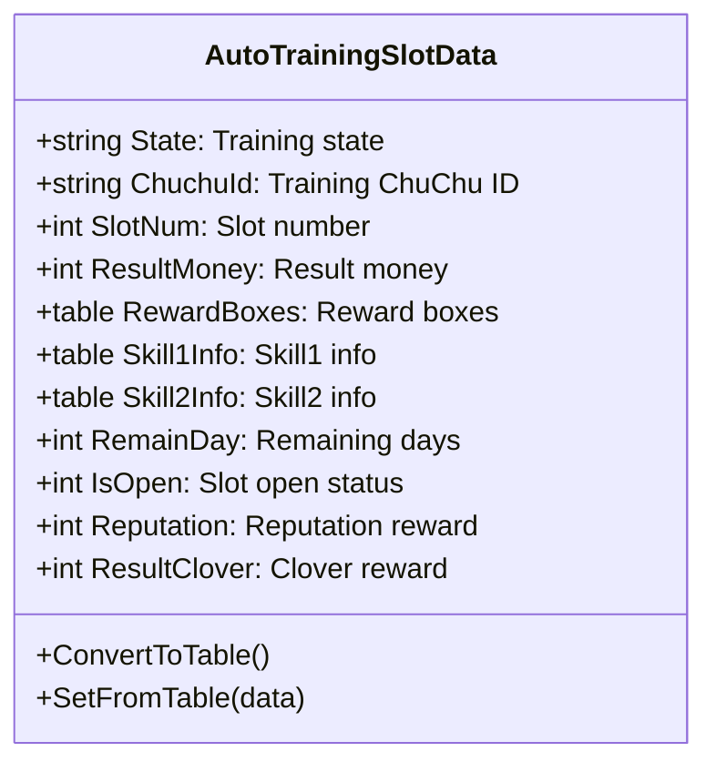

### AutoTrainingTruckSlot - UI Management

**State-based UI System:**
```lua
-- AutoTrainingTruckSlot.mlua :: ChangeUIOnState()
if state == _AutoTrainingUIStateEnum.OnProgress then
    -- Training in progress UI
    btnDim.Enable = true
    dimText.Enable = true
    timerPanel.Enable = true
    noParkingSign.Enable = true
    
elseif state == _AutoTrainingUIStateEnum.WaitingReward then
    -- Reward waiting state UI
    buttonText.TextComponent.Text = _LocalizationService:GetText("Receive")
    
elseif state == _AutoTrainingUIStateEnum.Locked then
    -- Locked slot UI
    lockIcon.Enable = true
    coverSprite.Enable = true
end
```

### Scooter Training Features

**Long-term Training System:**
- **Time-based**: Long-term training progressing in real-time
- **Multi-slot**: Multiple employees can train simultaneously
- **Offline Progress**: Continues even after game closure
- **Diverse Rewards**: Experience, gold, reputation, clover, etc.

**Scooter Visualization:**
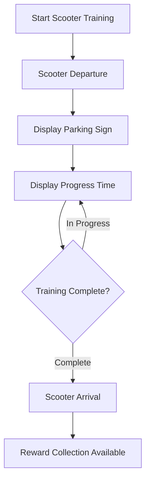

## UI System Integration

### TrainingUIStateEnum - State Management

**UI State Definitions:**
```lua
-- TrainingUIStateEnum.mlua
property string Default = "Default"              -- Default state
property string OnProgress = "OnProgress"        -- In progress
property string WaitingReward = "WaitingReward"  -- Waiting for reward
property string Locked = "Locked"                -- Locked state
property string List_Selected = "List_Selected"  -- List selected
```

### Integrated UI Experience

**UITraining Main Interface:**
- **Character Selection**: Select employees to participate in training
- **Spot Map**: Display available training locations
- **Hint Information**: Display collected hints
- **Progress Status**: Current training phase and remaining time
- **Reward Preview**: Check expected rewards

**UITrainingSetting Configuration:**
- **Difficulty Adjustment**: Set training intensity
- **Goal Setting**: Focused training for specific skills
- **Time Management**: Plan training schedule
- **Cost Setting**: Determine training investment cost

## Reward System

### TrainingExpRewardData - Experience Rewards

**Stage-based Differential Rewards:**
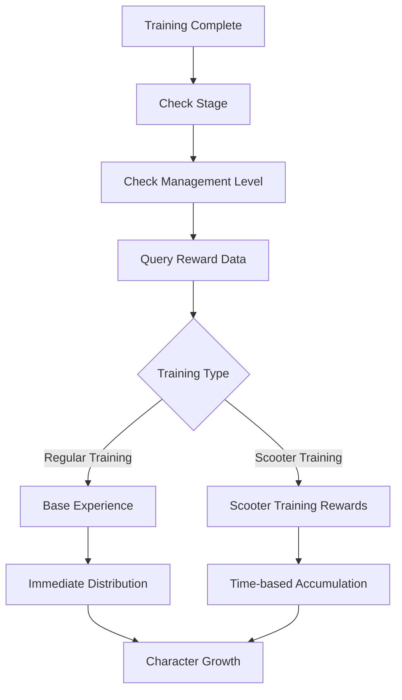

**TrainingRewardLogic Reward Management:**
- **Stage-based Adjustment**: Appropriate rewards for current stage
- **Management Level Correction**: Better rewards for higher management levels
- **Training Type-based**: Differential rewards for regular/scooter training
- **Skill-specific**: Dedicated rewards for cooking/serving skills

### Comprehensive Performance Indicators

**Training Performance Measurement:**
- **Skill Improvement**: Compare skill levels before and after training
- **Experience Efficiency**: Experience gained versus investment  
- **Time Efficiency**: Growth rate versus time spent
- **Cost Effectiveness**: Long-term profitability versus investment cost

## Strategic Value

### Employee Growth Acceleration

**Systematic Growth Management:**
- **Customized Training**: Select training appropriate for individual employee characteristics
- **Balanced Development**: Harmonious growth of cooking/serving skills  
- **Specialization Support**: Advanced training for specific areas
- **Team Synergy**: Maximize team efficiency through diverse skill combinations

### Increased Gameplay Depth

**Strategic Decision Making:**
- **Resource Management**: Efficient use of limited tokens
- **Risk Management**: Safe training vs high-risk high-reward
- **Time Planning**: Short-term growth vs long-term investment strategy
- **Information Utilization**: Secure information advantage through hint system

## Performance Optimization and Technical Considerations

### Real-time Processing

**Scooter Training Timer:**
- **Server-based**: Server processing for accurate time calculation
- **Synchronization**: Time synchronization between client and server
- **Offline Rewards**: Settlement of rewards for time not logged in
- **Performance Optimization**: Minimize unnecessary updates

### Data Consistency

**Training Progress State Management:**
```lua
-- AutoTrainingSlotData.mlua :: ConvertToTable()
result["State"] = self.State
result["RemainDay"] = self.RemainDay
result["ResultMoney"] = self.ResultMoney
result["RewardBoxes"] = _UtilLogic:TableToString(self.RewardBoxes)
```

**Backup and Recovery:**
- **Periodic Saves**: Automatic backup of training progress
- **Data Validation**: Check data integrity on load
- **Recovery Mechanism**: Automatic recovery in case of data loss

## Code References

### Core Training Management
- `RootDesk/MyDesk/06. Training/PlayerTrainingManager.mlua :: SendChuChu()` — Character spot entry processing
- `RootDesk/MyDesk/06. Training/PlayerTrainingManager.mlua :: OnSelectLastSpot()` — Final spot selection
- `RootDesk/MyDesk/06. Training/PlayerTrainingManager.mlua :: LoadConfigData()` — Load configuration data

### Spot and Environment Management
- `RootDesk/MyDesk/06. Training/SpotComponent.mlua :: OnBeginPlay()` — Spot initialization
- `RootDesk/MyDesk/06. Training/SpotComponent.mlua :: AddHintIcon()` — Add hint icon
- `RootDesk/MyDesk/06. Training/SpotComponent.mlua :: BigBounceSpot()` — Spot emphasis effect

### Character Control
- `RootDesk/MyDesk/06. Training/TrainingChar.mlua :: OnEnterSpot()` — Spot entry processing
- `RootDesk/MyDesk/06. Training/TrainingChar.mlua :: Emotion()` — Emotion animation
- `RootDesk/MyDesk/06. Training/TrainingChar.mlua :: FindHint()` — Hint discovery processing

### Scooter Training System
- `RootDesk/MyDesk/06. Training/AutoTrainingSlotData.mlua :: ConvertToTable()` — Data serialization
- `RootDesk/MyDesk/06. Training/AutoTrainingTruckSlot.mlua :: ChangeUIOnState()` — State-based UI changes
- `RootDesk/MyDesk/06. Training/AutoTrainingTruckSlot.mlua :: SwitchLockPanel()` — Lock state processing

### Reward System
- `RootDesk/MyDesk/06. Training/TrainingExpRewardData.mlua :: Load()` — Load reward data
- `RootDesk/MyDesk/06. Training/TrainingRewardLogic.mlua` — Reward logic management

### UI Management
- `RootDesk/MyDesk/06. Training/UITraining.mlua` — Main training UI
- `RootDesk/MyDesk/06. Training/UITrainingSetting.mlua` — Training setup UI
- `RootDesk/MyDesk/06. Training/TrainingUIStateEnum.mlua` — UI state enum

### Customer Simulation
- `RootDesk/MyDesk/06. Training/TrainingCustomerComponent.mlua` — Training customer management

---

This document comprehensively covers all aspects of the ChuChuBurger employee training system. It demonstrates how regular training and scooter training systems integrate to systematically develop the player's employees while providing both strategic depth and entertainment.
