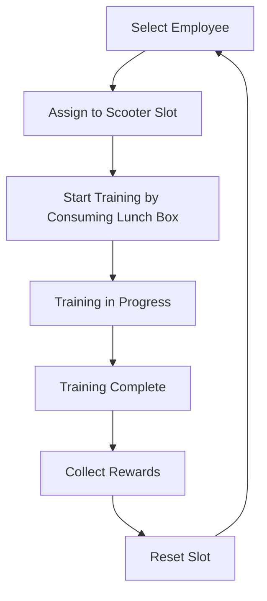

# Scooter Training System

The ChuChuBurger scooter training system is a feature where players can send employees (ChuChus) on automatic training missions for a set period of time, and receive rewards such as experience points, gold, clover, and ingredient boxes upon completion. It is a core element of the AFK (Away From Keyboard) system that allows players to earn resources for profit and employee growth even when not actively playing the game.

## System Overview

The scooter training system operates through 3 scooter slots. Each slot can be assigned one employee, and training can be started by consuming lunch boxes, with rewards available after a certain period of time.

### Core Operation Flow



## Main Components

### PlayerAutoTrainingManager

The core manager component for the scooter training system, handling all scooter training logic.

**Main Properties:**
- `OpenSlotNum`: Number of open slots (expandable through upgrades)
- `MaxSlotCount`: Maximum slot count (3 slots)
- `RequireLunchBoxNum`: Required lunch boxes to start training (3 boxes)
- `TrainingTime`: Training duration (in minutes)
- `AutoTrainingSlotInfoTable`: Training data storage by slot

**Main Functions:**
- `StartTraining()`: Training start processing
- `CalcResult()`: Reward calculation and result generation
- `GiveReward()`: Reward distribution
- `UpdateTimer()`: Training time progression management

### AutoTrainingSlotData

Structure that manages the state and data of each scooter slot.

**Main Properties:**
- `State`: Training state (Default/OnProgress/WaitingReward)
- `ChuchuId`: Assigned employee ID
- `SlotNum`: Slot number
- `RemainDay`: Remaining training time
- `ResultMoney`: Resulting gold
- `ResultClover`: Resulting clover
- `RewardBoxes`: Reward box list

### AutoTrainingTruckSlot

Component responsible for individual scooter slot UI and state management.

**UI Changes by State:**
- `Default`: Base state, employee assignment and departure preparation
- `OnProgress`: Training in progress, timer display and scooter hidden
- `WaitingReward`: Training complete, arrival notification and reward collection available
- `Locked`: Slot locked state

## System Features

### Slot Expansion System

Initially only 1 slot is available, expandable up to 3 slots through upgrades:

```
- Slot 1: Provided by default
- Slot 2: Requires Scooter Training Open upgrade
- Slot 3: Requires Additional Scooter Training Open upgrade
```

### Reward System

Upon training completion, the following rewards are available:

#### Basic Rewards
- **Gold**: Customer count × Burger price × Setting multiplier × Stage adjustment
- **Clover**: Base clover based on management level + Collection bonus
- **Reputation**: Reputation based on training upgrade level

#### Ingredient Boxes
- Ingredient boxes Grade 1-3: Random drop based on weight
- Bun boxes: Drop based on probability

#### Experience Items
- Cooking experience items
- Serving experience items

### Employee Skill System Integration

When participating employees have training type skills, additional bonuses are available:

- `TotalMoneyBonus`: Gold bonus
- `ArcaneBonus`: Clover bonus  
- `CookExpBonus`: Cooking experience bonus
- `ServingExpBonus`: Serving experience bonus

### Visual Feedback

#### Lobby Integration
Scooter training progress is visually reflected in the actual lobby parking area:
- Scooter display/hide
- No parking sign display
- Remaining time or arrival notification display

#### HUD Display
Scooter training status can also be checked from the main HUD:
- Progress status for each slot
- Remaining time display
- Completion notifications

## UI System

### UITrainingAuto

Component that manages the main UI for scooter training.

**Main Functions:**
- Scooter slot display and management
- Employee selection popup
- Result popup display
- Batch reward collection

### Employee Selection System

Players can select employees to participate in scooter training from their owned employees:
- Employee list scrolling
- Detailed information display for each employee
- Training skill possession display
- Current deployment status check

## Economic System Integration

### Cost System
- **Lunch Box Consumption**: 3 lunch boxes are consumed when starting training
- **Speed-up Feature**: Training can be instantly completed by consuming Arcane Symbols

### Reward Calculation
Reward calculation considers various factors:
- Player's current stage
- Management level
- Training upgrade level  
- Employee skills
- Strategy effects
- Collection bonuses

## Data Management

### Save System
Scooter training data is managed as follows:
- `AutoTrainingSlotInfoTable`: Training status by slot
- `OpenSlotNum`: Number of open slots
- `ChuchuIds`: Selected employee list

### Log System
All scooter training activities are recorded in PlayerLog:
- Training start logs
- Training completion logs  
- Reward collection logs

## Achievement and Badge Integration

The scooter training system integrates with various achievement and badge systems:
- Scooter training income achievements
- Scooter training cumulative income achievements
- Scooter training count achievements
- Training count badges

## Code References

- `RootDesk/MyDesk/06. Training/PlayerAutoTrainingManager.mlua :: CalcResult()` — Reward calculation logic
- `RootDesk/MyDesk/06. Training/PlayerAutoTrainingManager.mlua :: StartTraining()` — Training start processing
- `RootDesk/MyDesk/06. Training/PlayerAutoTrainingManager.mlua :: UpdateTimer()` — Time progression management
- `RootDesk/MyDesk/06. Training/AutoTrainingSlotData.mlua :: ConvertToTable()` — Database save data conversion
- `RootDesk/MyDesk/06. Training/AutoTrainingTruckSlot.mlua :: ChangeUIOnState()` — UI changes by state
- `RootDesk/MyDesk/06. Training/UITrainingAuto.mlua :: SetTruckSlot()` — Scooter slot UI setup
- `RootDesk/MyDesk/06. Training/AutoTrainingUIStateEnum.mlua` — Training state enum definitions
