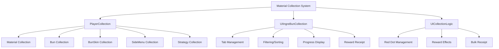
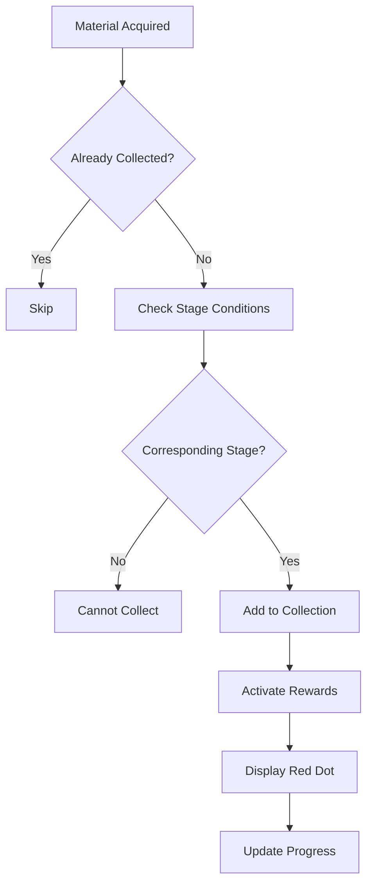
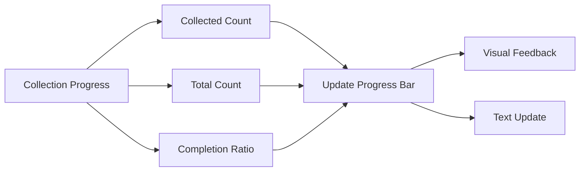
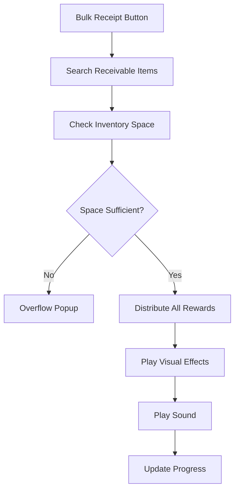

# Material Collection System

The ChuChuBurger material collection system is a long-term goal achievement system that collects various in-game elements and provides rewards based on completion rates. Centered around **PlayerCollection**, it manages 5 categories of collections including **Materials**, **Buns**, **BunSkins**, **SideMenu**, and **Strategy**, providing progress tracking and reward systems through **UIIngreBunCollection**.

## System Overview



## PlayerCollection - Collection Data Management

### 5 Main Collection Types

Each collection type managed by PlayerCollection is synchronized in real-time with @TargetUserSync:

<details>
<summary>PlayerCollection Property Definition</summary>

```lua
-- RootDesk/MyDesk/00. Player/PlayerCollection.mlua
@TargetUserSync
property SyncTable<integer, boolean> IngredientCollection

@TargetUserSync
property SyncTable<integer, boolean> BunCollection

@TargetUserSync
property SyncTable<integer, boolean> IngredientCollectionGetReward

@TargetUserSync
property SyncTable<integer, boolean> BunCollectionGetReward

@TargetUserSync
property SyncTable<integer, boolean> BunSkinCollection

@TargetUserSync
property SyncTable<integer, boolean> SideMenuCollection

@TargetUserSync
property SyncTable<integer, boolean> SideMenuChecked

@TargetUserSync
property SyncTable<integer, boolean> StrategyCollection
```
</details>

**Collection Categories:**
- **IngredientCollection**: Burger-making ingredients
- **BunCollection**: Various bun (bread) types
- **BunSkinCollection**: Visual customization for buns
- **SideMenuCollection**: Game strategy elements
- **StrategyCollection**: Advanced strategy systems

### Material Collection Addition System

PlayerCollection's material collection includes stage restrictions and duplicate checks:



### Reward Receipt System

The RequestGetIngredientCollectionReward() method processes material collection rewards:

1. **User Verification**: Security verification by checking senderUserId match
2. **Reward Calculation**: Material count × Diamond reward setting value
3. **Inventory Check**: Display overflow popup when maximum holding capacity exceeded
4. **Duplicate Prevention**: Block re-receipt of already received rewards

Core Logic: `local totalAmount = rewardConfig * #ingreIds`

<details>
<summary>Material Collection Reward Receipt Implementation</summary>

```lua
-- RootDesk/MyDesk/00. Player/PlayerCollection.mlua :: RequestGetIngredientCollectionReward()
method void RequestGetIngredientCollectionReward(table ingreIds, boolean isTween, string source)
    if senderUserId ~= self.Entity.PlayerComponent.UserId then
        return
    end
    
    local rewardConfig = _GetConfigDataLogic:GetConfigNumDataByKey("IngreCollectionRewardDiamond")
    local totalAmount = rewardConfig * #ingreIds
    if self.Entity.PlayerInventory:IsItemOverMaxCount(_ItemDataEnum.DiaFree, totalAmount) > 0 then
        local itemData = _ItemDataSetLogic:GetItemData(_ItemDataEnum.DiaFree)
        _UIPurchasePopupLogic:OpenOverMaxCountPopup(itemData.Id, itemData.NameKey, itemData.MaxStackCount, nil, false, false, senderUserId)
        return
    end
    
    for _, ingreId in pairs(ingreIds) do
        local ingreData = _IngredientDataSetLogic:GetIngredientData(ingreId)
        if isvalid(ingreData) == false then
            return
        end
        
        if self.IngredientCollection[ingreId] == nil or self.IngredientCollection[ingreId] == false then
            return
        end
        
        if self.IngredientCollectionGetReward[ingreId] == true then
            return
        end
        
        self:GetIngredientCollectionReward(ingreId, isTween)
    end
```
</details>

**Reward Processing Features:**
- **Diamond Rewards**: Distribute set diamonds per material
- **Inventory Check**: Display popup when maximum holding capacity exceeded
- **Duplicate Prevention**: Block re-receipt of already received rewards
- **Bulk Processing**: Support simultaneous reward receipt for multiple materials

## UIIngreBunCollection - Collection UI System

### Tab-based Interface

UIIngreBunCollection is a UI that manages each collection category in tab format:

<details>
<summary>UIIngreBunCollection Property Definition</summary>

```lua
-- RootDesk/MyDesk/17. Collection/UIIngreBunCollection.mlua
property SyncTable<integer, Entity> Tabs
property SyncTable<integer, Entity> Slots
property Entity List = "8adcc019-7b96-48c7-91d9-5348eb340074"
property Entity Detail = "d8eb453a-b622-42ed-b2ab-054f25b80d03"
property Entity FilterSelectArea = "406e51eb-fac8-4eba-bb03-4b64b5189681"
property Entity SortSelectArea = "8808ac03-2c62-46f4-88c8-50c586311cca"
property integer SelectTab = 0
property string NowFilter = ""
property string NowSort = ""
property integer NowSelected = 0
property SyncTable<integer, Entity> DetailPages
property Entity GetAllRewardBtnDim = "0f603a0c-38e5-4925-a2ee-a8e22c7e8f52"
property Entity GetAllRewardBtn = "c7179c8b-65b0-41f2-9ec0-2541be4625f6"
property Entity ProgressSlider = "2ae361cd-23a0-44f2-9ecc-490c55e95c40"
property Entity ProgressPercentText = "4cbabff2-342c-4e79-9f4c-11f68d4b9f25"
property Entity ProgressCountText = "3b64f6ed-4043-4660-8983-9321e26167f9"
```
</details>

**UI Components:**
- **Tabs**: Tabs by collection category
- **List/Detail**: List view and detail view
- **FilterSelectArea**: Filter option selection
- **SortSelectArea**: Sort option selection
- **ProgressSlider**: Progress display bar
- **GetAllRewardBtn**: Bulk reward receipt button

### Filtering and Sorting System

During filter button initialization, each filter option is set and icons are applied:

1. **Button Iteration**: Check all child buttons in FilterSelectArea
2. **Name Parsing**: Separate button name with `_` to extract type and value
3. **Icon Setting**: Apply corresponding icon RUID by Type and Stage

Core Logic: `local split = _UtilLogic:Split(child.Name, "_")`

<details>
<summary>Filtering System Initialization Implementation</summary>

```lua
-- RootDesk/MyDesk/17. Collection/UIIngreBunCollection.mlua :: InitializeFilters()
for i = 1, #self.FilterSelectArea:GetChildByName("Buttons").Children do
    local child = self.FilterSelectArea:GetChildByName("Buttons").Children[i]
    
    if isvalid(child.ButtonComponent) == false then
        continue
    end
    
    local split = _UtilLogic:Split(child.Name, "_")
    local key = split[1]
    local value = split[2]
    
    self.FilterOptions[child.Name] = child
    
    if key == "Type" then
        local typeData = _RecipeTagDataSetLogic:GetRecipeTagData(value)
        if isvalid(typeData) then
            local icon = child:GetChildByName("Icon")
            if isvalid(icon) then
                icon.SpriteGUIRendererComponent.ImageRUID = typeData.IconRUID
            end
        end        
        
    elseif key == "Stage" then
        local stageData = _StageDataSetLogic:GetStageData(tonumber(value))
        if isvalid(stageData) then
            local icon = child:GetChildByName("Icon")
```
</details>

**Filtering Options:**
- **Type**: Filtering by material type (Meat, Chicken, Seafood, Vegetables, Spicy)
- **Stage**: Filtering by stage
- **Grade**: Filtering by grade
- **Status**: Filtering by collection status (Collected/Uncollected/Rewards Available)

### Progress Display System



Progress is calculated in real-time and displayed as progress bars and text.

## UICollectionLogic - Reward Effects and Management

### Red Dot System

SetIngreBunCollectionMenuBtnRedDot() method manages notification display for collection menu:

`local isRedDotEnable = self.uiIngreBunCollection:ReturnCanGetReward(1) or self.uiIngreBunCollection:ReturnCanGetReward(2)`

Activates Red Dot if either Tab 1 (Materials) or Tab 2 (Buns) has receivable rewards.

<details>
<summary>Red Dot Management Logic</summary>

```lua
-- RootDesk/MyDesk/17. Collection/UICollectionLogic.mlua :: SetIngreBunCollectionMenuBtnRedDot()
method void SetIngreBunCollectionMenuBtnRedDot()
    local isRedDotEnable = self.uiIngreBunCollection:ReturnCanGetReward(1) or self.uiIngreBunCollection:ReturnCanGetReward(2)
    _MainMenuRedDotManager:EnableIngreBunCollectionRedDot(isRedDotEnable)
end
```
</details>

**Red Dot Display Conditions:**
- Items with receivable rewards exist in Tab 1 (Materials)
- Items with receivable rewards exist in Tab 2 (Buns)
- Display notification in main menu to guide player

### Reward Receipt Effects

DropDiamondAndMoveToMoneyBar() method creates visual effects when receiving rewards:

1. **Diamond Icon Creation**: Create diamond icons equal to reward count
2. **Position Calculation**: Accurate start position considering current scroll position
3. **Animation**: Tween animation moving to money bar
4. **Sound Effects**: Play sound effects when receiving rewards

Core Logic: `icon.SpriteGUIRendererComponent.ImageRUID = _ItemDataSetLogic:GetItemData("G1001").IconRUID`

<details>
<summary>Reward Visual Effects Implementation</summary>

```lua
-- RootDesk/MyDesk/17. Collection/UICollectionLogic.mlua :: DropDiamondAndMoveToMoneyBar()
method void DropDiamondAndMoveToMoneyBar(integer count, Entity parent, Vector3 originWorldPos)
    if self._T.index == nil then
        self._T.index = 0
    end
    
    local selectTab = self.uiIngreBunCollection.SelectTab
    
    for i = 1, count do
        self._T.index += 1
            
        local icon = _UIEntityService:GetOrCreateEntityOfModel("Model_VIPOrderSeasonScore", self._T.index, parent)
        icon.SpriteGUIRendererComponent.ImageRUID = _ItemDataSetLogic:GetItemData("G1001").IconRUID
    
        local scrolledLength = 0
        if selectTab == 1 and count <= 1then
            local list = self.uiIngreBunCollection.Lists[selectTab]
            local listScroll = list.ScrollLayoutGroupComponent
```
</details>

**Visual Effects:**
1. **Diamond Icon Creation**: Create diamond icons at reward position
2. **Movement Animation**: Tween animation moving to money bar at top of screen
3. **Scroll Compensation**: Calculate accurate start position considering current scroll position
4. **Sound Effects**: Play appropriate sound when receiving rewards

## Collection-specific Features

### Material Collection (Ingredient Collection)

**Stage Restriction System:**
- Each material can only be collected at specific stages
- Progressive unlock based on stage progression
- Differential rewards based on diversity and rarity

**Collection Conditions:**
- Must reach corresponding stage
- Must actually acquire material to register collection
- No duplicate collection (register only once)

### Bun/BunSkin Collection (Bun/BunSkin Collection)

**Visual Customization:**
- Collect various bun appearances
- Personalization elements through BunSkins
- Unlock additional options based on collection completion

**Acquisition Methods:**
- Natural acquisition during game progression
- Limited BunSkins through special events
- Acquisition as achievement rewards

### SideMenu/Strategy Collection

**Gameplay Integration:**
- Collection elements directly connected to actual game strategy
- Natural learning through usage experience
- Progressive unlock of advanced strategies

## Reward System

### Individual Rewards

Individual rewards are set for each collection item:
- **Diamonds**: Basic reward currency
- **Special Items**: Rare materials or special effects
- **Unlock Elements**: Access to new features or content

### Completion Rewards

Progressive rewards based on completion rate by collection category:
- **25% Completion**: Small rewards
- **50% Completion**: Medium rewards
- **75% Completion**: Advanced rewards
- **100% Completion**: Maximum rewards + Special title/effects

### Bulk Receipt System



## Performance Optimization

### Data Synchronization

All collection data synchronizes with client in real-time:
- Automatic synchronization through `@TargetUserSync` properties
- Efficiency secured by transmitting only changes over network
- Improved responsiveness with immediate client-side reflection

### UI Optimization

- **Virtualized Scrolling**: Efficient display of large collection items
- **Lazy Loading**: Load detailed information only when needed
- **Caching System**: Memory caching of frequently referenced data

## Code References

### Core Data Management
- `RootDesk/MyDesk/00. Player/PlayerCollection.mlua :: AddIngredientCollection()` — Material collection addition
- `RootDesk/MyDesk/00. Player/PlayerCollection.mlua :: RequestGetIngredientCollectionReward()` — Material collection reward receipt
- `RootDesk/MyDesk/00. Player/PlayerCollection.mlua :: GetIngredientCollectionPercentage()` — Progress calculation
- `RootDesk/MyDesk/00. Player/PlayerCollection.mlua :: SaveToDB()` — DB save

### UI System
- `RootDesk/MyDesk/17. Collection/UIIngreBunCollection.mlua :: SetSelectTab()` — Tab switching
- `RootDesk/MyDesk/17. Collection/UIIngreBunCollection.mlua :: RefreshList()` — List refresh
- `RootDesk/MyDesk/17. Collection/UIIngreBunCollection.mlua :: SetFilter()` — Apply filtering
- `RootDesk/MyDesk/17. Collection/UIIngreBunCollection.mlua :: ReturnCanGetReward()` — Check reward receipt availability

### Effects and Feedback
- `RootDesk/MyDesk/17. Collection/UICollectionLogic.mlua :: DropDiamondAndMoveToMoneyBar()` — Reward visual effects
- `RootDesk/MyDesk/17. Collection/UICollectionLogic.mlua :: SetIngreBunCollectionMenuBtnRedDot()` — Red Dot management
- `RootDesk/MyDesk/17. Collection/UICollectionLogic.mlua :: EnableIngreBunCollectionSlotRewardDot()` — Slot-specific notification display

### Detailed UI Components
- `RootDesk/MyDesk/17. Collection/UIIngreBunCollectionSlot.mlua` — Collection slot UI management
- `RootDesk/MyDesk/17. Collection/UIIngreBunCollectionDetailIngre.mlua` — Material detailed information display
- `RootDesk/MyDesk/17. Collection/UIIngreBunCollectionDetailBun.mlua` — Bun detailed information display
- `RootDesk/MyDesk/17. Collection/UIIngreBunCollectionDetailBunSkin.mlua` — BunSkin detailed information display

---

This document comprehensively explains all aspects of the ChuChuBurger material collection system. It helps understand how 5 collection categories are systematically managed and provide long-term goals and achievement satisfaction to players.
