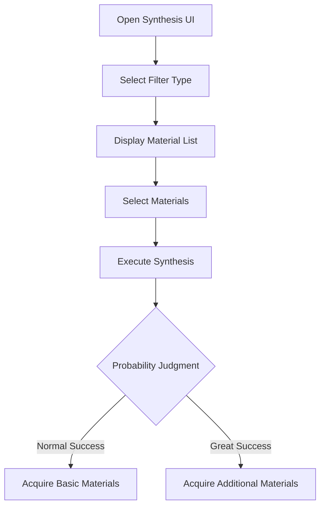

# Material Exchange and Synthesis System

## Overview

The material exchange and synthesis system is a core resource management system that allows players to utilize their owned materials to acquire new resources or obtain better materials. The exchange system is a card game method where materials are consumed to acquire special currencies like hearts or clovers, while the synthesis system combines materials to create new materials.

## Material Exchange System (Exchange System)

### System Purpose

- Utilize player's owned material cards to acquire hearts or clovers
- Provide card-flipping mini-game based on luck and choice
- Present efficient utilization methods for material cards

### Exchange Process

#### 1. Exchange Setup Stage

Players first set exchange conditions:


**Reward Types:**
- Heart: Used for employee stamina recovery
- Clover: Magic material used for special effects

**Quantity Setting:** Select 1-10 material cards for exchange

#### 2. Card Selection Game

When exchange begins, players select from 12 cards:

- **Card Types**: 4 different types of cards exist
- **Card Layout**: Arranged in `{1, 1, 1, 1, 1, 1, 1, 2, 2, 3, 4, 4}` format
- **Selection Process**: Player sequentially flips and confirms cards

#### 3. Reward Calculation

Final rewards are calculated using the following formula:

- **Minimum Reward**: `Base Reward × (1 + Card1 Bonus × 3)`
- **Maximum Reward**: `Base Reward × (1 + Card1 Bonus × 2 + Card2 Bonus × 2 + Card3 Bonus)`

### Core Implementation Files

**Key Methods:**
- UIExchangeSetting.mlua :: OnClickStartBtn() — Exchange start processing
- UIExchangeSetting.mlua :: CalculateReward() — Reward calculation
- ExchangeManager.mlua :: GiveReward() — Final reward distribution

<details>
<summary>Exchange System Core Methods</summary>

```lua
-- RootDesk/MyDesk/19. Exchange/UIExchangeSetting.mlua
method void OnClickStartBtn()
method number CalculateReward()
method void SetReward()

-- RootDesk/MyDesk/19. Exchange/ExchangeManager.mlua
method void GiveReward(number rewardCost, table resultTable, number ingredientCost, integer rewardType, integer ingredientCount)
```
</details>

## Material Synthesis System (Synthesis System)

### System Purpose

- Combine existing materials to acquire higher-grade materials
- Add game interest elements through probability-based synthesis
- Guide strategic material management by players

### Synthesis Process

#### 1. Material Filtering and Selection



#### 2. Filtering System

Materials for synthesis are filtered by the following conditions:

- **Stage Restriction**: Display only materials corresponding to player's current stage
- **Filter Type**: Each filter represents combination of specific basic materials and result materials
- **Tag Classification**: Classification by material tags (e.g., Meat, Vegetable, etc.)

#### 3. Synthesis Probability System

The following probability system is applied during synthesis:

- **Normal Success**: Acquire 1 material with base probability
- **Great Success**: Possibility to acquire additional materials with set probability

### Core Implementation Files

**Key Methods:**
- IngreSynthLogic.mlua :: Synth() — Synthesis execution
- IngreSynthLogic.mlua :: MakeIngrePool() — Synthesis material pool creation
- UIIngreSynthComponent.mlua :: SelectFilterType() — Filter type selection

<details>
<summary>Synthesis System Core Methods</summary>

```lua
-- RootDesk/MyDesk/20. IngreSynth/IngreSynthLogic.mlua
method void DrawIngreList()
method boolean IsChance()
method void Synth(Entity player, table selectedIngreIndexTable, integer filterType, string tagType)
method table MakeIngrePool(Entity player, integer filterType, string tagType)

-- RootDesk/MyDesk/20. IngreSynth/UIIngreSynthComponent.mlua
method void OpenUI()
method void SelectFilterType(integer filterType)
method void EnableNoticePanel(boolean enable, boolean isFull)
```
</details>

## System Integration and Connectivity

### Player Material Management

Both systems closely integrate with the `PlayerIngredient` component:

- **Material Card Addition/Removal**: Reflect exchange and synthesis results
- **Material Quantity Management**: Verify and handle maximum holding capacity
- **Material Type Management**: Manage distinction between buns and ingredients

### UI/UX Integration

#### Common UI Elements

- **Material Icon Display**: Consistent material image system
- **Quantity Display**: Improved readability through thousands separators
- **Color Coding**: Red display for insufficient resources
- **Animation**: Smooth transitions and feedback

#### Tutorial Integration

Both systems integrate with the tutorial system to provide player guidance:

- **ExchangeEnter**: Tutorial when entering exchange system
- **ExchangeSettingEnter**: Tutorial when entering exchange setup
- **IngreSynthEnter**: Tutorial when entering synthesis system

### Data Management

#### CSV Datasets

- **ExchangeBaseMoneyDataSet**: Exchange cost reference data
- **GameConfigData**: Exchange rate and bonus settings
- **IngredientData**: Material basic information
- **BunData**: Bun-related data

#### Dynamic Data Generation

- **Material Pool Creation**: List of acquirable materials matching stage and conditions
- **Probability Calculation**: Real-time success probability calculation
- **Reward Calculation**: Dynamic reward calculation based on selected cards and quantity

## Gameplay Strategy

### Exchange System Strategy

- **Card Type Understanding**: Understand bonus effects by each card type
- **Quantity Optimization**: Select optimal material quantity vs owned gold
- **Reward Type Selection**: Choose based on currently needed resources (Heart vs Clover)

### Synthesis System Strategy

- **Filter Utilization**: Select filters with high probability of desired materials
- **Material Combination**: Strategic approach for efficient material usage
- **Probability Management**: Control synthesis timing considering great success probability

## Code References

- `RootDesk/MyDesk/19. Exchange/ExchangeManager.mlua` - Exchange system core logic
- `RootDesk/MyDesk/19. Exchange/UIExchangeSetting.mlua` - Exchange setup UI
- `RootDesk/MyDesk/19. Exchange/UIExchange.mlua` - Exchange game UI
- `RootDesk/MyDesk/20. IngreSynth/IngreSynthLogic.mlua` - Synthesis system core logic
- `RootDesk/MyDesk/20. IngreSynth/UIIngreSynthComponent.mlua` - Synthesis UI
- `RootDesk/MyDesk/00. Player/PlayerIngredient.mlua` - Player material management
