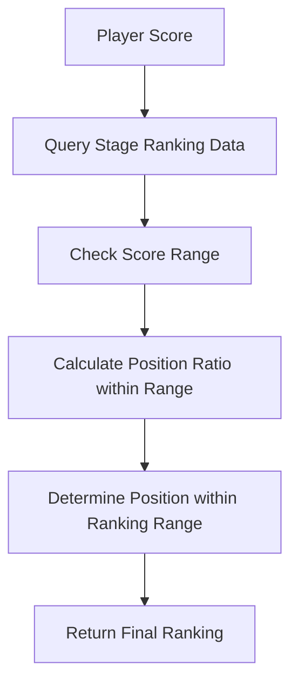

# Store Ranking System

The ChuChuBurger store ranking system is a competitive system that calculates and manages players' store operation performance rankings across the entire server. It ranks players from 1st to 10,000th place based on their highest revenue records and provides continuous competitive motivation through regular ranking announcements and reward distribution.

## System Overview

The store ranking system provides an objective evaluation of players' operational performance and enables comparison with other players.

### Core Features

- **Score-based Ranking**: Converts players' highest revenue records into scores
- **1~10,000 Position System**: Large-scale ranking system for the entire server
- **Monthly Announcements**: Regular ranking announcements and reward distribution every 10th of each month
- **Surrounding Store Simulation**: Provides competitive environment with AI stores
- **Re-evaluation System**: Allows immediate ranking recalculation by spending Gold

## Ranking Calculation System

### Score Calculation Criteria

Ranking scores are calculated based on:
- **Base Score**: `PlayerSettlement.BestRecipeEarnings` (highest revenue record)
- **Stage-based Adjustment**: Different score ranges for each stage

### Ranking Determination Algorithm

Rankings are calculated using the following formula:



**Calculation Process:**
1. Find the range where the player's score belongs
2. Calculate relative position within the range
3. Determine exact position within the ranking range
4. Clamp within 1~10,000 position range

## Core Components

### PlayerManagement

The core component that manages all management-related data including store rankings.

**Key Ranking-related Properties:**
- `StoreRanking`: Current store ranking
- `LastStoreRanking`: Previous ranking (for change tracking)
- `Surroundings`: Current surrounding store information
- `LastSurroundings`: Previous surrounding store information
- `RankingSpeech`: Speech that can be entered when achieving 1st place

**Core Methods:**
- `ExamStoreRanking()`: Calculate and update rankings
- `SetStoreRanking()`: Set rankings and distribute rewards
- `ReturnSurroundingsData()`: Generate surrounding store data
- `ReexamRanking()`: Immediate ranking re-evaluation

### StoreRankingDataSetLogic

The Logic component responsible for all ranking calculation-related logic.

**Core Functions:**
- `ReturnPlayerUserRankingScore()`: Calculate player ranking score
- `ReturnPlayerUserRankingByScore()`: Calculate ranking through score
- `ReturnRewardDataByRanking()`: Return reward data by ranking
- `ReturnRandomStoreNameOfGrade()`: Generate random store names by grade

## Ranking Announcement System

### Regular Announcements

Rankings are automatically announced every 10th of each month:

**Announcement Process:**
1. Calculate rankings based on current scores
2. Compare with previous rankings to check changes
3. Distribute rewards by ranking
4. Execute events based on ranking changes
5. Update surrounding store data

### Ranking Change Events

Different events are executed based on ranking changes:

- **1st Place Achievement**: "Y0004" event (special congratulations)
- **Ranking Up**: "Y0001" event (rise congratulations)
- **Ranking Maintained**: "Y0003" event (status quo)
- **Ranking Down**: "Y0002" event (decline notification)

## Reward System

### Rewards by Ranking

Different rewards are given for each ranking tier:
- **Reward Types**: Gold, diamonds, material boxes, etc.
- **Reward Scale**: Higher rankings receive larger rewards
- **Stage Adjustment**: Reward adjustment based on stage

### 1st Place Special Benefits

Special benefits when achieving 1st place:
- **Speaking Rights**: Can input speech visible to entire server
- **Special Rewards**: Highest grade reward items
- **Achievement**: 1st place-related achievements and badges

## Surrounding Store System

### Virtual Competitor Generation

Virtual stores around the player's ranking position are generated:

**Generation Rules:**
- Stores within ±4 positions of player ranking
- Appropriate score allocation by ranking
- Store name selection matching the grade
- Special handling of rivalry with 1st place

### Surrounding Store Data Structure

Each surrounding store includes the following information:
```
Ranking: StoreName,Score
```

Example: `1st: RivalStoreName,150000`

## Re-evaluation System

### Immediate Re-evaluation

Players can spend Gold to get their ranking re-evaluated at any time:

**Re-evaluation Conditions:**
- Current ranking must be 2nd place or lower
- Different re-evaluation costs by ranking
- Score improvement must exist for meaningful re-evaluation

**Re-evaluation Cost:**
- Higher costs for higher rankings
- Cost adjustment by stage

## UI System

### Ranking Display

Player ranking information is displayed in various UIs:
- Current ranking confirmation in main menu
- Detailed ranking information page
- Surrounding store list and comparison

### Red Dot System

Provides notifications when ranking improvement is possible:
- When holding scores capable of achieving 1st place
- When higher position than current ranking is achievable

## Achievement and Log Integration

### Achievement System

Various achievements related to rankings:
- `_AchievementTypeEnum.Ranking`: Highest ranking record
- 1st place achievement-related
- Ranking improvement-related achievements

### Log System

All ranking activities are recorded:
- Ranking change logs
- Reward receipt logs
- Re-evaluation logs

## Data Management

### Saved Data

The following ranking-related data is saved to DB:
- Current ranking and previous ranking
- Surrounding store information
- 1st place speech content
- Annual revenue records

### Synchronization

Ranking information is synchronized with the client in real-time:
- Automatic synchronization through `@TargetUserSync`
- Immediate UI updates when rankings change

## Stage-based Tier System

### Stage-based Ranking Data

Different ranking criteria are applied for each stage:
- Stage 1: Tutorial stage, ranking system inactive
- Stage 2+: Full ranking competition begins

### Reward Scaling

As stages progress:
- Higher score requirements
- Larger reward scales
- More intense competitive environment

## Strategic Elements

### Ranking Improvement Strategy

- **Revenue Optimization**: Updating highest revenue records is key
- **Timing**: Focused operations before month-end ranking announcements
- **Re-evaluation Usage**: Execute re-evaluation at appropriate times

### Competitive Psychology

- **Surrounding Store Analysis**: Understanding competitors' scores
- **Goal Setting**: Gradual ranking improvement plans
- **1st Place Challenge**: Challenge for server's highest honor

## Code References

- `RootDesk/MyDesk/00. Player/PlayerManagement.mlua :: ExamStoreRanking()` — Ranking calculation and update
- `RootDesk/MyDesk/00. Player/PlayerManagement.mlua :: SetStoreRanking()` — Ranking setting and reward distribution
- `RootDesk/MyDesk/00. Player/PlayerManagement.mlua :: ReturnSurroundingsData()` — Surrounding store data generation
- `RootDesk/MyDesk/13. StoreRanking/StoreRankingDataSetLogic.mlua :: ReturnPlayerUserRankingByScore()` — Score-based ranking calculation
- `RootDesk/MyDesk/13. StoreRanking/StoreRankingDataSetLogic.mlua :: ReturnRewardDataByRanking()` — Ranking-based reward data
- `RootDesk/MyDesk/13. StoreRanking/StoreRankingDataSetLogic.mlua :: RefreshRankingRedDot()` — Ranking notification management
- `RootDesk/MyDesk/13. StoreRanking/UIStoreRanking.mlua` — Ranking UI management
- `RootDesk/MyDesk/13. StoreRanking/StoreRankingRewardData.mlua` — Reward data structure
