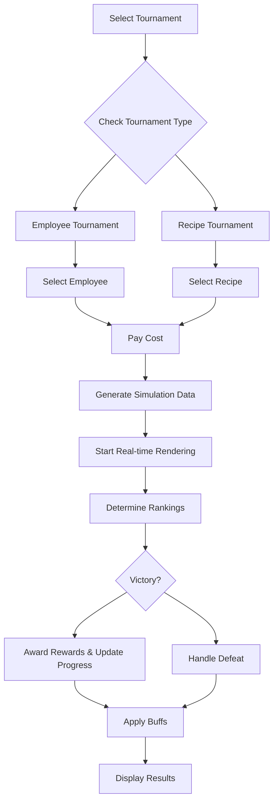

# Tournament System

The ChuChuBurger tournament system is a PvE competitive content where players compete with their employees or recipes against AI competitors to compete for rankings. It provides intuitive match results through real-time animation rendering and offers various rewards and buff effects upon victory.

## System Overview

The tournament system is divided into two types:

### Official Tournament (Official Trial)
- **Employee Tournaments**: 2 fixed employee type tournaments
- **Recipe Tournaments**: Stage-based recipe tournaments
- Progressive advancement system (grade-difficulty)
- Permanent buffs applied to recipes upon victory

### Unofficial Tournament (Unofficial Trial)
- **Employee Tournaments**: 1 random employee type tournament
- **Recipe Tournaments**: 2 random recipe tournaments  
- Daily reset providing new challenge tasks
- One-time reward system

## Core Operation Flow



## Core Components

### PlayerTrial

The core management component for the tournament system, handling all tournament-related logic.

**Key Properties:**
- `SelectedTrialId`: Selected tournament ID
- `SelectedEmployeeId`: Selected employee ID
- `SelectedRecipeId`: Selected recipe ID
- `TrialProgress`: Official tournament progress
- `UnofficialTrials`: Unofficial tournament list and completion status
- `ExEmployeeIds`: Employee records used in official employee tournaments

**Core Functions:**
- `SelectTrial()`: Tournament selection and cost verification
- `SetTrialData()`: Simulation data generation
- `EndTrial()`: Result processing and reward distribution
- `UpdateTrialProgress()`: Progress update

### TrialLogic

The Logic component responsible for the core calculation logic of tournaments.

**Key Functions:**
- `ReturnUserRank()`: Player ability-based ranking calculation
- `ReturnTrialScore()`: Score calculation by ranking
- `ReturnRandomRivalId()`: AI rival character selection
- `ReturnRandomBurgerIngreList()`: Random burger ingredient generation

### Data Structures

#### TrialData
Structure containing basic tournament information:
- `Target`: Tournament target ("Employee" or "Recipe")
- `TargetStat`: Target ability (for employees)
- `TargetType`: Target type (for recipes)
- `GradeData`: Grade-specific detailed data

#### TrialGradeData
Manages tournament information by grade:
- `Grade`: Grade (0~3)
- `MissionCount`: Mission quantity
- `DifficultyData`: Difficulty-specific detailed data

## Simulation System

### Data Generation Process

When a tournament begins, the following simulation data is generated:

1. **Character Data**: Player employee + AI rivals
2. **Ranking Data**: Ability-based rankings and scores
3. **Play Data**: Time-based progress status
4. **Material Data**: Ingredient list for burger making

### Ranking Determination Algorithm

Player rankings are determined by the following formula:
- **Employee Tournament**: Selected employee's corresponding stat level
- **Recipe Tournament**: Selected recipe's taste score

Compare abilities with requirements and determine ranking among 1st-3rd place through weight tables.

### Real-time Rendering

Tournament progress is visualized in real-time through TrialSimpleRenderLogic:
- Simultaneous progress in 3 layouts
- Burger making process animation
- Progress bar and ranking display
- Result display by ranking upon completion

## Reward System

### Official Tournament Rewards
- **Gold and Items**: Basic rewards based on grade and difficulty
- **Progress Advancement**: Unlock next stage
- **Recipe Buffs**: Permanent 15% bonus applied to corresponding recipe upon recipe tournament victory

### Unofficial Tournament Rewards
- **Gold and Items**: One-time rewards
- **Material Cards**: Acquire random ingredient or bun cards

## Progress System

### Official Tournament Progress

Official tournaments progress in "grade-difficulty" format:
```
0-1 → 0-2 → ... → 1-1 → 1-2 → ... → 3-maximum
```

Each stage must be cleared to unlock the next stage.

### Unlock Conditions
- **Employee Tournament**: Highest stat level employee meets requirements
- **Recipe Tournament**: Highest taste score recipe of corresponding type meets requirements

## UI System

### Tournament Selection UI
- Official/Unofficial tab separation
- Tournament information and reward preview
- Recommendation display and unlock status confirmation

### Employee/Recipe Selection UI
- Display owned employee/recipe list
- Show abilities and recommendation status
- Detailed information popup

### Simulation UI
- Simultaneous progress display in 3 layouts
- Real-time progress and rankings
- Character information display

### Results UI
- Final rankings and scores
- Reward list display
- Progress change guidance

## Achievement and Log Integration

### Achievement System
- Tournament victory count
- Official/Unofficial tournament victory counts by type
- Employee/Recipe tournament victory counts by type

### Badge System
- Tournament victory count badges

### Log System
All tournament activities are recorded in PlayerLog:
- Tournament start/end
- Selected employee/recipe information
- Match results and rewards

## Cost System

Each tournament participation consumes Gold:
- Costs increase based on grade and difficulty
- Different costs for Official/Unofficial tournaments
- Costs recorded as miscellaneous expenses in settlement system

## Daily Reset System

Unofficial tournaments reset to new challenge tasks daily:
- 1 employee tournament + 2 recipe tournaments
- Appropriate difficulty selection considering player's current abilities
- Completion status reset

## Strategic Elements

### Employee Selection Strategy
- Prioritize employees with high corresponding stats
- Used employees cannot be reused in official tournaments

### Recipe Selection Strategy  
- Prioritize recipes with high taste scores
- Strategic selection considering permanent buffs upon victory

### Progress Management
- Systematic challenges for stage-based unlocks
- Priority setting considering reward efficiency

## Code References

- `RootDesk/MyDesk/00. Player/PlayerTrial.mlua :: SelectTrial()` — Tournament selection and cost verification
- `RootDesk/MyDesk/00. Player/PlayerTrial.mlua :: SetTrialData()` — Simulation data generation
- `RootDesk/MyDesk/00. Player/PlayerTrial.mlua :: EndTrial()` — Result processing and reward distribution
- `RootDesk/MyDesk/10. Trial/TrialLogic.mlua :: ReturnUserRank()` — Player ranking calculation
- `RootDesk/MyDesk/10. Trial/TrialLogic.mlua :: ReturnTrialScore()` — Score calculation by ranking
- `RootDesk/MyDesk/10. Trial/Data/TrialData.mlua` — Tournament basic information structure
- `RootDesk/MyDesk/10. Trial/Data/TrialGradeData.mlua` — Grade-based tournament data
- `RootDesk/MyDesk/10. Trial/TrialSimpleRenderLogic.mlua :: EnterTrialRender()` — Simulation rendering
- `RootDesk/MyDesk/10. Trial/UIScript/UITrialSelect.mlua` — Tournament selection UI
