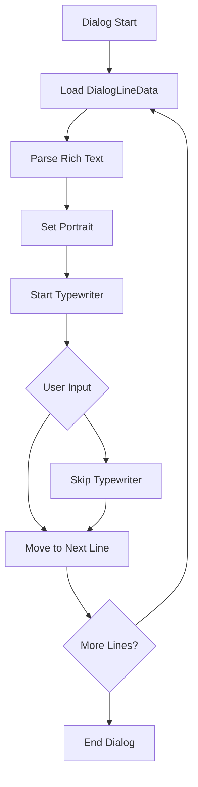

# Dialog and Story System

The ChuChuBurger dialog system is a core system responsible for the game's storytelling. It provides an immersive story experience through rich text parsing, typewriter effects, character-specific emotion expressions, choice branching, and more. It manages all text-based interactions from intro sequences to in-game events.

## System Overview

The dialog system is a comprehensive storytelling platform that goes beyond simple text display to integrate visual and audio effects.

### Core Features

- **Typewriter Effect**: Natural text animation with character-by-character appearance
- **Rich Text Support**: Text styling through HTML-style tags
- **Character System**: Various portrait types and emotion expressions
- **Choice Branching**: Dialog flow control based on user selections
- **Custom Avatar**: Distinctive visual representation of in-game characters

## Core Operation Flow



## Main Components

### EventDialogManager

Core component responsible for typewriter effects and rich text parsing.

**Main Properties:**
- `IsTyping`: Whether typing is in progress
- `OriginText`: Original text
- `interval`: Typing interval (0.02 seconds)
- `TargetTextComp`: Target text component

**Core Functions:**
- `ParseDialog()`: Rich text parsing (separating tags and plain text)
- `TypeWriter()`: Typewriter effect implementation
- `PlayTypeWriter()`: Start typewriter playback
- `SkipTypeWriter()`: Handle typewriter skip

### UIDialogLogic

Logic component that manages dialog lifecycle and flow.

**Main Functions:**
- `MakeDialog()`: Dialog start and initialization
- `GetNextLine()`: Move to next line
- `EndDialog()`: Dialog end and callback processing

### DialogDataLogic

Responsible for loading and managing dialog data.

**Data Management:**
- `TableData`: Line data for each dialog
- `FirstLineId`: First line ID for each dialog
- `CustomAvatarData`: Custom avatar information

## Data Structure

### DialogLineData

Structure containing all information for individual dialog lines.

**Main Properties:**
- `Id`: Line unique identifier
- `PortraitType`: Portrait type (sprite, MSW avatar, custom)
- `PortraitArgs`: Portrait-related arguments
- `Name`: Speaker name
- `Content`: Dialog content
- `ChildIds`: Next line/choice IDs
- `AvatarReactionType`: Avatar emotion/reaction type
- `SoundRuid`: Voice/sound effect RUID
- `IsPhoneCall`: Whether it's a phone call

### Portrait System

Supports various portrait types:

#### Sprite Type
- Uses static sprite images
- Automatic scaling by size
- Flip (horizontal mirror) support

#### MSW Avatar Type
- MapleStory Worlds avatar system integration
- Real-time emotion expression
- Face accessory support

#### Custom Avatar Type
- Game-specific custom characters
- Various expressions and poses
- Special effects and animations

## Rich Text System

### Tag Parsing

HTML-style tags are supported for text styling:

**Supported Tags:**
- `<color=#RRGGBB>`: Change text color
- `<b>`: Bold text
- `<i>`: Italic text
- `<size=XX>`: Change text size

**Parsing Process:**
1. Separate tags and plain text
2. Map tag information by index
3. Apply tags during typewriter playback

### Special Character Processing

- `\\n`: Automatic newline character conversion
- Unicode character support
- Multi-language text processing

## Typewriter Effect

### Implementation Principle

The typewriter effect is implemented as follows:

1. **Text Decomposition**: Break rich text into character units
2. **Tag Mapping**: Store rich tag information for each character  
3. **Sequential Display**: Show characters at regular intervals through timer
4. **Tag Application**: Apply corresponding rich tags when displaying characters

### User Interaction

- **Click to Skip**: Click during typing to instantly display full text
- **Auto Complete**: Allow progression to next step after typing completion
- **Voice Effects**: Keyboard typing sounds synchronized with typing

## Choice System

### Branch Structure

Dialogs support branching through choices:

```
DialogLine A
├── Choice 1 → DialogLine B
├── Choice 2 → DialogLine C  
└── Choice 3 → DialogLine D
```

### Choice Processing

- `ChildIds`: Available next lines
- `ChildContents`: Display text for each choice
- Story branching based on selection results
- Choice recording and callback processing

## Emotion Expression System

### Avatar Reactions

Visually express character emotions and situations:

- **Facial Changes**: Joy, sadness, surprise, anger, etc.
- **Pose Changes**: Appropriate postures and actions for situations
- **Special Effects**: Emotion emphasis through effects and particles

### Situational Presentation

- **Phone Calls**: Special UI layout
- **Important Moments**: Zoom in/out effects
- **Emotional Climax**: Screen shake or color changes

## Sound System

### Voice Support

- **Character-specific Voices**: Voice tones appropriate for each speaker
- **Emotion Expression**: Voice presentations matching situations
- **Typing Sound**: Synchronized with typewriter effect

### Sound Effects

- **Ambient Sound**: Background sounds appropriate for situations
- **Action Sound Effects**: For special actions or events
- **UI Sound**: Choice clicks, page navigation, etc.

## Special Features

### Intro System Integration

Special intro sequence at game start:

- **YouTube Video Playback**: External video content insertion
- **Camera Sequence**: In-game camera presentation
- **Fade Effects**: Natural screen transitions
- **Skip Function**: Allow skipping when desired by user

### Tutorial Integration

Tutorial dialogs based on game progress:

- **Situational Guide**: Explanations matching game situations
- **Interactive Elements**: Integration with actual game elements
- **Progress Tracking**: Tutorial completion status management

## Localization Support

### Multi-language System

- **Localization Keys**: Key-based text for multi-language support
- **Dynamic Text**: Real-time text generation based on game situations
- **Font Support**: Appropriate font application by language

### Text Formatting

- **Parameter Insertion**: Dynamic insertion of player names, numbers, etc.
- **Conditional Text**: Text changes based on game situations
- **Highlighting**: Emphasis on important words or phrases

## Performance Optimization

### Resource Management

- **Dynamic Loading**: Selectively load only needed dialogs
- **Caching**: Cache frequently used dialog data
- **Unloading**: Automatic release of used resources

### Rendering Optimization

- **Batching**: Rich text rendering optimization
- **Frame Rate**: Smooth playback of typewriter effect
- **Memory**: Efficient string processing

## Developer Tools

### Dialog Editor

Tools for writing and testing dialogs during development:

- **Visual Editing**: Visualize branch structure
- **Real-time Preview**: Instantly check modifications
- **Data Validation**: Automatic detection of missing links or errors

### Debugging Functions

- **Log System**: Track dialog progress
- **Status Check**: Monitor current dialog state
- **Performance Measurement**: Analyze typewriter performance

## Code References

- `RootDesk/MyDesk/08. Event/EventDialogManager.mlua :: ParseDialog()` — Rich text parsing
- `RootDesk/MyDesk/08. Event/EventDialogManager.mlua :: TypeWriter()` — Typewriter effect implementation  
- `RootDesk/MyDesk/15. Intro/Dialog/UIDialogLogic.mlua :: MakeDialog()` — Dialog start
- `RootDesk/MyDesk/15. Intro/Dialog/UIDialogLogic.mlua :: GetNextLine()` — Next line processing
- `RootDesk/MyDesk/15. Intro/Dialog/DialogDataLogic.mlua :: GetDialogTable()` — Dialog data load
- `RootDesk/MyDesk/15. Intro/Data/DialogLineData.mlua` — Dialog line data structure
- `RootDesk/MyDesk/15. Intro/Dialog/UIDialogPanel.mlua` — Dialog UI panel
- `RootDesk/MyDesk/15. Intro/Dialog/IntroOpeningCaption.mlua` — Opening caption system
- `RootDesk/MyDesk/15. Intro/Data/CustomAvatarData.mlua` — Custom avatar data
