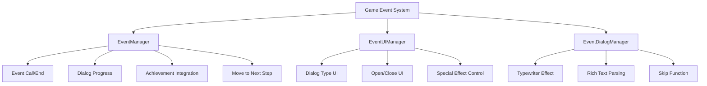
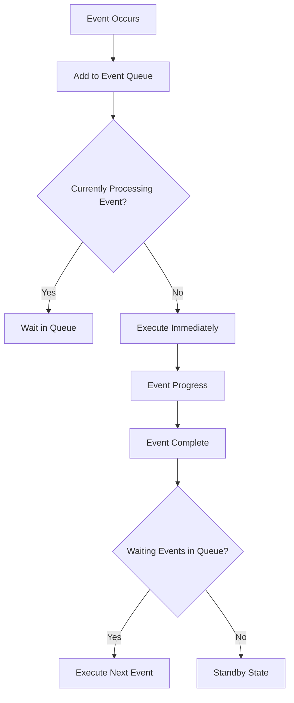

# Game Event System

The ChuChuBurger game event system is a comprehensive event processing system that systematically manages all stories, celebrations, and notifications that occur based on the player's game progress. Centered around **EventManager**, it integrates with **EventUIManager** and **EventDialogManager** to provide specialized UI and presentations for various event types.

## System Overview



## EventManager - Event System Management

### Core Properties

```28:27:RootDesk/MyDesk/08. Event/EventManager.mlua
property string CurrentEventGroupId = ""
property integer CurrentEventIndex = 0
property boolean CanMoveNext = false
property any CallbackAfterEndEvent = nil
```

**State Management:**
- `CurrentEventGroupId`: Currently active event group ID
- `CurrentEventIndex`: Current dialog index 
- `CanMoveNext`: Whether progression to next step is allowed
- `CallbackAfterEndEvent`: Callback function after event completion

### Event Call System

```28:42:RootDesk/MyDesk/08. Event/EventManager.mlua
method void CallEvent(string eventGroupId)
    local player = _UserService.LocalPlayer
    local eventGroupData = _EventDataSetLogic:GetEventGroupData(eventGroupId)
    
    player.TimeManager:TimeFlowsChange(false)
    
    self.CurrentEventGroupId = eventGroupId
    self.CurrentEventIndex = 1
    
    _UIGroupManager:EnableBackToLobbyBtn(false)
    
    self:CallDialog(self.CurrentEventGroupId, self.CurrentEventIndex)
end
```

**Event Start Process:**
1. Pause time flow
2. Set event group ID and index
3. Disable lobby return button
4. Call first dialog

### Event End Processing

```44:110:RootDesk/MyDesk/08. Event/EventManager.mlua
method void EndEvent()
    _UserService.LocalPlayer.PlayerEvent:RequestClearEventData(self.CurrentEventGroupId)
    
    local eventQueue = _UserService.LocalPlayer.PlayerEvent.EventQueue
    if #eventQueue > 0 then
        if eventQueue[1] == self.CurrentEventGroupId then
            _UserService.LocalPlayer.PlayerEvent:RequestRemoveFromEventQueue(eventQueue[1])
        end
            
        _TimerService:SetTimerOnce(function()
            _UserService.LocalPlayer.PlayerEvent:RequestRemoveAndCallEventFromEventQueue(eventQueue[1])
        end, 2)
        
    end
```

**Event End Process:**
1. Clear event data
2. Remove from event queue
3. Schedule next event auto-call
4. Process stage reward queue
5. Clean up special effects and restore UI

### Dialog Progress Control

```133:152:RootDesk/MyDesk/08. Event/EventManager.mlua
method void MoveNextDialog()
    if self.CanMoveNext == false then
        if _EventDialogManager.IsTyping == true then
            _EventDialogManager:SkipTypeWriter()
        end
        return
    end
    
    _SoundService:StopSound(_ResourceManager.SFXTable["Firework"])
    _EventUIManager.ConfettiSpawner.UIEventConfettiSpawner:EndSpawnConfetties()
    _LobbyEntityLogic.ExpansionParticles.Enable = false
    _EventUIManager:ResetEntitiesRUID()
    
    wait(0.02)
    
    self.CurrentEventIndex = self.CurrentEventIndex + 1
    self:CallDialog(self.CurrentEventGroupId, self.CurrentEventIndex)
end
```

## EventUIManager - UI Management and Control

### Support for Various Event Types

EventUIManager provides specialized UI for the following event types:

```47:104:RootDesk/MyDesk/08. Event/EventUIManager.mlua
method void SetDialogUI(EventDialogData dialogData)
    local dialogType = dialogData.EventDialogType
    local dialogEntity = self.DialogEntity[dialogType]
    
    if dialogType == _EventDialogTypeEnum.Congrats then
        dialogEntity.UIEventCongrats:Refresh(dialogData)
    elseif dialogType == _EventDialogTypeEnum.Fail then
        dialogEntity.UIEventFail:Refresh(dialogData)
    elseif dialogType == _EventDialogTypeEnum.InfoDialog then
        dialogEntity.UIEventInfoDialog:Refresh(dialogData)
    elseif dialogType == _EventDialogTypeEnum.GetItem then
        dialogEntity.UIEventGetItem:Refresh(dialogData)
    elseif dialogType == _EventDialogTypeEnum.NewEmployee then
        dialogEntity.UIEventNewEmployee:Refresh(dialogData)
    elseif dialogType == _EventDialogTypeEnum.OpenFunction then
        dialogEntity.UIEventOpenFunction:Refresh(dialogData)
    elseif dialogType == _EventDialogTypeEnum.StartTrend then
        dialogEntity.UIEventStartTrend:Refresh(dialogData)
    elseif dialogType == _EventDialogTypeEnum.EndTrend then
        dialogEntity.UIEventEndTrend:Refresh(dialogData)
    elseif dialogType == _EventDialogTypeEnum.TalkDialog then
        dialogEntity.UIEventTalkDialog:Refresh(dialogData)
    elseif dialogType == _EventDialogTypeEnum.RankingAnnounce then
        dialogEntity.UIEventRankingAnnounce:StartRender()
    elseif dialogType == _EventDialogTypeEnum.Tutorial then
        self.Dim.Enable = false
        local tutorialId = dialogData.TitleInfo[1]
        _TutorialManager:PlayTutorial(tutorialId)
    end
```

### Functions by Event Type

#### Congratulations Event (Congrats)
- **UIEventCongrats**: Achievement completion, level-up situations
- Celebration animations and visual effects
- Reward information display

#### Failure/Information Events (Fail/InfoDialog) 
- **UIEventFail**: Failure or problem situation notifications
- **UIEventInfoDialog**: General information delivery
- Clear situation explanation and solution proposals

#### Item Acquisition (GetItem)
- **UIEventGetItem**: New item or ingredient acquisition
- Visual item display
- Acquisition amount and effect guidance

#### Employee Related (NewEmployee/ResignEmployee)
- **UIEventNewEmployee**: New employee recruitment
- **UIEventResignEmployee**: Employee resignation processing
- Employee information and stats display

#### Function Unlock (OpenFunction)
- **UIEventOpenFunction**: New feature or UI unlock
- Feature icon and description display
- Usage instructions

#### Trend System (StartTrend/EndTrend)
- **UIEventStartTrend**: New trend start
- **UIEventEndTrend**: Trend end
- Trend effect and duration guidance

#### Ranking Announcement (RankingAnnounce)
- **UIEventRankingAnnounce**: Monthly ranking announcement
- Ranking change animation
- Reward and celebration presentation

## EventDialogManager - Text Processing and Presentation

### Typewriter Effect

```85:140:RootDesk/MyDesk/08. Event/EventDialogManager.mlua
method void TypeWriter(table plainText, table richMap, table richInfo, number interval, any outputCallback)
    local typedText = ""
    local currentIndex = 1
    
    local function step()
        if currentIndex > #table.keys(plainText) then 
            self:EndTypeWriter()
            return 
        end
        
        local drawData = plainText[table.keys(plainText)[currentIndex]]
        local drawIdx = drawData[1]
        local char = drawData[2]
```

**Typewriter Features:**
- Character-by-character gradual output
- Rich text tag support
- Built-in skip function
- Custom output speed setting

### Rich Text Parsing System

```19:83:RootDesk/MyDesk/08. Event/EventDialogManager.mlua
method table ParseDialog(string richText)
    local richInfo = {} 
    
    local richIdx = 1
    local isRichFormat = false
    local nowRichFormat = ""
    
    local isRichText = false
    local isRichEnd = false
    
    local index = 1
    local plainText = {} 
    local richMap = {} 
    
    local convertedText, _ = string.gsub(richText, "\\n", "\n")
```

**Rich Text Functions:**
- HTML-style tag support (`<color>`, `<size>`, `<b>`, etc.)
- Separate processing of plain text and tags
- Harmonious integration with typewriter effect
- Newline character processing

## Data Structure System

### EventDataSetLogic - Data Management

```18:44:RootDesk/MyDesk/08. Event/Data/EventDataSetLogic.mlua
method void LoadDataSet()
    table.clear(self.EventGroupData)
    local eGroupDataSet = _DataService:GetTable("EventGroupData")
    for i = 1, eGroupDataSet:GetRowCount() do
        local eGroupData = EventGroupData()
        eGroupData:Load(eGroupDataSet, i)
        
        if self.EventGroupData[eGroupData.Id] ~= nil then
            break
        end
    
        self.EventGroupData[eGroupData.Id] = eGroupData
    end
```

**Data Loading:**
- Convert CSV data to structures
- Manage data by event group
- NPC data integration

### EventDialogData Structure

```1:34:RootDesk/MyDesk/08. Event/Data/EventDialogData.mlua
script EventDialogData

property string EventGroupId = ""
property integer Index = 0
property string EventDialogType = ""
property table TitleInfo = {}
property table Arguments = {}
property boolean IsReferKey = false
property string DialogInfoKey = ""

method void Load(any rowData, string eventGroupId)
    self.EventGroupId = eventGroupId
    
    self.Index = tonumber(rowData:GetItem("Index"))
    self.EventDialogType = rowData:GetItem("EventDialogType")
    self.TitleInfo = _UtilLogic:Split(rowData:GetItem("TitleInfo"), ",")
    self.DialogInfoKey = rowData:GetItem("DialogInfoKey")
```

**Dialog Data Structure:**
- Event group and order information
- Dialog type classification
- Title information and parameter management
- Multi-language key and reference key processing

## Event Queue System

### Sequential Event Processing

The event system processes multiple simultaneous events sequentially through a queue:



## Special Effects and Presentation System

### Visual Effects

- **Confetti Effect**: Paper confetti effect during celebration events
- **Particle System**: Particle effects during expansion or upgrades  
- **Sound Effects**: Situational custom sound playback
- **Camera Control**: Camera movement during specific events

### Animation Presentation

- **UI Tween Animation**: Smooth UI transitions
- **Scale/Fade Effects**: Emphasis effects and entrance/exit
- **Bounce Effects**: Emphasis on important information

## Multi-language Support

### Localization System Integration

```72:102:RootDesk/MyDesk/08. Event/Data/EventDataSetLogic.mlua
method string ReturnDialogText(EventDialogData dialogData)
    local dialogInfo = _GetLocalizationTextLogic:GetText(dialogData.DialogInfoKey)
    
    if dialogData.IsReferKey == true then
        local referKey = _UserService.LocalPlayer.PlayerEvent.EventReferKey[dialogData.EventGroupId]
        if _UtilLogic:IsNilorEmptyString(referKey) == false then
            dialogInfo = _LocalizationService:GetTranslatorForLocale(_LocalizationService.CurrentLocaleId):GetTextFormat(dialogData.DialogInfoKey, referKey)
        end
        
    else
        if #dialogData.Arguments > 0 then
            local arguments = {}
            for i, argument in pairs(dialogData.Arguments) do
                local referKeyText
                if argument == "RankingIndex" then
                    referKeyText = _UserService.LocalPlayer.PlayerEvent.EventReferKey[dialogData.EventGroupId]
                elseif argument == "RivalStoreName" then
                    local stageData = _StageDataSetLogic:GetStageData(_UserService.LocalPlayer.PlayerStage.NowStage)
                    referKeyText = _GetLocalizationTextLogic:GetText(stageData.RivalStoreNameKey)
                else
                    referKeyText = _GetLocalizationTextLogic:GetReferKeyText(argument)
                end
```

**Multi-language Features:**
- Key-based text management
- Dynamic parameter replacement (player name, scores, etc.)
- Context-specific text through reference keys
- Real-time language switching support

## Achievement and Progress Integration

### PlayerEvent Integration

The event system closely integrates with player progress:

- **Achievement Check**: Celebration events occur when specific conditions are met
- **Tutorial Integration**: Tutorial events based on game progress
- **Stage Progress**: Related events during stage clear and movement
- **Function Unlock**: Guidance events when new features become available

## Performance Optimization

### Efficient Resource Management

- **Lazy Loading**: Load event resources only when needed
- **Entity Recycling**: Efficient reuse of UI entities
- **Memory Cleanup**: Release unnecessary resources after event completion
- **Timer Management**: Prevent memory leaks through proper timer cleanup

## Code References

### Core Event Management
- `RootDesk/MyDesk/08. Event/EventManager.mlua :: CallEvent()` — Event call and start
- `RootDesk/MyDesk/08. Event/EventManager.mlua :: EndEvent()` — Event end processing
- `RootDesk/MyDesk/08. Event/EventManager.mlua :: MoveNextDialog()` — Next dialog progress
- `RootDesk/MyDesk/08. Event/EventManager.mlua :: CallDialog()` — Dialog call

### UI Management System
- `RootDesk/MyDesk/08. Event/EventUIManager.mlua :: SetDialogUI()` — Dialog type UI setup
- `RootDesk/MyDesk/08. Event/EventUIManager.mlua :: Open()` — Open event UI
- `RootDesk/MyDesk/08. Event/EventUIManager.mlua :: Close()` — Close event UI

### Text Processing
- `RootDesk/MyDesk/08. Event/EventDialogManager.mlua :: TypeWriter()` — Typewriter effect
- `RootDesk/MyDesk/08. Event/EventDialogManager.mlua :: ParseDialog()` — Rich text parsing
- `RootDesk/MyDesk/08. Event/EventDialogManager.mlua :: SkipTypeWriter()` — Skip text output

### Data Management
- `RootDesk/MyDesk/08. Event/Data/EventDataSetLogic.mlua :: LoadDataSet()` — Load event data
- `RootDesk/MyDesk/08. Event/Data/EventDataSetLogic.mlua :: ReturnDialogText()` — Return dialog text
- `RootDesk/MyDesk/08. Event/Data/EventDialogData.mlua :: Load()` — Dialog data structure

### Event Type UI
- `RootDesk/MyDesk/08. Event/DialogTypeModel/UIEventCongrats.mlua` — Congratulations event UI
- `RootDesk/MyDesk/08. Event/DialogTypeModel/UIEventGetItem.mlua` — Item acquisition UI
- `RootDesk/MyDesk/08. Event/DialogTypeModel/UIEventOpenFunction.mlua` — Function unlock UI
- `RootDesk/MyDesk/08. Event/DialogTypeModel/UIEventRankingAnnounce.mlua` — Ranking announcement UI

---

This document describes the comprehensive structure and functionality of the ChuChuBurger game event system. It demonstrates how specialized processing for various event types, visual presentations, multi-language support, and other features are integrated to provide players with an immersive story experience.
