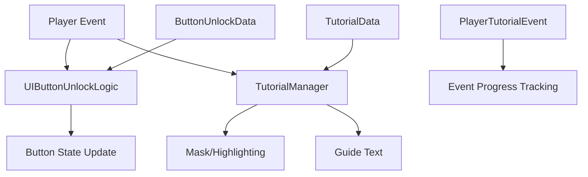

# Tutorial Guide System

The ChuChuBurger tutorial system is a comprehensive system that guides new players through step-by-step learning of the game's core functions.

## System Overview

The tutorial system consists of two main core components:
1. **TutorialManager**: Tutorial progress and UI masking/highlighting control
2. **UIButtonUnlockLogic**: UI button lock/unlock management based on game progress

### System Structure



## TutorialManager

Core component responsible for visual guidance in tutorials.

### Main Functions

#### 1. Find Target Entity
Precisely locates specific UI elements or game objects as targets.

#### 2. UI Mirroring
- Divides screen into 4 areas (TopLeft, TopRight, BottomLeft, BottomRight)
- Masks areas other than target UI elements to improve focus

#### 3. Mask/Highlighting
- **Mask**: Darken areas that are not targets
- **Highlighting**: Visually emphasize target elements

#### 4. Guide Text Display
- Multi-language supported guide text
- Alignment options: ScreenTopCenter, TopLeft, TopRight, BottomLeft, BottomRight
- Fine position adjustment through offset

#### 5. Force Action Processing
- Block progression until player completes specific actions
- Automatic progression to next step through callback function

### Tutorial Data Structure

The TutorialData structure defines settings for each tutorial step:

**Main Properties:**
- `Highlight`: Whether highlighting is enabled
- `Mask`: Whether masking is enabled  
- `TargetPath`: Target UI path
- `AutoNext`: Automatic progression to next step
- `TouchAnywhere`: Allow touch anywhere on screen
- `ForceTo/funcCallback`: Force action and callback processing

<details>
<summary>TutorialData Structure Details</summary>

```lua
-- RootDesk/MyDesk/08. Event/Tutorial/TutorialData.mlua
property string ForceTo = ""
property string funcCallback = ""
property table callbackParams = {}
property boolean FuncOnTouch = false
```
</details>

### Tutorial Progress Method

Tutorials are executed sequentially through the PlayTutorial() method:

1. **Data Validation**: Load tutorial data for the corresponding ID from TutorialDataSetLogic
2. **Target Check**: Search for UI entity to highlight using GetTargetEntity()  
3. **Apply Masking**: Darken areas other than target

<details>
<summary>PlayTutorial Method Implementation</summary>

```lua
-- RootDesk/MyDesk/08. Event/Tutorial/TutorialManager.mlua :: PlayTutorial()
method void PlayTutorial(string id)
    local tutorialData = _TutorialDataSetLogic:GetTutorialData(id)
    if tutorialData == nil then 
        self:HideMask()
        return
    end
    
    if self.target ~= nil then 
        return
    end
    
    local target = self:GetTargetEntity(tutorialData)
    if isvalid(target) == false then 
        self:HideMask()
        return
    end
```
</details>

## UIButtonUnlockLogic

System that manages UI button activation/deactivation based on game progress.

### Unlock Condition Types

#### 1. Event-based Unlock

The IsButtonUnlocked() method checks for specific event occurrence to activate buttons:

`return player.PlayerEvent:IsEventOccured(unlockData.EventCondition)`

<details>
<summary>Event-based Unlock Logic</summary>

```lua
-- RootDesk/MyDesk/08. Event/UIButtonUnlockLogic.mlua :: IsButtonUnlocked()
local unlockData = self:GetButtonUnlockData(id)
if unlockData.ConditionType == "Event" then
    if _UtilLogic:IsNilorEmptyString(unlockData.EventCondition) then
        return true
    end
    
    return player.PlayerEvent:IsEventOccured(unlockData.EventCondition)
```
</details>

#### 2. Achievement-based Unlock
Button activation upon specific achievement completion

#### 3. Upgrade-based Unlock
Button activation upon reaching specific upgrade level

### Special Condition Processing

Special unlock conditions after Stage 1:

- **VIP Orders**: Requires Management Level 1 or higher
- **Scooter Dispatch**: Requires AutoTrainingOpen upgrade level 1 or higher
- **Material Exchange**: Requires T6003 tutorial event completion 
- **Material Synthesis**: Requires T7001 tutorial event completion

<details>
<summary>Stage-specific Special Condition Logic</summary>

```lua
-- RootDesk/MyDesk/08. Event/UIButtonUnlockLogic.mlua :: IsButtonUnlocked()
if player.PlayerStage.NowStage > 1 then
    if id == _ButtonUnlockEnum.MainMenuVIPOrder then
        return player.PlayerManagement.ManagementLevel >= 1 
        
    elseif id == _ButtonUnlockEnum.MainMenuAutoTraining then
        return _UpgradeDataSetLogic:ReturnCurrentPlayerLevel(player, _UpgradeTypeEnum.AutoTrainingOpen) >= 1 
    
    elseif id == _ButtonUnlockEnum.MainMenuExchange then
        return  player.PlayerEvent:IsEventOccured("T6003") 
        
    elseif id == _ButtonUnlockEnum.MainMenuIngreSynth then
        return player.PlayerEvent:IsEventOccured("T7001")
```
</details>

### Button Status Update

The SetButtonsUnlock() method iterates through all registered buttons to update unlock status:

1. **Check Conditions**: Verify activation conditions for each button using IsButtonUnlocked()
2. **Get Entity**: Reference actual UI button entity through EntityPath
3. **Apply Status**: Enable entire entity or only ButtonComponent based on IsFull option

<details>
<summary>Button Status Update Logic</summary>

```lua
-- RootDesk/MyDesk/08. Event/UIButtonUnlockLogic.mlua :: SetButtonsUnlock()
method void SetButtonsUnlock()
    local player = _UserService.LocalPlayer
    for id, _ in pairs(self.ButtonUnlockData) do
        local unlockData = self:GetButtonUnlockData(id)
        local isUnlock = self:IsButtonUnlocked(id, player)
        
        local entity = _EntityService:GetEntityByPath(unlockData.EntityPath)
        
        if unlockData.IsFull then
            entity.Enable = isUnlock
        else
            if isvalid(entity.ButtonComponent) then
                entity.ButtonComponent.Enable = isUnlock
            end
```
</details>

## Player Tutorial Event

Component that manages player tutorial progress status.

### Main Properties

PlayerTutorialEvent manages tutorial progress status with synchronization:

- **TutorialEvents**: Completion status table for each tutorial event ID
- **IsSkipTutorial**: Flag for skipping entire tutorial

<details>
<summary>PlayerTutorialEvent Property Definitions</summary>

```lua
-- RootDesk/MyDesk/00. Player/PlayerTutorialEvent.mlua
@TargetUserSync
property SyncTable<string, boolean> TutorialEvents

@TargetUserSync
property boolean IsSkipTutorial = false
```
</details>

### Skip Function

The entire tutorial can be skipped using the SetIsSkipTutorial() method:

`if bool == true then self:ForceSetTutorialEventsOccured() end`

When skip is enabled, ForceSetTutorialEventsOccured() is called to set all tutorial events to completed status.

<details>
<summary>Tutorial Skip Logic</summary>

```lua
-- RootDesk/MyDesk/00. Player/PlayerTutorialEvent.mlua :: SetIsSkipTutorial()
method void SetIsSkipTutorial(boolean bool)
    if self.IsSkipTutorial == bool then
        return
    end
    
    self.IsSkipTutorial = bool
    
    if bool == true then
        self:ForceSetTutorialEventsOccured()
    end
end
```
</details>

## Tutorial Event Categories

### Basic Gameplay Tutorials
- `T1003`: First customer purchase processing
- `T1004`: Tip acquisition system
- `T1005`: Tip storage upgrade

### Menu Creation Tutorials
- `T1101`: Customer feedback (chicken tag)
- `T1102`: Recipe creation start
- `T1103`: Recipe creation completion

### Employee Management Tutorials
- `T1006`: Employee hiring system
- `T1301`: Reputation system introduction
- `T1701`: Employee stat deficiency situation
- `T1702`: Employee upgrade system

### Dispatch System Tutorials
- `T1302`: Dispatch setup entry
- `T1303`: Dispatch system entry
- `T1304`: Dispatch hint acquisition
- `T1305`: Dispatch spot selection

### Advanced Function Tutorials
- `T1501`: Tournament system
- `T1601`: VIP order system
- `T6003`: Material exchange system
- `T7001`: Material synthesis system

## Implementation Features

### Step-by-step Guide
Each tutorial is divided into multiple steps and progresses sequentially.
- Example: `T1101_1` → `T1101_2` → ... → `T1101_12`

### Skip Function
Tutorials can be skipped in development environments or by player choice.

### Progress Tracking
All tutorial events are stored in database and managed continuously.

## Code References

**Core Files:**
- `RootDesk/MyDesk/08. Event/Tutorial/TutorialManager.mlua` — Tutorial UI control
- `RootDesk/MyDesk/08. Event/UIButtonUnlockLogic.mlua` — Button unlock logic
- `RootDesk/MyDesk/08. Event/Tutorial/TutorialDataSetLogic.mlua :: LoadDataSet()` — Tutorial data load
- `RootDesk/MyDesk/00. Player/PlayerTutorialEvent.mlua :: SetIsSkipTutorial()` — Tutorial skip processing
- `RootDesk/MyDesk/08. Event/Tutorial/TutorialData.mlua` — Tutorial data structure
- `RootDesk/MyDesk/08. Event/Data/ButtonUnlockData.mlua` — Button unlock data structure
- `RootDesk/MyDesk/08. Event/Tutorial/TutorialEventEnum.mlua` — Tutorial event ID definitions
- `RootDesk/MyDesk/08. Event/Data/ButtonUnlockEnum.mlua` — Button ID definitions

**Data Files:**
- `RootDesk/MyDesk/08. Event/Tutorial/TutorialData.csv` — Tutorial scenario data
- `RootDesk/MyDesk/08. Event/Data/ButtonUnlockData.csv` — Button unlock condition data
