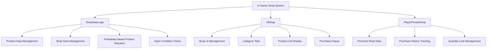
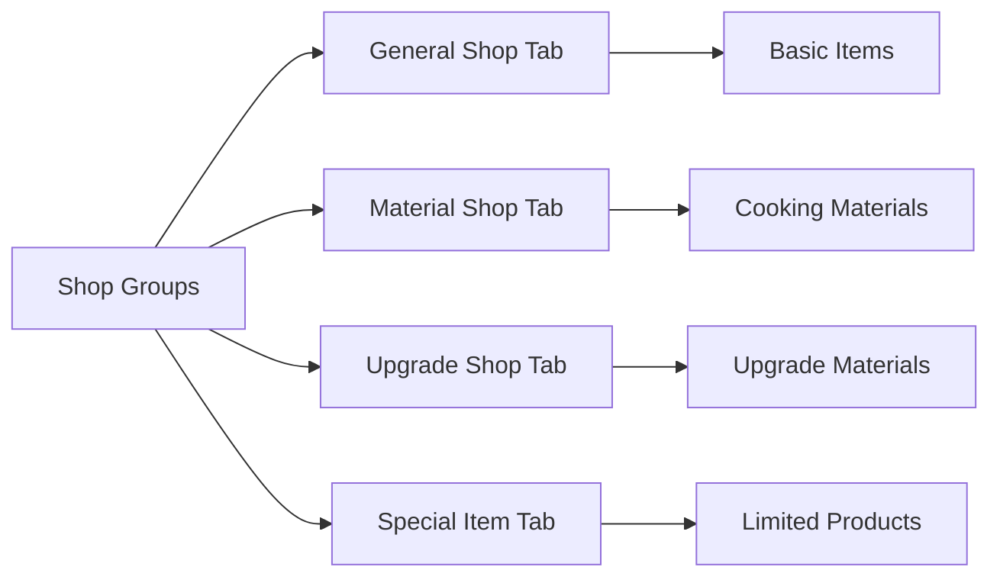
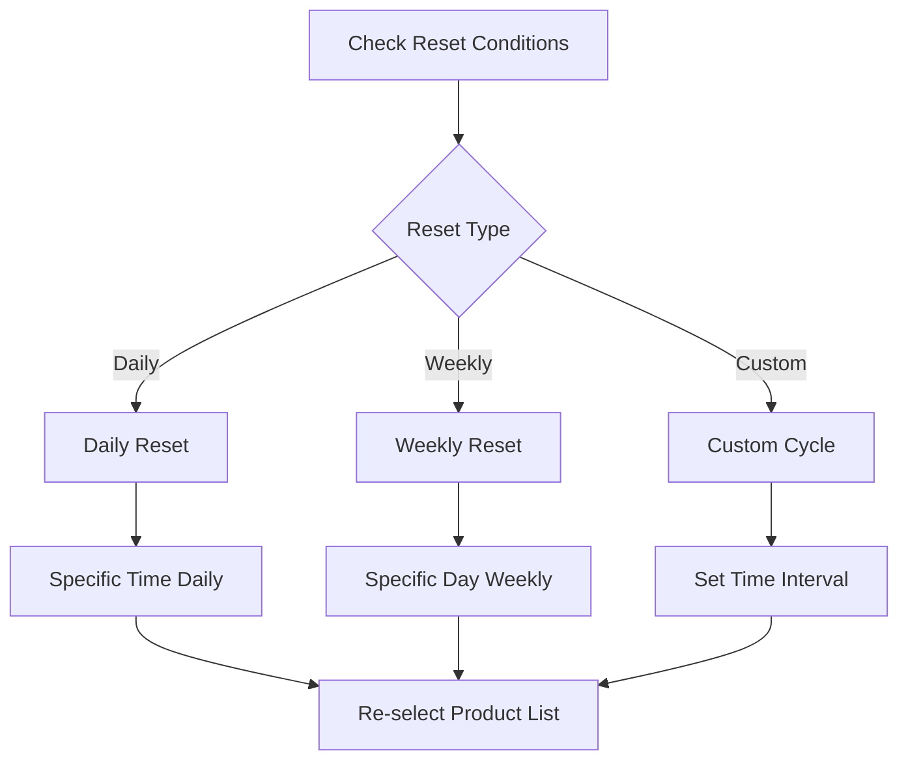
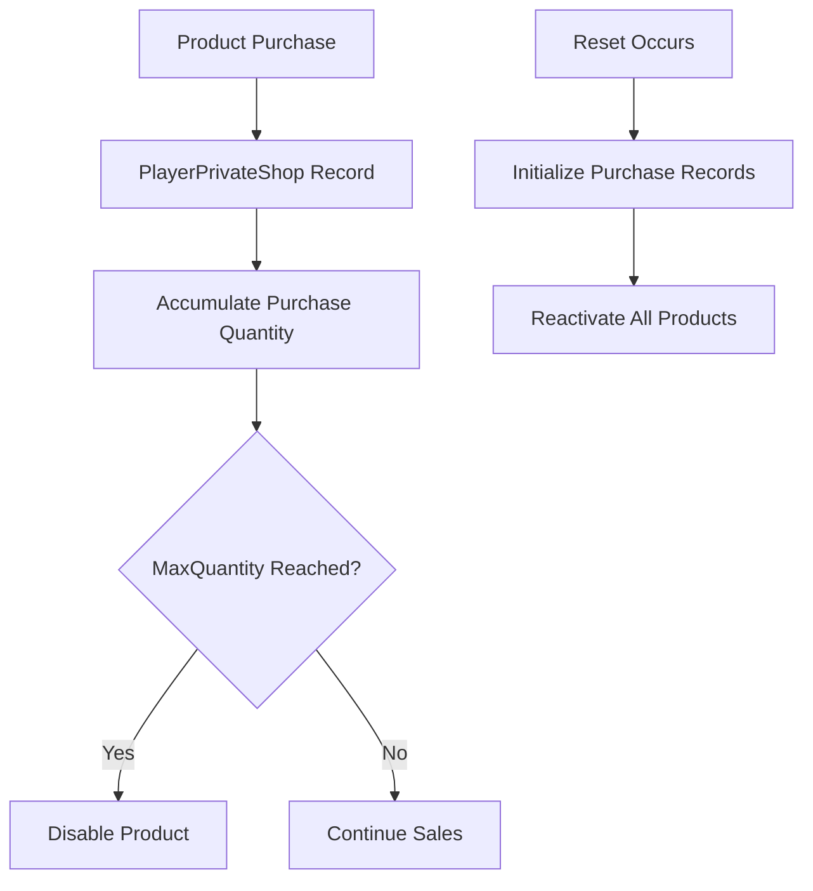

# In-Game Shop System

The ChuChuBurger in-game shop system is the basic shop system where players can purchase various items, materials, upgrade materials, and other items needed for game progression. Centered around **ShopDataLogic**, it systematically manages product data, shop data, purchase processing, system resets, quantity limitations, and provides dynamic shop operations through probability-based product selection and open conditions.

## System Overview



## ShopDataLogic - Data Management Core

### Data Structure Management

The LoadProductData() method loads CSV datasets and converts them into memory structures:

1. **Data Initialization**: Clear ProductData and ProductIdsByShopId tables
2. **CSV Iteration**: Convert each row from ShopProductDataSet to ShopProductData objects
3. **Indexing**: Categorize by product ID and shop ID for fast access support

<details>
<summary>Product Data Loading Implementation</summary>

```lua
-- RootDesk/MyDesk/Shop/ShopDataLogic.mlua :: LoadProductData()
method void LoadProductData()
    table.clear(self.ProductData)
    table.clear(self.ProductIdsByShopId)
    local productDataSet = _DataService:GetTable("ShopProductDataSet")
    for i = 1, productDataSet:GetRowCount() do
        local productData = ShopProductData()
        productData:LoadFrom(productDataSet, i)
        if self.ProductData[productData.ProductId] ~= nil then
            break
        end
    
        self.ProductData[productData.ProductId] = productData
        
        if self.ProductIdsByShopId[productData.LinkedShopId] == nil then
            self.ProductIdsByShopId[productData.LinkedShopId] = {}
        end
        
        table.insert(self.ProductIdsByShopId[productData.LinkedShopId], productData.ProductId)
    end
end
```
</details>

**Core Properties:**
- `ProductData`: Overall product data management
- `ProductIdsByShopId`: Product ID list by shop
- `ShopData`: Shop basic information
- `ShopIdsByShopGroup`: Shop ID list by shop group

### Probability-based Product Selection System

The PickProductsByShopId() method probabilistically selects products to display in shops:

1. **Independent Type**: Each product independently determines display probability
2. **Dependent Type**: Weight-based selection within the same PutoutType
3. **RandomBox Utilization**: RandomBox system for fair probability calculation

Core Logic: `if product.PutoutValue > randomValue then table.insert(picked, id) end`

<details>
<summary>Product Selection Algorithm Implementation</summary>

```lua
-- RootDesk/MyDesk/Shop/ShopDataLogic.mlua :: PickProductsByShopId()
method table PickProductsByShopId(string shopId)
    local candidateProduct = self.ProductIdsByShopId[shopId]
    local picked = {}
    
    local dependetCandidate = {}
    for i,id in ipairs(candidateProduct) do
        local product = self:GetShopProductData(id)
        if product == nil then
            continue
        end
        if product.PutoutType == "Independent" then
            local randomValue = _UtilLogic:RandomIntegerRange(0, 100000) 
            if product.PutoutValue > randomValue then
                table.insert(picked, id)
            end
        elseif product.PutoutType:len() > 0 then
            if dependetCandidate[product.PutoutType] == nil then
                dependetCandidate[product.PutoutType] = RandomBox()
            end 
            local randomBox = dependetCandidate[product.PutoutType]
            randomBox:AddItem(product.PutoutValue, product.ProductId)
        end
    end
    
    for k,v in pairs(dependetCandidate) do
        local pickedId = v:Pick()
        table.insert(picked, pickedId)
    end
```
</details>

**Product Selection Methods:**
- **Independent**: Independent selection with individual probabilities
- **Dependent Selection**: Weight-based selection within same type
- **RandomBox System**: Accurate drawing through probability tables

## Data Structure System

### ShopData - Shop Basic Information

The ShopData structure defines basic shop settings:

<details>
<summary>ShopData Structure Definition</summary>

```lua
-- RootDesk/MyDesk/Shop/ShopData.mlua
script ShopData

property string ShopId = ""
property string ShopGroup = ""
property string CurrencyType = ""
property string SystemResetType = ""
property integer SystemResetValue = 0
property integer CustomResetCost = 0
property integer CustomResetCostAdd = 0
property string ShopIconRUID = ""
property string OpenCondition = ""
property string OpenConditionValue = ""
property string CategoryNameKey = ""
```
</details>

**Key Properties:**
- `ShopId`: Shop unique identifier
- `ShopGroup`: Shop group (category tabs)
- `CurrencyType`: Payment currency type
- `SystemResetType/Value`: Automatic reset conditions
- `CustomResetCost`: Manual reset cost
- `OpenCondition`: Shop open conditions

### ShopProductData - Product Information

The ShopProductData structure defines all properties of individual products:

<details>
<summary>ShopProductData Structure Definition</summary>

```lua
-- RootDesk/MyDesk/Shop/ShopProductData.mlua
script ShopProductData

property string ProductId = ""
property string LinkedShopId = ""
property string PutoutType = ""
property number PutoutValue = 0
property integer SortingOrder = 0
property integer Price = 0
property string ItemId = ""
property integer ItemCount = 0
property integer MaxQuantity = 0
property string PurchaseCondition = ""
property integer PurchaseConditionValue = 0
property string UnlockCondition = ""
property integer UnlockConditionValue = 0
property number SaleRate = 0
```
</details>

**Product Properties:**
- `ProductId`: Product unique ID
- `LinkedShopId`: Belonging shop ID
- `PutoutType/Value`: Display probability type and value
- `Price/ItemId/ItemCount`: Price and product information
- `MaxQuantity`: Purchase quantity limit
- `PurchaseCondition`: Purchase conditions
- `SaleRate`: Discount rate

## UIShop - Shop Interface

### Shop Open System

The Open() method opens shop groups and filters accessible shops:

1. **Group Search**: Query shop list of corresponding group with GetShopIdsByShopGroup()
2. **Accessibility Check**: Verify open conditions of each shop with CheckCanOpenShop()
3. **Sorting**: Reverse order by shop ID to prioritize newer shops

Core Filtering Logic: `if _ShopDataLogic:CheckCanOpenShop(shopId, player) then`

<details>
<summary>Shop Open Logic Implementation</summary>

```lua
-- RootDesk/MyDesk/Shop/UIShop.mlua :: Open()
method void Open(string shopGroupId, string openShopId)
    self:ClearData()    
    self.Entity.Parent.Enable = true
    
    local shopIds = _ShopDataLogic:GetShopIdsByShopGroup(shopGroupId)
    if shopIds == nil or #shopIds == 0 then
        self:Close()
        return
    end
    
    local player = _UserService.LocalPlayer
    local canOpenIds = {}
    for i, shopId in ipairs(shopIds) do
        if _ShopDataLogic:CheckCanOpenShop(shopId, player) then
            table.insert(canOpenIds, shopId)
        end
    end
    
    table.sort(canOpenIds, function(a, b) 
        return tonumber(a) > tonumber(b)
    end)
```
</details>

**Open Process:**
1. Query shop list by shop group
2. Filter openable shops by checking player conditions
3. Sort by shop ID order
4. Create and initialize UI menu renderer
5. Stop time flow and activate UI

### Tab-based Navigation

Shops are displayed as tabs separated by groups:



### Product Rendering System

- **UIShopProductRenderer**: Individual product display
- **UIShopMenuRenderer**: Shop tab menu management
- **UIShopPurchasePopup**: Purchase confirmation popup

## Reset System

### Automatic Reset



**SystemResetType Types:**
- **Daily**: Reset at specific time daily
- **Weekly**: Reset on specific day weekly
- **Custom**: Reset at set intervals
- **Manual**: Only manual reset possible

### Manual Reset

Players can spend Gold to immediately reset shops:

- **CustomResetCost**: Base reset cost
- **CustomResetCostAdd**: Additional cost based on reset count
- **Progressive Cost Increase**: Cost increase to prevent abuse

## Purchase Condition System

### Unlock Conditions (UnlockCondition)

Conditions for products to be displayed in shops:
- **Level Conditions**: Player or management level restrictions
- **Achievement Conditions**: Specific achievement required
- **Stage Conditions**: Specific stage progress required
- **Event Conditions**: Specific event occurrence required

### Purchase Conditions (PurchaseCondition)

Additional verification conditions when purchasing products:
- **Stock Conditions**: Player inventory space
- **Prerequisite Conditions**: Need to own other items
- **Time Conditions**: Purchase only available at specific times
- **Count Conditions**: Daily/weekly purchase limits

## Quantity Limit System

### MaxQuantity Management

Set maximum purchasable quantity for each product:
- **0**: Unlimited purchase possible
- **Positive**: Purchase only up to corresponding quantity
- **Individual Tracking**: Purchase records managed in PlayerPrivateShop

### Stock Tracking



## Currency System Integration

### CurrencyType Support

Payment possible with various in-game currencies:
- **Gold**: Basic game currency
- **Diamond**: Premium currency
- **Heart**: Special currency
- **Clover**: Training-related currency
- **Other Materials**: Exchange with specific materials

### Discount System

- **SaleRate**: Set discount rate per product (0.0 ~ 1.0)
- **Limited Time Discount**: Applied only during specific periods
- **Conditional Discount**: Additional discount when specific conditions met

## Shop Group Specialization

### General Shop
- **Basic Consumables**: Lunch boxes, hearts, gold, etc.
- **Always Available**: Basic items always accessible
- **Low Prices**: Essential items for game progression

### Material Shop
- **Cooking Materials**: Ingredients for burger making
- **Buns and Sauces**: Various bun and sauce materials
- **Grade-based Materials**: Various grades from 1-star to 5-star

### Upgrade Shop
- **Experience Items**: Items for employee leveling
- **Upgrade Materials**: Materials for facility upgrades
- **Special Materials**: Materials exclusively for advanced upgrades

### Special Item Shop
- **Limited Sales**: Appears only under specific conditions
- **Premium Items**: Rare and powerful effects
- **Event Products**: Items related to special events

## Performance Optimization

### Data Caching
- **Product Data**: Cache in memory during loading
- **Filtering Results**: Temporarily store filtering results by conditions
- **UI Rendering**: Reuse identical product information

### Dynamic Loading
- **Load When Needed**: Process data only when shop opens
- **Delayed Rendering**: Render only necessary products when scrolling
- **Memory Cleanup**: Release unnecessary data when shop closes

## Log and Tracking System

### Purchase Logs
- **Purchase Records**: Detailed record of all purchase history
- **Payment Tracking**: Record used currency and quantity
- **Pattern Analysis**: Collect player purchase pattern data

### Shop Operation Data
- **Display Records**: What products were displayed when
- **Reset Records**: Record automatic/manual reset occurrences
- **Access Statistics**: Visit frequency and stay time by shop

## Code References

### Core Data Management
- `RootDesk/MyDesk/Shop/ShopDataLogic.mlua :: LoadProductData()` — Product data loading
- `RootDesk/MyDesk/Shop/ShopDataLogic.mlua :: LoadShopData()` — Shop data loading
- `RootDesk/MyDesk/Shop/ShopDataLogic.mlua :: PickProductsByShopId()` — Probability-based product selection
- `RootDesk/MyDesk/Shop/ShopDataLogic.mlua :: CheckCanOpenShop()` — Shop open condition verification

### UI System
- `RootDesk/MyDesk/Shop/UIShop.mlua :: Open()` — Open shop UI
- `RootDesk/MyDesk/Shop/UIShop.mlua :: OnResetButtonClicked()` — Shop reset processing
- `RootDesk/MyDesk/Shop/UIShopProductRenderer.mlua` — Product rendering
- `RootDesk/MyDesk/Shop/UIShopMenuRenderer.mlua` — Shop menu management

### Data Structures
- `RootDesk/MyDesk/Shop/ShopData.mlua :: LoadFrom()` — Shop basic data structure
- `RootDesk/MyDesk/Shop/ShopProductData.mlua :: LoadFrom()` — Product data structure
- `RootDesk/MyDesk/Shop/PlayerPrivateShop.mlua` — Personal shop data management

### Purchase Processing System
- `RootDesk/MyDesk/Shop/UIShopPurchasePopup.mlua` — Purchase confirmation popup
- `RootDesk/MyDesk/Shop/BMCommon/PaidLogic.mlua` — Payment processing logic
- `RootDesk/MyDesk/Shop/BMCommon/PurchaseLogLogic.mlua` — Purchase log management

---

This document explains the complete structure and functionality of the ChuChuBurger in-game basic shop system. It helps understand how probability-based product selection, various reset systems, conditional product management, and quantity limitations are integrated to provide dynamic and strategic shop experiences.
