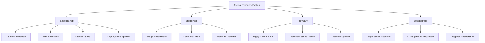
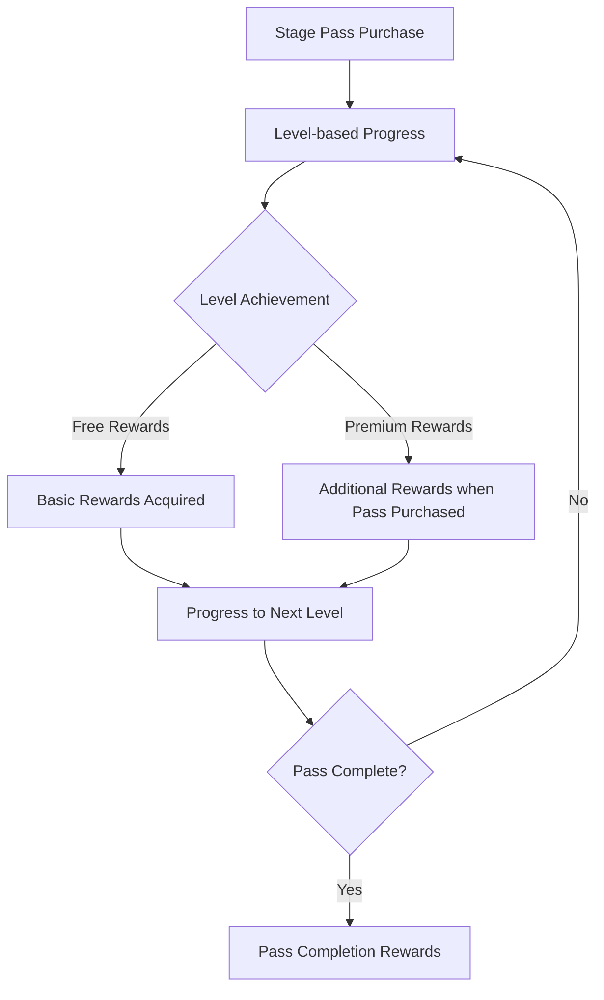
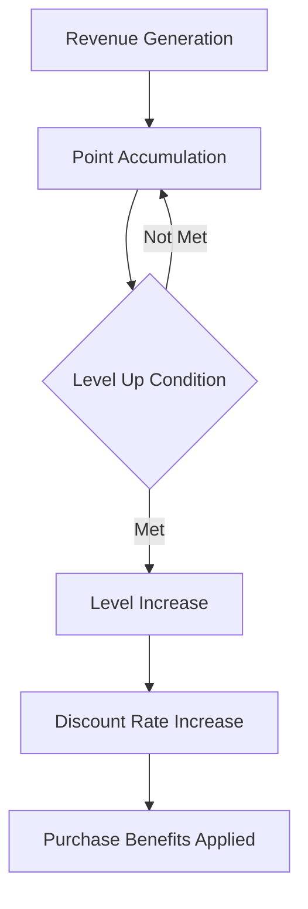

# Special Products System

The ChuChuBurger special products system is a premium product line operating separately from regular in-game shops, consisting of 4 main systems: **SpecialShop**, **StagePass**, **PiggyBank**, and **BoosterPack**. It integrates with WorldCoin (premium currency)-based payment system to provide players with special value and convenience.

## System Overview



## SpecialShop - Special Shop System

### Shop Categories

SpecialShopDataLogic manages 4 categories of special shops:

<details>
<summary>Special Shop Category Definition</summary>

```lua
-- RootDesk/MyDesk/Shop/SpecialShop/SpecialShopDataLogic.mlua
property string DiamondShopId = "1003"
property string ItemPackageShopId = "1002"
property string StarterPackShopId = "1001"
property string EmployeeEquipShopId = "1004"
```
</details>

**Main Categories:**
- **StarterPack (1001)**: Starter packages for new players
- **ItemPackage (1002)**: Various item bundle packages
- **Diamond (1003)**: Direct diamond purchases
- **EmployeeEquip (1004)**: Employee equipment special products

### Data Structure Management

LoadSpecialShopProductDataSet() method loads and structures special shop product data:

1. **Data Initialization**: Clear existing product data tables
2. **CSV Loading**: Load each product information from SpecialShopProductDataSet
3. **Dual Indexing**: Support both ID-based access and shop-based grouping

Core Logic: `self.SpecialShopProductDataByLinkedShopId[data.LinkedShopId] = {}`

<details>
<summary>Special Shop Data Loading Implementation</summary>

```lua
-- RootDesk/MyDesk/Shop/SpecialShop/SpecialShopDataLogic.mlua :: LoadSpecialShopProductDataSet()
method void LoadSpecialShopProductDataSet()
    table.clear(self.SpecialShopProductData)
    table.clear(self.SpecialShopProductDataByLinkedShopId)
    
    local dataSet = _DataService:GetTable("SpecialShopProductDataSet")
    
    local ruidList = {}
    for i = 1, dataSet:GetRowCount() do
        local data = SpecialShopProductData()
        data:LoadFrom(dataSet:GetRow(i))
        if self.SpecialShopProductData[data.Id] ~= nil then
            break
        end
        self.SpecialShopProductData[data.Id] = data
        if isvalid(self.SpecialShopProductDataByLinkedShopId[data.LinkedShopId]) then
            table.insert(self.SpecialShopProductDataByLinkedShopId[data.LinkedShopId], data)
        else
            self.SpecialShopProductDataByLinkedShopId[data.LinkedShopId] = {}
            table.insert(self.SpecialShopProductDataByLinkedShopId[data.LinkedShopId], data)
        end
    end
end
```
</details>

**Data Management:**
- `SpecialShopProductData`: Overall special product data
- `SpecialShopProductDataByLinkedShopId`: Product classification by shop
- `SpecialShopProductModelData`: UI model data

### Stock Management System

HasRemainingStock() method checks product availability for purchase:

`return itemCount == -1 or purchaseCount < itemCount`

- **-1**: Unlimited purchase possible
- **Positive**: Purchase only within limited quantity

<details>
<summary>Stock Check Logic</summary>

```lua
-- RootDesk/MyDesk/Shop/SpecialShop/SpecialShopDataLogic.mlua :: HasRemainingStock()
method boolean HasRemainingStock(string productId, integer purchaseCount)
    local itemCount = self.SpecialShopProductData[productId].ItemCount
    return itemCount == -1 or purchaseCount < itemCount 
end
```
</details>

**Stock Types:**
- **-1**: Unlimited purchase possible
- **Positive**: Limited quantity (individual purchase limits)

### WorldCoin Integration

IsCurrenyWorldCoin() method checks if the product uses premium currency:

`return self.SpecialShopData[data.LinkedShopId].UseItemId == "G2000"`

Item ID G2000 represents WorldCoin (premium currency).

<details>
<summary>WorldCoin Integration Check Logic</summary>

```lua
-- RootDesk/MyDesk/Shop/SpecialShop/SpecialShopDataLogic.mlua :: IsCurrenyWorldCoin()
method boolean IsCurrenyWorldCoin(string productId)
    local data = self.SpecialShopProductData[productId]
    return self.SpecialShopData[data.LinkedShopId].UseItemId == "G2000"
end
```
</details>

## StagePass - Stage Pass System

### Pass Structure System

StagePassDataLogic manages all stage pass data:

- **Group/Product/Level Data**: Basic elements of pass structure
- **Reward System**: Group/slot/product reward mapping tables
- **Limited Items**: G0008 (special materials) management

<details>
<summary>StagePassDataLogic Property Definition</summary>

```lua
-- RootDesk/MyDesk/Shop/StagePass/StagePassDataLogic.mlua
property table StagePassGroupData = {}
property table StagePassProductData = {}
property table StagePassLevelData = {}
property table StagePassLevelId_Sorted = {}
property integer StagePassProductCount = 3
property table StagePassRewardData = {}
property table StagePassRewardIdByGroupId = {}
property table StagePassRewardIdBySlotId = {}
property table StagePassRewardIdByProductId = {}
property table StagePassGroupId_Sorted = {}
property string LimitedItemId = "G0008"
property integer SpecialRewardProgress = 6
```
</details>

**Core Components:**
- **Group System**: Stage-based pass groups
- **Level System**: Progress levels within pass
- **Reward System**: Free/premium rewards by level
- **Product System**: Pass purchase options

### Pass Progress System



### Reward Receipt System

RequestGetPurchaseReward_StagePass() method processes stage pass purchase rewards:

1. **User Verification**: Confirm senderUserId and userId match
2. **Purchase Status Check**: Verify pass purchase status with IsPassProductPurchased()
3. **Duplicate Prevention**: Check received status with GetStagePassPurchaseRewardReceived()
4. **Reward Distribution**: Actual item distribution with ReceiveStagePassPurchaseReward()

Core Verification: `if isPurchased == false then _SpecialShopDataLogic:AbnormalLog() return end`

<details>
<summary>Stage Pass Reward Receipt Implementation</summary>

```lua
-- RootDesk/MyDesk/Shop/BMCommon/PaidLogic.mlua :: RequestGetPurchaseReward_StagePass()
method void RequestGetPurchaseReward_StagePass(string productId, string userId)
    if senderUserId ~= userId then
        _SpecialShopDataLogic:AbnormalLog()
        return
    end
    
    local userEntity = _UserService:GetUserEntityByUserId(userId)
    
    local productData = _StagePassDataLogic.StagePassProductData[productId]
    
    local isPurchased = _StagePassDataLogic:IsPassProductPurchased(productId, userId)
    if isPurchased == false then
        _SpecialShopDataLogic:AbnormalLog()
        return
    end
    
    local isReceived = userEntity.PlayerOutgameManager:GetStagePassPurchaseRewardReceived(productId)
    if isReceived then
        _SpecialShopDataLogic:AbnormalLog()
        return
    end
    
    local res = userEntity.PlayerOutgameManager:ReceiveStagePassPurchaseReward(userEntity, productData)
```
</details>

## PiggyBank - Piggy Bank System

### Level-based System

```29:44:RootDesk/MyDesk/Shop/PiggyBank/PiggyBankDataLogic.mlua
method void LoadPiggyBankLevelDataSet()
    table.clear(self.PiggyBankLevelData)
    
    local dataSet = _DataService:GetTable("PiggyBankLevelDataSet")
    
    for i = 1, dataSet:GetRowCount() do
        local data = PiggyBankLevelData()
        data:LoadFrom(dataSet:GetRow(i))
        if self.PiggyBankLevelData[data.Level] ~= nil then
            break
        end
        table.insert(self.PiggyBankLevelData, data)
        self.PiggyBankLevelDataIdByProductId[data.ProductId] = data.Level
    end
end
```

**Core Properties:**
- `MaxLevelDefault`: Maximum level (10)
- `AddPointPerEarningRateKey`: Point ratio per revenue
- `PiggyBankLevelDataIdByProductId`: Product-level mapping

### Point Accumulation System

```559:564:RootDesk/MyDesk/Shop/BMCommon/PaidLogic.mlua
method void AddEarnings_PiggyBank(integer earnings, string userId)
    local userEntity = _UserService:GetUserEntityByUserId(userId)
    userEntity.PlayerSettlement:AddPiggyBankEarnings(earnings)
    
    userEntity.PlayerDBManager:SaveToDB(false)
end
```

**Operation Principle:**
1. Player revenue generation
2. Point accumulation at set ratio
3. Level up when point threshold reached
4. Level-based discount benefits applied

### Discount System

Provides purchase discount benefits based on piggy bank level:



## BoosterPack - Booster Pack System

### Stage Integration System

```16:30:RootDesk/MyDesk/Shop/BoosterPack/BoosterPackDataLogic.mlua
method void LoadBoosterPackDataSet()
    table.clear(self.BoosterPackData)
    
    local dataSet = _DataService:GetTable("BoosterPackDataSet")
    
    for i = 1, dataSet:GetRowCount() do
        local data = BoosterPackData()
        data:LoadFrom(dataSet:GetRow(i))
        if self.BoosterPackData[data.StageId] ~= nil then
            break
        end
        self.BoosterPackData[data.StageId] = data
    end
end
```

**Booster Pack Features:**
- **Stage-specific**: Booster packs specialized for each stage
- **Progress Acceleration**: Items that help speed up game progress
- **Management Level Integration**: Differential benefits based on management level

### UI Color System

```8:10:RootDesk/MyDesk/Shop/BoosterPack/BoosterPackDataLogic.mlua
property table PriceColor = {Color.FromHexCode("#fa5246"), Color.FromHexCode("#ffffff")}
property table PriceOutlineColor = {Color.FromHexCode("#ffffff"), Color.FromHexCode("#c15e14")}
```

Color system for visual distinction when displaying discounted prices

## Integrated Payment System

### PaidLogic - Payment Processing Core

```422:444:RootDesk/MyDesk/Shop/BMCommon/PaidLogic.mlua
method boolean PurchaseProcessByShopType(any _Info)
    
    local purchaseInfo = _Info 
    
    local specialShopProductData = _SpecialShopDataLogic.SpecialShopProductData[purchaseInfo.ProductId]
    if specialShopProductData ~= nil then
        return self:PurchaseCallback_SpecialShop(purchaseInfo, specialShopProductData)
    end
    
    if _StagePassDataLogic:IsWorldCoinProduct(purchaseInfo.ProductId) then
        return self:PurchaseCallback_StagePass(purchaseInfo)
    end
    
    if _PiggyBankDataLogic.PiggyBankLevelDataIdByProductId[purchaseInfo.ProductId] then
        return self:PurchaseCallback_PiggyBank(purchaseInfo)
    end
    
    _PurchaseLogLogic:PurchaseFailLog_InvalidProductId(purchaseInfo)
    return false
end
```

**Payment Processing Flow:**
1. Identify product type (Special Shop/Stage Pass/Piggy Bank)
2. Execute corresponding system callback function
3. Process item distribution and recording
4. Save to database

### WorldShop Integration

```349:368:RootDesk/MyDesk/Shop/BMCommon/PaidLogic.mlua
method void RequestPurchaseWorldShopProduct_StagePass(string productId, string userId)
    if senderUserId ~= userId then
        _SpecialShopDataLogic:AbnormalLog()
        return
    end
    
    local purchaseCount = _UserService:GetUserEntityByUserId(userId).PlayerOutgameManager:GetPurchaseCount(productId)
    if purchaseCount ~= 0 then
        _SpecialShopDataLogic:AbnormalLog()
        return
    end
    
    local worldShopProduct = _WorldShopService:GetProductAndWait(productId)
    if isvalid(worldShopProduct) then
        self:PromptPurchase(productId, userId)
    else
        _SpecialShopDataLogic:AbnormalLog()
        return
    end
end
```

## Integrated UI Management

### BMDropDownLogic - Dropdown Menu

```1:44:RootDesk/MyDesk/Shop/BMCommon/BMDropDownLogic.mlua
script BMDropDownLogic extends Logic

property UISpecialShopRef UISpecialShopGroup = "786a099c-45ec-434d-a7ab-e64a59b2e925"
property UIStagePass UIStagePass = "f96cb0f0-b032-46a5-b189-a42ab5963b45"
property UIPiggyBank UIPiggyBank = "1a0e70eb-8469-4445-879d-fa2a9950d355"
property UIBoosterPack UIBoosterPack = "c4282791-0bc4-4c19-8a67-16b83b0831b0"
```

**Integrated UI Access:**
- Special shop group opening
- Stage pass UI invocation
- Piggy bank management
- Booster pack purchase

### Red Dot Notification System

Each special product system supports independent Red Dot notifications:
- **New product appearance**
- **Purchasable items available**
- **Discount events in progress**
- **Rewards awaiting receipt**

## Economic System Integration

### Management Level Integration

Booster packs and some special products integrate with player's management level:
- **Level-based product unlock**
- **Level-based discount benefits**
- **Level-based additional rewards**

### Revenue-based Benefits

Piggy bank integrates with player's actual game revenue:
- **Revenue-proportional point accumulation**
- **Discount benefits through level up**
- **Long-term investment value provision**

## Performance Optimization and Security

### Purchase Verification System

```349:368:RootDesk/MyDesk/Shop/BMCommon/PaidLogic.mlua
if senderUserId ~= userId then
    _SpecialShopDataLogic:AbnormalLog()
    return
end

local purchaseCount = _UserService:GetUserEntityByUserId(userId).PlayerOutgameManager:GetPurchaseCount(productId)
if purchaseCount ~= 0 then
    _SpecialShopDataLogic:AbnormalLog()
    return
end
```

**Security Verification:**
- User ID match confirmation
- Duplicate purchase prevention
- Abnormal access log recording
- Condition verification before item distribution

### Data Synchronization

All special product purchase history synchronizes in real-time:
- **Purchase status immediately reflected**
- **Reward receipt status tracking**
- **Level progress updates**

## Log and Analysis System

### PurchaseLogLogic - Purchase Logs

All special product purchases are recorded in detail:
- **Purchase time and user information**
- **Product information and payment amount**
- **Distributed item details**
- **System-specific purchase pattern analysis**

## Code References

### Core Data Management
- `RootDesk/MyDesk/Shop/SpecialShop/SpecialShopDataLogic.mlua :: LoadSpecialShopProductDataSet()` — Special shop data loading
- `RootDesk/MyDesk/Shop/StagePass/StagePassDataLogic.mlua :: LoadStagePassGroupDataSet()` — Stage pass data loading
- `RootDesk/MyDesk/Shop/PiggyBank/PiggyBankDataLogic.mlua :: LoadPiggyBankLevelDataSet()` — Piggy bank data loading
- `RootDesk/MyDesk/Shop/BoosterPack/BoosterPackDataLogic.mlua :: LoadBoosterPackDataSet()` — Booster pack data loading

### Payment Processing System
- `RootDesk/MyDesk/Shop/BMCommon/PaidLogic.mlua :: PurchaseProcessByShopType()` — System-specific payment processing
- `RootDesk/MyDesk/Shop/BMCommon/PaidLogic.mlua :: PurchaseCallback_SpecialShop()` — Special shop purchase callback
- `RootDesk/MyDesk/Shop/BMCommon/PaidLogic.mlua :: PurchaseCallback_StagePass()` — Stage pass purchase callback
- `RootDesk/MyDesk/Shop/BMCommon/PaidLogic.mlua :: PurchaseCallback_PiggyBank()` — Piggy bank purchase callback

### UI Management System
- `RootDesk/MyDesk/Shop/BMCommon/BMDropDownLogic.mlua` — Dropdown menu integrated management
- `RootDesk/MyDesk/Shop/SpecialShop/UISpecialShop.mlua` — Special shop UI
- `RootDesk/MyDesk/Shop/StagePass/UIStagePass.mlua` — Stage pass UI
- `RootDesk/MyDesk/Shop/PiggyBank/UIPiggyBank.mlua` — Piggy bank UI

### Reward Processing System
- `RootDesk/MyDesk/Shop/BMCommon/PaidLogic.mlua :: RequestGetReward_StagePass()` — Stage pass reward receipt
- `RootDesk/MyDesk/Shop/BMCommon/PaidLogic.mlua :: RequestReceiveReward_PiggyBank()` — Piggy bank reward receipt
- `RootDesk/MyDesk/Shop/BMCommon/PaidLogic.mlua :: AddEarnings_PiggyBank()` — Piggy bank point addition

---

This document comprehensively explains all components of the ChuChuBurger special products system. It helps understand how 4 major systems integrate to provide players with various premium experiences and game progression convenience.
