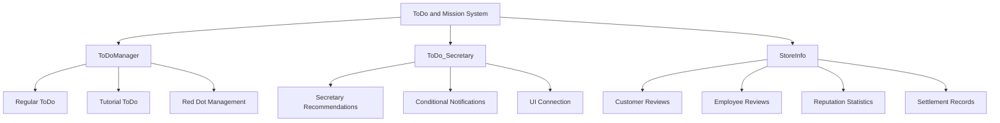
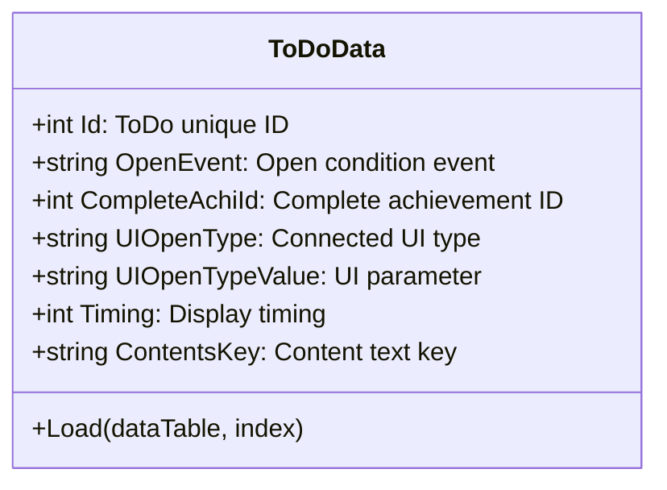
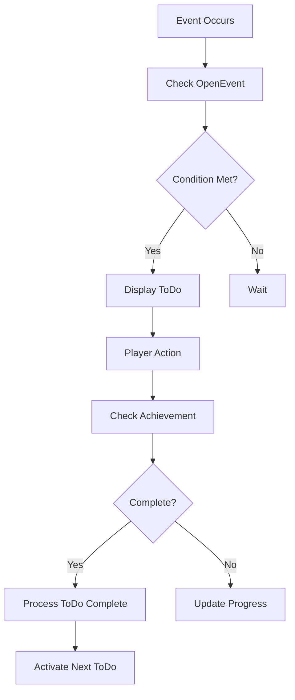
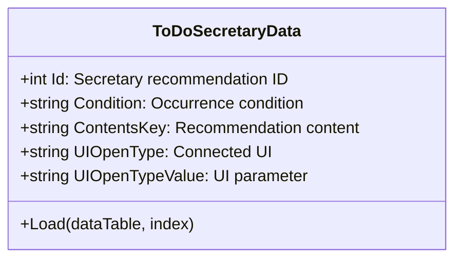
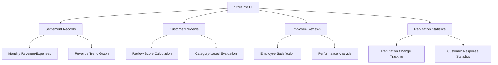
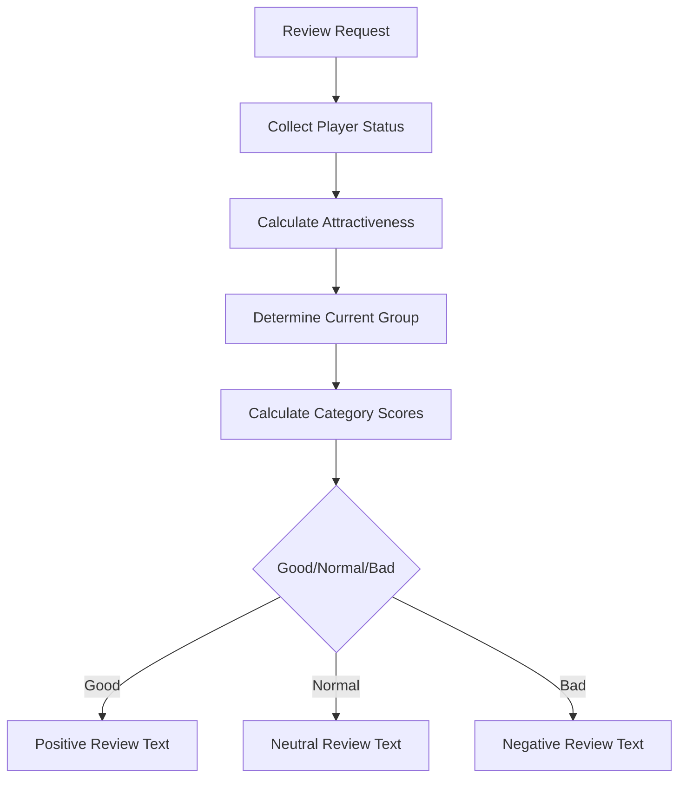
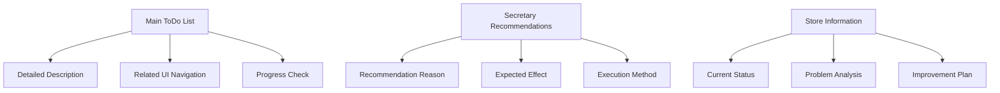

# ToDo and Mission System

## System Overview

The ChuChuBurger ToDo and Mission System is a guide system that provides clear goals and direction to players. This system consists of the **ToDo System** and the **ToDo_Secretary (Secretary Recommendation) System**, integrated with the **StoreInfo System** to comprehensively monitor and provide feedback on the player's store operation status.



## ToDo System

### ToDoManager - ToDo List Management

Core component that manages the creation, updates, and completion status of ToDo lists.

**Core Data Structure:**
```lua
-- ToDoManager.mlua
property table ToDoData = {}              -- Regular ToDo data
property table ToDoSecretaryData = {}     -- Secretary ToDo data
property integer NowToDo = 0              -- Currently active ToDo
property Entity RedDot                    -- Red Dot notification display
```

### Regular ToDo System

**ToDoData Structure:**


**ToDo Processing Flow:**


### Tutorial ToDo Processing

**RefreshTutorialToDoList Logic:**
```lua
-- ToDoManager.mlua :: RefreshTutorialToDoList()
for i = 1, #self.ToDoData do
    local toDoData = self:GetData(i)
    local openEvent = toDoData.OpenEvent
    
    local isEventOccured = _UserService.LocalPlayer.PlayerEvent:IsEventOccured(openEvent)
    if isEventOccured == false then
        continue -- Skip if condition not met
    end
        
    local isCompleted = _UserService.LocalPlayer.PlayerAchievement:IsAchievementAchieved(toDoData.CompleteAchiId)
    if isCompleted then
        table.insert(completed, toDoData)    -- Completed ToDo
    else
        table.insert(notCompleted, toDoData)  -- Incomplete ToDo
    end
end
```

**Display Priority:**
1. **Incomplete ToDo**: Priority display at top
2. **Completed ToDo**: Gray display at bottom  
3. **Condition Not Met**: Not displayed

### Red Dot Notification System

**Integration with RedDotManager:**
```lua
-- ToDoManager.mlua :: SetRedDot()
local hasNewToDo = self:HasNewToDo()
self.RedDot.Enable = hasNewToDo
_MainMenuRedDotManager:EnableToDoRedDot(hasNewToDo)
```

**Red Dot Display Conditions:**
- New ToDo appears
- Completable ToDo exists  
- Secretary recommendation new items occur
- Important notification updates

## ToDo_Secretary - Secretary Recommendation System

### Intelligent Recommendation System

The secretary system is an AI-based guide that analyzes the player's current state and recommends appropriate actions.

**ToDoSecretaryData Structure:**


### Conditional Secretary Recommendations

**Recommendation Occurrence Conditions (IsToDoSecretaryOccured function):**

**1. Upgrade Recommendations (RecommendedUpgrade)**
```lua
-- ToDoManager.mlua :: IsToDoSecretaryOccured()
if secData.Condition == "RecommendedUpgrade" then
    local upgradeList = _UpgradeDataSetLogic:ReturnTabDatas(0, player)
    if #upgradeList > 0 then
        for i = 1, #upgradeList do
            local upgradeLevel = _UpgradeDataSetLogic:ReturnCurrentPlayerLevel(player, upgradeId)
            local levelData = _UpgradeDataSetLogic:GetLevelData(upgradeId, upgradeLevel+1)
            if player.PlayerInventory.Money >= levelData:GetUpgradeCost(player) then
                return true -- Purchasable upgrade exists
            end
        end
    end
end
```

**2. Employee-related Recommendations (Employment/EmployeeDeploy)**
- **Employment**: New employee hiring recommendation
- **EmployeeDeploy**: Employee deployment optimization recommendation

**3. Other Situational Recommendations:**
- **VIPOrderCount**: VIP order completion count related
- **VIPOrderSeasonReward**: VIP season reward collection 
- **TrialParticipation**: Tournament participation encouragement
- **ResourceManagement**: Material/currency management advice

### Secretary UI Integration

**RefreshSecretary Processing:**
```lua
-- UIToDoItemRenderer.mlua :: RefreshSecretary()
self.Id = secData.Id
self.Contents.Text = _GetLocalizationTextLogic:GetText(secData.ContentsKey)
self.New.Enable = not isChecked           -- Show NEW if unconfirmed
local menuData = _MainMenuDataSetLogic:GetMenuBtnData(secData.UIOpenType)
self.MenuIcon.ImageRUID = menuData.IconRUID  -- Display related UI icon
```

**Functions:**
- **Content Display**: Specific recommendations and reasons
- **UI Connection**: Direct navigation to related screens upon touch  
- **State Management**: Track confirmed/unconfirmed status
- **Icon Display**: Visualize icons of connected functions

## StoreInfo - Store Information System

### Comprehensive Information Dashboard

Information center that analyzes and provides store overall status and performance from multiple angles.

**UIStoreInfo Structure:**


### Customer Review System

**CustomerReviewData-based Evaluation:**
```lua
-- StoreInfoDataSetLogic.mlua :: ReturnPlayerScoreByCustomerReviewId()
-- Attractiveness calculation: Recipe + Facilities
local recipeAttractive = player.CustomerManager:CalcAttractiveRecipe()
local storeAttractiveExpansion = player.CustomerManager:CalcAttractiveExpension()
local storeAttractiveInterior = player.CustomerManager:CalcAttractiveInterior() 
local storeAttractiveDeco = player.CustomerManager:CalacAttractiveDeco()

local playerTotalAttractive = recipeAttractive + storeAttractive
```

**Review Categories:**
- **Store**: Store facilities and environment evaluation
- **Recipe**: Menu quality and variety evaluation  
- **Service**: Service speed and quality evaluation
- **Price**: Price-to-satisfaction ratio evaluation

**Review Score Calculation:**


### Employee Review System

**UIEmployeeReview Functions:**
- **Individual Employee Evaluation**: Performance and satisfaction of each employee
- **Team-wide Analysis**: Efficiency review of employee composition
- **Improvement Suggestions**: Employee management optimization proposals

**Employee Evaluation Metrics:**
- **Work Efficiency**: Task completion time and quality
- **Growth Potential**: Level-up and skill development progress  
- **Teamwork**: Cooperation with other employees
- **Customer Satisfaction**: Employee-specific customer feedback

### Reputation Statistics System

**UIReputationReview Analysis:**
```lua
-- UIReputationStat.mlua
property SyncTable<integer, Entity> StatSlots  -- Statistics slots
property Entity GraphContainer                  -- Graph container
```

**Reputation Analysis Items:**
- **Reputation Change Trends**: Daily/weekly/monthly reputation change graphs
- **Cause Analysis**: Identify main causes of reputation rise/fall
- **Customer Distribution**: Satisfaction distribution of visiting customers  
- **Improvement Points**: Specific measures for reputation improvement

## Integration Systems

### PlayerEvent Integration

**Event-based Updates:**
```lua
-- PlayerEvent.mlua :: OnSyncProperty()  
if name == "Events" then
    _ToDoManager:RefreshToDoList()      -- Refresh ToDo on event changes
    _UIButtonUnlockLogic:SetButtonsUnlock()  -- Process button unlocks
end
```

### Red Dot Integrated Management

**Integration with MainMenuRedDotManager:**
- **ToDo Notifications**: When new tasks appear  
- **Secretary Notifications**: When secretary recommendations update
- **StoreInfo Notifications**: When important reviews or statistics change
- **Achievement Integration**: ToDo activation linked to achievement completion

### Achievement System Integration

**AchievementLogic Integration:**
```lua
-- ToDoManager.mlua :: RefreshToDoList()
local isCompleted = _UserService.LocalPlayer.PlayerAchievement:IsAchievementAchieved(toDoData.CompleteAchiId)
if isCompleted then
    -- Process ToDo completion
else  
    -- Display as in-progress ToDo
end
```

## UI/UX Design

### Accessibility and Usability

**Intuitive Navigation:**
- **One-click Navigation**: Direct navigation to related UI upon touching ToDo items
- **Status Distinction**: Distinguish complete/in-progress/new status with colors and icons
- **Priority Display**: Arrangement and emphasis based on importance

**Information Hierarchy:**


### Feedback System

**Immediate Response:**
- **Completion Animation**: Visual effects that provide satisfaction upon ToDo completion
- **Progress Display**: Visualize step-by-step progress for complex goals
- **Achievement Highlight**: Emphasize special achievements or improvements

**Continuous Improvement:**
- **Pattern Learning**: Improve recommendation accuracy by analyzing player behavior patterns
- **Personalization**: Customized advice matching player's play style
- **Adaptive Difficulty**: Present appropriate goals matching player level

## Performance Optimization

### Data Management

**Efficient Loading:**
```lua
-- ToDoManager.mlua :: LoadDataSet()
table.clear(self.ToDoData)
local dataSet = _DataService:GetTable("EventToDoData")
-- Convert CSV data to structured objects
```

**Memory Usage Optimization:**
- **Lazy Loading**: Load detailed data only when needed
- **Caching Strategy**: Memory caching of frequently referenced data
- **Garbage Collection**: Proper release of used data

### Real-time Updates

**Event-based Updates:**
- **Conditional Check**: Execute recalculation only when changes occur  
- **Batch Processing**: Handle multiple changes at once
- **Priority Queue**: Manage update order based on importance

## Strategic Value

### Player Guide

**Learning Curve Mitigation:**
- **Step-by-step Guidance**: Introduce complex systems gradually
- **Contextual Help**: Specific advice appropriate for current situation
- **Mistake Prevention**: Warnings about common mistakes or inefficient actions

### Long-term Engagement Induction

**Goal Setting:**
- **Short-term Goals**: Provide small achievements immediately attainable
- **Medium-term Goals**: Progress goals for several days to a week  
- **Long-term Vision**: Present big picture connected to game's ultimate goals

**Growth Realization:**
- **Performance Tracking**: Present player's progress through objective metrics
- **Comparative Analysis**: Confirm growth through comparison with past self
- **Milestone Display**: Special feedback when reaching important development stages

## Code References

### Core ToDo System
- `RootDesk/MyDesk/01. Lobby/ToDo/ToDoManager.mlua :: RefreshToDoList()` — ToDo list refresh
- `RootDesk/MyDesk/01. Lobby/ToDo/ToDoManager.mlua :: RefreshTutorialToDoList()` — Tutorial ToDo processing
- `RootDesk/MyDesk/01. Lobby/ToDo/ToDoManager.mlua :: RefreshSecretaryToDoList()` — Secretary recommendation refresh
- `RootDesk/MyDesk/01. Lobby/ToDo/ToDoData.mlua :: Load()` — ToDo data structure

### Secretary Recommendation System
- `RootDesk/MyDesk/01. Lobby/ToDo/ToDoManager.mlua :: IsToDoSecretaryOccured()` — Secretary recommendation condition check
- `RootDesk/MyDesk/01. Lobby/ToDo_Secretary/ToDoSecretaryData.mlua` — Secretary data structure
- `RootDesk/MyDesk/01. Lobby/ToDo/UIToDoItemRenderer.mlua :: RefreshSecretary()` — Secretary UI refresh

### Store Information System
- `RootDesk/MyDesk/01. Lobby/StoreInfo/StoreInfoDataSetLogic.mlua :: ReturnPlayerScoreByCustomerReviewId()` — Review score calculation
- `RootDesk/MyDesk/01. Lobby/StoreInfo/UIStoreInfo.mlua :: Open()` — Store info UI open
- `RootDesk/MyDesk/01. Lobby/StoreInfo/UICustomerReview.mlua :: Refresh()` — Customer review refresh
- `RootDesk/MyDesk/01. Lobby/StoreInfo/UIEmployeeReview.mlua` — Employee review management

### Review Data Management
- `RootDesk/MyDesk/01. Lobby/StoreInfo/CustomerReviewData.mlua :: Load()` — Customer review data load
- `RootDesk/MyDesk/01. Lobby/StoreInfo/UIReputationReview.mlua` — Reputation review UI
- `RootDesk/MyDesk/01. Lobby/StoreInfo/UIReputationStat.mlua` — Reputation statistics display

### Red Dot and Notifications
- `RootDesk/MyDesk/01. Lobby/ToDo/ToDoManager.mlua :: SetRedDot()` — Red Dot state management
- `RootDesk/MyDesk/Common/UI/MainMenuRedDotManager.mlua` — Main menu notification integrated management

---

This document describes the comprehensive structure and functionality of the ChuChuBurger ToDo and Mission System. It demonstrates how the ToDo system, secretary recommendation system, and store information system integrate to provide continuous guidance and feedback to players.
