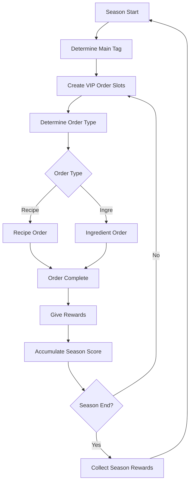
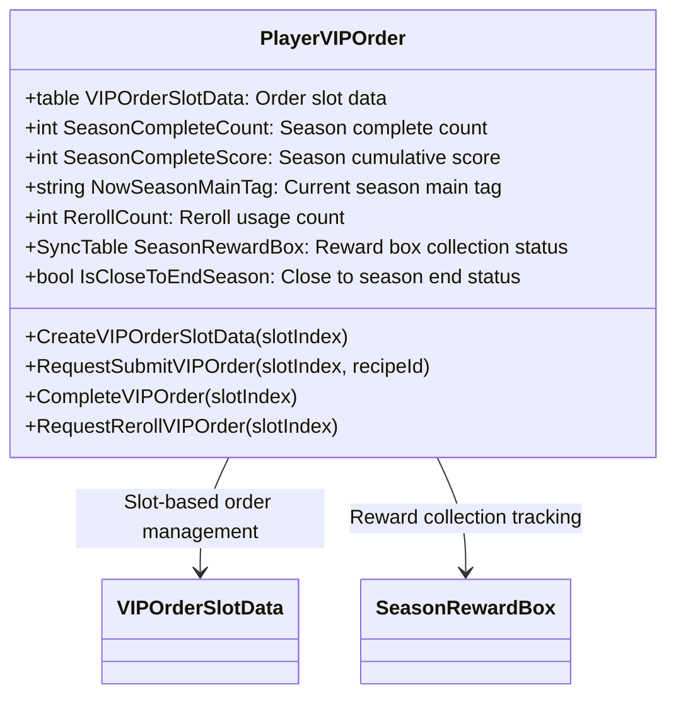

# VIP Order System

## System Overview

The ChuChuBurger VIP Order System is advanced content operating on a seasonal basis, where players can obtain high rewards by satisfying special recipe or ingredient requirements. This system is managed around the `PlayerVIPOrder` component and regularly starts new seasons to provide continuous challenges and goals.

## Season-based Operation System

### Season Structure


### Season Schedule Management
```lua
-- VIPOrderDataSetLogic.mlua
property table SeasonStartMonths = {3, 9}  -- Seasons start in March, September
```

**Season Features:**
- **Start Time**: New seasons begin in March and September each year
- **Main Tag**: A specific ingredient tag is set as the main theme for each season
- **Time Limit**: Goals must be achieved within the set period for each season
- **Cumulative Progress**: Number of orders completed and scores accumulated within the season

## PlayerVIPOrder Management System

### Core Data Structure


### Main Property Descriptions

**VIPOrderSlotData**: Stores order information for 3 slots
```lua
-- PlayerVIPOrder.mlua :: CreateVIPOrderSlotData()
property table VIPOrderSlotData = {}  -- Slot-based order data
```

**Season Progress Tracking**:
- `SeasonCompleteCount`: Number of completed VIP orders
- `SeasonCompleteScore`: Score accumulation for reward collection
- `NowSeasonMainTag`: Main ingredient tag for the season

**State Management**:
- `IsCloseToEndSeason`: Season end approaching notification
- `IsFirstEnterUI`: First entry tutorial processing
- `RerollCount`: Number of order regeneration uses

## Order Type System

### VIP Order Types
```lua
-- VIPOrderTypeEnum.mlua
property string Recipe = "Recipe"    -- Recipe order
property string Ingre = "Ingre"      -- Ingredient order  
property string Waiting = "Waiting"  -- Waiting state
property string Complete = "Complete" -- Complete state
```

### Recipe Order (Recipe Order)

Orders where players create and submit recipes that meet specific conditions.

**Order Generation Process:**
```lua
-- PlayerVIPOrder.mlua :: CreateVIPOrderSlotData()
local getOrderType = function()
    local recipeWeight = 1
    local ingreWeight = 2
    -- Ingredient orders appear twice as frequently
end
```

**Recipe Order Conditions:**
- **Main Tag Required**: Season main tag must be included
- **Ingredient Count**: Requires use of 3-4 specific ingredients
- **Taste Grade**: Must achieve minimum taste grade or higher
- **Balance Condition**: Must meet specific balance range

**Additional Reward System:**
```lua
-- PlayerVIPOrder.mlua :: RequestSubmitVIPOrder()
if orderTasteGrade < recipeTasteGrade then
    local gap = math.floor(recipeTasteGrade - orderTasteGrade)
    if gap > 3 then gap = 3 end
    self.SeasonCompleteScore += _GetConfigDataLogic:GetConfigNumDataByKey("VIPOrderScoreExtraReward"..gap)
end
```

Additional scores can be earned by submitting recipes of higher quality than required grade.

### Ingredient Order (Ingredient Order)

Simple orders to submit specific ingredients in certain quantities.

**Ingredient Order Features:**
- **Main Tag Priority**: Season main tag ingredients are primarily requested
- **Grade-based Differential**: Higher grade ingredients require smaller quantities
- **Immediate Completion**: Rewards given immediately after ingredient consumption

**Ingredient Selection Logic:**
```lua
-- VIPOrderDataSetLogic.mlua :: ReturnIngreType()
local mainTagWeight = 1    -- Main tag weight
local otherTagWeight = 0   -- Other tags rarely selected
```

## Reward System

### Individual Order Rewards
Basic rewards given upon completion of each VIP order.

**Reward Calculation:**
```lua
-- PlayerVIPOrder.mlua :: CompleteVIPOrder()
local rewardTable = _VIPOrderDataSetLogic:ReturnVIPOrderReward(self.VIPOrderSlotData[slotIndex], self.Entity)
self.Entity.PlayerInventory:AddItems(rewardTable, "VIPOrder Complete", "VIPOrder Panel")
```

**Reward Types:**
- **Reputation Points**: Store reputation increase
- **Score**: Score for unlocking season rewards
- **Currency**: Gold, hearts, and other basic currency
- **Special Items**: Season-specific special rewards

### Season Reward System

Provides tier-based rewards according to completion count and scores accumulated during the season.

**Season Reward Structure:**
```lua
-- VIPOrderSeasonRewardData.mlua
property integer ManagementLevel = 0     -- Differential by management level
property table SeasonRewardData = {}     -- Reward data by completion count
```

**Reward Tiers:**
1. **5 Completions**: Basic rewards
2. **10 Completions**: Intermediate rewards  
3. **15 Completions**: Advanced rewards
4. **20 Completions**: Premium rewards

**Management Level Integration:**
Players can receive better rewards for the same completion count based on their management level.

### Additional Score System

Bonus scores are earned when submitting recipes of higher quality than required conditions.

**Score Calculation:**
- **1 Grade Difference**: Small bonus score
- **2 Grade Difference**: Medium bonus score  
- **3+ Grade Difference**: Maximum bonus score

## Reroll and Reset System

### Order Reroll (Reroll)

Feature to change unwanted orders to new orders.

**Reroll Processing:**
```lua
-- PlayerVIPOrder.mlua :: RequestRerollVIPOrder()
self.RerollCount += 1
self:CreateVIPOrderSlotData(slotIndex, true, "2")  -- Generate new order referencing existing data
```

**Reroll Features:**
- **Increasing Cost**: Cost increases with number of rerolls
- **Differentiation**: Generate new orders with different conditions from existing ones
- **Limitation**: Limited number of reroll uses per season

### Season Reset

All progress is reset when the season ends and a new season begins.

**Reset Items:**
- Order slot data initialization
- Complete count counter reset
- Score accumulation reset  
- New main tag setting

## UI System

### UIVIPOrderPanel - Main UI

Main interface displaying overall VIP order status.

**Main Components:**
```lua
-- UIVIPOrderPanel.mlua
property SyncTable<integer, Entity> VIPOrderSlot  -- 3 order slots
property UIVIPOrderSeasonInfo SeasonInfo          -- Season information
property TextComponent VIPOrderCountText          -- Complete count display
```

**Functions:**
- **Order Slot Display**: Visualize order status of 3 slots
- **Season Information**: Current season progress and remaining time
- **Completion Statistics**: Total completion count and earned score
- **Reward Preview**: Check next tier rewards

### Order Slot UI

UI displaying detailed information for each individual order.

**Display Information:**
- **Order Type**: Recipe vs ingredient icon
- **Requirements**: Display specific ingredients or conditions  
- **Progress Status**: Complete/waiting/in progress status
- **Reward Preview**: Rewards obtainable upon completion

### Season Information UI

**UIVIPOrderSeasonInfo** component manages season-specific information:

- **Season Theme**: Visual theme based on main tag
- **Progress**: Current completion count / target count  
- **Timer**: Time remaining until season end
- **Reward Status**: Display collectable season rewards

## Gameplay Strategy

### Efficient VIP Order Strategy

**1. Understanding Season Main Tag**
- Check main tag at season start and prepare focused on corresponding ingredients
- Stock sufficient main tag ingredients to prepare for ingredient orders

**2. Recipe Order Response**
- Create high-quality recipes with various grade ingredient combinations
- Earn bonus scores by achieving higher grades than required conditions

**3. Reroll Utilization**
- Use reroll appropriately for difficult-to-complete orders
- Consider selective reroll use based on cost-benefit efficiency

## Performance Optimization and Technical Considerations

### Data Synchronization

Important data in the VIP order system is synchronized with clients in real-time:

**Synchronized Data:**
```lua
@TargetUserSync property integer SeasonCompleteCount
@TargetUserSync property integer SeasonCompleteScore  
@TargetUserSync property string NowSeasonMainTag
@TargetUserSync property SyncTable<integer, boolean> SeasonRewardBox
```

### Logging System

All VIP order activities are recorded in detail:

```lua
-- PlayerVIPOrder.mlua :: CompleteVIPOrder()
self.Entity.PlayerLog:VIPOrderFlow(orderType, slotIndex, rewardData)
```

**Recorded Content:**
- Order type and completion time
- Recipe or ingredient information submitted  
- Reward details obtained
- Bonus score acquisition status

### Tutorial Integration

Step-by-step guidance is provided for new players:

```lua  
-- UIVIPOrderPanel.mlua :: Open()
_TutorialManager:SendTutorialTriggerEvent(_TutorialEventEnum.VIPOrderEnter)
_UserService.LocalPlayer.PlayerAchievement:RequestChangeProgress(_TutorialAchievementTypeEnum.VIPOrderUIEnter, 1)
```

## Economic Impact

### Role in Game Economy

**1. High-grade Ingredient Consumer**
- Creates continuous demand for high-grade ingredients
- Induces monetization through integration with ingredient gacha system

**2. Long-term Goal Provider**  
- Provides continuous play motivation through seasonal rewards
- Provides sense of growth through integration with management level

**3. Increased Strategic Depth**
- Induces quality competition beyond simple profit pursuit
- Strengthens strategic importance of resource management

## Code References

### Core System
- `RootDesk/MyDesk/00. Player/PlayerVIPOrder.mlua :: CreateVIPOrderSlotData()` — VIP order generation logic
- `RootDesk/MyDesk/00. Player/PlayerVIPOrder.mlua :: RequestSubmitVIPOrder()` — Order submission processing
- `RootDesk/MyDesk/00. Player/PlayerVIPOrder.mlua :: CompleteVIPOrder()` — Order completion and reward distribution
- `RootDesk/MyDesk/00. Player/PlayerVIPOrder.mlua :: RequestRerollVIPOrder()` — Order reroll processing

### Data Management
- `RootDesk/MyDesk/04. Recipe/VIPOrder/VIPOrderDataSetLogic.mlua :: ReturnRecipeOrderData()` — Recipe order data generation
- `RootDesk/MyDesk/04. Recipe/VIPOrder/VIPOrderDataSetLogic.mlua :: ReturnIngreOrderData()` — Ingredient order data generation
- `RootDesk/MyDesk/04. Recipe/VIPOrder/VIPOrderSeasonRewardData.mlua :: Load()` — Season reward data load

### UI System
- `RootDesk/MyDesk/04. Recipe/VIPOrder/UIVIPOrderPanel.mlua :: Open()` — Open VIP order UI
- `RootDesk/MyDesk/04. Recipe/VIPOrder/UIVIPOrderPanel.mlua :: Refresh()` — UI refresh
- `RootDesk/MyDesk/04. Recipe/VIPOrder/UIVIPOrderSeasonInfo.mlua` — Season information UI management
- `RootDesk/MyDesk/04. Recipe/VIPOrder/UIVIPOrderSlot.mlua` — Individual order slot UI

### Reward and Result Processing
- `RootDesk/MyDesk/04. Recipe/VIPOrder/VIPOrderResultRenderLogic.mlua` — Result rendering logic
- `RootDesk/MyDesk/04. Recipe/VIPOrder/UIVIPOrderScoreExtraReward.mlua` — Bonus score UI display

---

This document comprehensively covers all aspects of the ChuChuBurger VIP Order System. It demonstrates how season-based progression, various order types, reward systems, and strategic gameplay elements integrate to provide players with continuous challenges and sense of achievement.
