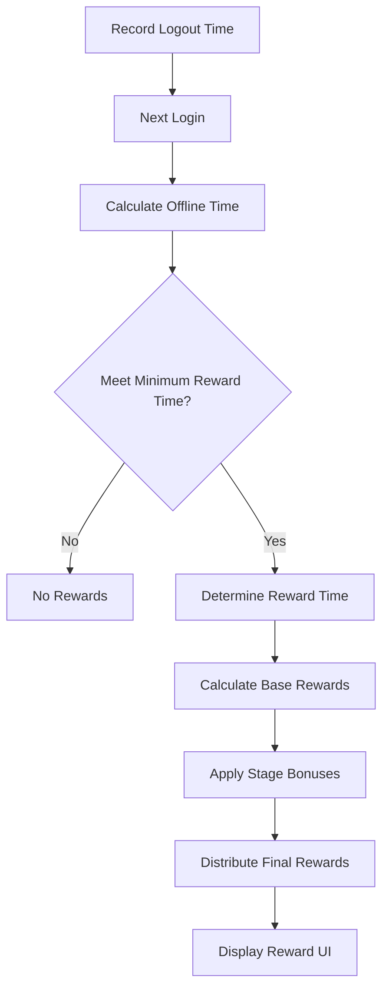
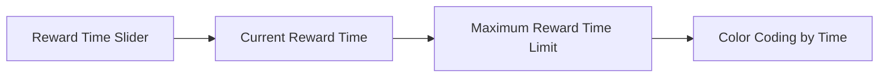

# Offline Rewards System

## Overview

The offline rewards system is a system that converts time when players are not connected to the game into rewards. It calculates appropriate levels of gold rewards based on players' previous game performance and cleared stages, while maintaining game balance through maximum reward time limits.

## System Structure

### Reward Calculation Mechanism



### Core Components

#### 1. OfflineRewardLogic

Handles the core logic of the offline rewards system.

**Key Methods:**
- GetOfflineRewardAmount() — Calculate final reward amount
- GetRewardTimeSec() — Calculate reward target time
- GetMaxRewardTime() — Query maximum reward time limit

<details>
<summary>OfflineRewardLogic Core Methods</summary>

```lua
-- RootDesk/MyDesk/01. Lobby/OfflineRewardLogic.mlua
method integer GetOfflineRewardAmount(integer rewardTimeSec, Entity player, table clearedStageList)
method integer GetRewardTimeSec(integer logoutElapsed, integer lobbyEnterElapsed, integer maxRewardTime)
method integer GetMaxRewardTime()
```
</details>

#### 2. UIGetOfflineRewardPopup

Visually displays offline rewards and handles user interactions.

**Key Features:**
- Reward time slider display
- Display cleared stage list
- Show reward amount and bonus information
- Provide animation effects

## Reward Calculation System

### Base Reward Formula

Offline rewards are calculated using the following formula:

```
Final Reward = (Reward Time × Revenue per Second) × Base Ratio × (1 + Stage Bonus)

Where:
- Revenue per Second = Monthly Best Revenue ÷ (30 days × seconds per day)
- Base Ratio = 5% (0.05)
- Stage Bonus = Sum of bonuses from cleared stages
```

### Reward Time Calculation

GetRewardTimeSec() method calculates actual reward target time:

1. **Time Difference Calculation**: Calculate difference between login and logout times
2. **Unit Conversion**: Convert milliseconds to seconds (`math.floor(elapsedGap / 1000)`)
3. **Apply Limits**: Apply upper limit not to exceed maxRewardTime

<details>
<summary>Reward Time Calculation Implementation</summary>

```lua
-- RootDesk/MyDesk/01. Lobby/OfflineRewardLogic.mlua :: GetRewardTimeSec()
method integer GetRewardTimeSec(integer logoutElapsed, integer lobbyEnterElapsed, integer maxRewardTime)
    local elapsedGap = lobbyEnterElapsed - logoutElapsed
    local rewardTimeSec = math.floor(elapsedGap / 1000)
    
    -- Apply maximum reward time limit
    if rewardTimeSec > maxRewardTime then
        rewardTimeSec = maxRewardTime
    end
    
    return rewardTimeSec
end
```
</details>

### Stage Bonus System

Additional bonuses are applied for each cleared stage:

Stage bonuses are calculated by summing OfflineRewardBonusPercent of all cleared stages:

`stagePercent += stageConfig.OfflineRewardBonusPercent`

Each stage's unique bonus ratio is accumulated and reflected in the final reward.

<details>
<summary>Stage Bonus Calculation Implementation</summary>

```lua
-- RootDesk/MyDesk/01. Lobby/OfflineRewardLogic.mlua :: GetOfflineRewardAmount()
local stagePercent = 0
for i = 1, #clearedStageList do
    local stageId = clearedStageList[i]
    local stageConfig = _BalanceDataSetLogic:GetStageConfigData(stageId)
    if stageConfig ~= nil then
        stagePercent += stageConfig.OfflineRewardBonusPercent
    end
end
```
</details>

## UI System

### Reward Display Interface

#### Time Information Display



**Time Display Features:**
- **Time Slider**: Visual representation of reward time
- **Time Limit**: Display only up to maximum reward time
- **Color Coding**: Different colors for different time periods

#### Reward Information Display

- **Total Reward Amount**: Improved readability with thousands separators
- **Cleared Stages**: List of stages providing bonuses
- **Bonus Percentage**: Display bonus ratios by stage
- **Employee Illustration**: Employee characters matching reward situation

### Animation System

#### Reward Receipt Animation

PlayAnimOnClickGetRewardButton() method creates differential effects based on reward amount:

1. **Effect Level Determination**: Set 1-3 stage effect levels by reward amount ranges
2. **Particle Name Generation**: Format `"Model_OfflineGetRewardParticle" + rewardIndex`
3. **UI Entity Creation**: Create particle entities with GetOrCreateEntityOfModel()

Core Logic: `local particleName = "Model_OfflineGetRewardParticle"..rewardIndex`

<details>
<summary>Reward Animation Implementation</summary>

```lua
-- RootDesk/MyDesk/01. Lobby/UIGetOfflineRewardPopup.mlua :: PlayAnimOnClickGetRewardButton()
method void PlayAnimOnClickGetRewardButton(Vector3 worldPos, integer rewardAmount)
    -- Determine effect level based on reward amount
    local rewardIndex = 0
    if rewardAmount < 1000000 then
        rewardIndex = 1
    elseif rewardAmount < 10000000 then
        rewardIndex = 2
    else
        rewardIndex = 3
    end
    
    -- Create particle and money animations
    local particleName = "Model_OfflineGetRewardParticle"..rewardIndex
    local particle = _UIEntityService:GetOrCreateEntityOfModel(particleName, 1, _UIGroupManager.LobbyHUDGroup)
end
```
</details>

**Animation Stages:**
1. **Particle Effects**: Differential effects based on reward amount
2. **Money Drop**: Animation of currency icons moving to money bar
3. **Sound Effects**: Sound effects when receiving rewards

## Balance System

### Minimum/Maximum Reward Time

Minimum/maximum reward times are dynamically loaded from configuration data:

- **Minimum Time Check**: `if rewardTimeSec < minRewardTime then return 0 end`
- **Maximum Time Limit**: Set upper limit with GetConfigNumDataByKey("OfflineRewardMaxTimeDefault")

<details>
<summary>Reward Time Limit Implementation</summary>

```lua
-- RootDesk/MyDesk/01. Lobby/OfflineRewardLogic.mlua :: GetOfflineRewardAmount()
-- Check minimum reward time
local minRewardTime = _GetConfigDataLogic:GetConfigNumDataByKey("OfflineRewardMinTime")
if rewardTimeSec < minRewardTime then
    return 0
end

-- Maximum reward time limit
local maxRewardTime = _GetConfigDataLogic:GetConfigNumDataByKey("OfflineRewardMaxTimeDefault")
```
</details>

**Balance Elements:**
- **Minimum Time**: No rewards for too short offline time
- **Maximum Time**: Limit rewards for long-term abandonment
- **Base Ratio**: Provide only 5% of total revenue as offline rewards

### Revenue-based Calculation

Offline rewards are calculated based on player's actual game performance:

Revenue-based calculation utilizes player's monthly best revenue record:

`local moneyPerSec = monthlyRecord / (30 * player.TimeManager.GameTimeSec)`

Calculate revenue per second by dividing monthly best revenue by 30 days and seconds per day.

<details>
<summary>Revenue per Second Calculation Implementation</summary>

```lua
-- RootDesk/MyDesk/01. Lobby/OfflineRewardLogic.mlua :: GetOfflineRewardAmount()
-- Calculate revenue per second based on monthly best revenue
local monthlyRecord = player.PlayerSettlement.BestRecipeEarnings
local moneyPerSec = monthlyRecord / (30 * player.TimeManager.GameTimeSec)
```
</details>

This provides more offline rewards to players with high revenue and appropriate level rewards to beginners.

## System Integration

### PlayerSettlement Integration

Offline rewards are closely related to the settlement system:

- **Best Revenue Record**: Use monthly best revenue as calculation basis for rewards
- **Reward Distribution**: Process actual gold distribution through settlement system

### Stage System Integration

Bonus system utilizing cleared stage information:

- **Stage Progress**: Reflect player's game progression status
- **Bonus Ratio**: Apply unique bonus ratios by stage
- **Motivation**: Encourage clearing more stages

### Time System Integration

Integration with TimeManager for accurate time calculation:

- **Logout Time**: Record last logout time
- **Login Time**: Compare with new login time
- **Time Flow**: Consider in-game time units

## User Experience (UX)

### Automatic Display on Login

Open() method displays offline reward UI:

1. **Reward Verification**: Close UI immediately if rewardAmount is 0
2. **UI Activation**: Display UI with Entity.Enable = true
3. **Time Stop**: Temporarily pause game time with TimeFlowsChange(false)

Core Logic: `if rewardAmount == 0 then self:Close() return end`

<details>
<summary>Offline Reward UI Open Implementation</summary>

```lua
-- RootDesk/MyDesk/01. Lobby/UIGetOfflineRewardPopup.mlua :: Open()
method void Open(integer rewardTimeSec, integer rewardAmount, table clearedStageList, integer maxRewardTime)
    if rewardAmount == 0 then
        self:Close()
        return
    end
    
    self.Entity.Enable = true
    _UserService.LocalPlayer.TimeManager:TimeFlowsChange(false)
end
```
</details>

**UX Design Principles:**
- **Immediate Display**: Automatically show reward UI upon lobby entry
- **Time Stop**: Temporarily pause game time flow during reward confirmation
- **Optional Receipt**: Player can receive rewards when desired

### Visual Feedback

- **Employee Characters**: Character display based on number of owned employees
- **Reward Grades**: Visual differentiation based on reward amount
- **Progress Status**: Intuitive time display through sliders

## Game Economy Impact

### Positive Effects

1. **Prevent Abandonment**: Motivate return for long-term non-access players
2. **Ensure Progress**: Continuous progress possible for busy players
3. **Maintain Balance**: Prevent game balance disruption through excessive rewards

### Balance Management

1. **Performance-based**: Appropriate rewards based on player's actual performance
2. **Time Limits**: Prevent unlimited accumulation through maximum reward time
3. **Ratio Adjustment**: Limit to certain percentage of total revenue

## Code References

- `RootDesk/MyDesk/01. Lobby/OfflineRewardLogic.mlua` - Offline reward core logic
- `RootDesk/MyDesk/01. Lobby/UIGetOfflineRewardPopup.mlua` - Offline reward UI
- `RootDesk/MyDesk/00. Player/PlayerSettlement.mlua` - Settlement system integration
- `RootDesk/MyDesk/01. Lobby/LobbyHUDService.mlua` - Lobby HUD management
