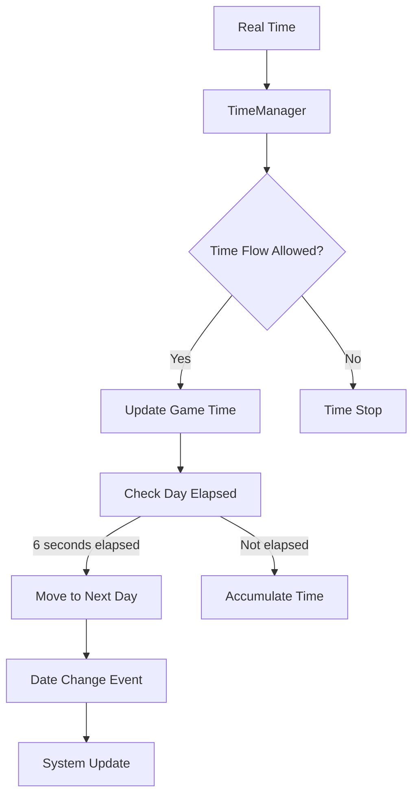
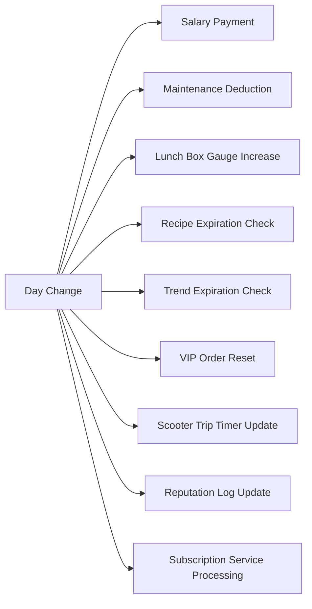

# Time System

## Overview

The time system is a core gameplay element of ChuChuBurger that manages the flow of dates and time within the game and operates various events and systems accordingly. It operates accelerated game time different from real time, and various systems such as salaries, settlements, trends, and business trips operate automatically based on daily/monthly/annual changes.

## System Structure

### Time Flow Mechanism



**Core Features:**
- **Accelerated Time**: 6 real seconds equal one day in game
- **Conditional Flow**: Time flow can be temporarily paused under specific situations
- **Event-based**: Automatic system processing based on date changes

### Major Components

#### 1. TimeManager

The core manager of game time, overseeing time flow and change events.

**Key Properties:**
- `GameTimeSec = 6`: Real-world seconds for one day in game
- `canTimeFlows`: Whether time flow is allowed
- `Utc`: Current in-game time based on UTC

**Core Methods:**
- OnUpdate() — Real-time processing
- UpdateTime() — Game time change and event generation
- OnDayChanged() — Daily system processing (salaries, maintenance, etc.)

<details>
<summary>TimeManager Core Methods</summary>

```lua
-- RootDesk/MyDesk/01. Lobby/TimeManager.mlua
method void OnUpdate(number delta)
method void UpdateTime(any updateTime)
method void OnDayChanged(number changedDay)
method void OnMonthChanged(number changedMonth)
method void OnYearChanged(number changedYear)
```
</details>

#### 2. DateTimeLogic

Handles synchronization between actual UTC time and game time.

**Core Methods:**
- GetUtcNow() — Return current UTC time
- GetUtcNowText() — Convert UTC time to string
- GetUtc9Elapsed() — Elapsed time based on UTC+9

#### 3. TimeUIService

Service that displays time information in UI, updating UI when dates change through UpdateUI() method.

<details>
<summary>Time-related Utility Methods</summary>

```lua
-- RootDesk/MyDesk/Common/DateTimeLogic.mlua
method any GetUtcNow()
method string GetUtcNowText()
method integer GetUtc9Elapsed()

-- RootDesk/MyDesk/01. Lobby/TimeUIService.mlua
method void UpdateUI(integer day, integer month, integer year)
```
</details>

## Time-based Event System

### Daily Events (OnDayChanged)

Systems that execute automatically every day:



**Core Processing:**
1. **Salary Calculation**: Calculate employee salaries with EmployeeManager::ReturnDailySalary()
2. **Maintenance Calculation**: Calculate facility maintenance costs with ManagementDataSetLogic::ReturnMaintenance()
3. **Settlement Reflection**: Accumulate daily income/expenses in PlayerSettlement

<details>
<summary>Daily Event Processing Implementation</summary>

```lua
-- RootDesk/MyDesk/01. Lobby/TimeManager.mlua :: OnDayChanged()
method void OnDayChanged(number changedDay)
    -- Process salaries and maintenance costs
    local salary = self.Entity.EmployeeManager:ReturnDailySalary()
    local maintenanceCost = _ManagementDataSetLogic:ReturnMaintenance(self.Entity, self.Entity.PlayerComponent.UserId)
    
    -- Add values to settlement system
    self.Entity.PlayerSettlement:AddValueForSettlement(_SettlementPropertyEnum.M_AccumSalary, salary)
    self.Entity.PlayerSettlement:AddValueForSettlement(_SettlementPropertyEnum.M_AccumMaintenance, maintenanceCost)
end
```
</details>

### Monthly Events (OnMonthChanged)

Systems that execute automatically every month:

- **Settlement System**: Month-end settlement and revenue calculation
- **Trend System**: Start new trends and end existing trends
- **Business Trip System**: Reset available trip count
- **Ranking System**: Store ranking re-evaluation

### Annual Events (OnYearChanged)

Systems that reset annually:

- **Annual Revenue**: Reset annual accumulated revenue
- **Long-term Goals**: Annual goal reset

## Time Flow Control

### Time Stop Conditions

Time flow is temporarily paused in the following situations:

- **UI Popup Active**: When important UI or settings screens are accessed
- **Mini-game Progress**: While mini-games like trips or exchanges are running
- **Event Progress**: During story events or dialogues
- **Map Movement**: When moving to maps other than lobby

### Time Flow Recovery

RequestTimeFlowClient() method resumes time flow:

`if _UIGroupManager:IsOnLobby(true) then self:TimeFlowsChange(true) end`

Activates time flow only when in lobby state, considering gameplay situations.

<details>
<summary>Time Flow Recovery Logic</summary>

```lua
-- RootDesk/MyDesk/01. Lobby/TimeManager.mlua :: RequestTimeFlowClient()
method void RequestTimeFlowClient()
    if _UIGroupManager:IsOnLobby(true) then
        self:TimeFlowsChange(true)
    end
end
```
</details>

## Data Management

### DB Save/Load

Time data is saved individually per player and restored upon game reconnection:

SaveToDB() method saves current game time to database:

`timeData["Day"] = tostring(self.Utc.Day)` saves each time element as string.

<details>
<summary>Time Data Save Implementation</summary>

```lua
-- RootDesk/MyDesk/01. Lobby/TimeManager.mlua :: SaveToDB()
method void SaveToDB(table saveData)
    local timeData = {}
    timeData["Day"] = tostring(self.Utc.Day)
    timeData["Month"] = tostring(self.Utc.Month)
    timeData["Year"] = tostring(self.Utc.Year)
    saveData["TimeData"] = timeData
end
```
</details>

### First Entry Time Recording

Records player's first game start time as reference point for various calculations:

```lua
property SyncTable<string, integer> FirstEnterUtc
```

## Time-based System Integration

### 1. Settlement System Integration

- Automatic calculation of daily salaries and maintenance costs
- Automatic execution of month-end settlement
- Accumulation of revenue analysis data

### 2. Employee System Integration

- Automatic employee salary payment
- Employee fatigue management
- Employee business trip schedule management

### 3. Recipe System Integration

- Automatic trend start/end processing
- Annual plan progress check
- VIP order season management

### 4. Business Trip System Integration

- Daily/monthly reset of available trip count
- Scooter trip timer management
- Special benefits during festival periods

## Performance Optimization

### Delta Time-based Updates

OnUpdate() method performs efficient time updates based on delta time:

1. **Condition Check**: Verify time flow allowed state with CheckCanTimeFlows()
2. **Time Accumulation**: Accumulate delta time in RealTimeSec
3. **Day Change**: Move to next day when GameTimeSec (6 seconds) is reached

Core Logic: `if self.RealTimeSec >= self.GameTimeSec then`

<details>
<summary>Time Update Optimization Implementation</summary>

```lua
-- RootDesk/MyDesk/01. Lobby/TimeManager.mlua :: OnUpdate()
method void OnUpdate(number delta)
    if self:CheckCanTimeFlows() == false then return end
    if not isvalid(self.Utc) then return end
    
    self.RealTimeSec = self.RealTimeSec + delta
    
    if self.RealTimeSec >= self.GameTimeSec then
        self.RealTimeSec = 0
        local updateTime = self.Utc + TimeSpan.FromDays(1)
        self:UpdateTime(updateTime)
    end
end
```
</details>

### Conditional Execution

Check time flow allowed state first to prevent unnecessary computations.

## Gameplay Strategy

### Importance of Time Management

- **Efficient Operations**: Maximum revenue generation within limited time
- **Strategic Expansion**: Investment timing considering settlement cycles
- **Employee Management**: Employee hiring/firing plans considering payroll dates

### Time-based Optimization

- **Trend Prediction**: Understanding monthly trend change patterns
- **Settlement Preparation**: Fund management for month-end settlement
- **Event Utilization**: Maximum utilization of time-based events

## UI Display

### Time Information UI

Current game time is displayed at top of game screen:

- **Year Display**: Current game year
- **Month/Day Display**: Current month and day
- **Multi-language Support**: Format changes based on player language settings

### Debug Time Display

Debug information for developers:

- **Real-time flow display**
- **Manual time flow control features**
- **Time-based event monitoring**

## Code References

- `RootDesk/MyDesk/01. Lobby/TimeManager.mlua` - Game time core manager
- `RootDesk/MyDesk/Common/DateTimeLogic.mlua` - UTC time synchronization
- `RootDesk/MyDesk/01. Lobby/TimeUIService.mlua` - Time UI service
- `RootDesk/MyDesk/Admin/DebugTimer/DebugTimer.mlua` - Debug time tools
