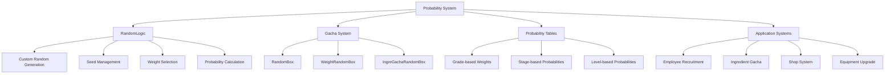

# Probability and Random

ChuChu Burger has built a sophisticated probability system to provide fair and unpredictable gameplay. Through custom random generators, weight-based gacha systems, and various probability tables, it provides game enjoyment and balance.

## Probability System Overview

### Core Probability Architecture



## RandomLogic Custom Random System

### Custom Random Generator

Independent random generator to ensure game fairness.

```lua
-- RandomLogic.mlua :: Custom random generation
property integer Seed = 0

method integer RandomInteger()
    local next = self.Seed * 6364136223846793005 + 1442695040888963407
    self.Seed = next & 0x7fffffff
    return next >> 16 & 0x7fffffff
end

method number RandomDouble()
    return self:RandomInteger() / 0x80000000
end

method integer RandomIntegerRange(integer a, integer b)
    return self:RandomInteger() % (b - a + 1) + a
end
```

#### Seed Management System

```lua
-- RandomLogic.mlua :: Seed management
method void NextSeed(SyncTable<integer> seed)
    self.Seed = seed[1]
    seed[1] = self:RandomIntegerRange(0, 123456789)
end

method number GetRandomDouble(SyncTable<integer> seed)
    self:NextSeed(seed)
    return self:RandomDouble()
end

-- Generate multiple random values
method SyncTable<number> GetRandomDoubles(SyncTable<integer> seed, integer count)
    self:NextSeed(seed)
    
    local values = {}
    for i = 1, count do
        table.insert(values, self:RandomDouble())
    end
    return values
end

-- Usage example
local seed = {12345}
local randomValue = _RandomLogic:GetRandomDouble(seed)
local multipleValues = _RandomLogic:GetRandomDoubles(seed, 5)  -- 5 random values
```

### Weight-based Selection System

```lua
-- RandomLogic.mlua :: ReturnRandomPickWeight()
method integer ReturnRandomPickWeight(table weights)
    local eventIndex = 1
    local totalWeight = 0
    local eventWeights = {}
    
    -- Calculate total weight
    for i, key in pairs(weights) do
        local weight = weights[i]
        if not _UtilLogic:IsNilorEmptyString(weight) then
            totalWeight = tonumber(totalWeight) + tonumber(weight)
            eventWeights[i] = tonumber(weight)
        end
    end
    
    -- Weight-based selection
    local randNum = _UtilLogic:RandomIntegerRange(1, totalWeight)
    
    if randNum <= eventWeights[1] then
        eventIndex = 1
    elseif randNum <= eventWeights[1] + eventWeights[2] then
        eventIndex = 2
    elseif randNum <= eventWeights[1] + eventWeights[2] + eventWeights[3] then
        eventIndex = 3
    -- ... supports up to 6
    else
        eventIndex = 6
    end
    
    return eventIndex
end

-- Usage example
local weights = {30, 50, 20}  -- 30%, 50%, 20% probability
local selectedIndex = _RandomLogic:ReturnRandomPickWeight(weights)
```

### Probability Calculation Utilities

```lua
-- RandomLogic.mlua :: ReturnIsDropProb100()
method boolean ReturnIsDropProb100(integer prob)
    if tonumber(prob) < 1 then
        return false
    end
    
    if _UtilLogic:RandomIntegerRange(1, 100) <= tonumber(prob) then
        return true
    else
        return false
    end
end

-- Usage example
local dropChance = 15  -- 15% probability
local isDropped = _RandomLogic:ReturnIsDropProb100(dropChance)

if isDropped then
    -- Item drop
    print("Item has been dropped!")
end
```

### Permutation and Shuffle

```lua
-- RandomLogic.mlua :: RandomIntegersInRange()
method table RandomIntegersInRange(integer range)
    local ints = {}
    for i = 1, range do
        table.insert(ints, i)
    end
    
    return _StringUtilLogic:ShuffleStringTable(ints)
end

-- Usage example
local shuffledNumbers = _RandomLogic:RandomIntegersInRange(10)
-- Result: {3, 7, 1, 9, 2, 5, 8, 4, 6, 10} (randomly shuffled 1~10)
```

## RandomBox Gacha System

### Basic RandomBox Structure

Core gacha system that selects items based on weight.

```lua
-- RandomBox.mlua :: Basic structure
@Struct
script RandomBox

property table items = {}           -- Item storage (weight cumulative value → item)
property table itemWeight = {}      -- Weight cumulative value array
property integer totalWeight = 0    -- Total weight

-- Add item
method boolean AddItem(integer weight, any value)
    if weight == 0 then
        return false
    end
    
    local nextWeight = self.totalWeight + weight
    self.items[self.totalWeight] = value  -- Use current cumulative value as key
    table.insert(self.itemWeight, self.totalWeight)
    self.totalWeight = nextWeight
end

-- Usage example
local gachaBox = RandomBox()
gachaBox:AddItem(50, "Common Item")    -- 50% probability
gachaBox:AddItem(30, "Rare Item")    -- 30% probability  
gachaBox:AddItem(15, "Epic Item")    -- 15% probability
gachaBox:AddItem(5, "Legendary Item") -- 5% probability
```

#### Binary Search-based Selection

```lua
-- RandomBox.mlua :: Pick()
method any Pick()
    if self.totalWeight < 1 then
        return nil
    end
    
    if #self.itemWeight == 1 then
        return self.items[self.itemWeight[1]]
    end
    
    local pickNumber = _UtilLogic:RandomIntegerRange(0, self.totalWeight - 1)
    local pickedIndex = self:FindMaxValueLessThanOrEqual(self.itemWeight, pickNumber)
    
    return self.items[pickedIndex]
end

-- Efficient selection with binary search
method integer FindMaxValueLessThanOrEqual(table arr, integer target)
    local left, right = 1, #arr
    local result = -1 
    
    while left <= right do
        local mid = math.floor((left + right) / 2)
    
        if arr[mid] <= target then
            result = arr[mid] 
            left = mid + 1 
        else
            right = mid - 1 
        end
    end
    
    return result
end

-- Usage example
local selectedItem = gachaBox:Pick()
print("Selected item: " .. selectedItem)
```

#### Dynamic Item Removal

```lua
-- RandomBox.mlua :: RemoveItem()
method integer RemoveItem(any value)
    local weight = 0
    for i = 1, self.totalWeight do
        if self.items[i] == value then
            table.remove(self.items, i)
            weight += 1
        end
    end
    
    return weight  -- Return removed weight
end

-- Usage example
local removedWeight = gachaBox:RemoveItem("Rare Item")
print("Removed weight: " .. removedWeight)
```

## IngreGachaRandomBoxData Ingredient Gacha

### Grade-based Weight System

Advanced weight management system used in ingredient gacha.

```lua
-- IngreGachaRandomBoxData.mlua :: Structure
@Struct
script IngreGachaRandomBoxData

property string Id = ""
property SyncTable<integer, integer> GradeWeight  -- Grade-based weights

method void Load(any dataTable, integer index)
    local row = dataTable:GetRow(index)
    
    self.Id = row:GetItem("Id")
    local gradeTb = _UtilLogic:Split(row:GetItem("ContainsGrade"), ",")
    local weightTb = _UtilLogic:Split(row:GetItem("GradeWeight"), ",")
    
    for i = 1, #gradeTb do
        local grade = tonumber(gradeTb[i])
        local weight = tonumber(weightTb[i])
        
        self.GradeWeight[grade] = weight
    end
end

-- CSV data example:
-- Id: "IN_001", ContainsGrade: "1,2,3,4,5", GradeWeight: "50,30,15,4,1"
-- Grade 1: 50%, Grade 2: 30%, Grade 3: 15%, Grade 4: 4%, Grade 5: 1%
```

#### Grade-based Probability Calculation

```lua
-- IngreGachaRandomBoxData.mlua :: Pick()
method table Pick(Entity player, integer count)
    local result = {}
    
    local gachaType = _UtilLogic:SubString(self.Id, 1, 2)  -- "IN" or "BN"
    
    -- Grade selection function
    local getGrade = function()
        local gradePool = {}
        for grade, weight in pairs(self.GradeWeight) do
            for i = 1, weight do
                table.insert(gradePool, grade)  -- Add to pool by weight amount
            end
        end
        
        return gradePool[_UtilLogic:RandomIntegerRange(1, #gradePool)]
    end
    
    if gachaType == "IN" then 
        -- Ingredient gacha
        local pool = _StageDataSetLogic:GetStageTotalIngredient(player.PlayerStage.NowStage, player)
        
        for i = 1, count do	
            local gachaPool = self:GetGachaPool(player, pool, gachaType, getGrade())
            local randomId = gachaPool[_UtilLogic:RandomIntegerRange(1, #gachaPool)]
            table.insert(result, randomId)
        end
        
    elseif gachaType == "BN" then 
        -- Bun gacha
        local pool = table.keys(_IngredientDataSetLogic.BunData)
        for i = 1, count do
            local gachaPool = self:GetGachaPool(player, pool, gachaType, getGrade())
            local randomId = gachaPool[_UtilLogic:RandomIntegerRange(1, #gachaPool)]
            table.insert(result, randomId)
        end
    end
    
    return result
end

-- Usage example
local gachaData = IngreGachaRandomBoxData()
-- ... data loading ...
local rewards = gachaData:Pick(player, 10)  -- 10 pulls
```

## Application Systems

### Employee Recruitment Probability System

Multi-layered probability system used in employee recruitment.

#### Recruitment Pool Generation

```lua
-- PlayerEmployment.mlua :: OnProcessingRecruit() excerpt
@ExecSpace("ServerOnly")
method void OnProcessingRecruit(integer employmentId)
    -- Provide fixed employees during tutorial
    if self.Entity.PlayerStage.NowStage == 1 then
        if self.Entity.PlayerAchievement:ReturnAchievementProgress(_TutorialAchievementTypeEnum.EmploymentCount) < 1 then
            self:Recruit_Fix(employmentId, _EmployeeTypeEnum.Serving)
            return
        end
    end
    
    -- Select 5 employees from random employee pool
    local empIdRandomBox = self:ReturnEmploymentChuchuPool(employmentId)
    local empList = {}
    
    for i = 1, self.DEFINE_EMPNUM do
        -- Select 5 employees without duplicates
        local idx = _UtilLogic:RandomIntegerRange(1, #empIdRandomBox)
        local newEmployeeId = empIdRandomBox[idx]
        empList[i] = newEmployeeId
        table.remove(empIdRandomBox, idx)  -- Prevent duplicates
    end
    
    self.NewEmployeeIdList = empList
end
```

#### Recruitment Level-based Probability Adjustment

```lua
-- PlayerEmployment.mlua :: CalcEmploymentStartLv()
method table CalcEmploymentStartLv()
    local nowStage = self.Entity.PlayerStage.NowStage
    local stageValue = _StageDataSetLogic:GetStageData(nowStage).EmployeeInitLevel
    
    local lvSum = self.EmploymentLv + self.ScoutLv
    local v = _GetConfigDataLogic:GetConfigNumDataByKey("RecruitmentPerEmployeeInitLevelUp") 
    local lvBonus = math.floor(lvSum / v) - 1 
    local maxLv = _GetConfigDataLogic:GetConfigNumDataByKey("EmployeeInitLevelMax") 
    local maxLvBonus = maxLv - stageValue
    lvBonus = math.min(lvBonus, maxLvBonus) 
    
    local chuchuStartLv = stageValue + lvBonus
    
    return {math.floor(chuchuStartLv), stageValue, math.floor(lvBonus)}
end

-- Each recruitment increases recruitment level, increasing chance of higher level employees
```

#### Random Employee Selection

```lua
-- EmployeeService.mlua :: ReturnRandomCharId()
method string ReturnRandomCharId(Entity player, string type)
    local employees = player.EmployeeManager.EmployeeDetailTable
    local randomTable = {}
    
    for i = 1, #employees do
        local data = employees[i]
        local id = data.Id
        
        local empData = _EmployeeService:GetData(id)
        if _UtilLogic:IsNilorEmptyString(type) == false then
            if empData.Type ~= type then
                continue  -- Exclude if type doesn't match
            end
        end
        
        table.insert(randomTable, id)
    end
    
    local randomIndex = _UtilLogic:RandomIntegerRange(1, #randomTable)
    local randomId = randomTable[randomIndex]
    
    return randomId
end

-- Usage example
local randomServingEmployee = _EmployeeService:ReturnRandomCharId(player, "Serving")
local randomAnyEmployee = _EmployeeService:ReturnRandomCharId(player, "")  -- Any type
```

### Shop Product Display Probability

System that manages the probability of products being displayed in shops.

```lua
-- ShopDataLogic.mlua :: PickProductsByShopId()
method table PickProductsByShopId(string shopId)
    local candidateProduct = self.ProductIdsByShopId[shopId]
    local picked = {}
    
    local dependetCandidate = {}
    for i, id in ipairs(candidateProduct) do
        local product = self:GetShopProductData(id)
        if product == nil then
            continue
        end
        
        if product.PutoutType == "Independent" then
            -- Independent probability: each decides display individually
            local randomValue = _UtilLogic:RandomIntegerRange(0, 100000) 
            if product.PutoutValue > randomValue then
                table.insert(picked, id)
            end
            
        elseif product.PutoutType:len() > 0 then
            -- Dependent probability: weight-based selection within same type
            if dependetCandidate[product.PutoutType] == nil then
                dependetCandidate[product.PutoutType] = RandomBox()
            end 
            local randomBox = dependetCandidate[product.PutoutType]
            randomBox:AddItem(product.PutoutValue, product.ProductId)
        end
    end
    
    -- Select one from each type of dependent products
    for k, v in pairs(dependetCandidate) do
        local pickedId = v:Pick()
        table.insert(picked, pickedId)
    end
    
    return picked
end

-- Example:
-- Independent products: individual probability display (multiple can display simultaneously)
-- "WeaponType" dependent products: only one weapon type selected for display
-- "ArmorType" dependent products: only one armor type selected for display
```

### Tournament Rival Selection

System for randomly selecting rivals in tournaments.

```lua
-- TrialLogic.mlua :: ReturnRandomRivalId()
method string ReturnRandomRivalId(Entity player)
    local rivalPool = {}
    
    for id, data in pairs(_EmployeeService.EmployeeData) do
        local empData = data
        
        -- Exclude if same as selected employee
        if not _UtilLogic:IsNilorEmptyString(player.PlayerTrial.SelectedEmployeeId) then
            if id == player.PlayerTrial.SelectedEmployeeId then
                continue
            end
        end
        
        -- Exclude if already appeared as rival
        if isvalid(player.PlayerTrial.CharacterData) then
            local isSame = false
            
            for k, v in pairs(player.PlayerTrial.CharacterData) do
                if v == id then
                    isSame = true
                    break
                end
            end
            
            if isSame then
                continue
            end
        end
        
        table.insert(rivalPool, id)
    end
    
    local randIndex = _UtilLogic:RandomIntegerRange(1, #rivalPool)
    return rivalPool[randIndex]
end

-- Select new rivals while avoiding duplicates
```

### Equipment Upgrade Probability

Complex probability calculation system used in equipment enhancement.

```lua
-- Equipment upgrade probability calculation (extracted from documentation)
@ExecSpace("Server")
method boolean UpgradeProcess(integer upgradeProb)
    -- Complex seed generation to ensure unpredictable randomness
    local seedOffset = 1
    for i=1, 10 do
        seedOffset = math.random(1, 100000)
    end
    local seed = os.time() * 1000000 + os.clock() * 1000000 + seedOffset
    math.randomseed(seed)
    
    local res = math.random(1, 100)
    
    -- Success if result is within probability
    if res <= upgradeProb then
        return true
    end
    
    return false
end

-- Upgrade process
@ExecSpace("Server")
method void RequestUpgradeEmployeeEquip(string employeeId, string userId, string currencyId)
    local equipUpgradeData = _EmployeeEquipUpgradeDataLogic:GetEmployeeEquipUpgrageData(nextEquipLevel)
    local upgradeCost = equipUpgradeData.UpgradeCost
    local upgradeProb = equipUpgradeData.UpgradeProb
    
    -- Deduct cost
    userEntity.PlayerInventory:RemoveItem(currencyId, upgradeCost, "Employee Equip Upgrade")
    
    -- Calculate probability
    local res = self:UpgradeProcess(upgradeProb)
    
    if res then
        -- Success: increase equipment level
        userEntity.EmployeeManager:AddEmployeeEquipLevel(employeeId)
    else
        -- Failure: only consume item
    end
end
```

## Advanced Probability Techniques

### Perceived Probability Adjustment

Techniques to adjust the probability felt by players versus actual probability.

#### Consecutive Failure Correction

```lua
-- Probability correction system for consecutive failures (example)
local function GetAdjustedProbability(baseProbability, consecutiveFailures)
    local adjustment = consecutiveFailures * 5  -- Increase by 5% for each failure
    local adjustedProb = baseProbability + adjustment
    return math.min(adjustedProb, 100)  -- Cap at 100%
end

-- Usage example
local baseProb = 20  -- Base 20% probability
local failures = 3   -- 3 consecutive failures
local adjustedProb = GetAdjustedProbability(baseProb, failures)
-- Result: 35% (20% + 15%)
```

#### Variable Weight System

```lua
-- Dynamically adjust weights based on time or situation
local function GetTimeBasedWeight(baseWeight, timeOfDay)
    if timeOfDay >= 18 and timeOfDay <= 22 then
        -- Increase rare item probability during evening hours
        return baseWeight * 1.5
    elseif timeOfDay >= 2 and timeOfDay <= 6 then
        -- Decrease probability during early morning hours
        return baseWeight * 0.7
    else
        return baseWeight
    end
end
```

### Seed Synchronization

System to ensure identical random results between server and client in multiplayer environments.

```lua
-- Generate synchronized random values
local function GetSyncedRandom(player, seedKey)
    local playerSeed = player.PlayerData.RandomSeeds[seedKey]
    if playerSeed == nil then
        playerSeed = {math.random(1, 999999)}
        player.PlayerData.RandomSeeds[seedKey] = playerSeed
    end
    
    return _RandomLogic:GetRandomDouble(playerSeed)
end

-- Usage example
local gachaResult = GetSyncedRandom(player, "dailyGacha")
```

### Probability Analysis Tools

Developer tools for probability verification.

```lua
-- Probability distribution test
local function TestProbabilityDistribution(testFunction, iterations)
    local results = {}
    
    for i = 1, iterations do
        local result = testFunction()
        results[result] = (results[result] or 0) + 1
    end
    
    -- Result analysis
    for outcome, count in pairs(results) do
        local percentage = (count / iterations) * 100
        print(string.format("Result %s: %d times (%.2f%%)", outcome, count, percentage))
    end
end

-- Usage example
TestProbabilityDistribution(function()
    local gachaBox = RandomBox()
    gachaBox:AddItem(70, "Common")
    gachaBox:AddItem(25, "Rare")
    gachaBox:AddItem(5, "Epic")
    return gachaBox:Pick()
end, 10000)
```

## Performance Optimization

### Probability Table Caching

```lua
-- Pre-calculate and cache probability tables
local probabilityCache = {}

local function GetCachedProbabilityTable(configId)
    if probabilityCache[configId] == nil then
        local config = _DataService:GetTable(configId)
        local probabilityTable = {}
        
        for i = 1, config:GetRowCount() do
            local row = config:GetRow(i)
            local weight = tonumber(row:GetItem("Weight"))
            local item = row:GetItem("ItemId")
            table.insert(probabilityTable, {weight = weight, item = item})
        end
        
        probabilityCache[configId] = probabilityTable
    end
    
    return probabilityCache[configId]
end
```

### Bulk Gacha Optimization

```lua
-- Batch processing for efficiency in bulk gacha
local function BatchGacha(gachaBox, count)
    local results = {}
    local batchSize = math.min(count, 100)  -- Max 100 at once
    
    for batch = 1, math.ceil(count / batchSize) do
        local remaining = math.min(batchSize, count - (batch - 1) * batchSize)
        
        for i = 1, remaining do
            table.insert(results, gachaBox:Pick())
        end
        
        -- Allow garbage collection between batches
        if batch % 10 == 0 then
            collectgarbage("step", 200)
        end
    end
    
    return results
end
```

## Developer Guide

### Adding New Gacha Systems

1. **Define Data Structure**: Define probability table in CSV
2. **Create RandomBox**: Add weights and items
3. **Verify Probability**: Confirm distribution through testing
4. **UI Integration**: Display results to users

### Probability Balancing Guide

1. **Set Base Probability**: Basic probability fitting game design
2. **Staged Adjustment**: Probability changes according to player progress
3. **Perceived Correction**: Mechanisms to prevent consecutive failures
4. **Data Analysis**: Adjustment through actual play data

### Performance Considerations

1. **Memory Usage**: Efficient management of large probability tables
2. **Computation Optimization**: Caching of frequent probability calculations
3. **Synchronization Cost**: Server-client probability synchronization
4. **Garbage Collection**: Memory management during bulk gacha

### Debugging and Testing

```lua
-- Probability system debugging
local function DebugRandomSystem()
    -- Check seed state
    print("Current Seed: " .. _RandomLogic.Seed)
    
    -- Test probability distribution
    local testResults = {}
    for i = 1, 1000 do
        local result = _RandomLogic:RandomIntegerRange(1, 10)
        testResults[result] = (testResults[result] or 0) + 1
    end
    
    for i = 1, 10 do
        print(string.format("Value %d: %d times (%.1f%%)", i, testResults[i] or 0, ((testResults[i] or 0) / 1000) * 100))
    end
end

-- Gacha system verification
local function VerifyGachaSystem(gachaBox, iterations)
    local results = {}
    for i = 1, iterations do
        local item = gachaBox:Pick()
        results[item] = (results[item] or 0) + 1
    end
    
    print("Gacha Results after " .. iterations .. " pulls:")
    for item, count in pairs(results) do
        local percentage = (count / iterations) * 100
        print(string.format("%s: %d (%.2f%%)", item, count, percentage))
    end
end
```

## Code References

### Core Random System
- `RootDesk/MyDesk/Common/RandomLogic.mlua :: RandomInteger(), RandomIntegerRange()` — Custom random generator
- `RootDesk/MyDesk/Common/RandomLogic.mlua :: ReturnRandomPickWeight()` — Weight-based selection
- `RootDesk/MyDesk/Common/RandomLogic.mlua :: ReturnIsDropProb100()` — Probability calculation utilities

### Gacha System
- `RootDesk/MyDesk/Common/Gacha/RandomBox.mlua :: AddItem(), Pick()` — Basic gacha system
- `RootDesk/MyDesk/Common/Gacha/RandomBox.mlua :: FindMaxValueLessThanOrEqual()` — Binary search-based selection
- `RootDesk/MyDesk/Common/Gacha/Ingredient/IngreGachaRandomBoxData.mlua :: Pick()` — Ingredient gacha system

### Application Systems
- `RootDesk/MyDesk/11. Employment/PlayerEmployment.mlua :: OnProcessingRecruit()` — Employee recruitment probability
- `RootDesk/MyDesk/Shop/ShopDataLogic.mlua :: PickProductsByShopId()` — Shop product display probability
- `RootDesk/MyDesk/10. Trial/TrialLogic.mlua :: ReturnRandomRivalId()` — Tournament rival selection

### Employee-related Probability
- `RootDesk/MyDesk/02. Employee/EmployeeService.mlua :: ReturnRandomCharId()` — Random employee selection
- `RootDesk/MyDesk/11. Employment/PlayerEmployment.mlua :: CalcEmploymentStartLv()` — Recruitment level calculation

### Core Interfaces
```lua
-- RandomLogic main methods
method integer RandomIntegerRange(integer a, integer b)
method number RandomDouble()
method integer ReturnRandomPickWeight(table weights)
method boolean ReturnIsDropProb100(integer prob)

-- RandomBox main methods
method boolean AddItem(integer weight, any value)
method any Pick()
method integer RemoveItem(any value)
method integer FindMaxValueLessThanOrEqual(table arr, integer target)

-- IngreGachaRandomBoxData main methods
method void Load(any dataTable, integer index)
method table Pick(Entity player, integer count)
method table GetGachaPool(Entity player, table originPool, string type, integer grade)
```
