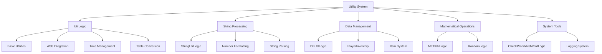

# Utility Tools

ChuChu Burger provides various utility tools and common functions to improve development efficiency and code quality. These tools are utilized in all areas of game development, including string processing, mathematical operations, data conversion, and inventory management, helping to ensure consistent code writing.

## Utility System Overview

### Core Utility Architecture



## UtilLogic Native Utilities

### Basic String Processing

Powerful string processing tools provided by MapleStory Worlds.

```lua
-- String containment check
local hasWord = _UtilLogic:Contains("Hello World", "World")  -- true
print("Contains check: " .. tostring(hasWord))

-- String insertion
local inserted = _UtilLogic:Insert("Hello!", 6, " World")  -- "Hello World!"
print("Inserted string: " .. inserted)

-- String splitting
local parts = _UtilLogic:Split("apple,banana,orange", ",")
for i, part in ipairs(parts) do
    print("Part " .. i .. ": " .. part)
end
-- Result: "apple", "banana", "orange"

-- String replacement
local replaced = _UtilLogic:Replace("Hello World", "World", "Universe")
print("Replaced: " .. replaced)  -- "Hello Universe"

-- Whitespace trimming
local trimmed = _UtilLogic:Trim("  Hello World  ")
print("Trimmed: '" .. trimmed .. "'")  -- "Hello World"
```

#### Advanced String Processing

```lua
-- Substring extraction
local substring = _UtilLogic:SubString("Hello World", 7, 5)  -- "World"
print("Substring: " .. substring)

-- Leading and trailing whitespace removal (individual)
local startTrimmed = _UtilLogic:TrimStart("  Hello")  -- "Hello"
local endTrimmed = _UtilLogic:TrimEnd("World  ")      -- "World"

-- Empty string check
local isEmpty = _UtilLogic:IsNilorEmptyString("")     -- true
local isEmpty2 = _UtilLogic:IsNilorEmptyString(nil)   -- true
local isEmpty3 = _UtilLogic:IsNilorEmptyString("Hi")  -- false
```

### Table and String Conversion

```lua
-- Convert table to string
local myTable = {name = "John", age = 25, score = 100}
local tableString = _UtilLogic:TableToString(myTable)
print("Table as string: " .. tableString)

-- Convert string to table
local restoredTable = _UtilLogic:StringToTable(tableString)
print("Restored name: " .. restoredTable.name)

-- Load string data into existing table
local targetTable = {}
_UtilLogic:StringToTable(targetTable, tableString)
print("Loaded age: " .. targetTable.age)
```

### Time Management

```lua
-- Check elapsed time
local elapsedTime = _UtilLogic.ElapsedSeconds
print("Client elapsed time: " .. elapsedTime .. " seconds")

local serverTime = _UtilLogic.ServerElapsedSeconds
print("Server elapsed time: " .. serverTime .. " seconds")

-- Local time conversion (client-only)
@ExecSpace("ClientOnly")
local function GetLocalTime()
    local utcTime = DateTime.UtcNow
    local localTime = _UtilLogic:GetLocalTimeFrom(utcTime)
    
    print("UTC Time: " .. tostring(utcTime))
    print("Local Time: " .. tostring(localTime))
    
    return localTime
end
```

### Web Integration Features

```lua
-- Open URL (client-only)
@ExecSpace("Client")
local function OpenExternalLink()
    _UtilLogic:OpenUrl("https://www.example.com")
end

-- Open web view popup (client-only)
@ExecSpace("ClientOnly")
local function ShowWebPopup()
    _UtilLogic:OpenWebViewPopup("Game Guide", "https://guide.example.com", true)
end

-- Close web view popup
@ExecSpace("ClientOnly")
local function CloseWebPopup()
    _UtilLogic:CloseWebViewPopup()
end
```

### Random Functions

```lua
-- Random integer within range
local randomNum = _UtilLogic:RandomIntegerRange(1, 100)
print("Random number (1-100): " .. randomNum)

-- Random float (0.0 ~ 1.0)
local randomFloat = _UtilLogic:RandomNumber()
print("Random float: " .. randomFloat)

-- Table shuffle
local numbers = {1, 2, 3, 4, 5}
local shuffled = _UtilLogic:ShuffleTable(numbers)
for i, num in ipairs(shuffled) do
    print("Shuffled " .. i .. ": " .. num)
end
```

### File Management (Client-only)

```lua
-- Append lines to file
@ExecSpace("ClientOnly")
local function WriteToFile()
    local lines = {"Line 1", "Line 2", "Line 3"}
    _UtilLogic:AppendFileLines("game_log.txt", lines)
end

-- Read from file
@ExecSpace("ClientOnly")
local function ReadFromFile()
    local content = _UtilLogic:ReadFileLines("game_log.txt")
    for i, line in ipairs(content) do
        print("File line " .. i .. ": " .. line)
    end
end
```

## StringUtilLogic String-Specific Tools

### Number Formatting System

Provides commonly used number display functions in games.

#### Thousands Separator

```lua
-- StringUtilLogic.mlua :: ReturnThousandsSeparatedString()
method string ReturnThousandsSeparatedString(integer value)
    if value == 0 then return "0" end
    
    local sign = value < 0 and "-" or ""
    value = math.abs(value)
    
    local prev_string = tostring(value)
    local pos = string.len(prev_string) % 3
    
    if pos == 0 then 
        pos = 3 
    end
        
    local new_string = string.sub(prev_string, 1, pos)..string.gsub(string.sub(prev_string, pos + 1), "(...)", ",%1") 
    
    return sign..new_string
end

-- Usage example
local formatted = _StringUtilLogic:ReturnThousandsSeparatedString(1234567)
print(formatted)  -- "1,234,567"

local negative = _StringUtilLogic:ReturnThousandsSeparatedString(-999999)
print(negative)   -- "-999,999"
```

#### K/M/B Unit Conversion

```lua
-- StringUtilLogic.mlua :: FormatNumber()
method string FormatNumber(integer value)
    function formatNumberWithKMB(number)
        local result
        
        if number >= 1000000000 then
            local billions = number / 1000000000	
            result = customFormatString(billions).."B"
                            
        elseif number >= 1000000 then
            local millions = number / 1000000
            result = customFormatString(millions).."M"
                
         elseif number >= 1000 then
            local thousands = number / 1000
            result = customFormatString(thousands).."K"
                
      	 else
            result = tostring(number)
        end
        
        return result
    end
    
    return formatNumberWithKMB(value)
end

-- Usage example
local formatted1 = _StringUtilLogic:FormatNumber(1500)      -- "1.5K"
local formatted2 = _StringUtilLogic:FormatNumber(2500000)   -- "2.5M"
local formatted3 = _StringUtilLogic:FormatNumber(3200000000) -- "3.2B"
```

#### Separator Removal

```lua
-- StringUtilLogic.mlua :: ReturnOriginString()
method string ReturnOriginString(string value)
    local prev_string = tostring(value)
    if not _UtilLogic:Contains(prev_string, ",") then 
        return prev_string 
    end
    
    while _UtilLogic:Contains(prev_string, ",") do
        prev_string = _UtilLogic:Replace(prev_string, ",", "")
    end
    
    return prev_string
end

-- Usage example
local original = _StringUtilLogic:ReturnOriginString("1,234,567")
print(original)  -- "1234567"
local number = tonumber(original)  -- 1234567
```

### Item String Parsing

```lua
-- StringUtilLogic.mlua :: ParseItemsStringToItemTable()
method SyncTable<string, integer> ParseItemsStringToItemTable(string itemsString)
    local result = {} 
    for pair in itemsString:gmatch("([^:]+)") do
        local foundIndex, _ = string.find(pair, ",")
        if foundIndex == nil then
            continue
        end
        local key = string.sub(pair, 1, foundIndex - 1)
        local value = tonumber(string.sub(pair, foundIndex + 1))
        result[key] = value
    end
    
    return result
end

-- Usage example
local itemString = "G0001,1000:M4001,5:M4002,3:"
local itemTable = _StringUtilLogic:ParseItemsStringToItemTable(itemString)
-- Result: {["G0001"] = 1000, ["M4001"] = 5, ["M4002"] = 3}

for itemId, count in pairs(itemTable) do
    print("Item: " .. itemId .. ", Count: " .. count)
end
```

### Type Conversion Utilities

```lua
-- Number to string
local numStr = _StringUtilLogic:NumToString(42.7)  -- "42"
print("Number to string: " .. numStr)

-- String to integer
local intNum = _StringUtilLogic:StringToInt("123")  -- 123
print("String to int: " .. intNum)

-- String to boolean
local bool1 = _StringUtilLogic:GetBoolByString("true", false)   -- true
local bool2 = _StringUtilLogic:GetBoolByString("false", true)   -- false
local bool3 = _StringUtilLogic:GetBoolByString("", true)        -- true (default)
local bool4 = _StringUtilLogic:GetBoolByString("TRUE", false)   -- true
```

### Table Processing

```lua
-- Convert SyncTable to string
local syncTable = {"apple", "banana", "cherry"}
local csvString = _StringUtilLogic:GetSyncTableVStr(syncTable)
print("CSV string: " .. csvString)  -- "apple,banana,cherry"

-- Table shuffle
local items = {"sword", "shield", "potion", "scroll"}
local shuffled = _StringUtilLogic:ShuffleStringTable(items)
-- Result: randomly shuffled order
```

### Time Formatting

```lua
-- UTC time to RFC3339 format
local utcTime = os.time()
local rfc3339 = _StringUtilLogic:get_utc_time_rfc3339_format(utcTime)
print("RFC3339 format: " .. rfc3339)  -- "2024-01-15T14:30:25Z"
```

### Resource RUID Management

StringUtilLogic manages RUIDs for frequently used resources as constants.

```lua
-- Common RUIDs
local emptyIcon = _StringUtilLogic.EmptyRUID           -- Empty icon
local starIcon = _StringUtilLogic.StarRUID             -- Star icon  
local burgerIcon = _StringUtilLogic.BurgerRUID         -- Burger icon
local emptyStarIcon = _StringUtilLogic.EmptyStarRUID   -- Empty star icon

-- Time-based icons
local morningIcon = _StringUtilLogic.MorningIconRuid   -- Morning icon
local afternoonIcon = _StringUtilLogic.AfternoonIconRuid -- Afternoon icon  
local nightIcon = _StringUtilLogic.NightIconRuid       -- Night icon

-- Materials
local grayMaterial = _StringUtilLogic.GrayScaleMaterial -- Grayscale material

-- Usage in UI
local function SetTimeIcon(timeOfDay)
    local iconRUID
    if timeOfDay >= 6 and timeOfDay < 12 then
        iconRUID = _StringUtilLogic.MorningIconRuid
    elseif timeOfDay >= 12 and timeOfDay < 18 then
        iconRUID = _StringUtilLogic.AfternoonIconRuid
    else
        iconRUID = _StringUtilLogic.NightIconRuid
    end
    
    timeIconSprite.SpriteGUIRendererComponent.ImageRUID = iconRUID
end
```

## DBUtilLogic Database Utilities

### Safe Data Extraction

Tools for safely extracting values from databases or tables.

```lua
-- DBUtilLogic.mlua :: Safe value extraction
method number GetNumberByTable(table dataTable, string key, integer defaultValue)
    local value = dataTable[key]
    if value == nil then
        return defaultValue
    end
    return tonumber(value)
end

method string GetStringByTable(table dataTable, string key, string defaultValue)
    local value = dataTable[key]
    if value == nil then
        return defaultValue
    end
    return value
end

-- Usage example
local playerData = {
    name = "John",
    level = "25",
    exp = "1500"
}

-- Safe value extraction (with default support)
local playerName = _DBUtilLogic:GetStringByTable(playerData, "name", "Unknown")     -- "John"
local playerLevel = _DBUtilLogic:GetNumberByTable(playerData, "level", 1)          -- 25
local playerMoney = _DBUtilLogic:GetNumberByTable(playerData, "money", 0)          -- 0 (default)
local playerClass = _DBUtilLogic:GetStringByTable(playerData, "class", "Novice")   -- "Novice" (default)

print(string.format("Player: %s, Level: %d, Money: %d, Class: %s", 
      playerName, playerLevel, playerMoney, playerClass))
```

### Empty Table Check

```lua
-- DBUtilLogic.mlua :: IsEmpty()
method boolean IsEmpty(table tbl)
    if tbl == nil then
        return true
    end
    
    if next(tbl) == nil then
        return true
    end
    
    return false
end

-- Usage example
local emptyTable = {}
local nilTable = nil
local filledTable = {name = "test"}

print("Empty table: " .. tostring(_DBUtilLogic:IsEmpty(emptyTable)))   -- true
print("Nil table: " .. tostring(_DBUtilLogic:IsEmpty(nilTable)))       -- true
print("Filled table: " .. tostring(_DBUtilLogic:IsEmpty(filledTable))) -- false

-- Actual use case
local function ProcessPlayerData(playerData)
    if _DBUtilLogic:IsEmpty(playerData) then
        print("No player data available.")
        return
    end
    
    -- Data processing logic
    local name = _DBUtilLogic:GetStringByTable(playerData, "name", "Unknown")
    print("Processing data for: " .. name)
end
```

## MathUtilLogic Mathematical Utilities

### Vector3 Comparison

Position comparison functions commonly used in games.

```lua
-- MathUtilLogic.mlua :: Vector3AlmostEquals()
method boolean Vector3AlmostEquals(Vector3 pos1, Vector3 pos2)
    if pos1 == nil and pos2 == nil then
        return true
    end
    
    if pos1 == nil or pos2 == nil then
        return false
    end
    
    if math.almostequal(pos1.x, pos2.x) and math.almostequal(pos1.y, pos2.y) then
        return true
    end
    
    return false
end

-- Usage example
local playerPos = Vector3(10.0001, 20.0002, 0)
local targetPos = Vector3(10.0000, 20.0000, 0)

local isClose = _MathUtilLogic:Vector3AlmostEquals(playerPos, targetPos)
print("Positions almost equal: " .. tostring(isClose))  -- true

-- Actual game usage
local function IsPlayerAtTarget(player, target)
    local playerPosition = player.TransformComponent.Position
    local targetPosition = target.TransformComponent.Position
    
    if _MathUtilLogic:Vector3AlmostEquals(playerPosition, targetPosition) then
        print("Player has reached the target!")
        return true
    end
    
    return false
end
```

## PlayerInventory Inventory System

### Item Management

ChuChu Burger's central item management system.

#### Item Addition

```lua
-- PlayerInventory.mlua :: AddItem()
@ExecSpace("ServerOnly")
method integer AddItem(string itemId, integer count, string source, string modMapNameForNxLog)
    local itemData = _ItemDatta(itemId)
    if itemData == nil then
        return 1  -- Item data not found
    end
    
    if count < 1 then
        return 2  -- Invalid quantity
    end
    
    -- Special item handling
    if itemId == "G0001" then  -- Gold
        self:ModifyMoney(count, source, modMapNameForNxLog)
        return
    elseif itemId == "G0002" then  -- Lunch box
        self:ModifyLunchBox(count, source, modMapNameForNxLog)
        return
    elseif itemId == "G0004" then  -- Arcane symbol
        self:ModifyArcaneSymbol(count, source, modMapNameForNxLog)
        return
    -- ... other special items
    end
    
    -- Regular item handling
    if itemData.SaveToOutgameDB == true then 
        -- Items saved to outgame DB
        self.Entity.PlayerOutgameManager:AddItem(itemId, count, source, modMapNameForNxLog)
    else 
        -- Items saved in-game only
        if self.Items[itemId] == nil then
            self.Items[itemId] = 0
        end
        
        -- Check stack limit
        if itemData.MaxStackCount == nil then
            self.Items[itemId] = self.Items[itemId] + count
        else
            if self.Items[itemId] + count > itemData.MaxStackCount then
                self.Items[itemId] = itemData.MaxStackCount
            else
                self.Items[itemId] = self.Items[itemId] + count
            end
        end
    end
    
    -- Log recording
    self.Entity.PlayerLog:ItemFlow(logValue, flowType, modresourcename, 
                                   modresourcechangecnt, modresourceaftcnt, 
                                   modresourcemakerdefinetag, modmapname, nil)
    
    return 0  -- Success
end

-- Usage example
local result = player.PlayerInventory:AddItem("M4001", 5, "Quest Reward", "QuestMap")
if result == 0 then
    print("Item added successfully!")
else
    print("Failed to add item: " .. result)
end
```

#### Item Removal

```lua
-- PlayerInventory.mlua :: RemoveItem() (expected structure)
@ExecSpace("ServerOnly")
method integer RemoveItem(string itemId, integer count, string source, string modMapNameForNxLog)
    -- Check item availability
    local canUse = self:CanUseItem(itemId, count)
    if canUse ~= 0 then
        return canUse  -- Cannot use
    end
    
    -- Item removal logic
    if itemData.SaveToOutgameDB == true then 
        self.Entity.PlayerOutgameManager:RemoveItem(itemId, count, source, modMapNameForNxLog)
    else 
        self.Items[itemId] = self.Items[itemId] - count
        if self.Items[itemId] <= 0 then
            self.Items[itemId] = nil  -- Remove entry when count reaches 0
        end
    end
    
    return 0  -- Success
end

-- Usage example
local result = player.PlayerInventory:RemoveItem("M4001", 3, "Crafting", "Kitchen")
```

#### Item Availability Check

```lua
-- PlayerInventory.mlua :: CanUseItem()
method integer CanUseItem(string itemId, integer count)
    local itemData = _ItemDataSetLogic:GetItemData(itemId)
    if itemData == nil then
        return 1  -- Item data not found
    end
    
    if count < 1 then
        return 2  -- Invalid quantity
    end
    
    if itemData.SaveToOutgameDB == true then 
        if self.Entity.PlayerOutgameManager.OutgameInventory[itemId] == nil then
            return 3  -- Item not found
        end
        
        if self.Entity.PlayerOutgameManager.OutgameInventory[itemId] < count then
            return 3  -- Insufficient quantity
        end
    else 
        if self.Items[itemId] == nil then
            return 3  -- Item not found
        end
        
        if self.Items[itemId] < count then
            return 3  -- Insufficient quantity
        end
    end
    
    return 0  -- Available
end

-- Usage example
local canUse = player.PlayerInventory:CanUseItem("M4001", 5)
if canUse == 0 then
    print("Item available")
    -- Execute item usage logic
else
    print("Item unavailable: " .. canUse)
end
```

### Currency Management

#### Gold Management

```lua
-- PlayerInventory.mlua :: ModifyMoney()
@ExecSpace("Server")
method boolean ModifyMoney(integer money, string source, string modMapNameForNxLog)
    if money == 0 then
        return true
    elseif money > 0 then
        return self:AddMoney(money, source, modMapNameForNxLog)
    else
        return self:SubMoney(-money, source, modMapNameForNxLog)
    end
end

-- Add gold
@ExecSpace("ServerOnly")
method boolean AddMoney(integer money, string source, string modMapNameForNxLog)
    if money <= 0 then
        return false
    end
    
    self.Money = self.Money + money
    
    -- Log recording
    self.Entity.PlayerLog:CurrencyFlow("AddMoney", money, self.Money, source, modMapNameForNxLog)
    
    return true
end

-- Deduct gold
@ExecSpace("ServerOnly") 
method boolean SubMoney(integer money, string source, string modMapNameForNxLog)
    if money <= 0 then
        return false
    end
    
    if self.Money < money then
        return false  -- Insufficient balance
    end
    
    self.Money = self.Money - money
    
    -- Log recording
    self.Entity.PlayerLog:CurrencyFlow("SubMoney", -money, self.Money, source, modMapNameForNxLog)
    
    return true
end

-- Usage example
local success = player.PlayerInventory:ModifyMoney(-1000, "Shop Purchase", "ShopMap")
if success then
    print("Payment completed")
else
    print("Insufficient balance")
end
```

#### Other Currency Management

```lua
-- Lunch box management
player.PlayerInventory:ModifyLunchBox(5, "Daily Login", "LobbyMap")

-- Arcane symbol management  
player.PlayerInventory:ModifyArcaneSymbol(100, "Achievement", "AchievementSystem")

-- Heart management
player.PlayerInventory:ModifyHeart(10, "Event Reward", "EventMap")

-- Reputation management
player.PlayerInventory:ModifyReputation(50)  -- Reputation doesn't need source
```

## CheckProhibitedWordLogic Content Filtering

### Prohibited Word Check

System to check the appropriateness of text input by players.

```lua
-- CheckProhibitedWordLogic.mlua :: Prohibited word check
@ExecSpace("ServerOnly")
method boolean ContainsProhibitedWord(string text)
    -- Utilizes MapleStory Worlds' built-in prohibited word checking system
    return _UtilLogic:ContainsProhibitedWordAndWait(text)
end

-- Chat message validation
@ExecSpace("Server")
method boolean ValidateChatMessage(string message, Entity player)
    if _UtilLogic:IsNilorEmptyString(message) then
        return false
    end
    
    if _CheckProhibitedWordLogic:ContainsProhibitedWord(message) then
        -- Warning when prohibited words are included
        self:SendWarningToPlayer(player, "Inappropriate language detected.")
        return false
    end
    
    return true
end

-- Nickname validation
@ExecSpace("Server")
method boolean ValidateNickname(string nickname, Entity player)
    if string.len(nickname) < 2 or string.len(nickname) > 12 then
        return false  -- Length restriction
    end
    
    if _CheckProhibitedWordLogic:ContainsProhibitedWord(nickname) then
        return false  -- Contains prohibited words
    end
    
    return true
end

-- Store name validation
@ExecSpace("Server")
method boolean ValidateStoreName(string storeName, Entity player)
    if _UtilLogic:IsNilorEmptyString(storeName) then
        return false
    end
    
    if _CheckProhibitedWordLogic:ContainsProhibitedWord(storeName) then
        return false
    end
    
    -- Additional restriction check
    if string.len(storeName) > 20 then
        return false  -- Length restriction
    end
    
    return true
end
```

## Practical Usage Examples

### Game Data Processing Pipeline

```lua
-- Complex data processing example
local function ProcessGameData(rawData)
    -- 1. Check for empty data
    if _DBUtilLogic:IsEmpty(rawData) then
        return nil
    end
    
    -- 2. Safe data extraction
    local playerName = _DBUtilLogic:GetStringByTable(rawData, "name", "Unknown")
    local score = _DBUtilLogic:GetNumberByTable(rawData, "score", 0)
    local level = _DBUtilLogic:GetNumberByTable(rawData, "level", 1)
    
    -- 3. Prohibited word check
    if _CheckProhibitedWordLogic:ContainsProhibitedWord(playerName) then
        playerName = "Player_" .. _UtilLogic:RandomIntegerRange(1000, 9999)
    end
    
    -- 4. Number formatting
    local formattedScore = _StringUtilLogic:FormatNumber(score)
    local formattedMoney = _StringUtilLogic:ReturnThousandsSeparatedString(score * 10)
    
    return {
        name = playerName,
        displayScore = formattedScore,
        displayMoney = formattedMoney,
        level = level
    }
end

-- Usage
local rawPlayerData = {name = "John", score = 1234567, level = 25}
local processedData = ProcessGameData(rawPlayerData)
print(string.format("Player: %s, Score: %s, Money: %s", 
      processedData.name, processedData.displayScore, processedData.displayMoney))
```

### UI Data Binding

```lua
-- Integrated system for UI updates
local function UpdatePlayerUI(player)
    local inventory = player.PlayerInventory
    
    -- Currency information formatting
    local money = _StringUtilLogic:ReturnThousandsSeparatedString(inventory.Money)
    local lunchBox = _StringUtilLogic:FormatNumber(inventory.LunchBox)
    local arcaneSymbol = _StringUtilLogic:FormatNumber(inventory.ArcaneSymbol)
    
    -- UI component update
    _UIManager:UpdateCurrencyDisplay({
        money = money,
        lunchBox = lunchBox,
        arcaneSymbol = arcaneSymbol
    })
    
    -- Item count check and display
    local potionCount = inventory.Items["M4001"] or 0
    local scrollCount = inventory.Items["M4002"] or 0
    
    _UIManager:UpdateItemCounts({
        potions = potionCount,
        scrolls = scrollCount
    })
end
```

### Data Validation System

```lua
-- Comprehensive data validation system
local ValidationSystem = {}

function ValidationSystem:ValidateUserInput(inputType, value, player)
    -- Empty value check
    if _UtilLogic:IsNilorEmptyString(value) then
        return false, "No input provided."
    end
    
    if inputType == "nickname" then
        -- Nickname length check
        if string.len(value) < 2 or string.len(value) > 12 then
            return false, "Nickname must be 2-12 characters."
        end
        
        -- Prohibited word check
        if _CheckProhibitedWordLogic:ContainsProhibitedWord(value) then
            return false, "Contains inappropriate words."
        end
        
    elseif inputType == "storeName" then
        -- Store name length check
        if string.len(value) > 20 then
            return false, "Store name must be 20 characters or less."
        end
        
        -- Prohibited word check
        if _CheckProhibitedWordLogic:ContainsProhibitedWord(value) then
            return false, "Contains inappropriate words."
        end
        
    elseif inputType == "chat" then
        -- Chat length check
        if string.len(value) > 100 then
            return false, "Chat message must be 100 characters or less."
        end
        
        -- Prohibited word check
        if _CheckProhibitedWordLogic:ContainsProhibitedWord(value) then
            return false, "Contains inappropriate language."
        end
    end
    
    return true, "Validation successful"
end

-- Usage example
local isValid, message = ValidationSystem:ValidateUserInput("nickname", "John", player)
if not isValid then
    _UIManager:ShowError(message)
end
```

## Developer Guide

### Adding New Utility Functions

1. **Choose Appropriate Logic Class**: Add to the Logic class that fits the functionality
2. **Follow Naming Conventions**: Use consistent names with existing functions
3. **Error Handling**: Proper handling of exception situations
4. **Documentation**: Document the function's purpose and usage

### Performance Optimization Tips

1. **Minimize String Manipulation**: Prevent unnecessary string creation
2. **Use Caching**: Cache repetitive calculation results
3. **Early Return**: Quick return when conditions are not met
4. **Memory Management**: Proper release of large data structures

### Error Handling Best Practices

```lua
-- Safe function writing example
local function SafeProcessData(data, defaultValue)
    -- nil check
    if data == nil then
        return defaultValue
    end
    
    -- Type check
    if type(data) ~= "table" then
        print("Warning: Expected table, got " .. type(data))
        return defaultValue
    end
    
    -- Empty table check
    if _DBUtilLogic:IsEmpty(data) then
        return defaultValue
    end
    
    -- Actual processing logic
    local result = ProcessComplexData(data)
    
    return result or defaultValue
end
```

## Code References

### Native Utilities
- `Environment/NativeScripts/Logic/UtilLogic.d.mlua :: Split(), Replace(), Contains()` — Basic string processing
- `Environment/NativeScripts/Logic/UtilLogic.d.mlua :: TableToString(), StringToTable()` — Table/string conversion
- `Environment/NativeScripts/Logic/UtilLogic.d.mlua :: RandomIntegerRange(), ElapsedSeconds` — Random and time management

### String-Specific Tools
- `RootDesk/MyDesk/Common/StringUtilLogic.mlua :: ReturnThousandsSeparatedString()` — Thousands separator
- `RootDesk/MyDesk/Common/StringUtilLogic.mlua :: FormatNumber()` — K/M/B unit conversion
- `RootDesk/MyDesk/Common/StringUtilLogic.mlua :: ParseItemsStringToItemTable()` — Item string parsing

### Database Utilities
- `RootDesk/MyDesk/Common/DBUtilLogic.mlua :: GetNumberByTable(), GetStringByTable()` — Safe data extraction
- `RootDesk/MyDesk/Common/DBUtilLogic.mlua :: IsEmpty()` — Empty table check

### Mathematical Utilities
- `RootDesk/MyDesk/Common/MathUtilLogic.mlua :: Vector3AlmostEquals()` — Vector3 approximate comparison

### Inventory System
- `RootDesk/MyDesk/00. Player/PlayerInventory.mlua :: AddItem(), RemoveItem()` — Item management
- `RootDesk/MyDesk/00. Player/PlayerInventory.mlua :: ModifyMoney(), CanUseItem()` — Currency management

### Content Filtering
- `RootDesk/MyDesk/Common/CheckProhibitedWordLogic.mlua :: ContainsProhibitedWord()` — Prohibited word check

### Core Interfaces
```lua
-- UtilLogic main methods
method boolean Contains(string origin, string targetString)
method string Replace(string origin, string oldString, string newString)
method table Split(string str, string separator)
method string TableToString(table table)
method table StringToTable(string str)

-- StringUtilLogic main methods  
method string ReturnThousandsSeparatedString(integer value)
method string FormatNumber(integer value)
method SyncTable<string, integer> ParseItemsStringToItemTable(string itemsString)

-- DBUtilLogic main methods
method number GetNumberByTable(table dataTable, string key, integer defaultValue)
method string GetStringByTable(table dataTable, string key, string defaultValue)
method boolean IsEmpty(table tbl)

-- PlayerInventory main methods
method integer AddItem(string itemId, integer count, string source, string modMapNameForNxLog)
method integer CanUseItem(string itemId, integer count)
method boolean ModifyMoney(integer money, string source, string modMapNameForNxLog)
```
