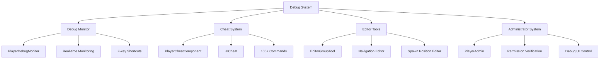

# Debug and Cheat

ChuChuBurger provides a comprehensive debug tool and cheat system to maximize development and testing efficiency. This system consists of real-time monitoring, over 100 cheat commands, editor extension tools, and an administrator permission system.

## Debug System Overview

### Core Debug Architecture



## PlayerDebugMonitor Real-time Monitoring

### F-key Based Debug Monitor

A system that allows developers to monitor the real-time status of various game systems using F keys.

```lua
-- PlayerDebugMonitor.mlua :: HandleKeyDownEvent()
@ExecSpace("ClientOnly")
@EventSender("Service", "InputService")
handler HandleKeyDownEvent(KeyDownEvent event)
    local key = event.key
    
    -- Check administrator permission
    if not _UserService.LocalPlayer.PlayerCheatComponent:HasAuthority() then
        return
    end
    
    if key == KeyboardKey.F3 then
        -- Debug timer toggle
        if isvalid(self.DebugTimer) then
            if self.DebugTimer.Enable ~= true then
                self.DebugTimer.DebugTimer:Init()
            else
                self.DebugTimer.Enable = false
            end	
        end
        
    elseif key == KeyboardKey.F4 then
        -- Recipe monitor toggle (only during recipe making)
        if isvalid(self.RecipeInfoMonitor) then
            if not (_UIGroupManager.RecipeGroup.Enable == true and 
                    _UIEntityLogic_RecipeGroup.UIRecipeMaking.Enable == true) then
                return
            end
            
            self.RecipeInfoMonitor.Enable = not self.RecipeInfoMonitor.Enable
            if self.RecipeInfoMonitor.Enable == true then
                self.RecipeInfoMonitor.UIRecipeDebug:OpenTab("Making")
            end
        end
        
    elseif key == KeyboardKey.F5 then
        -- Store info monitor toggle
        if isvalid(self.StoreInfoMonitor) then
            if self.StoreInfoMonitor.Enable == false then
                self:EnableStoreInfoMonitor(true)
            else
                self:EnableStoreInfoMonitor(false)
            end
        end
        
    elseif key == KeyboardKey.F6 then
        -- Customer info monitor toggle
        if isvalid(self.CustomerInfoMonitor) then
            if self.CustomerInfoMonitor.Enable == false then
                self:EnableCustomerInfoMonitor(true)
            else
                self:EnableCustomerInfoMonitor(false)
            end
        end
        
    elseif key == KeyboardKey.F9 then
        -- Employee info monitor toggle
        if isvalid(self.EmployeeInfoMonitor) then
            if self.EmployeeInfoMonitor.Enable == false then
                self:EnableEmployeeInfoMonitor(true)
            else
                self:EnableEmployeeInfoMonitor(false)
            end
        end
    end
end
```

#### Debug Monitor Shortcut Map

| Key | Monitor | Function |
|---|---|---|
| **F3** | DebugTimer | Developer timer |
| **F4** | RecipeInfoMonitor | Recipe making info (only while making) |
| **F5** | StoreInfoMonitor | Store information |
| **F6** | CustomerInfoMonitor | Customer information |
| **F7** | (Reserved) | |
| **F8** | (Reserved) | |
| **F9** | EmployeeInfoMonitor | Employee information |
| **Comma (,)** | MaintainInfoMonitor | Maintenance information |
| **Period (.)** | SpawnPoolMonitor | Spawn pool information |

### Recipe Debug Monitor

A system that displays real-time balance information during recipe creation.

```lua
-- UIRecipeDebug.mlua :: Real-time recipe info display
method void UpdateRecipeInfo()
    local currentRecipe = _PlayerRecipe.CurrentRecipe
    if currentRecipe == nil then
        return
    end
    
    -- Display balance information
    local balance = currentRecipe:GetBalance()
    local spiciness = currentRecipe:GetSpiciness()
    local taste = currentRecipe:GetTasteScore()
    local price = currentRecipe:GetPrice()
    
    -- UI update
    self.BalanceText.text = string.format("Balance: %.2f", balance)
    self.SpicinessText.text = string.format("Spiciness: %.2f", spiciness)
    self.TasteText.text = string.format("Taste: %.2f", taste)
    self.PriceText.text = string.format("Price: %d", price)
    
    -- Tag information
    local tags = currentRecipe:GetTags()
    local tagText = table.concat(tags, ", ")
    self.TagText.text = "Tags: " .. tagText
    
    -- Combo information
    local combos = currentRecipe:GetCombos()
    local comboText = table.concat(combos, ", ")
    self.ComboText.text = "Combos: " .. comboText
end
```

### Customer Info Monitor

Displays real-time status of all customers currently in the store.

```lua
-- DebugMonitorUICustomer.mlua :: Customer info update
method void UpdateCustomerInfo()
    local customers = _CustomerManager.ActiveCustomers
    
    for i, customer in ipairs(customers) do
        local customerInfo = string.format(
            "Customer %d: State=%s, Order=%s, Wait=%.1fs, Patience=%.1f%%",
            i,
            customer.State,
            customer.OrderName or "None",
            customer.WaitTime,
            customer.Patience * 100
        )
        
        self:SetCustomerInfoText(i, customerInfo)
    end
end
```

### Employee Info Monitor

Monitors work status and efficiency of all employees.

```lua
-- DebugMonitorUIEmployee.mlua :: Employee info update
method void UpdateEmployeeInfo()
    local employees = _EmployeeManager.ActiveEmployees
    
    for i, employee in ipairs(employees) do
        local employeeInfo = string.format(
            "Employee %d: Type=%s, State=%s, Level=%d, Efficiency=%.2f",
            i,
            employee.Type,
            employee.CurrentState,
            employee.Level,
            employee:GetEfficiency()
        )
        
        self:SetEmployeeInfoText(i, employeeInfo)
    end
end
```

### Spawn Pool Monitor

A monitor that displays customer spawn data with pagination.

```lua
-- DebugMonitorSpawnPool.mlua :: Spawn pool info display
method void UpdateSpawnPoolInfo()
    local spawnData = _CustomerManager.SpawnPool
    local currentPage = self.CurrentPage
    local itemsPerPage = 10
    
    local startIndex = (currentPage - 1) * itemsPerPage + 1
    local endIndex = math.min(startIndex + itemsPerPage - 1, #spawnData)
    
    for i = startIndex, endIndex do
        local data = spawnData[i]
        local info = string.format(
            "Group:%s Orders:%d Attractive:%d Tags:%s Tip:%d ID:%s",
            data.Group,
            data.OrderCount,
            data.RequiredAttractive,
            data.TargetTags,
            data.Tip,
            data.UniqueId
        )
        
        self:SetSpawnInfoText(i - startIndex + 1, info)
    end
end
```

## PlayerCheatComponent Cheat System

### Cheat Command Registration System

A system that systematically manages over 100 cheat commands.

```lua
-- PlayerCheatComponent.mlua :: OnBeginPlay()
method void OnBeginPlay()
    self.UserId = self.Entity.PlayerComponent.UserId
    
    -- Currency-related cheats
    self:RegisterCheat("GainDiamondFree", "Gains free diamonds. Enter the amount in the first parameter. Negative values consume free+paid diamonds.", self.GainDiamondFree)
    self:RegisterCheat("GainDiamondPaid", "Gains paid diamonds. Enter the amount in the first parameter. Negative values consume paid diamonds.", self.GainDiamondPaid)
    self:RegisterCheat("GainMeso", "Gains money. Enter the meso amount in the first parameter. Negative values consume meso.", self.GainMeso)
    self:RegisterCheat("GainClover", "Gains clover. Enter the arcane symbol amount in the first parameter. Negative values consume arcane symbols.", self.GainClover)
    self:RegisterCheat("GainHeart", "Gains hearts. Enter the heart amount in the first parameter. Negative values consume hearts.", self.GainHeart)
    self:RegisterCheat("GainTip", "Gains tips. Enter the tip amount in the first parameter. Negative values consume tips. Tip storage must be level 1 or higher.", self.GainTip)
    
    -- Item-related cheats
    self:RegisterCheat("GainItem", "Gains items. Enter itemID in the first parameter and count in the second parameter.", self.GainItem)
    self:RegisterCheat("ClearInventory", "Clears my inventory.", self.ClearInventory)
    
    -- Employee-related cheats
    self:RegisterCheat("AddEmployee", "Adds an employee. Enter the employee ID in the first parameter.", self.AddEmployee)
    self:RegisterCheat("RemoveEmployee", "Removes an employee. Enter the employee ID in the first parameter.", self.RemoveEmployee)
    self:RegisterCheat("LevelUpEmployee", "Levels up an employee. Enter employee ID in the first parameter and level in the second parameter.", self.LevelUpEmployee)
    
    -- Recipe-related cheats
    self:RegisterCheat("UnlockAllRecipes", "Unlocks all recipes.", self.UnlockAllRecipes)
    self:RegisterCheat("AddIngredient", "Adds ingredients. Enter ingredient ID in the first parameter and quantity in the second parameter.", self.AddIngredient)
    
    -- Game state manipulation
    self:RegisterCheat("SetStage", "Sets the stage. Enter the stage number in the first parameter.", self.SetStage)
    self:RegisterCheat("CompleteAchievement", "Completes an achievement. Enter the achievement ID in the first parameter.", self.CompleteAchievement)
    
    -- Event and trend manipulation
    self:RegisterCheat("StartEvent", "Starts an event. Enter the event ID in the first parameter.", self.StartEvent)
    self:RegisterCheat("SetTrend", "Sets a trend. Enter the trend ID in the first parameter.", self.SetTrend)
    
    -- Trial-related
    self:RegisterCheat("CompleteTrialInstantly", "Instantly completes a trial.", self.CompleteTrialInstantly)
    self:RegisterCheat("SetTrialScore", "Sets trial score. Enter the score in the first parameter.", self.SetTrialScore)
    
    -- Database-related
    self:RegisterCheat("ReloadData", "Reloads data.", self.ReloadData)
    self:RegisterCheat("SaveDataNow", "Immediately saves current data.", self.SaveDataNow)
    
    -- Test presets
    self:RegisterCheat("ApplyTestPreset", "Applies a test preset. Enter the preset name in the first parameter.", self.ApplyTestPreset)
end
```

#### Cheat Registration Mechanism

```lua
-- PlayerCheatComponent.mlua :: RegisterCheat()
method void RegisterCheat(string cheatName, string desc, any func)
    if self:IsClient() then
        -- Client: Store description for UI
        self.commandToDesc[cheatName] = desc
    else
        -- Server: Store function for execution
        local cheatLower = string.lower(cheatName)	
        self.commandToFunc[cheatLower] = func
    end
end
```

### Cheat Execution System

```lua
-- PlayerCheatComponent.mlua :: GoCheat()
@ExecSpace("ServerOnly")
method void GoCheat(string command, string op1, string op2, string op3)
    -- Check permission
    if self:HasAuthority() == false then
        return
    end
    
    -- Search command (case-insensitive)
    local commandLower = string.lower(command)
    local commandFunc = self.commandToFunc[commandLower]
    
    if commandFunc == nil then
        _UIToast:ShowMessage("There is no cheat", self.UserId)
        return
    end
    
    -- Execute cheat
    commandFunc(self, op1, op2, op3)
end

-- Chat message parsing
@ExecSpace("Server")
method void SendCheat(string message)
    local cheatString = {}
    for word in string.gmatch(message, "[^%s/]+") do
        table.insert(cheatString, word)
    end
    
    local header = (#cheatString >= 1) and cheatString[1] or nil
    local param1 = (#cheatString >= 2) and cheatString[2] or nil
    local param2 = (#cheatString >= 3) and cheatString[3] or nil
    local param3 = (#cheatString >= 4) and cheatString[4] or nil
    
    self:GoCheat(header, param1, param2, param3)
end
```

### Major Cheat Command Implementation

#### Currency Manipulation Cheats

```lua
-- PlayerCheatComponent.mlua :: GainMeso()
@ExecSpace("ServerOnly")
method void GainMeso(string mesoString)
    if _UtilLogic:IsNilorEmptyString(mesoString) then
        _UIToast:ShowMessage("Please input meso amount", self.UserId)
        return
    end
    
    local meso = tonumber(mesoString)
    if meso == nil then
        _UIToast:ShowMessage("Invalid meso amount", self.UserId)
        return
    end
    
    local success = self.Entity.PlayerInventory:ModifyMoney(meso, "Cheat", "CheatSystem")
    if success then
        _UIToast:ShowMessage(string.format("Added %d meso", meso), self.UserId)
    else
        _UIToast:ShowMessage("Failed to modify meso", self.UserId)
    end
end

-- Diamond manipulation
@ExecSpace("ServerOnly") 
method void GainDiamondFree(string diamondString)
    local diamond = tonumber(diamondString)
    if diamond == nil then
        _UIToast:ShowMessage("Invalid diamond amount", self.UserId)
        return
    end
    
    self.Entity.PlayerOutgameManager:ModifyDiamond(diamond, false, "Cheat", "CheatSystem")
    _UIToast:ShowMessage(string.format("Added %d free diamond", diamond), self.UserId)
end
```

#### Item Manipulation Cheats

```lua
-- PlayerCheatComponent.mlua :: GainItem()
@ExecSpace("ServerOnly")
method void GainItem(string itemId, string countString)
    if _UtilLogic:IsNilorEmptyString(itemId) then
        _UIToast:ShowMessage("Please input item ID", self.UserId)
        return
    end
    
    local count = tonumber(countString) or 1
    
    local result = self.Entity.PlayerInventory:AddItem(itemId, count, "Cheat", "CheatSystem")
    if result == 0 then
        _UIToast:ShowMessage(string.format("Added %d x %s", count, itemId), self.UserId)
    else
        _UIToast:ShowMessage(string.format("Failed to add item: %d", result), self.UserId)
    end
end

-- Inventory clearing
@ExecSpace("ServerOnly")
method void ClearInventory()
    self.Entity.PlayerInventory:ClearItems()
    _UIToast:ShowMessage("Inventory cleared", self.UserId)
end
```

#### Employee Manipulation Cheats

```lua
-- Add employee
@ExecSpace("ServerOnly")
method void AddEmployee(string employeeId)
    if _UtilLogic:IsNilorEmptyString(employeeId) then
        _UIToast:ShowMessage("Please input employee ID", self.UserId)
        return
    end
    
    local success = self.Entity.EmployeeManager:AddEmployee(employeeId, 1, "Cheat")
    if success then
        _UIToast:ShowMessage(string.format("Added employee: %s", employeeId), self.UserId)
    else
        _UIToast:ShowMessage("Failed to add employee", self.UserId)
    end
end

-- Employee level up
@ExecSpace("ServerOnly")
method void LevelUpEmployee(string employeeId, string levelString)
    local targetLevel = tonumber(levelString)
    if targetLevel == nil or targetLevel < 1 then
        _UIToast:ShowMessage("Invalid level", self.UserId)
        return
    end
    
    local employee = self.Entity.EmployeeManager:GetEmployee(employeeId)
    if employee == nil then
        _UIToast:ShowMessage("Employee not found", self.UserId)
        return
    end
    
    employee.Level = targetLevel
    _UIToast:ShowMessage(string.format("Employee %s level set to %d", employeeId, targetLevel), self.UserId)
end
```

### Test Preset System

Presets that allow developers to quickly reproduce specific situations.

```lua
-- PlayerCheatComponent.mlua :: ApplyTestPreset()
@ExecSpace("ServerOnly")
method void ApplyTestPreset(string presetName)
    if presetName == "rich_player" then
        -- Rich player preset
        self.Entity.PlayerInventory:ModifyMoney(1000000, "TestPreset", "CheatSystem")
        self.Entity.PlayerOutgameManager:ModifyDiamond(10000, false, "TestPreset", "CheatSystem")
        self.Entity.PlayerInventory:ModifyArcaneSymbol(5000, "TestPreset", "CheatSystem")
        
    elseif presetName == "max_level" then
        -- Max level preset
        local employees = self.Entity.EmployeeManager.EmployeeDetailTable
        for _, employee in ipairs(employees) do
            employee.Level = 50
        end
        
    elseif presetName == "all_recipes" then
        -- All recipes unlocked preset
        self:UnlockAllRecipes()
        
    elseif presetName == "debug_materials" then
        -- Debug materials preset
        local materialIds = {"IN0001", "IN0002", "IN0003", "BN0001", "BN0002"}
        for _, materialId in ipairs(materialIds) do
            self.Entity.PlayerIngredient:AddIngredientCard(materialId, 99, "TestPreset")
        end
        
    else
        _UIToast:ShowMessage("Unknown preset: " .. presetName, self.UserId)
    end
end

-- Usage example
-- Type "/ApplyTestPreset rich_player" in chat
```

## UICheat Cheat UI System

### Cheat UI Activation

The cheat UI can be toggled with the slash (/) key.

```lua
-- UICheat.mlua :: HandleKeyDownEvent()
@ExecSpace("ClientOnly")
@EventSender("Service", "InputService")
handler HandleKeyDownEvent(KeyDownEvent event)
    if event.key == KeyboardKey.Slash then
        if not _UserService.LocalPlayer.PlayerCheatComponent:HasAuthority() then
            return
        end
        
        if self.Entity.Enable then
            self:CloseCheatUI()
        else
            self:OpenCheatUI()
        end
    end
end
```

### Cheat Command Search and Auto-completion

```lua
-- UICheat.mlua :: Command search
method void OnSearchTextChanged(string searchText)
    local matchingCommands = {}
    local allCommands = _UserService.LocalPlayer.PlayerCheatComponent.commandToDesc
    
    for commandName, description in pairs(allCommands) do
        if string.lower(commandName):find(string.lower(searchText), 1, true) then
            table.insert(matchingCommands, {
                name = commandName,
                description = description
            })
        end
    end
    
    -- Sort search results
    table.sort(matchingCommands, function(a, b)
        return a.name < b.name
    end)
    
    self:UpdateCommandList(matchingCommands)
end

-- Command auto-completion
method void OnCommandClick(string commandName)
    self.InputField.text = commandName .. " "
    self.InputField:SetCaretPosition(string.len(self.InputField.text))
end
```

### Cheat Command Execution

```lua
-- UICheat.mlua :: Command execution
method void ExecuteCheat()
    local input = self.InputField.text
    if _UtilLogic:IsNilorEmptyString(input) then
        return
    end
    
    -- Send cheat command to server
    _UserService.LocalPlayer.PlayerCheatComponent:SendCheat(input)
    
    -- Reset input field
    self.InputField.text = ""
    
    -- Close UI (optional)
    self:CloseCheatUI()
end
```

## EditorGroupTool Editor Extensions

### Navigation Node Editor

A tool for editing navigation nodes for A* pathfinding and saving them to CSV.

```lua
-- NaviNodeEditorLogic.mlua :: Function1()
method void Function1()
    local stageString = self.SelectedStage.Text
    local dataSetName = "DataSet_NaviGroup_Stage"..stageString
    local parent = _EntityService:GetEntityByPath("/maps/Lobby/Model_NaviGroup")
    
    local nodes = parent.Children 
    
    for row, v in pairs(nodes) do
        local x = v.TransformComponent.Position.x
        local y = v.TransformComponent.Position.y
        local jump = v.NaviPoint.jump
        
        _EditorService:DataSetInsertRow(dataSetName)
        _EditorService:DataSetSetCell(dataSetName, row, "x", tostring(x))
        _EditorService:DataSetSetCell(dataSetName, row, "y", tostring(y))
        _EditorService:DataSetSetCell(dataSetName, row, "jump", tostring(jump))
    end
end

-- Navigation node grid creation
@EventSender("Entity", "d95e5ab3-a137-4a1b-908c-382e606eabd2")
handler HandleButtonClickEditorEvent2(ButtonClickEditorEvent event)
    local startEntity = _EntityService:GetEntityByPath("/maps/Lobby/Model_NaviGroup/1")
    local startPos = startEntity.TransformComponent.Position
    
    local col = tonumber(self.Col_Count.Text)
    local row = tonumber(self.Row_Count.Text)
    
    if col > 0 and row > 0 then
        for i=1, row do
            for j=1, col do
                local entityName = tostring(math.tointeger(col * (i - 1) + j))
                local position = Vector3(startPos.x + (j-1) * 1, startPos.y - (i-1) * 0.8, 0)
                _SpawnService:SpawnByEntity(startEntity, entityName, position)
            end
        end
    end
end
```

### Spawn Position Editor

A tool for extracting and managing various spawn positions on the map.

```lua
-- SpawnPosEditorLogic.mlua :: CustomerWaitSeatGroup()
method void CustomerWaitSeatGroup()
    local dataSetName = "CustomerWaitSeatGroupDataSet"
    local parent = _EntityService:GetEntityByPath("/maps/Lobby_Stage_1/CustomerWaitSeatGroup")
    
    local posEntites = parent.Children 
    
    for i, v in pairs(posEntites) do
        local row = math.tointeger((i-1) / 6 + 1)
        local col = math.tointeger((i-1) % 6 + 1)
        local x = v.TransformComponent.Position.x
        local y = v.TransformComponent.Position.y
        
        -- Save as CSV data
        _EditorService:DataSetInsertRow(dataSetName, i)
        _EditorService:DataSetSetCell(dataSetName, i, "row", tostring(row))
        _EditorService:DataSetSetCell(dataSetName, i, "col", tostring(col))
        _EditorService:DataSetSetCell(dataSetName, i, "x", tostring(x))
        _EditorService:DataSetSetCell(dataSetName, i, "y", tostring(y))
    end
end

-- Extract employee kitchen appliance usage positions
method void EmployeeUseKitchenAppPosGroup()
    local dataSetName = "EmployeeUseKitchenAppPosGroupDataSet"
    local parent = _EntityService:GetEntityByPath("/maps/Lobby_Stage_1/EmployeeUseKitchenAppPosGroup")
    
    local posEntites = parent.Children
    
    for i, v in pairs(posEntites) do
        local kitchenAppId = v.Name  -- Kitchen appliance ID
        local x = v.TransformComponent.Position.x
        local y = v.TransformComponent.Position.y
        
        _EditorService:DataSetInsertRow(dataSetName, i)
        _EditorService:DataSetSetCell(dataSetName, i, "kitchenAppId", kitchenAppId)
        _EditorService:DataSetSetCell(dataSetName, i, "x", tostring(x))
        _EditorService:DataSetSetCell(dataSetName, i, "y", tostring(y))
    end
end
```

## PlayerAdmin Administrator Permission System

### Administrator Permission Check

```lua
-- PlayerAdmin.mlua :: Administrator permission check
method boolean IsAdmin()
    local userId = self.Entity.PlayerComponent.UserId
    
    -- Developer account list (example)
    local adminUsers = {
        "developer1@company.com",
        "developer2@company.com",
        "tester@company.com"
    }
    
    for _, adminUserId in ipairs(adminUsers) do
        if userId == adminUserId then
            return true
        end
    end
    
    return false
end

-- Permission check (used in PlayerCheatComponent)
method boolean HasAuthority()
    local player = self.Entity
    if player.PlayerAdmin.IsAdmin then
        return true
    end
    
    return false
end
```

### Debug UI Activation

```lua
-- PlayerAdmin.mlua :: Debug UI setup
@ExecSpace("ClientOnly")
method void OnBeginPlay()
    if self:IsAdmin() then
        -- Enable debug UI for administrators
        _UIGroupManager.UIDebugGroup.Enable = true
        
        -- Show cheat button on mobile
        if Environment:IsMobilePlatform() then
            self:ShowMobileCheatButton(true)
        end
        
        -- Allow intro skip
        self.CanSkipIntro = true
    else
        -- Disable debug UI for regular users
        _UIGroupManager.UIDebugGroup.Enable = false
    end
end
```

### Mobile Cheat Button

A UI that allows administrators to easily use cheats in mobile environments.

```lua
-- PlayerAdmin.mlua :: Mobile cheat button
method void ShowMobileCheatButton(boolean show)
    if not Environment:IsMobilePlatform() then
        return
    end
    
    local cheatButton = _EntityService:GetEntityByPath("/UI/MobileCheatButton")
    if isvalid(cheatButton) then
        cheatButton.Enable = show
    end
end

-- Mobile cheat button click handling
@EventSender("Entity", "mobile_cheat_button")
handler HandleMobileCheatButtonClick(ButtonClickEvent event)
    if not self:IsAdmin() then
        return
    end
    
    -- Show simple cheat menu
    local cheatMenu = _EntityService:GetEntityByPath("/UI/MobileCheatMenu")
    if isvalid(cheatMenu) then
        cheatMenu.Enable = not cheatMenu.Enable
    end
end
```

## CheatButtonMacroLogic Macro System

### Multi-click Macro

An automatic click macro that can be activated with the F10 key.

```lua
-- CheatButtonMacroLogic.mlua :: F10 key handling
@ExecSpace("ClientOnly")
@EventSender("Service", "InputService")
handler HandleKeyDownEvent(KeyDownEvent event)
    if event.key == KeyboardKey.F10 then
        if not _UserService.LocalPlayer.PlayerCheatComponent:HasAuthority() then
            return
        end
        
        self.IsMultiClickEnabled = not self.IsMultiClickEnabled
        
        if self.IsMultiClickEnabled then
            _UIToast:ShowMessage("Multi-click enabled")
        else
            _UIToast:ShowMessage("Multi-click disabled")
        end
    end
end

-- Automatic click handling
@EventSender("Service", "InputService")
handler HandleButtonClickEvent(ButtonClickEvent event)
    if not self.IsMultiClickEnabled then
        return
    end
    
    local clickCount = _UtilLogic:RandomIntegerRange(3, 10)
    
    for i = 1, clickCount do
        -- Consecutive clicks with slight delay
        wait(0.1 * i)
        event.Entity.ButtonComponent:SimulateClick()
    end
    
    _UIToast:ShowMessage(string.format("Auto-clicked %d times", clickCount))
end
```

## DebugTimer Developer Timer

### Precise Time Measurement

A tool for measuring performance or the duration of specific tasks during development.

```lua
-- DebugTimer.mlua :: Timer functionality
@Component
script DebugTimer extends Component

property number StartTime = 0
property number ElapsedTime = 0
property boolean IsRunning = false
property table Records = {}

method void Init()
    self.StartTime = 0
    self.ElapsedTime = 0
    self.IsRunning = false
    table.clear(self.Records)
    
    self.Entity.Enable = true
    _UIToast:ShowMessage("Debug Timer Initialized")
end

method void Start()
    if self.IsRunning then
        return
    end
    
    self.StartTime = _UtilLogic.ElapsedSeconds
    self.IsRunning = true
    _UIToast:ShowMessage("Timer Started")
end

method void Stop()
    if not self.IsRunning then
        return
    end
    
    self.ElapsedTime = _UtilLogic.ElapsedSeconds - self.StartTime
    self.IsRunning = false
    
    -- Save record
    table.insert(self.Records, {
        duration = self.ElapsedTime,
        timestamp = os.date("%H:%M:%S")
    })
    
    _UIToast:ShowMessage(string.format("Timer Stopped: %.3fs", self.ElapsedTime))
end

method void Reset()
    self.StartTime = 0
    self.ElapsedTime = 0
    self.IsRunning = false
    _UIToast:ShowMessage("Timer Reset")
end

-- Real-time update
@ExecSpace("ClientOnly")
method void OnUpdate()
    if not self.IsRunning then
        return
    end
    
    local currentElapsed = _UtilLogic.ElapsedSeconds - self.StartTime
    self:UpdateTimerDisplay(currentElapsed)
end
```

## PacketDelayCheckComponent Network Monitoring

### Packet Delay Check

A tool for monitoring communication delay between client and server.

```lua
-- PacketDelayCheckComponent.mlua :: Packet delay monitoring
@Component
script PacketDelayCheckComponent extends Component

property number LastPingTime = 0
property number PingInterval = 1.0  -- Ping every second
property number AverageLatency = 0
property table LatencyHistory = {}
property boolean ClientPaused = false

@ExecSpace("ClientOnly")
method void OnBeginPlay()
    self.LastPingTime = _UtilLogic.ElapsedSeconds
end

@ExecSpace("ClientOnly")
method void OnUpdate()
    local currentTime = _UtilLogic.ElapsedSeconds
    
    if currentTime - self.LastPingTime > self.PingInterval then
        self:SendPing(currentTime)
        self.LastPingTime = currentTime
    end
end

-- Send ping
@ExecSpace("Client")
method void SendPing(number timestamp)
    self:ReceivePing(timestamp)
end

-- Handle ping response
@ExecSpace("Server")
method void ReceivePing(number clientTimestamp)
    -- Send immediate response
    self:SendPongToClient(clientTimestamp, _UtilLogic.ServerElapsedSeconds)
end

-- Receive ping response
@ExecSpace("Client")
method void SendPongToClient(number clientTimestamp, number serverTimestamp)
    local currentTime = _UtilLogic.ElapsedSeconds
    local roundTripTime = currentTime - clientTimestamp
    
    -- Record latency
    table.insert(self.LatencyHistory, roundTripTime)
    
    -- Keep only the latest 10 records
    if #self.LatencyHistory > 10 then
        table.remove(self.LatencyHistory, 1)
    end
    
    -- Calculate average latency
    local sum = 0
    for _, latency in ipairs(self.LatencyHistory) do
        sum = sum + latency
    end
    self.AverageLatency = sum / #self.LatencyHistory
    
    -- High latency warning
    if roundTripTime > 0.5 then  -- Over 500ms
        print(string.format("High latency detected: %.3fs", roundTripTime))
        
        if roundTripTime > 2.0 then  -- Over 2 seconds
            self.ClientPaused = true
            print("Client may be paused or experiencing severe network issues")
        end
    end
    
    -- UI update (only in developer mode)
    if _UserService.LocalPlayer.PlayerAdmin.IsAdmin then
        self:UpdateLatencyDisplay(roundTripTime, self.AverageLatency)
    end
end
```

## Practical Usage Examples

### Development Workflow Usage

```lua
-- Typical developer workflow example

-- 1. Start game and log in with administrator privileges
-- 2. Activate store monitor with F5 key
-- 3. Set up test environment
_UserService.LocalPlayer.PlayerCheatComponent:SendCheat("/ApplyTestPreset rich_player")

-- 4. Add specific items for testing
_UserService.LocalPlayer.PlayerCheatComponent:SendCheat("/GainItem M4001 100")

-- 5. Activate recipe debug monitor with F4 key to check balance
-- 6. Start timer with F3 key to measure specific task performance

-- 7. Open cheat UI with slash (/) key to execute additional commands
-- 8. Deactivate all monitors after testing is complete
```

### Bug Reproduction and Debugging

```lua
-- Bug reproduction scenario setup example

-- 1. Reproduce specific situation
_UserService.LocalPlayer.PlayerCheatComponent:SendCheat("/SetStage 3")
_UserService.LocalPlayer.PlayerCheatComponent:SendCheat("/AddEmployee EMP001")
_UserService.LocalPlayer.PlayerCheatComponent:SendCheat("/LevelUpEmployee EMP001 25")

-- 2. Activate monitors to check status
-- F6 (Customer monitor), F9 (Employee monitor) activation

-- 3. Measure performance with timer
-- Start timer with F3 then execute specific actions

-- 4. Immediately capture state when problem occurs
_UserService.LocalPlayer.PlayerCheatComponent:SendCheat("/SaveDataNow")
```

## Developer Guide

### Adding New Cheat Commands

1. **Register in PlayerCheatComponent.mlua's OnBeginPlay()**:
```lua
self:RegisterCheat("MyNewCheat", "New cheat description", self.MyNewCheat)
```

2. **Implement cheat function**:
```lua
@ExecSpace("ServerOnly")
method void MyNewCheat(string param1, string param2, string param3)
    -- Cheat logic implementation
    _UIToast:ShowMessage("My new cheat executed", self.UserId)
end
```

### Adding New Debug Monitors

1. **Add key event to PlayerDebugMonitor.mlua**
2. **Create monitor UI component**
3. **Implement real-time update logic**

### Security Considerations

1. **Permission checks**: Permission checks required for all cheats and debug features
2. **Release builds**: Disable debug features in production environment
3. **Log management**: Logging and monitoring of cheat usage history

## Code Reference

### Cheat System
- `RootDesk/MyDesk/Admin/Cheat/PlayerCheatComponent.mlua :: RegisterCheat(), GoCheat()` — Cheat command registration and execution
- `RootDesk/MyDesk/Admin/Cheat/UICheat.mlua :: OnSearchTextChanged(), ExecuteCheat()` — Cheat UI and search
- `RootDesk/MyDesk/Admin/CheatButtonMacroLogic.mlua :: HandleKeyDownEvent()` — F10 macro system

### Debug Monitor
- `RootDesk/MyDesk/Admin/DebugMonitor/PlayerDebugMonitor.mlua :: HandleKeyDownEvent()` — F-key debug monitor toggle
- `RootDesk/MyDesk/Admin/DebugMonitor/UIRecipeDebug.mlua :: UpdateRecipeInfo()` — Real-time recipe debugging
- `RootDesk/MyDesk/Admin/DebugMonitor/DebugMonitorSpawnPool.mlua :: UpdateSpawnPoolInfo()` — Spawn pool monitoring

### Editor Tools
- `RootDesk/MyDesk/EditorGroupTool/NaviNode/NaviNodeEditorLogic.mlua :: Function1()` — Navigation node editor
- `RootDesk/MyDesk/EditorGroupTool/SpawnPos/SpawnPosEditorLogic.mlua :: CustomerWaitSeatGroup()` — Spawn position editor

### Administrator System
- `RootDesk/MyDesk/Admin/PlayerAdmin.mlua :: IsAdmin(), HasAuthority()` — Administrator permission management
- `RootDesk/MyDesk/Admin/DebugTimer/DebugTimer.mlua :: Start(), Stop()` — Developer timer
- `RootDesk/MyDesk/Admin/PacketDelayCheckComponent.mlua :: SendPing()` — Network delay monitoring

### Core Interfaces
```lua
-- PlayerCheatComponent main methods
method void RegisterCheat(string cheatName, string desc, any func)
method void GoCheat(string command, string op1, string op2, string op3)
method boolean HasAuthority()
method void SendCheat(string message)

-- PlayerDebugMonitor main methods
method void EnableStoreInfoMonitor(boolean enable)
method void EnableCustomerInfoMonitor(boolean enable)
method void EnableEmployeeInfoMonitor(boolean enable)

-- NaviNodeEditorLogic main methods
method void Function1()  -- Save navigation data
method void HandleButtonClickEditorEvent2()  -- Create node grid

-- DebugTimer main methods
method void Start()
method void Stop() 
method void Reset()
method void Init()
```
