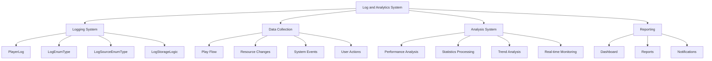

# Log and Analytics System

The ChuChuBurger log and analytics system is a core system that systematically records all player actions and game state changes within the game, and performs data analysis for game operation and improvement based on this data. It supports data-driven decision making across various aspects including game balance, user experience, and revenue optimization through comprehensive logging architecture and real-time analysis capabilities.

## System Overview



## 1. Logging System

### 1.1 PlayerLog - Central Logging Component

`PlayerLog` is a centralized logging system that records all major activities in the game.

**Related Files:**
- `RootDesk/MyDesk/00. Player/PlayerLog.mlua`

**Key Properties:**
```lua
-- Category-specific flow type management
property string Recipe = "2"
property string Training = "2"
property string AutoTraining = "2"
property string VipOrder = "2"
property string Trial = "2"
property table CategoryFlowType = {}
property string CurCategory = ""
```

### 1.2 Play Flow Logging

Records detailed information about major game activities.

**Core Method:**
```23:121:RootDesk/MyDesk/00. Player/PlayerLog.mlua
@ExecSpace("ServerOnly")
method void PlayflowLog(string category, string flowType)
    if not isvalid(self.Entity) then return end 
    
    self.CurCategory = category 
    self.CategoryFlowType[category] = flowType
    
    local userId = self.Entity.PlayerComponent.UserId
    local logName = _LogEnumType.PlayFlow
    
    local manageLv = string.format("%d", self.Entity.PlayerManagement.ManagementLevel)
    local manageIdx = self.Entity.PlayerManagement:GetGoalCount()
    local money = string.format("%d",self.Entity.PlayerInventory.Money)
    local arcaneSymbol = string.format("%d",self.Entity.PlayerInventory.ArcaneSymbol)
    local heart = string.format("%d",self.Entity.PlayerInventory.Heart)
    local lunchBox = string.format("%d",self.Entity.PlayerInventory.LunchBox)
    local diamond = string.format("%d",self.Entity.PlayerOutgameManager:GetDiamondCount(userId))
```

**Logging Data Items:**
- **Player Information**: User ID, nickname, profile code
- **Game State**: Management level, stage progress, current currency amounts
- **Device Information**: PC/mobile distinction
- **Timestamp**: UTC time recording
- **Platform Information**: Execution environment distinction

### 1.3 Resource Flow Logging

Records all changes in resources (gold, hearts, arcane symbols, etc.) in detail.

**Core Method:**
```124:165:RootDesk/MyDesk/00. Player/PlayerLog.mlua
@ExecSpace("ServerOnly")
method void ItemFlow(string logValue, string resourceFlowType, string resourceName, string resourceChangeCnt, string resourceAfterCnt, string resourceMakerDefineTag, string mapName, string targetChuchuId)
    local userId = self.Entity.PlayerComponent.UserId
    local logName = _LogEnumType.ResourceFlow
    local nickname = self.Entity.PlayerComponent.Nickname
    local profileCode = self.Entity.PlayerComponent.ProfileCode
    local itemTarget = "empty" 
    if not _UtilLogic:IsNilorEmptyString(targetChuchuId) then
        itemTarget = targetChuchuId
    end
    
    local playerStageId = tostring(self.Entity.PlayerStage.NowStage)
    local logFail, value = pcall(
```

**Resource Log Data:**
- **Before/After Amounts**: Tracking resource changes
- **Change Cause**: Classification as purchase, reward, consumption, etc.
- **Related Target**: Employees, items, facilities, etc.
- **Occurrence Location**: Map, functional unit distinction
- **Player Context**: Current progress status

## 2. Log Classification System

### 2.1 LogEnumType - Log Type Definition

An enumeration that systematically classifies all logs in the game.

**Related Files:**
- `RootDesk/MyDesk/Log/LogEnumType.mlua`

**Major Log Types:**
```4:96:RootDesk/MyDesk/Log/LogEnumType.mlua
property string ConnectFlow = "!ConnectFlow"
property string ConnectFlowLobby = "!ConnectFlow.Lobby"
property string ResourceFlow = "!ResourceFlow"
property string PurchaseSuccess = "!Purchase.Success"
property string PurchaseFail = "!Purchase.Fail"
property string PlayFlow = "!PlayFlow"
property string ManageLevel = "!ManageLevel"
property string ManageIndex = "!ManageIndex"
property string EmployeeFlow = "!EmployeeFlow"
property string EmployeeUpgradeFlow = "!EmployeeUpgradeFlow"
property string EmployeeOverLimitFlow = "!EmployeeOverLimitFlow"
property string EmploymentFlow = "!EmploymentFlow"
property string EmployeeLocation = "!EmployeeLocation"
property string RecipeSkillFlow = "!RecipeSkillFlow"
property string AutoTrainingFlow = "!AutoTrainingFlow"
property string TrainingFlow = "!TrainingFlow"
property string RecipeFlow = "!RecipeFlow"
property string MenuFlow = "!MenuFlow"
property string AchievementFlow = "!AchievementFlow"
property string RankFlow = "!RankFlow"
property string SettlementFlow = "!SettlementFlow"
property string UpgradeFlow = "!UpgradeFlow"
property string TrialEmployee = "!Trial.Employee"
property string VIPOrderRecipe = "!VIPOrder.Recipe"
property string VIPOrderIngre = "!VIPOrder.Ingre"
property string TutorialStart = "!Tutorial.Start"
property string TutorialEnd = "!Tutorial.End"
property string MonthlySnap = "!MonthlySnap"
property string MonthlyResource = "!MonthlyResource"
property string StageFlowEnter = "!StageFlow.Enter"
property string StageFlowSetting = "!StageFlow.Setting"
property string BadgeFlow = "!BadgeFlow"
property string StoreNameFlow = "!StoreNameFlow"
property string IngreCollectionFlow = "!IngreCollectionFlow"
property string EmployeeCollectionFlow = "!EmployeeCollectionFlow"
property string EmployeeEquipBuy = "!EmployeeEquip.Buy"
property string EmployeeEquipUpgrade = "!EmployeeEquip.Upgrade"
property string StagePassComplete = "!StagePassComplete"
property string PiggyBankLevelUpReward = "!PiggyBank.LevelUpReward"
property string IngreFlow = "!IngreFlow"
property string IngreSynthResult = "!IngreSynthResult"
property string TrialRecipe = "!Trial.Recipe"
property string StorageFlow = "!StorageFlow"
property string PiggyBankFlow = "!PiggyBankFlow"
property string OfflineRewardFlow = "!OfflineRewardFlow"
property string CheckCanTimeFlows = "!CheckCanTimeFlows"
property string EquipUpgradeGachaLog = "!EquipUpgrade.GachaLog"
```

### 2.2 LogSourceEnumType - Log Source Classification

Classifies the system or feature where the log originated.

**Related Files:**
- `RootDesk/MyDesk/Log/LogSourceEnumType.mlua`

**Major Source Classifications:**
```4:43:RootDesk/MyDesk/Log/LogSourceEnumType.mlua
property string Training = "Training"
property string AutoTraining = "AutoTraining"
property string EmployeeUpgrade = "EmployeeUpgrade"
property string Achievement = "Achievement"
property string Trial = "Trial"
property string IngreGacha = "IngreGacha"
property string Rank = "Rank"
property string VipOrder = "VipOrder"
property string Event = "Event"
property string Cheat = "Cheat"
property string CustomerTip = "CustomerTip"
property string StoreManage = "StoreManage"
property string RecipeReroll = "RecipeReroll"
property string DayPerLunchBox = "DayPerLunchBox"
property string Transfer = "Transfer"
property string playerUpgrade = "playerUpgrade"
property string BurgerSales = "BurgerSales"
property string Employment = "Employment"
property string Recipe = "Recipe"
property string Exchange = "Exchange"
```

### 2.3 LogStorageLogic - Log Storage Processing

Core logic that records actual log data to storage.

**Related Files:**
- `RootDesk/MyDesk/Log/LogStorageLogic.mlua`

**Core Method:**
```4:7:RootDesk/MyDesk/Log/LogStorageLogic.mlua
@ExecSpace("ServerOnly")
method void LogValue(string player, string name, string value, any extras)
    
end
```

## 3. Specialized Logging Systems

### 3.1 Menu Change Logging

Records detailed logs when menu settings are changed.

**Core Functionality:**
```330:354:2. 핵심 시스템/레시피 시스템/메뉴 설정과 관리.md
@ExecSpace("ServerOnly")
method void MenuFlow(SyncTable<integer, integer> lastMenu, SyncTable<integer, integer> CurMenu)
    local recipeTable = {}
    for k, v in pairs(CurMenu) do
        local recipeData = self.Entity.PlayerRecipe.Recipes[v]
        table.insert(recipeTable, {
            recipeId = tostring(recipeData.UniqueId),
            recipeName = recipeData.Name,
            price = tostring(recipeData.Cost),
            tag = recipeData.Tag,
            grade = tostring(_TasteGradeDataSetLogic:ReturnGradeDataByScore(recipeData.TasteScore).Index)
        })
    end
    
    -- Determine menu change type
    local flowType = ""
    if #table.keys(lastMenu) < #table.keys(CurMenu) then
        flowType = "1" -- Menu addition
    elseif #table.keys(lastMenu) > #table.keys(CurMenu) then
        flowType = "2" -- Menu removal
    elseif #table.keys(lastMenu) == #table.keys(CurMenu) then
        flowType = "3" -- Menu replacement
    end
end
```

### 3.2 Badge Achievement Logging

Records player badge achievements in detail.

**Logging Data:**
```313:323:2. 핵심 시스템/플레이어 진행/배지와 수집.md
_LogStorageLogic:LogValue(userId, _LogEnumType.BadgeFlow, _HttpService:JSONEncode({
    badgeTypeValue = tostring(badgeData.TypeValue),
    badgeName = badgeData.Name
}), {
    badgeId = badgeId,
    badgeTypeId = tostring(badgeData.TypeId),
    badgeGrade = tostring(badgeData.Grade),
    playerLevel = self.Entity.PlayerStage:GetPlayerLastStageProgress()
})
```

### 3.3 Collection Logging

Tracks all collection activities.

**Recording Items:**
- **Collection Type**: Ingredients, buns, bun skins, side menus, strategies
- **Achievement Time**: UTC timestamp
- **Player Progress**: Current stage and level
- **Reward Collection**: Whether collection rewards were received

## 4. Analysis System

### 4.1 Real-time Statistics Processing

Analyzes game data in real-time to provide immediate insights.

**Statistics Processing Areas:**
- **Player Behavior Patterns**: Play time, preferred feature analysis
- **Economic System Health**: Currency inflation/deflation monitoring
- **Content Consumption Rate**: Stage progression, achievement distribution
- **Monetization Efficiency**: Payment conversion rate, LTV analysis

### 4.2 Performance Analysis System

Systematically analyzes the performance of each game element.

**Analysis Targets:**
```367:382:2. 핵심 시스템/레시피 시스템/메뉴 설정과 관리.md
### 7.1 Profitability Calculation

Real-time calculation of each recipe's profitability:
- **Sales Volume × Unit Price**: Total revenue calculation
- **Profit Margin vs Ingredient Cost**: Net profit analysis
- **Sales Speed**: Sales volume per hour
- **Customer Satisfaction**: Ratings and reviews

### 7.2 Trend Impact Analysis

Tracks sales performance changes according to trends:
- **Trend Bonus**: Revenue increase for matching recipes
- **Trend Penalty**: Revenue decrease for non-matching recipes
- **Seasonal Effects**: Sales pattern analysis for specific periods
```

### 4.3 Reputation Statistics System

Analyzes store reputation changes from multiple angles.

**Analysis Features:**
```263:275:3. 고급 기능/특별 주문/할 일과 미션.md
**UIReputationReview Analysis:**
```lua
-- UIReputationStat.mlua
property SyncTable<integer, Entity> StatSlots  -- Statistics slots
property Entity GraphContainer                  -- Graph container
```

**Reputation Analysis Items:**
- **Reputation Change Trends**: Daily/weekly/monthly reputation change graphs
- **Cause Analysis**: Identifying main causes of reputation increase/decrease
- **Customer Distribution**: Satisfaction distribution of visiting customers
- **Improvement Points**: Specific measures for reputation improvement
```

## 5. Data Storage and Management

### 5.1 Log Data Storage

All logs are systematically classified and stored long-term.

**Storage Policy:**
- **Real-time Logs**: Immediate storage, 24-hour high-speed access
- **Daily Aggregation**: Daily statistics data generation
- **Monthly Archive**: Compressed storage of detailed data
- **Annual Summary**: Selective storage of key metrics only

### 5.2 Data Integrity

Ensures accuracy and consistency of log data.

**Verification Mechanisms:**
- **Duplicate Removal**: Prevention of duplicate recording of identical events
- **Data Validation**: Validity checking of log contents
- **Timestamp Consistency**: Logical consistency of time sequences
- **Referential Integrity**: Maintaining relationships between related data

### 5.3 Privacy Protection

Performs meaningful analysis while protecting player personal information.

**Protection Measures:**
- **Data Anonymization**: Removal/encryption of personal identification information
- **Aggregation-based Analysis**: Group-level analysis rather than individual players
- **Access Control**: Log access limited to analysis personnel only
- **Retention Period Limits**: Automatic deletion of logs containing personal information

## 6. Monitoring and Alerts

### 6.1 Real-time Monitoring

Real-time monitoring of important metrics for game operation.

**Monitoring Targets:**
- **User Count**: Concurrent users and new registrations
- **Server Performance**: Response time, error rate
- **Game Balance**: Abnormal currency fluctuations
- **User Churn**: Sudden churn rate changes

### 6.2 Anomaly Detection

Early detection of abnormal patterns through automated algorithms.

**Detection Items:**
- **Suspected Cheating**: Unrealistic game progression
- **System Errors**: Unexpected log patterns
- **Balance Disruption**: Sudden changes in game economy
- **User Complaints**: Surge in negative feedback

### 6.3 Response System

Automated/manual response system for detected anomalies.

**Response Methods:**
- **Automatic Blocking**: Immediate blocking of obvious cheating
- **Alert Dispatch**: Immediate notification to operations team
- **Temporary Measures**: Emergency measures for system stability
- **Detailed Analysis**: In-depth analysis to identify root causes

---

## Code Reference

**Core Files:**
- `RootDesk/MyDesk/00. Player/PlayerLog.mlua :: PlayflowLog()` — Play flow logging
- `RootDesk/MyDesk/00. Player/PlayerLog.mlua :: ItemFlow()` — Resource change logging
- `RootDesk/MyDesk/Log/LogEnumType.mlua` — Log type definition
- `RootDesk/MyDesk/Log/LogSourceEnumType.mlua` — Log source classification
- `RootDesk/MyDesk/Log/LogStorageLogic.mlua :: LogValue()` — Log storage processing
- `Environment/NativeScripts/Service/LogStorageService.d.mlua` — Native log service
- `RootDesk/MyDesk/01. Lobby/StoreInfo/UIReputationReview.mlua` — Reputation analysis system
