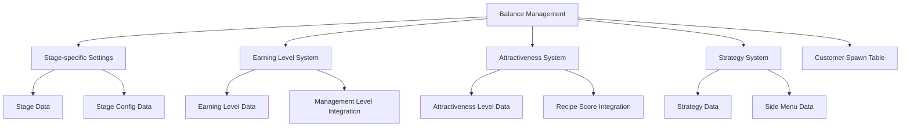
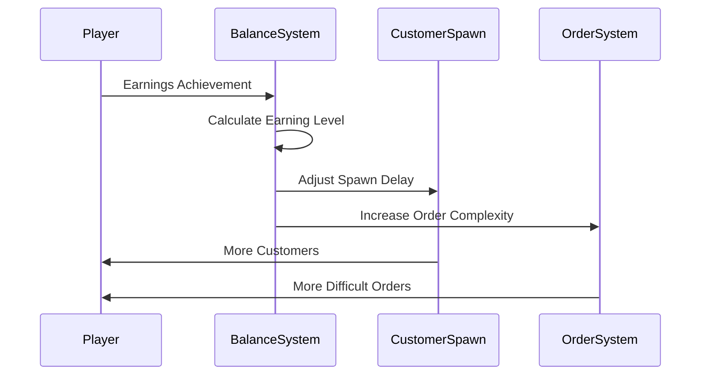

# Balance Management

ChuChuBurger provides players with continuous challenge and growth enjoyment through a complex and sophisticated balance system. This system consists of multi-layered structures including stage-specific difficulty adjustment, earning level management, attractiveness system, and strategic choices.

## Balance System Overview

### Core Balance Elements



## BalanceDataSetLogic Core System

### Balance Data Loading

BalanceDataSetLogic centrally manages all balance-related data in the game.

```lua
-- BalanceDataSetLogic.mlua :: LoadDataSet()
method void LoadDataSet()
    table.clear(self.StageConfigData)
    local scDataSet = _DataService:GetTable("StageConfigData")
    for i = 1, scDataSet:GetRowCount() do
        local scData = StageConfigData()
        scData:Load(scDataSet, i)
        
        if self.StageConfigData[scData.StageId] ~= nil then
            break
        end
        
        self.StageConfigData[scData.StageId] = scData
    end
    
    self.IsLoadConfigData = true
    
    -- Load store attractiveness level data
    table.clear(self.StoreAttractiveLevelData)
    local aDataSet = _DataService:GetTable("StoreAttractiveLevelData")
    for i = 1, aDataSet:GetRowCount() do
        local aData = StoreAttractiveLevelData()
        aData:Load(aDataSet, i)
        self.StoreAttractiveLevelData[aData.StoreAttractiveLevel] = aData
    end
end
```

### Earning Level Setting

```lua
-- BalanceDataSetLogic.mlua :: SetEarningLevelByEarningRecord()
@ExecSpace("Server")
method void SetEarningLevelByEarningRecord(Entity player)
    -- Determine earning level based on player's earning record
    local currentEarnings = player.PlayerSettlement.BestRecipeEarnings
    local stageId = player.PlayerStage.NowStage
    local stageData = _StageDataSetLogic:GetStageData(stageId)
    
    -- Find appropriate level from stage-specific earning level data
    for level, earningData in pairs(stageData.StageEarningLevelData) do
        if currentEarnings >= earningData.BestRecipeEarnings then
            player.PlayerStage.EarningLevel = level
        end
    end
end
```

## Stage System

### StageData Structure

Each stage has unique characteristics and balance settings.

```lua
-- StageData.mlua :: Main properties
struct StageData
    property integer StageId                    -- Stage ID
    property string RecipeTrialId               -- Recipe trial ID
    property integer StageClearRewardDiamond    -- Clear reward diamond
    property table StageEarningLevelData        -- Earning level data
    property table StageRankingData             -- Ranking data
    property integer EmployeeInitLevel          -- Initial employee level
    property table LessThen1YearCustomerOrderTags -- New customer order tags
    property string Bgm                         -- Background music
end
```

#### Stage-specific Earning Level Loading

```lua
-- StageData.mlua :: Load() earning level data loading
local seDataSet = _DataService:GetTable("EarningLevelStage"..self.StageId)
if isvalid(seDataSet) then
    for i = 1, seDataSet:GetRowCount() do
        local seData = StageEarningLevelData()
        seData:Load(seDataSet, i)
        
        if self.StageEarningLevelData[seData.EarningLevel] ~= nil then
            break
        end
        
        self.StageEarningLevelData[seData.EarningLevel] = seData
    end
end
```

### StageEarningLevelData Details

Enables fine balance adjustment by earning level.

```lua
-- StageEarningLevelData.mlua :: Main properties
struct StageEarningLevelData
    property integer EarningLevel               -- Earning level
    property integer BestRecipeEarnings        -- Best recipe earnings criteria
    property integer ServingEmployeeWarningLevel -- Serving employee warning level
    property integer BurgerOrderCountMin       -- Minimum burger order count
    property integer BurgerOrderCountMax       -- Maximum burger order count
    property number ExpectedRecipeAttractive   -- Expected recipe attractiveness
    property integer AccumEarnings             -- Accumulated earnings
    property integer ManagementLevel           -- Associated management level
    property integer StoreAttractiveLevel      -- Associated attractiveness level
end
```

#### Level-specific Balance Adjustment

```lua
-- StageEarningLevelData.mlua :: Load()
method void Load(any dataTable, integer index)
    local row = dataTable:GetRow(index)
    
    self.EarningLevel = tonumber(row:GetItem("EarningLevel"))
    
    -- Special handling in development environment
    if Environment:IsMakerPlay() then
        if self.EarningLevel < 1 then
            -- Developer balance adjustment
        end
    end
    
    self.BestRecipeEarnings = tonumber(row:GetItem("BestRecipeEarnings"))
    self.AccumEarnings = tonumber(row:GetItem("AccumEarnings"))
    self.ServingEmployeeWarningLevel = tonumber(row:GetItem("ServingEmployeeWarningLevel"))
    self.BurgerOrderCountMin = tonumber(row:GetItem("BurgerOrderCountMin"))
    self.BurgerOrderCountMax = tonumber(row:GetItem("BurgerOrderCountMax"))
    self.ExpectedRecipeAttractive = tonumber(row:GetItem("ExpectedRecipeAttractive"))
    self.ManagementLevel = tonumber(row:GetItem("ManagementLevel"))
    self.StoreAttractiveLevel = tonumber(row:GetItem("StoreAttractiveLevel"))
end
```

## Attractiveness System

### StoreAttractiveLevelData

Store attractiveness is an important balance element directly linked to customer spawning.

```lua
-- StoreAttractiveLevelData.mlua :: Main properties  
struct StoreAttractiveLevelData
    property integer StoreAttractiveLevel      -- Attractiveness level
    property number CustomerSpawnDelayMin      -- Minimum customer spawn delay
    property number CustomerSpawnDelayMax      -- Maximum customer spawn delay
    property integer MaxCustomerCount          -- Maximum concurrent customers
    property number CustomerWaitTimeMax        -- Maximum customer wait time
end
```

#### Attractiveness-based Customer Spawn Control

```lua
-- Customer spawn delay calculation based on attractiveness
method number GetCustomerSpawnDelay(integer attractiveLevel)
    local attractiveData = _BalanceDataSetLogic.StoreAttractiveLevelData[attractiveLevel]
    if attractiveData == nil then
        return 5.0  -- Default value
    end
    
    local minDelay = attractiveData.CustomerSpawnDelayMin
    local maxDelay = attractiveData.CustomerSpawnDelayMax
    
    return _UtilLogic:RandomNumberRange(minDelay, maxDelay)
end
```

## Strategy and Side Menu System

### StrategyData Strategy System

Provides various strategic options for players to choose from.

```lua
-- StrategyData.mlua :: Main properties
struct StrategyData
    property integer Id                        -- Strategy ID
    property string NameKey                    -- Name key
    property string DescKey                    -- Description key  
    property table LevelEffect                 -- Level-specific effects
    property table SPCost                      -- SP cost
    property table RecommendStage              -- Recommended stages
    property string OpenCondition             -- Unlock condition
end
```

#### Strategy Effect Calculation

```lua
-- StrategyEnum.mlua :: GetPlayerStrategyEffect()
method number GetPlayerStrategyEffect(Entity player, integer enum, integer stageId)
    local stLevel = player.PlayerIngameManager.StageStrategy[enum]
    local stEffect = 0
    if stLevel ~= nil then
        local stData = _StrategyDataSetLogic:GetStrategyData(enum)
        if isvalid(stData.LevelEffect[stLevel]) then
            stEffect = stData:GetLevelEffect(stLevel, stageId)
        end    
    end
    
    return stEffect
end
```

### SideMenuData Side Menu System

A side menu system that provides additional effects to recipes.

```lua
-- SideMenuData.mlua :: Main properties
struct SideMenuData
    property integer Id                        -- Side menu ID
    property string DescKey                    -- Description key
    property string IconRUID                   -- Icon RUID
    property table Effect                      -- Primary effects
    property table SubEffect                   -- Secondary effects
    property string GetCondition              -- Acquisition condition
    property string OpenCondition             -- Unlock condition
    property boolean HideSlot                 -- Slot hiding status
end
```

#### Side Menu Effect Application

```lua
-- StrategyEnum.mlua :: GetSideMenuEffect()
method number GetSideMenuEffect(integer sidemenuId, string effectKey, string effectValue)
    local sideMenuData = _StrategyDataSetLogic:GetSideMenuData(sidemenuId)
    if sideMenuData == nil then
        return 0
    end
    
    -- Return value based on effect key
    for i, effect in ipairs(sideMenuData.Effect) do
        if effect == effectKey then
            return tonumber(sideMenuData.SubEffect[i]) or 0
        end
    end
    
    return 0
end
```

## Difficulty Adjustment Mechanisms

### Dynamic Difficulty Adjustment

Difficulty is automatically adjusted based on player skill and progress.

#### Earnings-based Difficulty Adjustment



#### Attractiveness-based Adjustment

```lua
-- Order complexity calculation based on attractiveness
method integer CalculateOrderComplexity(Entity player)
    local attractiveLevel = player.PlayerStage.StoreAttractiveLevel
    local earningLevel = player.PlayerStage.EarningLevel
    local stageId = player.PlayerStage.NowStage
    
    local stageData = _StageDataSetLogic:GetStageData(stageId)
    local earningData = stageData:GetStageEarningLevelData(earningLevel)
    
    if earningData == nil then
        return 1  -- Default complexity
    end
    
    local minCount = earningData.BurgerOrderCountMin
    local maxCount = earningData.BurgerOrderCountMax
    
    return _UtilLogic:RandomIntegerRange(minCount, maxCount)
end
```

### Progress-based Adjustment

#### Stage-specific Standard Setting

```lua
-- StageConfigData.mlua :: Stage-specific settings
struct StageConfigData
    property integer StageId                   -- Stage ID
    property integer BaseCustomerCount        -- Base customer count
    property number BaseCustomerSpawnDelay    -- Base spawn delay
    property number BaseOrderComplexity       -- Base order complexity
    property number DifficultyMultiplier      -- Difficulty multiplier
end
```

#### Management Level Integration

```lua
-- Maintenance cost increase based on management level
method integer CalculateMaintenanceCost(Entity player)
    local managementLevel = player.PlayerManagement.ManagementLevel
    local baseCost = _ManagementDataSetLogic.MaintenanceCostData["Store"]
    
    -- Increase maintenance cost as management level rises
    local multiplier = 1.0 + (managementLevel * 0.1)
    
    return math.floor(baseCost * multiplier)
end
```

## Reward Scaling System

### Earnings-based Rewards

Rewards scale according to earning level.

```lua
-- Reward calculation based on earning level
method integer CalculateRewardByEarningLevel(integer baseReward, integer earningLevel)
    local multiplier = 1.0
    
    -- Reward multiplier by earning level
    if earningLevel >= 10 then
        multiplier = 2.0
    elseif earningLevel >= 5 then
        multiplier = 1.5
    elseif earningLevel >= 3 then
        multiplier = 1.2
    end
    
    return math.floor(baseReward * multiplier)
end
```

### Stage-specific Reward Tiers

```lua
-- StageData.mlua :: Stage clear rewards
property integer StageClearRewardDiamond    -- Diamond reward on stage clear

-- Higher stages provide more rewards
-- Stage 1: 100 diamonds
-- Stage 2: 200 diamonds  
-- Stage 3: 300 diamonds
```

## UI Integration System

### UIStageInfo Information Display

```lua
-- UIStageInfoStrategy.mlua :: Refresh()
method void Refresh(integer stageId, boolean isStageSetting)
    local player = _UserService.LocalPlayer
    local stageSettingData = {}
    
    if _UtilLogic:IsNilorEmptyString(player.PlayerStage.StageSettingData[stageId]) == false then
        stageSettingData = _HttpService:JSONDecode(player.PlayerStage.StageSettingData[stageId])
    end
    
    local sideMenuId = 0
    if stageId == player.PlayerStage.NowStage then
        sideMenuId = player.PlayerIngameManager.StageSideMenu
    else
        if isvalid(stageSettingData[_StageSettingEnum.SideMenu]) then
            sideMenuId = stageSettingData[_StageSettingEnum.SideMenu]
        end
    end
    
    -- Display side menu data
    local sideMenuData = _StrategyDataSetLogic:GetSideMenuData(sideMenuId)
    -- UI update logic...
end
```

### Strategy Selection UI

```lua
-- UIStageSettingStrategy.mlua :: Apply()
method void Apply(integer selectTab)
    local player = _UserService.LocalPlayer
    
    if selectTab == 1 then
        -- Display strategy list
        table.clear(self.OpenedStrategy)
        for id, bool in pairs(player.PlayerCollection.StrategyCollection) do
            if bool == true then
                table.insert(self.OpenedStrategy, id)
            end
        end
        table.sort(self.OpenedStrategy)
        
        self.StrategyList.RecycleScrollView:SetTotalCount(#self.OpenedStrategy)
        
    elseif selectTab == 2 then
        -- Display side menu list
        table.clear(self.OpenedSideMenu)
        for id, _ in pairs(_StrategyDataSetLogic.SideMenuData) do
            local data = _StrategyDataSetLogic:GetSideMenuData(id)
            if data.HideSlot == false then
                table.insert(self.OpenedSideMenu, id)
            end
        end
        table.sort(self.OpenedSideMenu)
        
        self.StrategyList.RecycleScrollView:SetTotalCount(#self.OpenedSideMenu)
    end
    
    self.CurrentList.RecycleScrollView:SetTotalCount(#table.keys(self.SelectedStrategy))
end
```

## Balance Tuning Tools

### Data-driven Tuning

All balance values are externalized as CSV data for quick adjustments.

#### Main Data Tables
- **StageConfigData**: Stage-specific basic settings
- **EarningLevelStageX**: Stage-specific earning level data
- **StoreAttractiveLevelData**: Attractiveness level settings
- **StrategyData**: Strategy-specific effect data
- **SideMenuData**: Side menu-specific effect data

#### Real-time Balance Monitoring

```lua
-- Developer balance monitoring
method void DebugBalanceInfo(Entity player)
    local earningLevel = player.PlayerStage.EarningLevel
    local attractiveLevel = player.PlayerStage.StoreAttractiveLevel
    local managementLevel = player.PlayerManagement.ManagementLevel
    
    print(string.format("EarningLevel: %d, AttractiveLevel: %d, ManagementLevel: %d", 
          earningLevel, attractiveLevel, managementLevel))
          
    -- Output currently applied strategies
    for strategyId, level in pairs(player.PlayerIngameManager.StageStrategy) do
        local strategyData = _StrategyDataSetLogic:GetStrategyData(strategyId)
        local effect = strategyData:GetLevelEffect(level, player.PlayerStage.NowStage)
        print(string.format("Strategy %d Level %d: Effect %f", strategyId, level, effect))
    end
end
```

## Developer Guide

### Adding New Balance Elements

1. **Define Data Structure**: Create new Struct
2. **Create CSV Table**: Define balance values as CSV
3. **Implement DataSetLogic**: Write data loading logic
4. **Implement Application Logic**: Apply balance to game systems
5. **UI Integration**: Display information in UI if needed

### Balance Testing

1. **Step-by-step Testing**: Individual testing for each level
2. **Boundary Value Testing**: Verify behavior at min/max values
3. **Play Testing**: Hands-on verification through actual gameplay
4. **Data Analysis**: Quantitative analysis through logs

### Performance Considerations

1. **Caching**: Cache frequently used calculation results
2. **Lazy Loading**: Load data only when needed
3. **Memory Management**: Release unused data

## Code Reference

### Balance Data Management
- `RootDesk/MyDesk/Common/Balance/BalanceDataSetLogic.mlua :: LoadDataSet(), SetEarningLevelByEarningRecord()` — Central balance data management
- `RootDesk/MyDesk/Common/Balance/StageEarningLevelData.mlua :: Load()` — Earning level-specific balance data
- `RootDesk/MyDesk/Common/Balance/StoreAttractiveLevelData.mlua :: Load()` — Attractiveness level-specific balance data

### Stage System  
- `RootDesk/MyDesk/16. Stage/Data/StageDataSetLogic.mlua :: LoadDataSet(), GetStageData()` — Stage data management
- `RootDesk/MyDesk/16. Stage/Data/StageData.mlua :: Load(), GetStageEarningLevelData()` — Stage-specific detailed settings

### Strategy System
- `RootDesk/MyDesk/16. Stage/Data/StrategyDataSetLogic.mlua :: LoadDataSet(), GetStrategyData()` — Strategy data management  
- `RootDesk/MyDesk/16. Stage/Data/StrategyEnum.mlua :: GetPlayerStrategyEffect(), GetSideMenuEffect()` — Strategy effect calculation
- `RootDesk/MyDesk/16. Stage/Data/SideMenuData.mlua :: Load()` — Side menu data structure

### UI System
- `RootDesk/MyDesk/16. Stage/UI/UIStageInfoStrategy.mlua :: Refresh()` — Stage strategy information display
- `RootDesk/MyDesk/16. Stage/UI/UIStageSettingStrategy.mlua :: Apply(), OnSelectTab()` — Strategy selection UI

### Core Interfaces
```lua
-- BalanceDataSetLogic main methods
method void LoadDataSet()
method void SetEarningLevelByEarningRecord(Entity player)

-- StageData main methods
method void Load(any dataTable, integer index)
method StageEarningLevelData GetStageEarningLevelData(integer level)

-- StrategyEnum main methods
method number GetPlayerStrategyEffect(Entity player, integer enum, integer stageId)
method number GetSideMenuEffect(integer sidemenuId, string effectKey, string effectValue)

-- StrategyDataSetLogic main methods
method StrategyData GetStrategyData(integer id)
method SideMenuData GetSideMenuData(integer id)
method string GetStrategyDescText(integer id, integer nowLevel, boolean concat, integer stageId)
```
