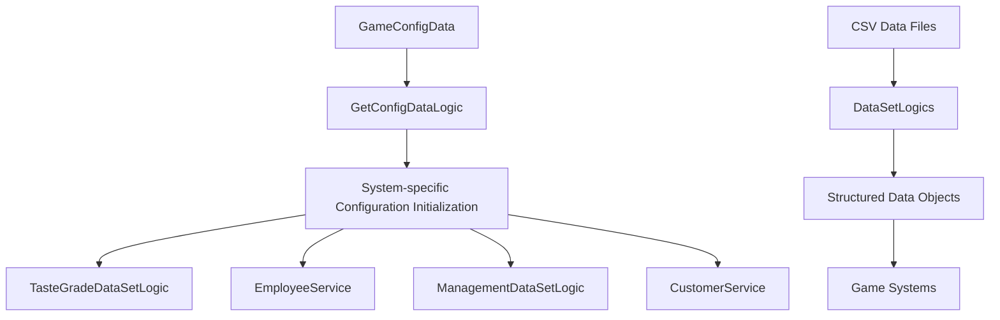

# Configuration Data

ChuChuBurger has built a comprehensive data management system to flexibly adjust complex game systems. This system efficiently controls game balance and functionality through CSV-based data tables and centralized configuration management.

## Data System Overview

### Data Architecture



## GetConfigDataLogic System

### Central Configuration Manager

GetConfigDataLogic is a core configuration system that manages key-value pairs from the GameConfigData table.

#### Configuration Initialization

Performs centralized configuration management in the OnBeginPlay() method:

1. **Data Loading**: Load all configuration values from GameConfigData table
2. **System Application**: Distribute configuration values to each system
3. **Environment-specific Initialization**: Separate initialization for client/server

Core Logic: `self.ConfigValues[key] = value`

<details>
<summary>Configuration Initialization Implementation</summary>

```lua
-- RootDesk/MyDesk/Common/GetConfigDataLogic.mlua :: OnBeginPlay()
method void OnBeginPlay()
    local config = _DataService:GetTable("GameConfigData")
    for i = 1, config:GetRowCount() do
        local row = config:GetRow(i)
        local key = row:GetItem("ConfigType")
        local value = row:GetItem("ConfigValue")
        
        if not _UtilLogic:IsNilorEmptyString(key) then
            self.ConfigValues[key] = value
        end    
    end
    
    -- Apply system-specific configuration values
    _TasteGradeDataSetLogic.FinalBalancePenalty = self:GetConfigNumDataByKey("RecipeBalanceFailPenalty")
    _TasteGradeDataSetLogic.BunTypeBonus = self:GetConfigNumDataByKey("RecipeBunCombinationBonus")
    _TasteGradeDataSetLogic.MaxTasteScoreCap = self:GetConfigNumDataByKey("RecipeMaxScore")
    
    _SettlementUIService.GraphHightMin = self:GetConfigNumDataByKey("GraphHeightMinValue")
    _CustomerService.tipRemoveTime = self:GetConfigNumDataByKey("TipLifeTimeOnTheFloor")
    
    -- Client/server-specific initialization
    if self:IsClient() then
        _EmployeeService:LoadConfigData(_UserService.LocalPlayer.PlayerComponent.UserId)
        _ManagementDataSetLogic:LoadConfigData(_UserService.LocalPlayer.PlayerComponent.UserId)
    end
    
    if self:IsServer() then
        _ManagementDataSetLogic:LoadConfigData()    
        _CustomerService:LoadDataOnServer()
    end
end
```
</details>

#### Configuration Value Retrieval

```lua
-- GetConfigDataLogic.mlua :: GetConfigNumDataByKey()
method number GetConfigNumDataByKey(string key)
    local data = self.ConfigValues[key]
    return tonumber(data)
end
```

### Configuration Application Examples

#### Recipe System Configuration
- `RecipeBalanceFailPenalty`: Penalty for balance failure
- `RecipeBunCombinationBonus`: Bun combination bonus
- `RecipeMaxScore`: Maximum taste score limit

#### Employee System Configuration
- `WorkDurationMin/Max`: Work time range
- `WorkProgressConstant1~4`: Work progress constants
- `CookEmployeeWarningWorkDuration`: Cook employee warning time

#### Customer System Configuration
- `TipLifeTimeOnTheFloor`: Floor tip survival time

## DataSetLogic System

### Common Pattern

All DataSetLogic follow the following common pattern:

All DataSetLogic follow a consistent pattern:

1. **OnBeginPlay()**: Calls LoadDataSet()
2. **LoadDataSet()**: Converts CSV data to structures
3. **Duplication Prevention**: Prevents duplicate data with same ID

<details>
<summary>Common DataSetLogic Pattern Implementation</summary>

```lua
-- Common DataSetLogic pattern
method void OnBeginPlay()
    self:LoadDataSet()
end

method void LoadDataSet()
    table.clear(self.DataTable)
    local dataSet = _DataService:GetTable("DataTableName")
    for i = 1, dataSet:GetRowCount() do
        local data = DataStructure()
        data:Load(dataSet, i)
        
        if self.DataTable[data.Id] ~= nil then
            break  -- Prevent duplication
        end
        
        self.DataTable[data.Id] = data
    end
end
```
</details>

### Major DataSetLogics

#### IngredientDataSetLogic
Manages ingredient and bun data.

```lua
-- IngredientDataSetLogic.mlua :: LoadDataSet()
method void LoadDataSet()
    table.clear(self.IngredientData)
    local ingreDataSet = _DataService:GetTable("IngredientData")
    for i = 1, ingreDataSet:GetRowCount() do
        local ingreData = IngredientData()
        ingreData:Load(ingreDataSet, i)
        
        if self.IngredientData[ingreData.Index] ~= nil then
            break
        end
    
        self.IngredientData[ingreData.Index] = ingreData
    end
    
    -- Bun data processing (complex structure)
    table.clear(self.BunData)
    local bunDataSet = _DataService:GetTable("BunData")
    local bunDatas = {}
    for i = 1, bunDataSet:GetRowCount() do
        local index = tonumber(bunDataSet:GetRow(i):GetItem("Index"))
        if not isvalid(bunDatas[index]) then
            bunDatas[index] = {}
        end
        
        local type = bunDataSet:GetRow(i):GetItem("Type")
        bunDatas[index][type] = bunDataSet:GetRow(i)
        bunDatas[index]["Tag"] = bunDataSet:GetRow(i):GetItem("Tag")
        bunDatas[index]["Grade"] = bunDataSet:GetRow(i):GetItem("Grade")
    end
    
    for k, v in pairs(bunDatas) do
        local bunData = BunData()
        bunData:Load(v, k)
        self.BunData[bunData.Index] = bunData
    end
end
```

#### BalanceDataSetLogic
Manages game balance-related data.

```lua
-- BalanceDataSetLogic.mlua :: LoadDataSet()
method void LoadDataSet()
    table.clear(self.StageConfigData)
    local scDataSet = _DataService:GetTable("StageConfigData")
    for i = 1, scDataSet:GetRowCount() do
        local scData = StageConfigData()
        scData:Load(scDataSet, i)
        
        if self.StageConfigData[scData.StageId] ~= nil then
            break
        end
        
        self.StageConfigData[scData.StageId] = scData
    end
    
    self.IsLoadConfigData = true
    
    table.clear(self.StoreAttractiveLevelData)
    local aDataSet = _DataService:GetTable("StoreAttractiveLevelData")
    for i = 1, aDataSet:GetRowCount() do
        local aData = StoreAttractiveLevelData()
        aData:Load(aDataSet, i)
        self.StoreAttractiveLevelData[aData.StoreAttractiveLevel] = aData
    end
end
```

#### TrialDataSetLogic
Manages trial system data.

```lua
-- TrialDataSetLogic.mlua :: LoadDataSet()
method void LoadDataSet()
    table.clear(self.TrialData)
    local dataSet = _DataService:GetTable("TrialDataSet")
    
    for i = 1, dataSet:GetRowCount() do
        local data = TrialData()
        data:Load(dataSet, i)
        
        if self.TrialData[data.Id] ~= nil then
            break
        end
        
        self.TrialData[data.Id] = data
    end
    
    -- Additional loading of winning weight data
    table.clear(self.WinningWeightData)
    local wDataSet = _DataService:GetTable("TrialWinningWeightData")
    for i = 1, wDataSet:GetRowCount() do
        local row = wDataSet:GetRow(i)
        local data = {}
        data["StatPerReq"] = tonumber(row:GetItem("StatPerRequirement"))
        data[1] = tonumber(row:GetItem("1"))
        data[2] = tonumber(row:GetItem("2"))
        data[3] = tonumber(row:GetItem("3"))
        table.insert(self.WinningWeightData, data)
    end
end
```

## ManagementDataSetLogic Management System

### Management Level Data

```lua
-- ManagementDataSetLogic.mlua :: LoadDataSet()
method void LoadDataSet()
    table.clear(self.ManagementLevelData)
    local levelData = _DataService:GetTable("ManagementLevelData")
    for i = 1, levelData:GetRowCount() do
        local data = ManagementLevelData()
        data:Load(levelData, i)
        
        if self.ManagementLevelData[data.Level] ~= nil then
            break
        end
        
        self.ManagementLevelData[data.Level] = data
    end
    
    table.clear(self.MaintenanceCostData)
    
    local costData = _DataService:GetTable("MaintenanceCostDataSet") 
    for i =1 , costData:GetRowCount() do
        local type = costData:GetCell(i,"MaintenanceType") 
        local value = tonumber(costData:GetCell(i,"MaintenanceCost"))
        self.MaintenanceCostData[type] = value
    end    
end
```

### Configuration Data Loading

```lua
-- ManagementDataSetLogic.mlua :: LoadConfigData()
method void LoadConfigData()
    table.clear(self.ApplianceCountSectionValue)    
    table.clear(self.ApplianceLevelSectionRate)
    table.clear(self.DisplayLevelSectionValue)
    
    for i = 1 , self.ApplianceScectionNum do 
        self.ApplianceCountSectionValue[i] = _GetConfigDataLogic:GetConfigNumDataByKey("ApplianceCount"..tostring(i))
        self.ApplianceLevelSectionRate[i] = _GetConfigDataLogic:GetConfigNumDataByKey("ApplianceLevelRate"..tostring(i))
        self.DisplayLevelSectionValue[i] = _GetConfigDataLogic:GetConfigNumDataByKey("DisplayLevelSection"..tostring(i))
    end    
end
```

### Maintenance Cost Calculation

```lua
-- ManagementDataSetLogic.mlua :: ReturnMaintenance()
method integer ReturnMaintenance(Entity player)
    -- Store rent calculation
    local storeCost = self.MaintenanceCostData["Store"]
    
    -- Employee salary calculation
    local employeeCost = 0
    for employeeId, _ in pairs(player.EmployeeManager.EmployeeData) do
        local employeeData = _EmployeeService:GetData(employeeId)
        employeeCost = employeeCost + employeeData.Salary
    end
    
    -- Facility maintenance cost calculation
    local facilityCost = self:CalculateFacilityCost(player)
    
    return storeCost + employeeCost + facilityCost
end
```

## Management UI System

### UIHUDManagement

Manages management information displayed on the HUD.

#### UI Refresh

```lua
-- UIHUDManagement.mlua :: Refresh()
method void Refresh()
    local player = _UserService.LocalPlayer
    local isUnlock = _UIButtonUnlockLogic:IsButtonUnlocked(_ButtonUnlockEnum.HUDManagement, player)
    if isUnlock == false then
        -- Locked state UI
        self.GradeBG.Entity.Enable = false
        self.GaugeParent.Enable = false
        self.RedDot.Enable = false
        self.Maple.Enable = true
        self.GradeIcon.Entity.Enable = false
        return
    end
    
    -- Unlocked state UI
    self.GradeBG.Entity.Enable = true
    self.GaugeParent.Enable = true
    self.Maple.Enable = false
    self.GradeIcon.Entity.Enable = true
    
    local playerLevel = player.PlayerManagement.ManagementLevel
    local managementMaxLevel = player.PlayerStage.NowStage == 1 and 2 or _ManagementDataSetLogic.ManagementMaxLevel
    
    local levelData = _ManagementDataSetLogic:GetManagementLevelData(playerLevel)
    self.GradeIcon.ImageRUID = levelData.IconRUID
    
    -- Goal achievement rate calculation
    local canLevelUp = true
    local goalCount = 0
    for k, v in pairs(player.PlayerManagement.CurrentGoals) do
        if v then
            goalCount = goalCount + 1
        else
            canLevelUp = false
        end
    end
    
    local goalPercent = 0.25 * goalCount
    if playerLevel+1 > managementMaxLevel then
        canLevelUp = false
        goalPercent = 1
    end
    
    -- UI settings
    self.Gauge.Color = levelData.HUDGaugeColor
    self.Gauge.FillAmount = goalPercent
    self.GradeBG.Color = levelData.HUDBackColor
    
    if canLevelUp then
        self.RedDot.Enable = true
    else
        self.RedDot.Enable = false
    end
end
```

### UIManagement

Manages the main UI of the management screen.

#### UI Opening with Animation

```lua
-- UIManagement.mlua :: Open()
method void Open()
    if self.Entity.Parent.Enable then
        return
    end
    
    _UIGroupManager:EnableManagementGroup(true)
    self:Refresh()
    
    -- Initial alpha settings
    self.GradeIcon.CanvasGroupComponent.GroupAlpha = 0
    self.CloseBtn.CanvasGroupComponent.GroupAlpha = 0
    self.Contents.CanvasGroupComponent.GroupAlpha = 0
    self._T.isProcessing = true
    
    _SoundService:PlaySound(_ResourceManager.SFXTable["Open_Management"], 1)
    
    -- Sequential animation
    _UIEntityService:PlayUIOpenAnim(self.Entity, self.Entity.UITransformComponent.anchoredPosition, Vector2.down, 0.6, nil, nil, "CubicEaseOut", nil)
    _TimerService:SetTimerOnce(function()
        _UIEntityService:PlayUIOpenAnim(self.Contents, self.Contents.UITransformComponent.anchoredPosition, Vector2.up, 0.6, nil, Vector2(100, 100), "Linear", nil)
        
        _TimerService:SetTimerOnce(function()
            _UIEntityService:PlayUIOpenAnim(self.CloseBtn, self.CloseBtn.UITransformComponent.anchoredPosition, Vector2.down, 0.6, nil, Vector2(50, 50), nil, nil)
            
            _TimerService:SetTimerOnce(function()
                _UIEntityService:PlayUIOpenAnim(self.GradeIcon, self.GradeIcon.UITransformComponent.anchoredPosition, Vector2.right, 0.6, nil, Vector2(50, 50), nil, function()
                    self._T.isProcessing = false
                end)
            end, 0.2)        
        end, 0.2)
        
    end, 0.2)
end
```

## Data Structure Examples

### TasteGradeData
Recipe taste grade data:
```lua
struct TasteGradeData
    property integer Index         -- Grade index
    property integer GradeValue    -- Grade criteria score
    property integer AttractiveScore -- Attractiveness score
    property string GradeName      -- Grade name
end
```

### ManagementLevelData
Management level data:
```lua
struct ManagementLevelData
    property integer Level         -- Management level
    property string IconRUID       -- Icon RUID
    property Color HUDGaugeColor   -- HUD gauge color
    property Color HUDBackColor    -- HUD background color
    property string NameKey        -- Name key
end
```

### StageConfigData
Stage configuration data:
```lua
struct StageConfigData
    property integer StageId       -- Stage ID
    property integer MaxCustomers  -- Maximum customers
    property number SpawnDelay     -- Spawn delay
    property number BaseAttractiveness -- Base attractiveness
end
```

## Configuration Management Best Practices

### 1. Centralized Configuration
All game constants concentrated in GameConfigData table:
```csv
ConfigType,ConfigValue
RecipeBalanceFailPenalty,-10
RecipeBunCombinationBonus,5
RecipeMaxScore,100
WorkDurationMin,3
WorkDurationMax,8
```

### 2. Type Safety
Type conversion handling when accessing configuration values:
```lua
method number GetConfigNumDataByKey(string key)
    local data = self.ConfigValues[key]
    return tonumber(data)  -- Safe number conversion
end
```

### 3. Initialization Order Management
Initialization order considering dependencies:
1. Initialize GetConfigDataLogic first
2. Initialize basic DataSetLogics
3. Initialize systems requiring configuration values

### 4. Client/Server Separation
```lua
if self:IsClient() then
    _EmployeeService:LoadConfigData(_UserService.LocalPlayer.PlayerComponent.UserId)
elseif self:IsServer() then
    _CustomerService:LoadDataOnServer()
end
```

## Development Workflow

### 1. Adding New Configuration
1. Add new key-value pair to GameConfigData.csv
2. Add initialization code to GetConfigDataLogic
3. Use configuration value in corresponding system

### 2. Adding New Data Table
1. Create CSV file
2. Define data structure (mlua file)
3. Create DataSetLogic
4. Implement LoadDataSet method
5. Implement access methods

### 3. Considerations When Changing Data
- Consider compatibility with existing data
- Implement duplication prevention logic
- Prepare error handling and fallback values

## Performance Considerations

### 1. Loading Optimization
- Load only once at game start
- Keep only necessary data in memory
- Prevent duplicate data

### 2. Memory Management
- Free memory with table.clear()
- Clean up unused data structures
- Load large data only when needed

### 3. Access Optimization
- Use ID-based hash tables
- Consider caching for frequent queries
- Minimize unnecessary data conversion

## Code Reference

### Configuration Management System
- `RootDesk/MyDesk/Common/GetConfigDataLogic.mlua :: OnBeginPlay(), GetConfigNumDataByKey()` — Central configuration management
- `RootDesk/MyDesk/Common/GameConfigData.userdataset` — Game configuration data table

### DataSetLogic Systems
- `RootDesk/MyDesk/04. Recipe/Data/IngredientDataSetLogic.mlua :: LoadDataSet()` — Ingredient data management
- `RootDesk/MyDesk/Common/Balance/BalanceDataSetLogic.mlua :: LoadDataSet()` — Balance data management
- `RootDesk/MyDesk/10. Trial/Data/TrialDataSetLogic.mlua :: LoadDataSet()` — Trial data management

### Management System
- `RootDesk/MyDesk/09. Management/ManagementDataSetLogic.mlua :: LoadDataSet(), LoadConfigData()` — Management data management
- `RootDesk/MyDesk/09. Management/UIHUDManagement.mlua :: Refresh()` — HUD management information display
- `RootDesk/MyDesk/09. Management/UIManagement.mlua :: Open(), Refresh()` — Management UI management

### Core Interfaces
```lua
-- GetConfigDataLogic main methods
method number GetConfigNumDataByKey(string key)

-- Common DataSetLogic pattern
method void OnBeginPlay()
method void LoadDataSet()

-- ManagementDataSetLogic main methods
method void LoadConfigData()
method integer ReturnMaintenance(Entity player)
method ManagementLevelData GetManagementLevelData(integer level)

-- UI system main methods
method void Refresh()  -- Data-driven UI refresh
method void Open()     -- UI opening with animation
```
