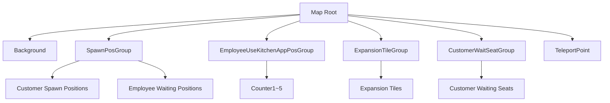
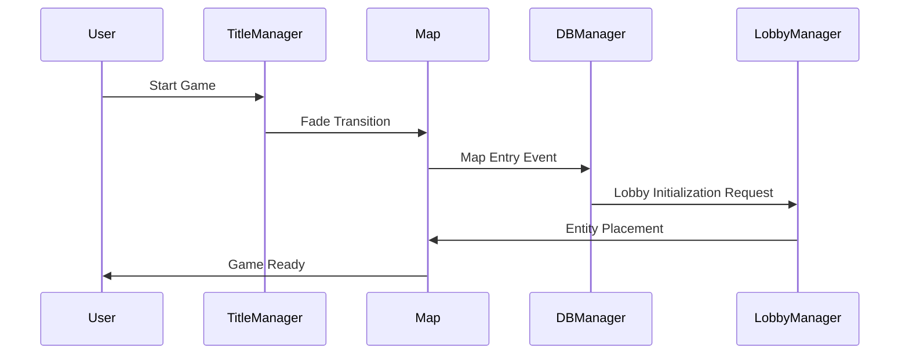

# Map Structure and Layout

ChuChuBurger constructs the game environment through a systematic map structure and precise entity placement system. Each map has unique purposes and structures, efficiently managed through development tools.

## Map Folder Structure

### Basic Map Configuration

ChuChuBurger consists of the following core maps:

#### 1. DataLoading.map
A transition map responsible for data loading when entering the game, with the following structure:

- **EntryKey**: Accessible via "map://dataloading" path
- **MapComponent**: Provides basic map functionality and FootholdComponent
- **BackgroundComponent**: Handles loading screen background

<details>
<summary>DataLoading.map Structure</summary>

```json
{
  "EntryKey": "map://dataloading",
  "Entities": [
    {
      "path": "/maps/DataLoading",
      "componentNames": "MOD.Core.MapComponent,MOD.Core.FootholdComponent"
    },
    {
      "path": "/maps/DataLoading/Background", 
      "componentNames": "MOD.Core.BackgroundComponent"
    }
  ]
}
```
</details>

#### 2. TitleMap.map
A map that provides the title screen and main menu.
- Game start button
- Data reset functionality
- Decorative character animations
- Various settings UI

#### 3. IntroMap.map
A map for game intro and tutorial progression.
- Intro dialogue system
- Tutorial guide
- Camera angles for story presentation

#### 4. Lobby Map Series
Core maps where actual gameplay takes place:
- **Lobby_Stage_1.map**: Stage 1 lobby
- **Lobby_Stage_2.map**: Stage 2 lobby
- **Lobby_Stage_3.map**: Stage 3 lobby
- **Other stage-specific maps**

### Map Entity Structure



## Spawn Position Management System

### EditorGroupTool System

An editor tool for systematically managing various positions on the map during development.

#### SpawnPosEditorLogic

An editor tool that extracts map position data to CSV.

**Main Features:**
- Customer waiting seat position extraction
- Employee kitchen appliance usage position extraction
- Customer entry/exit path position extraction
- Expansion tile group position extraction

Extracts customer waiting seat positions to CSV with the CustomerWaitSeatGroup() method:

1. **Entity Collection**: Collect all waiting seat position entities with parent.Children
2. **Coordinate Calculation**: Calculate 2D grid indices with row/col structure
3. **Position Storage**: Save TransformComponent.Position as CSV data

Core Logic: `local row = math.tointeger((i-1) / 6 + 1)` — Organized as 6 per row

<details>
<summary>Customer Waiting Seat Position Extraction Implementation</summary>

```lua
-- RootDesk/MyDesk/EditorGroupTool/SpawnPos/SpawnPosEditorLogic.mlua :: CustomerWaitSeatGroup()
method void CustomerWaitSeatGroup()
    local dataSetName = "CustomerWaitSeatGroupDataSet"
    local parent = _EntityService:GetEntityByPath("/maps/Lobby_Stage_1/CustomerWaitSeatGroup")
    
    local posEntites = parent.Children 
    
    for i,v in pairs(posEntites) do
        local row = math.tointeger((i-1) / 6 + 1)
        local col = math.tointeger((i-1) % 6 + 1)
        local x = v.TransformComponent.Position.x
        local y = v.TransformComponent.Position.y
        -- Save as CSV data
        _EditorService:DataSetSetCell(dataSetName, i, "x", tostring(x))
        _EditorService:DataSetSetCell(dataSetName, i, "y", tostring(y))
    end
end
```
</details>

#### LobbySpawnPositionLogic

A system that loads and manages spawn position data at runtime.

**Managed Position Groups:**
- `CustomerWaitSeatGroup`: Customer waiting seats (row/column structure)
- `CustomerExitTempGroup`: Customer exit temporary positions
- `CustomerEnterGroup`: Customer entry positions
- `EmployeeUseKitchenAppPosGroup`: Employee kitchen appliance usage positions
- `DisplayOffset`: Display offset information
- `ExpansionTileGroup`: Expansion tile group

Converts CSV data to 2D table with LoadRowColDataSet() method:

1. **Data Loading**: Load CSV dataset with _DataService:GetTable()
2. **2D Structure Creation**: Create 2D table with row/col as keys
3. **Vector3 Conversion**: Convert x, y coordinates to FastVector3 for storage

Core Logic: `targetTable[row][col] = FastVector3(x, y, 0)`

<details>
<summary>Runtime Position Data Loading Implementation</summary>

```lua
-- RootDesk/MyDesk/EditorGroupTool/SpawnPos/LobbySpawnPositionLogic.mlua :: LoadRowColDataSet()
method void LoadRowColDataSet(table targetTable, string dataSetName)
    local dataset = _DataService:GetTable(dataSetName)
    local rows = dataset:GetAllRow()
    
    for i, v in pairs(rows) do
        local row = math.tointeger(tonumber(v:GetItem("row")))
        local col = math.tointeger(tonumber(v:GetItem("col")))
        local x = tonumber(v:GetItem("x"))
        local y = tonumber(v:GetItem("y"))
        
        if targetTable[row] == nil then
            targetTable[row] = {}
        end
        
        targetTable[row][col] = FastVector3(x, y, 0)
    end
end
```
</details>

### Navigation System

#### NaviNodeEditorLogic

An editor tool that manages navigation nodes for AI pathfinding.

**Features:**
- Navigation node position extraction
- Jump capability settings
- Stage-specific navigation data generation

Extracts navigation node data with Function1() method:

1. **Stage-specific Dataset**: Separated by stage with "DataSet_NaviGroup_Stage" + stageString format
2. **Node Information Collection**: Collect TransformComponent.Position and NaviPoint.jump attributes
3. **CSV Storage**: Save x, y coordinates and jump capability to CSV

Core Logic: `local jump = v.NaviPoint.jump` — Set movement restrictions with jump capability

<details>
<summary>Navigation Node Extraction Implementation</summary>

```lua
-- RootDesk/MyDesk/EditorGroupTool/NaviNode/NaviNodeEditorLogic.mlua :: Function1()
method void Function1()
    local stageString = self.SelectedStage.Text
    local dataSetName = "DataSet_NaviGroup_Stage"..stageString
    local parent = _EntityService:GetEntityByPath("/maps/Lobby/Model_NaviGroup")
    
    local nodes = parent.Children 
    
    for row,v in pairs(nodes) do
        local x = v.TransformComponent.Position.x
        local y = v.TransformComponent.Position.y
        local jump = v.NaviPoint.jump
        -- Save navigation data
        _EditorService:DataSetSetCell(dataSetName, row, "x", tostring(x))
        _EditorService:DataSetSetCell(dataSetName, row, "y", tostring(y))
        _EditorService:DataSetSetCell(dataSetName, row, "jump", tostring(jump))
    end
end
```
</details>

## Title Screen System

### TitleManager

A core component responsible for overall management of the title screen.

#### Map Transition Management

Handles title map entry with OnMapEnter() method:

`if enteredMap.Name == "TitleMap" then` — Detects title map entry and initializes UI

<details>
<summary>Map Transition Management Implementation</summary>

```lua
-- RootDesk/MyDesk/Title/TitleManager.mlua :: OnMapEnter()
method void OnMapEnter(Entity enteredMap)
    if enteredMap.Name == "TitleMap" then
        self.UserPlayType = "1"
        local userId = self.Entity.PlayerComponent.UserId
        
        self:PassCheckServer()
        self:OpenTitleUI(userId)
    end
end
```
</details>

#### Game Start Processing

Handles transition to next map with ReadyForEnterToWorld() method:

1. **Map Decision**: Select lobby or intro map based on intro status
2. **Localization Setting**: Request localized text from server
3. **Fade Transition**: Smooth screen transition effect

<details>
<summary>Game Start Processing Implementation</summary>

```lua
-- RootDesk/MyDesk/Title/TitleManager.mlua :: ReadyForEnterToWorld()
method void ReadyForEnterToWorld(boolean isIntroMap)
    local userId = self.Entity.PlayerComponent.UserId
    local nextMapName = "Lobby"
    
    if isIntroMap then
        nextMapName = "Lobby"
    elseif self:PassCheckServer() == false then 
        nextMapName = self.Entity.PlayerDialog.IntroMapName
    end
    
    _GetLocalizationTextLogic:RequestSetLocalizedTextServer(userId)
    self:ShowFade(nextMapName, userId)
end
```
</details>

#### Resource Preloading

Preloads resources for game entry in OpenTitleUI() method:

- **UI Activation**: Display title UI with UITitle:TitleUIOn()
- **HUD Deactivation**: Disable lobby HUD group
- **Tileset Preloading**: Asynchronous loading of 3 main tilesets

<details>
<summary>Resource Preloading Implementation</summary>

```lua
-- RootDesk/MyDesk/Title/TitleManager.mlua :: OpenTitleUI()
method void OpenTitleUI()
    _UIGroupManager.TitleUIGroup.UITitle:TitleUIOn()
    _UIGroupManager:EnableLobbyHUDGroup(false)
    
    -- Tileset preloading
    _ResourceService:PreloadTileSetAsync("tileset://9c83666b-7388-4664-a444-3ee19e1e7980", function()  end)
    _ResourceService:PreloadTileSetAsync("tileset://660f086b-019f-4423-8d9a-874099926c53", function()  end)
    _ResourceService:PreloadTileSetAsync("tileset://362cff79-7315-493d-bf04-1656dfb05207", function()  end)
end
```
</details>

### UITitle

A component that manages UI elements on the title screen.

#### Main UI Elements
- `GameStartButton`: Game start button
- `ResetDataButton`: Data reset button
- `InfoButton`: Info button
- `FixDataButton`: Data fix button
- `ResetPopup`: Reset confirmation popup
- `InfoPopup`: Info popup

#### Title UI Activation
```lua
-- UITitle.mlua :: TitleUIOn()
method void TitleUIOn()
    self:CloseAllPopup()
    _UIGroupManager:EnableMoneyBarGroup(false)
    
    self.Entity.Enable = true
    self:ToggelToastAlpha()
    self:SpawnDeco()
    self:TweenDecoCharacter()
end
```

### TitleEmployee Decoration System

A decorative employee system that creates atmosphere on the title screen.

#### Random Employee Generation
```lua
-- TitleEmployee.mlua :: OnBeginPlay()
method void OnBeginPlay()
    local dataSet = _DataService:GetTable("EmployeeDataSet")
    local index = _UtilLogic:RandomIntegerRange(1, dataSet:GetRowCount())
    
    local rowEmployee = dataSet:GetRow(index)
    local data = _EmployeeService:GetData(rowEmployee:GetItem("Id"))
    
    self.Entity.SpriteGUIRendererComponent.ImageRUID = data.MoveRUID
    
    -- Random burger generation
    local burger = self.Entity:GetChildByName("Burger")
    local burgerTagDataSet = _DataService:GetTable("RecipeTagData")
    
    local randomIndex = _UtilLogic:RandomIntegerRange(1,burgerTagDataSet:GetRowCount())
    local row = burgerTagDataSet:GetRow(randomIndex)
    local burgerTag = row:GetItem("Type")
    
    -- Randomly determine burger count
    local randomNum = _UtilLogic:RandomIntegerRange(1,12)
    local burgerCount = 0
    if randomNum > 10 then
        burgerCount = randomNum 
    elseif randomNum > 5 then
        burgerCount = math.floor(randomNum % 5)
    else
        burgerCount = randomNum
    end
    
    -- Burger stack visualization
    burger.SpriteGUIRendererComponent.ImageRUID = burgerTagDataSet:FindRow("Type",burgerTag):GetItem("SmallPackRUID")
    burger.UITransformComponent.RectSize.y = 30 + 10 * (burgerCount - 1)
    burger.UITransformComponent.Position.y = 45 + 10 * (burgerCount - 1)
end
```

#### Movement Animation
```lua
-- TitleEmployee.mlua :: MoveStart()
method void MoveStart(boolean flipX, integer posY)
    local burger = self.Entity:GetChildByName("Burger")
    self.Entity.SpriteGUIRendererComponent.FlipX = flipX
    burger.SpriteGUIRendererComponent.FlipX = flipX
    
    math.randomseed(os.time()) 
    if flipX then
        _TweenLogic:MoveTo(self.Entity, Vector2(1300, posY), math.random(15,25) , EaseType.Linear )
    else
        _TweenLogic:MoveTo(self.Entity, Vector2(-1300, posY), math.random(15,25)  , EaseType.Linear )
    end
    
    -- Auto-destroy
    local selfDistroy = function()
        _EntityService:Destroy(self.Entity)
    end
    _TimerService:SetTimer(self, selfDistroy, 25, false )
end
```

#### Decoration Spawn System
```lua
-- UITitle.mlua :: SpawnDeco()
method void SpawnDeco()
    local spawnPos = Vector3.zero
    local floor1 = self.Entity:GetChildByName("TitleMapUI"):GetChildByName("TitleBg_Floor") :GetChildByName("TitleSpawner1") 
    local floor2 = self.Entity:GetChildByName("TitleMapUI"):GetChildByName("TitleBg_Floor") :GetChildByName("TitleSpawner2") 
    
    local modelId = _EntryService:GetModelIdByName("Model_Title_Employee")
    
    local callback = function()
        local randomNum = _UtilLogic:RandomIntegerRange(1,4)
        
        -- Determine random spawn position
        if randomNum == 1 then
            spawnPos = Vector3(1300, -440, 0)
        elseif randomNum == 2 then
            spawnPos = Vector3(1300, -350, 0)  
        elseif randomNum == 3 then
            spawnPos = Vector3(-1300, -430, 0)
        elseif randomNum == 4 then
            spawnPos = Vector3(-1300, -360, 0)
        end
        
        local decoEmployee
        
        -- Spawn by floor
        if randomNum == 1 or randomNum == 3 then
            decoEmployee = _SpawnService:SpawnByModelId(modelId, "Deco", spawnPos, floor1)
        elseif randomNum == 2 or randomNum == 4 then
            decoEmployee = _SpawnService:SpawnByModelId(modelId, "Deco", spawnPos, floor2)
        end
            
        -- Start movement (determine direction)
        if randomNum >= 3 then
            decoEmployee.TitleEmployee:MoveStart(true, spawnPos.y)
        else
            decoEmployee.TitleEmployee:MoveStart(false, spawnPos.y)
        end
    end
    
    -- Repeat spawn every 3-8 seconds
    _TimerService:SetTimer(self,callback, _UtilLogic:RandomIntegerRange(3,8), true )
end
```

## Map Data Management

### Map Loading Sequence



### Stage-specific Map Transition

```lua
-- TitleManager.mlua :: MoveToNextMap()
method void MoveToNextMap(string nextMapName)
    local destPath = ""
    if nextMapName == "Lobby" then
        local nowStage = self.Entity.PlayerStage.NowStage
        local mapName = self.Entity.PlayerStage:ReturnMapName(nowStage)
        destPath = string.format("/maps/%s/SpawnPosGroup/EmployeeWaitCook", mapName)
        
    elseif nextMapName == self.Entity.PlayerDialog.IntroMapName then
        destPath = self.Dest_IntroEntityPath
    elseif nextMapName == "Title" then
        destPath = self.Dest_TitleEntityPath
    end
    
    _TeleportService:TeleportToEntityPath(self.Entity, destPath)
    _FadeService:HideFade(self.Entity.PlayerComponent.UserId)
end
```

## Development Workflow

### Map Creation Process

1. **Basic Map Structure Creation**: Set MapComponent, Background
2. **Spawn Position Placement**: Manual placement in editor
3. **Data Extraction**: Generate CSV data with EditorGroupTool
4. **Runtime Loading**: Load data with SpawnPositionLogic
5. **Testing and Adjustment**: Verify and modify positions in-game

### Editor Tool Usage

```lua
-- Customer waiting seat position extraction example
self:CustomerWaitSeatGroup()  -- Extract position data to CSV
self:LoadRowColDataSet(self.CustomerWaitSeatGroup, "CustomerWaitSeatGroupDataSet")  -- Runtime loading
```

### Expansion Tile System

```lua
-- ExpansionTileGroup data structure
method void ExpansionTileGroup()
    for i,v in pairs(posEntites) do
        local _type = math.tointeger((i-1) / 12 + 1)
        local index = math.tointeger(((i-1) / 2) % 6) + 1
        local _dir = math.tointeger((i-1) % 2 + 1)
        
        local type = "Cash"
        if _type == 2 then
            type = "Kitchen"
        end
        
        local dir = "Bottom"
        if _dir == 2 then
            dir = "Top"
        end
        
        -- Save expansion tile information
        _EditorService:DataSetSetCell(dataSetName, i, "type", type)
        _EditorService:DataSetSetCell(dataSetName, i, "index", tostring(index))
        _EditorService:DataSetSetCell(dataSetName, i, "dir", dir)
    end
end
```

## Performance Considerations

### Entity Management
- Entities not visible on screen are deactivated
- Spawned decoration characters have auto-destroy timers
- Large position data externalized to CSV

### Memory Optimization
- Load only necessary resources per map
- Reduce loading time with tileset preloading
- Unload unused map data

## Code Reference

### Map Management System
- `RootDesk/MyDesk/Title/TitleManager.mlua :: OnMapEnter(), ReadyForEnterToWorld(), MoveToNextMap()` — Title screen and map transition management
- `RootDesk/MyDesk/Title/UITitle.mlua :: TitleUIOn(), SpawnDeco(), OnGameStartButton()` — Title UI and decoration system

### Spawn Position Management
- `RootDesk/MyDesk/EditorGroupTool/SpawnPos/SpawnPosEditorLogic.mlua :: CustomerWaitSeatGroup(), ExpansionTileGroup()` — Editor position extraction tools
- `RootDesk/MyDesk/EditorGroupTool/SpawnPos/LobbySpawnPositionLogic.mlua :: LoadRowColDataSet(), LoadKitchenAppDataSet()` — Runtime position data loading

### Navigation System
- `RootDesk/MyDesk/EditorGroupTool/NaviNode/NaviNodeEditorLogic.mlua :: Function1()` — Navigation node editor

### Decoration System
- `RootDesk/MyDesk/Title/TitleEmployee.mlua :: OnBeginPlay(), MoveStart()` — Title decoration employee system

### Core Interfaces
```lua
-- TitleManager main methods
method void OnMapEnter(Entity enteredMap)
method void ReadyForEnterToWorld(boolean isIntroMap)
method void MoveToNextMap(string nextMapName)

-- UITitle main methods
method void TitleUIOn()
method void SpawnDeco()
method void OnGameStartButton(boolean isIntroMap)

-- TitleEmployee main methods  
method void OnBeginPlay()  -- Random employee/burger generation
method void MoveStart(boolean flipX, integer posY)  -- Movement animation

-- LobbySpawnPositionLogic main methods
method void LoadRowColDataSet(table targetTable, string dataSetName)
method void LoadKitchenAppDataSet(table targetTable, string dataSetName)
```
