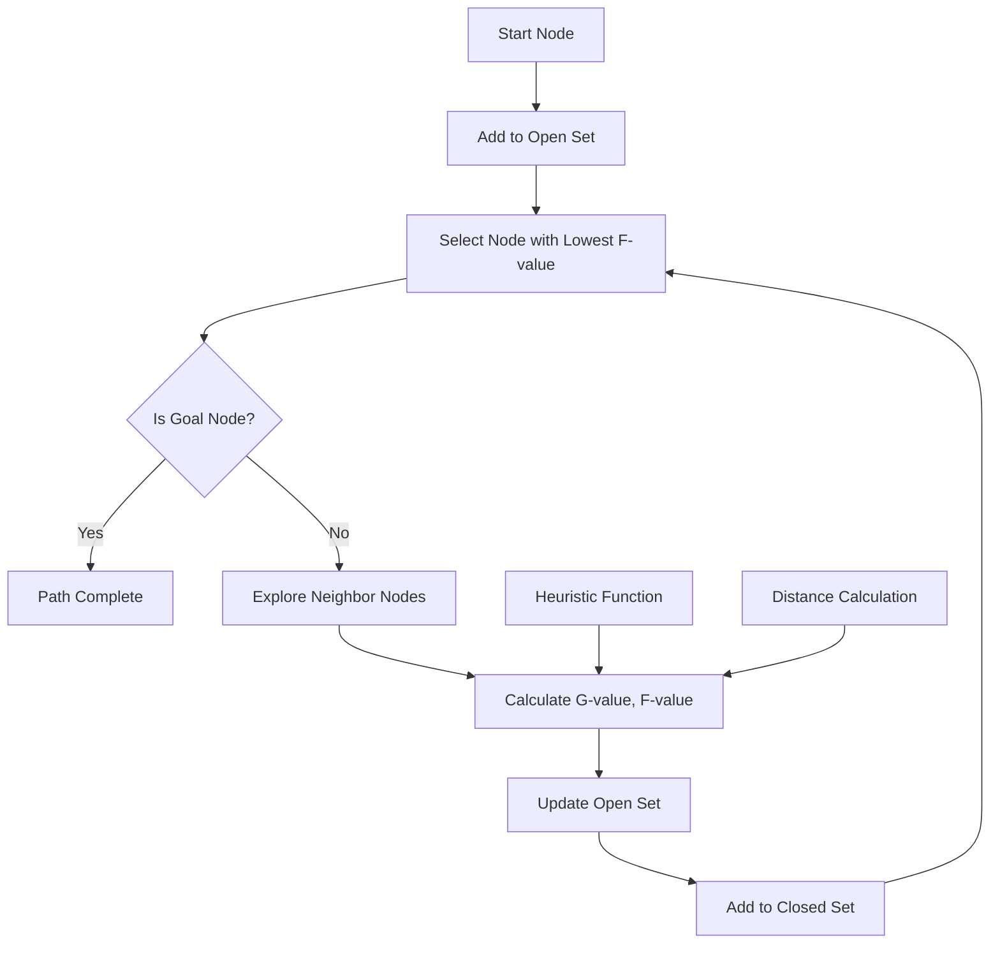

# Pathfinding and Movement

ChuChuBurger implements an A* algorithm-based pathfinding system for natural movement of employees and customers. This system calculates efficient and natural movement paths even in complex store layouts.

## PathFinder System

### A* Algorithm Implementation

PathFinder is the core pathfinding engine of the game, implementing the standard A* algorithm.

#### Core Components

Core distance calculation functions of the A* algorithm:

- **dist()**: Euclidean distance calculation between two points
- **heuristic_cost_estimate()**: Heuristic cost estimation
- **dist_between()**: Actual cost between adjacent nodes

<details>
<summary>Core Distance Calculation Function Implementation</summary>

```lua
-- RootDesk/MyDesk/PathFinder/PathFinder.mlua :: Core functions
self._T.dist = function ( x1, y1, x2, y2 )
    return math.sqrt ( ( x2 - x1)^2 + (y2 - y1)^2 )
end

self._T.heuristic_cost_estimate = function ( nodeA, nodeB )
    return self._T.dist ( nodeA.x, nodeA.y, nodeB.x, nodeB.y )
end

self._T.dist_between = function ( nodeA, nodeB )
    return self._T.dist ( nodeA.x, nodeA.y, nodeB.x, nodeB.y )
end
```
</details>

#### A* Algorithm Main Logic

```lua
-- PathFinder.mlua :: a_star function
self._T.a_star = function ( start, goal, nodes )
    local closedset = {}
    local openset = { start }
    local came_from = {}

    local g_score, f_score = {}, {}
    g_score [ start ] = 0
    f_score [ start ] = g_score [ start ] + self._T.heuristic_cost_estimate ( start, goal )

    while #openset > 0 do
        local current = self._T.lowest_f_score ( openset, f_score )
        if current == goal then
            local path = self._T.unwind_path ( {}, came_from, goal )
            table.insert ( path, goal )
            return path
        end

        self._T.remove_node ( openset, current )
        table.insert ( closedset, current )
        
        local neighbors = self._T.neighbor_nodes( current, nodes )
        for _, neighbor in ipairs ( neighbors ) do 
            if self._T.not_in ( closedset, neighbor ) then
                local tentative_g_score = g_score [ current ] + self._T.dist_between ( current, neighbor )
                 
                if self._T.not_in ( openset, neighbor ) or tentative_g_score < g_score [ neighbor ] then 
                    came_from [ neighbor ] = current
                    g_score [ neighbor ] = tentative_g_score
                    f_score [ neighbor ] = g_score [ neighbor ] + self._T.heuristic_cost_estimate ( neighbor, goal )
                    if self._T.not_in ( openset, neighbor ) then
                        table.insert ( openset, neighbor )
                    end
                end
            end
        end
    end
    return nil 
end
```

### Map Data Management

PathFinder manages map navigation node information and initialization.

#### Node Initialization

Initializes map data with the InitNodes() method:

`self.nowLevel = level` — Sets current level and loads stage-specific data

<details>
<summary>Map Data Initialization Implementation</summary>

```lua
-- RootDesk/MyDesk/PathFinder/PathFinder.mlua :: InitNodes()
method void InitNodes(number level)
    -- Map data initialization logic
    self.nowLevel = level
    -- Load stage-specific navigation data
end
```
</details>

#### Neighboring Node Calculation

```lua
-- PathFinder.mlua :: neighbor_nodes function
self._T.neighbor_nodes = function( theNode, nodes )
    local neighbors = {}
    local row = math.floor((theNode.id - 1) / self.col) + 1
    local col = (theNode.id - 1) % self.col + 1

    for i = row - 1, row + 1 do
        for j = col - 1, col + 1 do
            if (i >= 1 and i <= self.row and j >= 1 and j <= self.col) and not (i == row and j == col) then
                local adjacentIndex = (i - 1) * self.col + j
                if nodes[adjacentIndex].jump == false then
                    table.insert(neighbors, nodes[adjacentIndex])
                end
            end
        end
    end
    return neighbors
end
```

### Path Caching System

Caches calculated paths for performance optimization.

#### Cache Management

```lua
-- PathFinder.mlua :: path function (with cache system)
self._T.path = function ( start, goal, nodes, ignore_cache )
    if not self._T.cachedPaths [ start ] then
        self._T.cachedPaths [ start ] = {}
    elseif self._T.cachedPaths [ start ] [ goal ] and not ignore_cache then
        return self._T.cachedPaths [ start ] [ goal ]
    end

    local resPath = self._T.a_star ( start, goal, nodes )

    if not self._T.cachedPaths [ start ] [ goal ] and not ignore_cache then
        self._T.cachedPaths [ start ] [ goal ] = resPath
    end

    return resPath
end
```

#### Cache Initialization

```lua
-- PathFinder.mlua :: clear_cached_paths function
self._T.clear_cached_paths = function ()
    self._T.cachedPaths = nil
end
```

## EmployeeMoveScript System

A component responsible for employee movement that works with PathFinder to handle actual movement.

### A* Movement Initialization

```lua
-- EmployeeMoveScript.mlua :: InitForAstar()
method void InitForAstar()
    self._T.targetPos = self.Entity.TransformComponent.Position
    self._T.path = nil
    self._T.arriveLastNode = false
    self._T.currentNode = 1
    self._T.flipCoolTime = 0.5
    self._T.needToRefreshPath = false
    
    -- Define path refresh function
    self._T.refreshPath = function()
        -- Path calculation logic
    end
    
    if self:InitGraph() then
        self._T.refreshPath()
        self.useAstar = true
    end
end
```

### Graph Initialization

```lua
-- EmployeeMoveScript.mlua :: InitGraph()
method boolean InitGraph()
    if #self.graph > 0 then
        table.clear(self.graph)
    end
    
    if _PathFinder.nowLevel < 3 then
        return false
    end
    
    if isvalid(self.Entity.ServingEmployeeAIScript) then
        return false  -- Serving employees don't use A*
    end
    
    local i = 1
    for k,v in pairs(_PathFinder.mapData) do
        self.graph [ i ] = {}
        self.graph [ i ].id = i
        self.graph [ i ].x = v.x
        self.graph [ i ].y = v.y
        self.graph [ i ].jump = v.jump
        i = i + 1
    end
    
    return true
end
```

### Path Refresh

```lua
-- EmployeeMoveScript.mlua :: refreshPath function
self._T.refreshPath = function()
    self._T.needToRefreshPath = false
    local pos = self.Entity.TransformComponent.Position

    if isvalid(self.targetPosition) then        
        local targetPos = self.targetPosition
        self._T.targetPos = targetPos        
        local monsterPos = self.Entity.TransformComponent.Position
        self._T.preTargetPos = targetPos:Clone()
        
        local maxMonster = 9999
        local maxTarget = 9999
        local startIndex = 1
        local goalIndex = 1
        
        -- Find nodes closest to start and goal points
        for k, v in pairs(self.graph) do
            local dist = (v.x - monsterPos.x) * (v.x - monsterPos.x) + (v.y - monsterPos.y) * (v.y - monsterPos.y)
            if dist < maxMonster then
                maxMonster = dist
                startIndex = v.id
            end
            local distTarget = (v.x - targetPos.x) * (v.x - targetPos.x) + (v.y - targetPos.y) * (v.y - targetPos.y)
            if distTarget < maxTarget then
                maxTarget = distTarget
                goalIndex = v.id
            end
        end
        
        -- A* path calculation
        local newPath = _PathFinder:path( self.graph [startIndex], self.graph [goalIndex], self.graph, false )

        if newPath ~= nil then
            self._T.path = newPath
            self._T.arriveLastNode = false
            self._T.currentNode = 1
            
            local length = #newPath
            if #newPath > 2 then
                self._T.currentNode = 2
            elseif #newPath <= 2 then
                self._T.arriveLastNode = true
            end
        end
    end
end
```

### Movement Processing

```lua
-- EmployeeMoveScript.mlua :: OnUpdate()
method void OnUpdate(number delta)
    if not self.CanMove then 
        return
    end 
    
    if not isvalid(self.targetPosition) then
        return
    end
    
    if self.useAstar then
        self:MoveByAstar(delta)
    else
        self:MoveByLinear(delta)
    end
end
```

### Target Change Handling

```lua
-- EmployeeMoveScript.mlua :: ChangeTarget()
method void ChangeTarget(string location)
    if string.find(self.Entity.Name,"Customer") then 
        -- Customers move to random positions
        self.targetPosition = _EntityService:GetEntityByPath(_UserService.LocalPlayer.CurrentMap.Path.."/SpawnPosGroup/Customer/CustomerCreate".._UtilLogic:RandomIntegerRange(1,3)).TransformComponent.Position
    elseif isvalid(self.Entity.CookEmployeeAIScript) or isvalid(self.Entity.ServingEmployeeAIScript)  then
        -- Employees move to designated positions
        self.targetPosition = _LobbyEntityLogic:GetEmployeeSpawnPostion(location).TransformComponent.Position
        self:InitForAstar() 
    end
end
```

## Algorithm Detailed Analysis

### Core Elements of A* Algorithm



### Cost Calculations

#### G Cost (Actual Distance from Start)
```lua
local tentative_g_score = g_score [ current ] + self._T.dist_between ( current, neighbor )
```

#### H Cost (Estimated Distance to Goal)
```lua
self._T.heuristic_cost_estimate = function ( nodeA, nodeB )
    return self._T.dist ( nodeA.x, nodeA.y, nodeB.x, nodeB.y )
end
```

#### F Cost (G + H)
```lua
f_score [ neighbor ] = g_score [ neighbor ] + self._T.heuristic_cost_estimate ( neighbor, goal )
```

### Path Reconstruction

```lua
-- PathFinder.mlua :: unwind_path function
self._T.unwind_path = function ( flat_path, map, current_node )
    if map [ current_node ] then
        table.insert ( flat_path, 1, map [ current_node ] ) 
        return self._T.unwind_path ( flat_path, map, map [ current_node ] )
    else
        return flat_path
    end
end
```

## Optimization Techniques

### 1. Path Caching
- Paths for identical start-goal combinations are reused from cache
- Cache is cleared when map changes to maintain consistency

### 2. Conditional A* Usage
- A* algorithm is only activated at level 3 and above
- Serving employees use simple movement (reduced complexity)

### 3. Grid-based Node Management
- Maps are divided into grids to minimize node count
- Optimized neighbor node calculation

### 4. Jump-capable Node Filtering
```lua
if nodes[adjacentIndex].jump == false then
    table.insert(neighbors, nodes[adjacentIndex])
end
```

## Collision Avoidance and Dynamic Obstacles

### 1. Static Obstacle Handling
- Obstacle areas excluded from navigation nodes
- `jump` attribute marks impassable nodes

### 2. Dynamic Path Recalculation
- Automatic path recalculation when target changes
- Alternative path search when path fails

### 3. Path Validation
- Returns null when path calculation fails
- Provides safe fallback mechanisms

## Usage Patterns

### Employee Movement
```lua
-- Cook employees: Use A* pathfinding
if isvalid(self.Entity.CookEmployeeAIScript) then
    self:InitForAstar() 
end

-- Serving employees: Simple linear movement
if isvalid(self.Entity.ServingEmployeeAIScript) then
    self:MoveByLinear(delta)
end
```

### Customer Movement
```lua
-- Customers: Simple random position movement
if string.find(self.Entity.Name,"Customer") then 
    self.targetPosition = GetRandomCustomerPosition()
end
```

## Performance Considerations

### 1. Computational Complexity
- Time complexity: O((V + E) log V) (V: number of nodes, E: number of edges)
- Space complexity: O(V) (proportional to number of nodes)

### 2. Memory Usage
- Graph data: approximately 32 bytes per node
- Cache data: variable size per path
- Memory management through periodic cache cleanup

### 3. Real-time Performance
- Maximum 1 path calculation per frame
- Non-urgent paths deferred to next frame
- Reduced calculation count through improved cache hit rate

## Developer Guide

### PathFinder Usage

1. **Node Initialization**: Load map data with `InitNodes(level)`
2. **Path Calculation**: Get paths with `path(start, goal, nodes, ignore_cache)`
3. **Cache Management**: Clear cache with `clear_cached_paths()` when needed

### EmployeeMoveScript Setup

1. **A* Activation**: Initialize A* movement with `InitForAstar()`
2. **Target Setting**: Change target point with `ChangeTarget(location)`
3. **Movement Control**: Enable/disable movement with `CanMove` flag

### Debugging Tips

1. **Path Visualization**: Draw calculated paths on screen for verification
2. **Node State Check**: Log G, H, F values for each node
3. **Cache State Monitoring**: Track cache hit rate and memory usage

## Code Reference

### PathFinder Core
- `RootDesk/MyDesk/PathFinder/PathFinder.mlua :: a_star(), path(), neighbor_nodes()` — A* algorithm core implementation
- `RootDesk/MyDesk/PathFinder/PathFinder.mlua :: heuristic_cost_estimate(), dist_between()` — Cost calculation functions

### EmployeeMoveScript Movement System
- `RootDesk/MyDesk/PathFinder/EmployeeMoveScript.mlua :: InitForAstar(), refreshPath()` — A* movement system initialization
- `RootDesk/MyDesk/PathFinder/EmployeeMoveScript.mlua :: InitGraph(), ChangeTarget()` — Graph management and target changing

### Core Interfaces
```lua
-- PathFinder main methods
method table path(any start, any goal, any nodes, any ignore_cache)
method number distance(Vector2 x1, Vector2 y1, Vector2 x2, Vector2 y2)
method void InitNodes(number level)

-- EmployeeMoveScript main methods
method void InitForAstar()
method boolean InitGraph()
method void ChangeTarget(string location)
method void MoveByAstar(number delta)

-- A* core functions
self._T.a_star = function ( start, goal, nodes )
self._T.heuristic_cost_estimate = function ( nodeA, nodeB )
self._T.neighbor_nodes = function( theNode, nodes )
```
