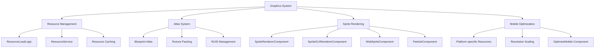

# Graphics and Sound

ChuChu Burger is a cross-platform game supporting mobile and PC, equipped with efficient resource management and platform optimization systems. Through atlas-based graphics systems and multi-layered sound management systems, it provides optimal performance and user experience.

## Graphics System Overview

### Core Graphics Architecture



## ResourceLoadLogic Resource Management

### Centralized Resource Management

ResourceLoadLogic is the core system responsible for loading and unloading all resources.

```lua
-- ResourceLoadLogic.mlua :: OnBeginPlay()
method void OnBeginPlay()
    self:AvatarResourcesUnload("CustomAvatarDataSet")
    
    local data = _DataService:GetTable("MobileResourceDataSet")
    
    for i = 1,data:GetRowCount() do
        local row = data:GetRow(i)
        local pc = row:GetItem("PCRUID")
        local mobile = row:GetItem("MobileRUID")
        
        self.MobileResourceTable[pc] = mobile
    end
    
    -- Preload platform-specific default resources
    local ruids
    if Environment:IsMobilePlatform() then
        ruids = {"75e532e60091464eae250f0d147cdf98", ...}
    else
        ruids = {"ce1622084bb14a31b82cb5b2bd624352", ...}
    end
    
    _ResourceService:PreloadAsync(ruids, nil)
end
```

#### Asynchronous Resource Loading

```lua
-- ResourceLoadLogic.mlua :: PreLoadResources()
@ExecSpace("ClientOnly")
method void PreLoadResources(table ruids, any onLoadCallback)
    if #ruids > 0 then
        _ResourceService:PreloadAsync(ruids, onLoadCallback)
    end
end

-- Usage example
local ruids = {"ruid1", "ruid2", "ruid3"}
_ResourceLoadLogic:PreLoadResources(ruids, function()
    print("Resource loading complete!")
    -- Execute UI updates or game logic
end)
```

#### Resource Unloading and Memory Management

```lua
-- ResourceLoadLogic.mlua :: UnloadResources()
@ExecSpace("ClientOnly")
method void UnloadResources(table ruids)
    _ResourceService:RemoveCaches(ruids)
    _ResourceService:UnloadUnusedResources(0)
end

-- Avatar resource management
method void AvatarResourcesUnload(string dataSetName)
    if self.stage == 0 then 
        return
    end
    
    local totalRuids = self:DialogAvatarRuids(self.stage, dataSetName)
    self:UnloadResources(totalRuids)
end
```

### Stage-specific Avatar Resource Loading

```lua
-- ResourceLoadLogic.mlua :: DialogAvatarRuids()
method table DialogAvatarRuids(number stage, string dataSetName)
    local avatarDataSet = _DataService:GetTable("AvatarStageDataSet")
    local stageKey = "Stage"..tostring(stage)
    local selectIds = {}
    
    -- Collect avatar IDs needed for current stage
    for _ , row in pairs(avatarDataSet:GetAllRow()) do
        local idValue = row:GetItem(stageKey)
        if idValue and idValue ~= "" then
            table.insert(selectIds, tonumber(idValue))
        end
    end
    
    -- Collect all RUIDs for those IDs
    local dataSet = _DataService:GetTable(dataSetName)
    local totalRuids = {}
    -- ... RUID collection logic
    
    return totalRuids
end
```

## Blueprint Atlas System

### Atlas Structure and Packing

Blueprint Atlas is a system that integrates multiple individual images into one large texture to optimize draw calls.

#### Atlas Definition Structure

```json
// Atlas_UI_Common.blueprintatlas example
{
  "Id": "",
  "EntryKey": "blueprintatlas://374b1899-dbd9-40d6-89c5-48dd27ca7a70",
  "ContentType": "x-mod/blueprintatlas",
  "ContentProto": {
    "Use": "Json",
    "Json": {
      "name": "Atlas_UI_Common",
      "width": 2048,
      "height": 2048,
      "padding": 4,
      "filtermode": 1,
      "resource_guid": "53f84fe7ac8c4819bc80ad052a3c6a3b",
      "images": [
        {
          "RUID": "70e39ebdfa944266911da9a7ba02c4af",
          "VersionString": null
        }
      ]
    }
  }
}
```

#### Category-based Atlas Classification

Atlases are categorized by each game function, allowing loading only when needed:

- **Atlas_UI_Common**: Common UI elements
- **Atlas_UI_Recipe**: Recipe-related UI
- **Atlas_Training_Place**: Training backgrounds and objects
- **Atlas_NPC**: Character and customer sprites
- **Atlas_TitleScene**: Title screen exclusive resources
- **Atlas_Anim_Ready_X**: Animation frames

### Atlas Optimization Techniques

#### Padding and Filtering

```json
"padding": 4,           // 4-pixel spacing between each image
"filtermode": 1,        // Filter mode (0=Point, 1=Linear)
```

#### Resolution-based Optimization

```json
"width": 2048,
"height": 2048,
```

Most atlases are unified at 2048x2048 size to maximize GPU efficiency.

## Sprite Rendering System

### SpriteRendererComponent (World Sprites)

Handles 3D/2.5D sprites rendered in world space.

```lua
-- World sprite setup example
local spriteEntity = world:SpawnEntity()
local renderer = spriteEntity.SpriteRendererComponent

renderer.SpriteRUID = "70e39ebdfa944266911da9a7ba02c4af"
renderer.SortingLayer = "Default"
renderer.OrderInLayer = 1
renderer.FlipX = false
renderer.DrawMode = SpriteDrawMode.Simple
```

#### Animation Playback

```lua
-- SpriteRendererComponent animation
renderer.PlayRate = 1.0
renderer.StartFrameIndex = 0
renderer.EndFrameIndex = 24
-- Automatically plays frame by frame
```

### SpriteGUIRendererComponent (UI Sprites)

Handles 2D sprites rendered in UI space.

```lua
-- UI sprite setup
local uiSprite = uiEntity.SpriteGUIRendererComponent

uiSprite.ImageRUID = "a0ad3f12e81840fd95198444effc1a84"
uiSprite.LocalPosition = Vector2(100, 50)
uiSprite.LocalScale = Vector2(1.5, 1.5)
uiSprite.SortingLayer = "UI"
uiSprite.OrderInLayer = 10
```

#### UI Animation Clips

```lua
-- SpriteGUIRendererComponent animation
uiSprite.AnimClipPlayType = SpriteAnimClipPlayType.Loop
uiSprite.PlayRate = 2.0
uiSprite.StartFrameIndex = 0
uiSprite.EndFrameIndex = 15
```

### WebSpriteComponent (Web Images)

Component that dynamically loads and displays images from the internet.

```lua
-- WebSpriteComponent usage
local webSprite = entity.WebSpriteComponent

webSprite.Url = "https://example.com/image.png"
webSprite.SortingLayer = "UI"
webSprite.Color = Color(1, 1, 1, 0.8)  -- 80% transparency

-- Animation URL sequence
webSprite.AnimationUrl = {
    "https://example.com/frame1.png",
    "https://example.com/frame2.png",
    "https://example.com/frame3.png"
}
```

### SpriteParticleComponent (Particle Effects)

Component that creates sprite-based particle effects.

```lua
-- SpriteParticleComponent setup
local particle = entity.SpriteParticleComponent

particle.SpriteRUID = "particle_star_ruid"
particle.ParticleType = SpriteParticleType.Explosion
particle.ParticleCount = 20
particle.ParticleLifeTime = 2.0
particle.ParticleSpeed = 5.0
particle.ParticleSize = 1.5
particle.Color = Color(1, 0.8, 0, 1)  -- Golden color
particle.Loop = false
particle.AutoRandomSeed = true
```

### PixelRendererComponent (Pixel Art)

Can create custom sprites drawn pixel by pixel.

```lua
-- PixelRendererComponent usage
local pixelRenderer = entity.PixelRendererComponent

pixelRenderer.Width = 16
pixelRenderer.Height = 16
pixelRenderer.FilterMode = PixelRendererFilterMode.Point

-- Fill entire area with red
pixelRenderer:FillColor(Color(1, 0, 0, 1))

-- Set specific pixel
pixelRenderer:SetPixel(8, 8, Color(0, 1, 0, 1))  -- Green at center

-- Set all pixels using array
local pixels = {}
for i = 1, 256 do  -- 16x16 = 256
    pixels[i] = Color(math.random(), math.random(), math.random(), 1)
end
pixelRenderer:ResetWithColors(16, 16, pixels)
```

## Mobile Optimization System

### Platform-specific Resource Mapping

Provides optimized resources for mobile and PC platforms respectively.

```lua
-- ResourceLoadLogic.mlua :: OptimizeMobileResource()
@ExecSpace("ClientOnly")
method string OptimizeMobileResource(string ruid)
    if self.MobileResourceTable[ruid] == nil then
        return ruid  -- Use original resource
    else 
        return self.MobileResourceTable[ruid]  -- Mobile optimized version
    end
end
```

### OptimizeMobileResource Component

Handles automatic mobile optimization of UI elements.

```lua
-- OptimizeMobileResource.mlua :: OnBeginPlay()
@ExecSpace("ClientOnly")
method void OnBeginPlay()
    self.Entity.SpriteGUIRendererComponent.ImageRUID = 
        _ResourceLoadLogic:OptimizeMobileResource(self.originRUID)
end
```

Usage:
```lua
-- Component setup
local optimizer = uiEntity.OptimizeMobileResource
optimizer.originRUID = "pc_high_res_image_ruid"
-- Automatically replaced with mobile image in OnBeginPlay
```

### OptimizeMobileMapResource Component

Handles mobile optimization of map objects.

```lua
-- OptimizeMobileMapResource.mlua :: OnBeginPlay()
@ExecSpace("ClientOnly")
method void OnBeginPlay()
    self.Entity.SpriteRendererComponent.SpriteRUID = 
        _ResourceLoadLogic:OptimizeMobileResource(self.originRUID)
        
    -- Apply scaling
    local scale = _ResourceLoadLogic:OptimizeMobileSize(self.multiplication)
    self.Entity.TransformComponent.Scale.x = 
        self.Entity.TransformComponent.Scale.x * scale
    self.Entity.TransformComponent.Scale.y = 
        self.Entity.TransformComponent.Scale.y * scale
end
```

#### Dynamic Scaling System

```lua
-- ResourceLoadLogic.mlua :: OptimizeMobileSize()
@ExecSpace("ClientOnly")
method integer OptimizeMobileSize(integer multiplication)
    if not Environment:IsMobilePlatform() then
        return 1  -- PC uses original size
    else
        return multiplication  -- Mobile uses specified multiplier
    end
end
```

## Sound System

### BGMService Background Music Management

System that centrally manages all background music in the game.

```lua
-- BGMService.mlua :: Main BGM RUID constants
property string LobbyBGM = "6b68d1ba391643fab60cd5f726cad64c"
property string RecipeMakingBGM = "fdd63a2f506643f08a6d8e2136a773e3"
property string TrialBGM = "27845f761e1441fda0a6df50a0ca1027"
property string VIPOrderBGM = "1401aacb48bf42fea21c965da4a835a9"
property string TrainingBGM = "fdd63a2f506643f08a6d8e2136a773e3"
property string OutroBGM = "f5bb92d91e134c699e7bb2cf1aaca8e6"
```

#### BGM Playback and Replacement

```lua
-- BGMService.mlua :: ApplyBGM()
@ExecSpace("Client")
method void ApplyBGM(string BGMRuid)
    local player = _UserService.LocalPlayer
    local curMap = player.CurrentMap
    
    curMap.SoundComponent:Stop()
    curMap.SoundComponent.AudioClipRUID = BGMRuid
    curMap.SoundComponent.Volume = 0.6
    
    if self.MUTE == false then
        curMap.SoundComponent:Play()
    end
end

-- Usage example
_BGMService:ApplyBGM(_BGMService.TrialBGM)
```

#### Spot-based BGM System

```lua
-- BGMService.mlua :: ApplySpotBGM()
@ExecSpace("Client")
method void ApplySpotBGM(string curSpotID)
    local spotDataSet = _DataService:GetTable("SpotDataSet")
    local row = spotDataSet:FindRow("SpotKey", curSpotID)
    
    if isvalid(row) then
        local spotBGM = row:GetItem("BGMRuid")
        
        if not _UtilLogic:IsNilorEmptyString(spotBGM) then
            local curMap = _UserService.LocalPlayer.CurrentMap
            curMap.SoundComponent:Stop()
            curMap.SoundComponent.AudioClipRUID = spotBGM
            curMap.SoundComponent:Play()
        end
    end
end
```

### SoundComponent Individual Sounds

Component attached to each entity to play individual sounds.

```lua
-- SoundComponent setup example
local soundEntity = world:SpawnEntity()
local sound = soundEntity.SoundComponent

sound.AudioClipRUID = "button_click_sound_ruid"
sound.Volume = 0.8
sound.Loop = false
sound.PlayOnEnable = true
sound.Bgm = false
sound.HearingDistance = 15.0
sound.Pitch = 1.0
```

#### 3D Positional Sound

```lua
-- Position-based sound
sound.SetCameraAsListener = true
sound.HearingDistance = 20.0

-- Or position-based playback through SoundService
_SoundService:PlaySoundAtPos("explosion_ruid", 
    Vector3(10, 0, 5), listenerEntity, 1.0)
```

### SoundService Global Sound Management

Native service that manages sound at system level.

#### Basic Sound Playback

```lua
-- Immediate playback
_SoundService:PlaySound("button_click", 0.8)

-- Loop playback
_SoundService:PlayLoopSound("ambient_loop", 0.5)

-- BGM playback
_SoundService:PlayBGM("main_bgm", 0.6)
```

#### Sound Control

```lua
-- Pause/Resume
_SoundService:PauseSound("ambient_loop")
_SoundService:ResumeSound("ambient_loop")

-- Stop
_SoundService:StopSound("ambient_loop")
_SoundService:StopBGM(true)  -- Stop immediately

-- Volume control
_SoundService:SetBGMVolume(0.3)
```

#### Sound Event System

```lua
-- SoundPlayStateChangedEvent listener
@EventHandler
method void OnSoundStateChanged(SoundPlayStateChangedEvent event)
    local soundId = event.SoundId
    local isPlaying = event.IsPlaying
    
    if soundId == "boss_bgm" and not isPlaying then
        -- Handle when boss BGM ends
        _BGMService:ApplyBGM(_BGMService.LobbyBGM)
    end
end
```

## Performance Optimization Strategies

### Memory Management

#### Selective Resource Loading

```lua
-- Load only when needed
local function LoadStageResources(stageId)
    local requiredRuids = GetStageRuids(stageId)
    _ResourceLoadLogic:PreLoadResources(requiredRuids, function()
        OnStageResourcesReady()
    end)
end

-- Unload previous stage resources
local function UnloadPreviousStageResources(prevStageId)
    local unusedRuids = GetStageRuids(prevStageId)
    _ResourceLoadLogic:UnloadResources(unusedRuids)
end
```

#### Cache Management

```lua
-- Manual cache cleanup
_ResourceService:RemoveCaches({"old_ruid_1", "old_ruid_2"})
_ResourceService:UnloadUnusedResources(0)  -- Immediate cleanup

-- Or time-based cleanup (e.g., after 30 seconds)
_ResourceService:UnloadUnusedResources(30)
```

### Rendering Optimization

#### Layer-based Sorting

```lua
-- Set rendering priority
backgroundSprite.SortingLayer = "Background"
backgroundSprite.OrderInLayer = 0

gameObjectSprite.SortingLayer = "Default"  
gameObjectSprite.OrderInLayer = 10

uiSprite.SortingLayer = "UI"
uiSprite.OrderInLayer = 100

popupSprite.SortingLayer = "Popup"
popupSprite.OrderInLayer = 1000
```

#### Minimize Draw Calls

```lua
-- Sprites from same atlas should be placed together
local function OptimizeDrawCalls()
    -- Set all UI elements from Atlas_UI_Common to consecutive OrderInLayers
    local commonUIElements = GetUIElementsByAtlas("Atlas_UI_Common")
    for i, element in ipairs(commonUIElements) do
        element.SpriteGUIRendererComponent.OrderInLayer = 100 + i
    end
end
```

### Platform-specific Optimization

#### Mobile Device Detection

```lua
local function ApplyPlatformOptimizations()
    if Environment:IsMobilePlatform() then
        -- Mobile: use low resolution textures
        ApplyLowResTextures()
        ReduceParticleCount()
        LimitSoundChannels()
    else
        -- PC: use high resolution textures
        ApplyHighResTextures()
        EnableFullParticleEffects()
        EnableSurroundSound()
    end
end
```

#### Adaptive UI for Resolution

```lua
-- Resolution-based scaling
local function AdaptToScreenResolution()
    local screenWidth = Screen.width
    local screenHeight = Screen.height
    local baseWidth = 1920
    local baseHeight = 1080
    
    local scaleX = screenWidth / baseWidth
    local scaleY = screenHeight / baseHeight
    local scale = math.min(scaleX, scaleY)
    
    -- Adjust UI root scale
    UIRoot.TransformComponent.Scale = Vector3(scale, scale, 1)
end
```

## Debugging and Monitoring

### Resource Usage Monitoring

```lua
-- Developer resource monitoring
local function DebugResourceUsage()
    local loadedResources = _ResourceService:GetLoadedResourceCount()
    local memoryUsage = _ResourceService:GetMemoryUsage()
    
    print(string.format("Loaded Resources: %d", loadedResources))
    print(string.format("Memory Usage: %d KB", memoryUsage / 1024))
    
    -- Check specific atlas usage
    local atlasUsage = {}
    for _, atlas in pairs(GetAllAtlasNames()) do
        atlasUsage[atlas] = GetAtlasReferenceCount(atlas)
    end
    
    for atlas, count in pairs(atlasUsage) do
        print(string.format("Atlas %s: %d references", atlas, count))
    end
end
```

### Sound Debugging

```lua
-- Check currently playing sounds
local function DebugCurrentSounds()
    local bgmPlaying = _SoundService:IsPlayBGM()
    print("BGM Playing: " .. tostring(bgmPlaying))
    
    -- Check individual sound status
    for _, soundId in pairs(GetActiveSoundIds()) do
        local isPlaying = _SoundService:IsSoundPlaying(soundId)
        print(string.format("Sound %s: %s", soundId, isPlaying and "Playing" or "Stopped"))
    end
end
```

## Developer Guide

### Adding New Atlas

1. **Prepare Images**: Prepare images in appropriate size within 2048x2048
2. **Create Atlas**: Create Blueprint Atlas file and add images
3. **RUID Management**: Record and manage each image's RUID
4. **Loading Optimization**: Set resource groups to load only when needed

### Performance Optimization Checklist

1. **Atlas Efficiency**: Use sprites from same atlas together
2. **Memory Management**: Unload unused resources immediately
3. **Platform Support**: Provide appropriate resources for mobile and PC
4. **Caching Strategy**: Preload frequently used resources
5. **Sound Channels**: Limit number of simultaneously playing sounds

### Error Handling

```lua
-- Handle resource loading failure
local function SafeLoadResource(ruid, callback)
    _ResourceService:PreloadAsync({ruid}, function(success, error)
        if success then
            callback(true)
        else
            print("Resource loading failed: " .. ruid .. ", Error: " .. tostring(error))
            -- Use alternative resource or default value
            UseDefaultResource()
            callback(false)
        end
    end)
end

-- Handle sound playback failure
local function SafePlaySound(soundId, volume)
    pcall(function()
        _SoundService:PlaySound(soundId, volume)
    end)
    -- Game continues even if playback fails
end
```

## Code References

### Resource Management
- `RootDesk/MyDesk/Resource/ResourceLoadLogic.mlua :: PreLoadResources(), UnloadResources(), OptimizeMobileResource()` — Centralized resource management
- `RootDesk/MyDesk/Resource/OptimizeMobileResource.mlua :: OnBeginPlay()` — UI mobile optimization
- `RootDesk/MyDesk/Resource/OptimizeMobileMapResource.mlua :: OnBeginPlay()` — Map object mobile optimization

### Atlas System
- `RootDesk/MyDesk/Atlas/Atlas_UI_Common.blueprintatlas` — UI common atlas definition
- `RootDesk/MyDesk/Atlas/Atlas_Training_Place.blueprintatlas` — Training background atlas
- `RootDesk/MyDesk/Atlas/Atlas_NPC.blueprintatlas` — Character sprite atlas

### Sprite Rendering
- `Environment/NativeScripts/Component/SpriteRendererComponent.d.mlua :: SpriteRUID, SortingLayer` — World sprite rendering
- `Environment/NativeScripts/Component/SpriteGUIRendererComponent.d.mlua :: ImageRUID, LocalPosition` — UI sprite rendering  
- `Environment/NativeScripts/Component/SpriteParticleComponent.d.mlua :: ParticleType, ParticleCount` — Sprite particles

### Sound System
- `RootDesk/MyDesk/Common/BGMService.mlua :: ApplyBGM(), ApplySpotBGM()` — BGM central management
- `Environment/NativeScripts/Component/SoundComponent.d.mlua :: AudioClipRUID, Volume` — Individual sound component
- `Environment/NativeScripts/Service/SoundService.d.mlua :: PlaySound(), PlayBGM()` — Global sound service

### Core Interfaces
```lua
-- ResourceLoadLogic main methods
method void PreLoadResources(table ruids, any onLoadCallback)
method void UnloadResources(table ruids)
method string OptimizeMobileResource(string ruid)
method void AvatarResourcesLoad(string dataSetName, any onLoadCallback)

-- BGMService main methods  
method void ApplyBGM(string BGMRuid)
method void ApplySpotBGM(string curSpotID)
method void StopBGM()
method void ResumeBGM()

-- SoundService main methods
method void PlaySound(string id, float volume)
method void PlayBGM(string id, float volume)  
method void PlayLoopSound(string id, float volume)
method void StopSound(string id)
```
