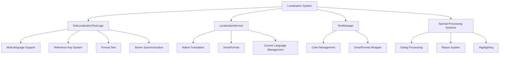

# Localization

ChuChu Burger has a comprehensive multi-language support system for players worldwide. It supports 5 languages (Korean, English, Simplified Chinese, Traditional Chinese, Spanish) and provides advanced localization features including dynamic parameter insertion, reference key systems, and rich text.

## Localization System Overview

### Core Localization Architecture



## GetLocalizationTextLogic Central Management

### Multi-language Support System

ChuChu Burger supports 5 major languages.

```lua
-- GetLocalizationTextLogic.mlua :: Supported language list
property table SupportedLocaleList = {"ko", "en", "zh-cn", "zh-tw", "es"}

-- Get current language
@ExecSpace("ClientOnly")
method string GetText(string key)
    return _LocalizationService:GetTranslatorForLocale(_LocalizationService.CurrentLocaleId):GetText(key) 
end
```

#### Translation Tables by Language

Localization data is managed in LocalizationTable CSV:

| Key | ko | en | zh-cn | zh-tw | es | type | Arguments |
|-----|----|----|-------|-------|----|----- |-----------|
| Burger | 버거 | Burger | 汉堡 | 漢堡 | Hamburguesa | Default text | |
| Welcome | 환영합니다 | Welcome | 欢迎 | 歡迎 | Bienvenido | Format text | Player |

### Default Text and Format Text

```lua
-- GetLocalizationTextLogic.mlua :: MakeLocalizeDataText()
method string MakeLocalizeDataText(string textKey)
    local table = _DataService:GetTable("LocalizationTable")
    local row = table:FindRow("Key", textKey)
    
    if row == nil then 		
        if self:IsReferKey(textKey) == true then
            return self:GetReferKeyText(textKey)
        else	
            return self.errorText
        end
    end
    
    local source = row:GetItem("type")
    
    if source == "Default text" then
        -- Default text: simple translation
        local text = _LocalizationService:GetTranslatorForLocale(_LocalizationService.CurrentLocaleId):GetText(textKey) 
        return text
        
    elseif source == "Format text" then
        -- Format text: includes parameters
        local args = _UtilLogic:Split(row:GetItem("Arguments"), "/")
        return self:ProcessFormatText(textKey, args)
    end
end
```

### Multi-parameter System

Flexible text formatting system supporting up to 4 parameters.

#### 1 Parameter Processing

```lua
-- GetLocalizationTextLogic.mlua :: 1 parameter processing
if #args == 1 then
    local text1 = args[1]
    if self:IsReferKey(args[1]) == true then
        text1 = self:GetReferKeyText(text1)
    else	
        text1 = _LocalizationService:GetTranslatorForLocale(_LocalizationService.CurrentLocaleId):GetText(args[1]) 
    end	
    
    return _LocalizationService:GetTranslatorForLocale(_LocalizationService.CurrentLocaleId):GetTextFormat(textKey, text1)
end

-- Usage example
-- In LocalizationTable:
-- Key: "WelcomeMessage"
-- Arguments: "Player"
-- ko: "{0}님, 환영합니다!"
-- en: "Welcome, {0}!"

-- Result:
-- Korean: "김철수님, 환영합니다!"
-- English: "Welcome, KimChulSoo!"
```

#### 2 Parameter Processing

```lua
-- GetLocalizationTextLogic.mlua :: 2 parameter processing  
elseif #args == 2 then
    local text1 = args[1]
    local text2 = args[2]		
    
    for i, arg in ipairs(args) do
        if self:IsReferKey(arg) == true then
            if i == 1 then 
                text1 = self:GetReferKeyText(text1)
            elseif i == 2 then	
                text2 = self:GetReferKeyText(text2)
            end
        else	
            if i == 1 then 
                text1 = _LocalizationService:GetTranslatorForLocale(_LocalizationService.CurrentLocaleId):GetText(arg)
            elseif i == 2 then	
                text2 = _LocalizationService:GetTranslatorForLocale(_LocalizationService.CurrentLocaleId):GetText(arg)
            end
        end			
    end	
    
    return _LocalizationService:GetTranslatorForLocale(_LocalizationService.CurrentLocaleId):GetTextFormat(textKey, text1, text2)
end

-- Usage example
-- Key: "OrderComplete"
-- Arguments: "Player/PlayerShopName"
-- ko: "{0}님이 {1}에서 주문을 완료했습니다!"
-- en: "{0} completed an order at {1}!"
```

#### 3 and 4 Parameter Processing

```lua
-- GetLocalizationTextLogic.mlua :: Support up to 4 parameters
elseif #args == 4 then	
    local text1 = args[1]
    local text2 = args[2]	
    local text3 = args[3]
    local text4 = args[4]
    
    -- Process each parameter (reference key or localization key)
    for i, arg in ipairs(args) do
        -- ... individual parameter processing logic
    end
    
    return _LocalizationService:GetTranslatorForLocale(_LocalizationService.CurrentLocaleId):GetTextFormat(textKey, text1, text2, text3, text4)
end
```

### Reference Key System

Special key system for inserting dynamic data into text.

```lua
-- GetLocalizationTextLogic.mlua :: GetReferKeyText()
method string GetReferKeyText(string referKey)
    local referText = referKey
    
    if referKey == "Player" then
        referText = _UserService.LocalPlayer.PlayerComponent.Nickname
        
    elseif referKey == "PlayerShopName" then	
        referText = _UserService.LocalPlayer.PlayerOutgameManager.StoreName
        
    elseif referKey == "PassedYear" then
        referText = _IntroDialogLogic.OutroYear
    end 
    
    return referText
end

-- Reference key check
method boolean IsReferKey(string arg)
    local isReferKey = false
    for i, referKey in pairs(self.ReferKeys) do
        if referKey == arg then
            isReferKey = true
        end
    end
    return isReferKey 
end
```

#### Reference Key Registration System

```lua
-- GetLocalizationTextLogic.mlua :: OnBeginPlay()
method void OnBeginPlay()
    local referKeyTable = _DataService:GetTable("LocalizationReferKeyTable")
    local keyCount = referKeyTable:GetRowCount() 
    
    for i = 1, keyCount do
        table.insert(self.ReferKeys, referKeyTable:GetCell(i, "Key"))
    end
end
```

Available reference keys:
- **Player**: Player nickname
- **PlayerShopName**: Player store name  
- **PassedYear**: In-game elapsed years

## LocalizationService Native Service

### Basic Translation Features

Utilizes MapleStory Worlds' built-in localization service.

```lua
-- Check current language
local currentLanguage = _LocalizationService.CurrentLocaleId
print("Current Language: " .. currentLanguage)  -- "ko", "en", etc.

-- Get basic text
local text = _LocalizationService:GetText("Burger")
print(text)  -- "버거" (Korean), "Burger" (English)

-- Use format text
local welcomeText = _LocalizationService:GetTextFormat("WelcomeMessage", playerName)
print(welcomeText)  -- "김철수님, 환영합니다!"
```

#### Translate to Specific Language

```lua
-- Get Translator for specific language
local koreanTranslator = _LocalizationService:GetTranslatorForLocale("ko")
local englishTranslator = _LocalizationService:GetTranslatorForLocale("en")

local koreanText = koreanTranslator:GetText("Burger")  -- "버거"
local englishText = englishTranslator:GetText("Burger")  -- "Burger"

-- Format text also supported
local formattedText = koreanTranslator:GetTextFormat("WelcomeMessage", "김철수")
```

### SmartFormat System

```lua
-- LocalizationService.mlua :: SmartFormat
local smartText = _LocalizationService:SmartFormat("Hello {0}, you have {1} items", playerName, itemCount)
print(smartText)  -- "Hello 김철수, you have 10 items"

-- Complex formatting
local complexText = _LocalizationService:SmartFormat(
    "Player: {0}, Shop: {1}, Revenue: {2:C}, Date: {3:D}",
    playerName, shopName, revenue, date
)
```

## TextManager Color and Style

### Color Management System

Manages predefined colors applicable to text.

```lua
-- TextManager.mlua :: Color constants
property string Yellow = "#FFE92C"
property string Red = "#FA5246"
property string Grey = "#DDDDDD"
property string White = "#FFFFFF"
property string Brick = "#DD6822"
property string Olive = "#635743"
property string Skyblue = "#1091C7"

-- Get color hex code
method string GetHexCode(string color)
    if color == "yellow" then
        return self.Yellow
    elseif color == "red" then
        return self.Red
    -- ... other colors
    else
        return "#FFFFFF"  -- Default white
    end
end

-- Usage example
local yellowHex = _TextManager:GetHexCode("yellow")
local coloredText = "<color=" .. yellowHex .. ">Important text</color>"
```

#### Rich Text Color Application

```lua
-- Create colored text
local function CreateColoredText(text, colorName)
    local hexCode = _TextManager:GetHexCode(colorName)
    return "<color=" .. hexCode .. ">" .. text .. "</color>"
end

-- Usage
local redWarning = CreateColoredText("Warning!", "red")
local yellowHighlight = CreateColoredText("Important", "yellow")
```

### SmartFormat Wrapper Methods

```lua
-- TextManager.mlua :: SmartFormat wrappers
method string GetSmartText(string str, any arg1)
    return _LocalizationService:SmartFormat(str, arg1)
end

method string GetSmartText2(string str, any arg1, any arg2)
    return _LocalizationService:SmartFormat(str, arg1, arg2)
end

method string GetSmartText3(string str, any arg1, any arg2, any arg3)
    return _LocalizationService:SmartFormat(str, arg1, arg2, arg3)
end

method string GetSmartText4(string str, any arg1, any arg2, any arg3, any arg4)
    return _LocalizationService:SmartFormat(str, arg1, arg2, arg3, arg4)
end

-- Usage example
local text1 = _TextManager:GetSmartText("Hello {0}!", playerName)
local text2 = _TextManager:GetSmartText2("Player {0} earned {1} coins", playerName, coins)
```

## Server-Client Synchronization

### Server-side Localization System

System for when localized text is needed on the server.

```lua
-- GetLocalizationTextLogic.mlua :: LocalizedTextServer management
property table LocalizedTextServer = {}

-- Request sending localized text to server
@ExecSpace("Client")
method void RequestSetLocalizedTextServer()
    local serverKeyList = {
        "Burger", 
        "InitialBurgerName", 
        "ItemNameG1001", "ItemNameM4001", "ItemNameM4002", "ItemNameM4003", 
        "MaxStackCountMailMessage", 
        "MaintenanceRewardText" 
    }
    
    for _, key in pairs(serverKeyList) do
        local localizedTextData = LocalizedTextServer()
        localizedTextData.key = key
        
        table.clear(localizedTextData.localeText)
        for _, localeId in pairs(self.SupportedLocaleList) do
            localizedTextData.localeText[localeId] = 
                _LocalizationService:GetTranslatorForLocale(localeId):GetText(key) 
        end
        
        self.LocalizedTextServer[key] = localizedTextData
    end
    
    -- Send to server
    local currentLocaleId = _LocalizationService.CurrentLocaleId
    self:SetLocalizedTextServer(self.LocalizedTextServer, currentLocaleId, self.SupportedLocaleList, _UserService.LocalPlayer)
end
```

#### LocalizedTextServer Structure

```lua
-- LocalizedTextServer.mlua :: Server-side localization data
@Struct
script LocalizedTextServer

property string key = ""
property SyncTable<string, string> localeText

method string GetText(string localeId)
    return self.localeText[localeId]
end
```

#### Using Localized Text on Server

```lua
-- GetLocalizationTextLogic.mlua :: GetLocalizedTextServer()
@ExecSpace("Server")
method string GetLocalizedTextServer(string localeId, string key)
    local localizedTextServer = self.LocalizedTextServer[key]
    return localizedTextServer.localeText[localeId]
end

-- Usage example
local koreanBurgerName = _GetLocalizationTextLogic:GetLocalizedTextServer("ko", "Burger")  -- "버거"
local englishBurgerName = _GetLocalizationTextLogic:GetLocalizedTextServer("en", "Burger")  -- "Burger"
```

## Special Text Processing Systems

### Dialog Text Processing

Special text substitution system used in dialogs.

```lua
-- DialogDataLogic.mlua :: ChangeDefinitionWord()
method string ChangeDefinitionWord(string message)
    local result = message
    local highlight = {}
    
    -- Player nickname substitution
    local nick = _UserService.LocalPlayer.PlayerComponent.Nickname
    result, _ = string.gsub(result, "@Nick", nick)
    
    -- Store name substitution
    local storeName = _UserService.LocalPlayer.PlayerOutgameManager.StoreName
    result, _ = string.gsub(result, "@Store", storeName)
    
    -- Line break processing
    local empty = " \n"
    result, _ = string.gsub(result, "@enter", empty)
    
    -- Highlight marker processing
    local highStr = "*"
    while string.find(result, highStr) do
        local a, _ = string.find(result, highStr)
        highlight[#highlight+1] = a
        result, _ = string.gsub(result, highStr, "", 1)
    end
    
    return result, highlight
end
```

#### Dialog Substitution Rules

- **@Nick** → Player nickname
- **@Store** → Player store name  
- **@enter** → Line break
- **\*** → Highlight start/end marker

#### Highlighting System

```lua
-- DialogDataLogic.mlua :: SetHighlight()
method string SetHighlight(string target, table highlightTable)
    if #highlightTable == 0 then
        return target
    end
    
    local result = string.sub(target, 0, highlightTable[1]-1)
    local first = "<color=#"..self.HighligtColor..">" 
    local last = "</color>" 
    
    for i=1, #highlightTable do
        local nextidx = highlightTable[i+1]
        if not nextidx then
            nextidx = -1
        end
        
        if i%2 == 1 then
            result = result..first..string.sub(target, highlightTable[i], nextidx-1)
        elseif i == #highlightTable then
            result = result..last..string.sub(target, highlightTable[i], nextidx)
        else
            result = result..last..string.sub(target, highlightTable[i], nextidx-1)
        end
    end
    
    return result
end

-- Usage example
local originalText = "Hello *@Nick*! Welcome to *@Store*!"
local processedText, highlights = DialogDataLogic:ChangeDefinitionWord(originalText)
-- Result: "Hello John! Welcome to Delicious Burger Shop!"

local finalText = DialogDataLogic:SetHighlight(processedText, highlights)
-- Result: "Hello <color=#FFFF00>John</color>! Welcome to <color=#FFFF00>Delicious Burger Shop</color>!"
```

### Report Message System

Localization system for in-game notification messages.

```lua
-- ReportMessageMaker.mlua :: MakeReport()
method void MakeReport(integer reportId, string param1, string param2, string param3)
    local reportData = _StoreInfoDataSetLogic.StoreInfoReportData[reportId]
    if reportData == nil then return end
    
    local categoryTextKey = reportData.CategoryTextKey
    local reportTexttkey = reportData.ReportTextKey
    local paramCount = tonumber(reportData.ParamCount)
    
    local reportText = ""
    
    if paramCount <= 0 then
        reportText = _LocalizationService:GetTranslatorForLocale(_LocalizationService.CurrentLocaleId):GetText(reportTexttkey) 
        
    elseif paramCount <= 1 then
        if self:CheckParamIsNilOrNot(param1) then return end 
        reportText = _LocalizationService:GetTranslatorForLocale(_LocalizationService.CurrentLocaleId):GetTextFormat(reportTexttkey, param1)
        
    elseif paramCount <= 2 then
        if self:CheckParamIsNilOrNot(param1) then return end 
        if self:CheckParamIsNilOrNot(param2) then return end 
        reportText = _LocalizationService:GetTranslatorForLocale(_LocalizationService.CurrentLocaleId):GetTextFormat(reportTexttkey, param1, param2)
        
    elseif paramCount <= 3 then
        -- 3 parameter processing
        reportText = _LocalizationService:GetTranslatorForLocale(_LocalizationService.CurrentLocaleId):GetTextFormat(reportTexttkey, param1, param2, param3)
    end
    
    -- Add to report queue
    table.insert(self.ReportMessageQueue, reportText)
end
```

### Toast Message Localization

```lua
-- GetLocalizationTextLogic.mlua :: CallToastByLocalizationKey()
method void CallToastByLocalizationKey(string key, table args, boolean needLocalize)
    if needLocalize then
        local newArgs = {}
        for i, arg in pairs(args) do
            table.insert(newArgs, _GetLocalizationTextLogic:GetText(arg))
        end
        table.initialize(args, newArgs)
    end
    
    local message = ""
    if isvalid(args) then
        if #args == 1 then
            message = _LocalizationService:GetTranslatorForLocale(_LocalizationService.CurrentLocaleId):GetTextFormat(key, args[1])
        elseif #args == 2 then
            message = _LocalizationService:GetTranslatorForLocale(_LocalizationService.CurrentLocaleId):GetTextFormat(key, args[1], args[2])
        -- ... up to 4 parameters
        else
            message = _GetLocalizationTextLogic:GetText(key)
        end
    else
        message = _GetLocalizationTextLogic:GetText(key)
    end
    
    _UIToast:ShowMessage(message)
end

-- Usage example
_GetLocalizationTextLogic:CallToastByLocalizationKey("ItemReceived", {"Player", "ItemNameG1001"}, true)
-- Result: "John received a burger!" (keys in args are also localized)
```

## Practical Usage Examples

### Using Localized Text in UI

```lua
-- UI text setup
local function SetLocalizedUIText(textComponent, key, ...args)
    local localizedText
    if args and #args > 0 then
        localizedText = _LocalizationService:GetTextFormat(key, ...)
    else
        localizedText = _LocalizationService:GetText(key)
    end
    
    textComponent.text = localizedText
end

-- Usage example
SetLocalizedUIText(welcomeLabel, "WelcomeMessage", playerName)
SetLocalizedUIText(menuTitle, "MenuTitle")  -- No parameters
```

### Dynamic Text Generation

```lua
-- Dynamic text based on player status
local function GetStatusMessage(player)
    local playerName = player.PlayerComponent.Nickname
    local shopName = player.PlayerOutgameManager.StoreName
    local level = player.PlayerManagement.ManagementLevel
    
    if level >= 10 then
        return _LocalizationService:GetTextFormat("HighLevelStatus", playerName, shopName, level)
    elseif level >= 5 then
        return _LocalizationService:GetTextFormat("MidLevelStatus", playerName, shopName, level)
    else
        return _LocalizationService:GetTextFormat("LowLevelStatus", playerName, shopName)
    end
end
```

### Colored Localized Text

```lua
-- Using color and localization together
local function CreateColoredLocalizedText(key, colorName, ...args)
    local text
    if args and #args > 0 then
        text = _LocalizationService:GetTextFormat(key, ...)
    else
        text = _LocalizationService:GetText(key)
    end
    
    local hexCode = _TextManager:GetHexCode(colorName)
    return "<color=" .. hexCode .. ">" .. text .. "</color>"
end

-- Usage example
local redWarning = CreateColoredLocalizedText("WarningMessage", "red", playerName)
local yellowHighlight = CreateColoredLocalizedText("ImportantNotice", "yellow")
```

## Developer Guide

### Adding New Localization Keys

1. **Add new row to LocalizationTable.csv**:
   ```csv
   Key,ko,en,zh-cn,zh-tw,es,type,Arguments
   NewFeatureTitle,새로운 기능,New Feature,新功能,新功能,Nueva Función,Default text,
   ```

2. **Use in code**:
   ```lua
   local title = _LocalizationService:GetText("NewFeatureTitle")
   ```

### Adding Parameterized Text

1. **Set as Format text in CSV**:
   ```csv
   Key,ko,en,type,Arguments
   PlayerAction,{0}님이 {1}을 했습니다,{0} did {1},Format text,Player/ActionName
   ```

2. **Use in code**:
   ```lua
   local message = _GetLocalizationTextLogic:MakeLocalizeDataText("PlayerAction")
   -- Or directly
   local message = _LocalizationService:GetTextFormat("PlayerAction", playerName, actionName)
   ```

### Adding Reference Keys

1. **Add to LocalizationReferKeyTable.csv**:
   ```csv
   Key
   Player
   PlayerShopName
   NewReferenceKey
   ```

2. **Add handling in GetLocalizationTextLogic.mlua**:
   ```lua
   method string GetReferKeyText(string referKey)
       -- ... existing code ...
       elseif referKey == "NewReferenceKey" then
           referText = GetNewReferenceValue()
       end 
       
       return referText
   end
   ```

### Performance Optimization

#### Text Caching

```lua
local textCache = {}

local function GetCachedText(key, locale)
    local cacheKey = key .. "_" .. locale
    if textCache[cacheKey] == nil then
        textCache[cacheKey] = _LocalizationService:GetTranslatorForLocale(locale):GetText(key)
    end
    return textCache[cacheKey]
end
```

#### Batch Loading

```lua
-- Load frequently used texts at once
local function PreloadCommonTexts()
    local commonKeys = {"Burger", "WelcomeMessage", "MenuTitle", "WarningMessage"}
    local currentLocale = _LocalizationService.CurrentLocaleId
    
    for _, key in pairs(commonKeys) do
        GetCachedText(key, currentLocale)
    end
end
```

### Error Handling

```lua
-- Safe text retrieval
local function SafeGetText(key, fallback)
    pcall(function()
        local text = _LocalizationService:GetText(key)
        if text and text ~= "" then
            return text
        else
            return fallback or key
        end
    end)
    
    return fallback or key
end

-- Safe format text
local function SafeGetTextFormat(key, fallback, ...args)
    pcall(function()
        local text = _LocalizationService:GetTextFormat(key, ...)
        if text and text ~= "" then
            return text
        else
            return fallback or key
        end
    end)
    
    return fallback or key
end
```

## Code References

### Central Localization Management
- `RootDesk/MyDesk/Common/Localization/GetLocalizationTextLogic.mlua :: GetText(), MakeLocalizeDataText()` — Central localization system
- `RootDesk/MyDesk/Common/Localization/GetLocalizationTextLogic.mlua :: GetReferKeyText(), IsReferKey()` — Reference key system
- `RootDesk/MyDesk/Common/Localization/GetLocalizationTextLogic.mlua :: CallToastByLocalizationKey()` — Toast message localization

### Native Services
- `Environment/NativeScripts/Service/LocalizationService.d.mlua :: GetText(), GetTextFormat()` — Basic localization service
- `Environment/NativeScripts/Service/LocalizationService.d.mlua :: GetTranslatorForLocale()` — Specific language translator
- `Environment/NativeScripts/Service/LocalizationService.d.mlua :: SmartFormat()` — Smart formatting

### Color and Text Management
- `RootDesk/MyDesk/Common/Localization/TextManager.mlua :: GetHexCode(), GetSmartText()` — Color management and SmartFormat wrapper
- `RootDesk/MyDesk/Common/Localization/LocalizedTextServer.mlua :: GetText()` — Server-side localization data

### Special Processing Systems
- `RootDesk/MyDesk/15. Intro/Dialog/DialogDataLogic.mlua :: ChangeDefinitionWord(), SetHighlight()` — Dialog text processing
- `RootDesk/MyDesk/01. Lobby/ReportMessageMaker.mlua :: MakeReport()` — Report message localization

### Core Interfaces
```lua
-- GetLocalizationTextLogic main methods
method string GetText(string key)
method string MakeLocalizeDataText(string textKey)
method string GetReferKeyText(string referKey)
method void CallToastByLocalizationKey(string key, table args, boolean needLocalize)

-- LocalizationService main methods
method string GetText(string key)
method string GetTextFormat(string key, any... args)
method Translator GetTranslatorForLocale(string localeId)
method string SmartFormat(string format, any... args)

-- TextManager main methods
method string GetHexCode(string color)
method string GetSmartText(string str, any arg1)
method string GetSmartText2(string str, any arg1, any arg2)
```
