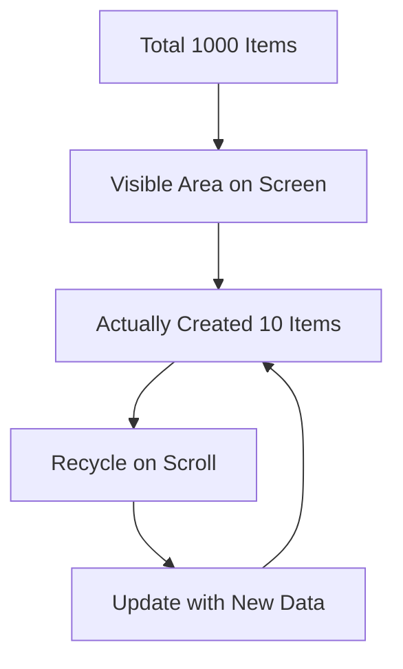
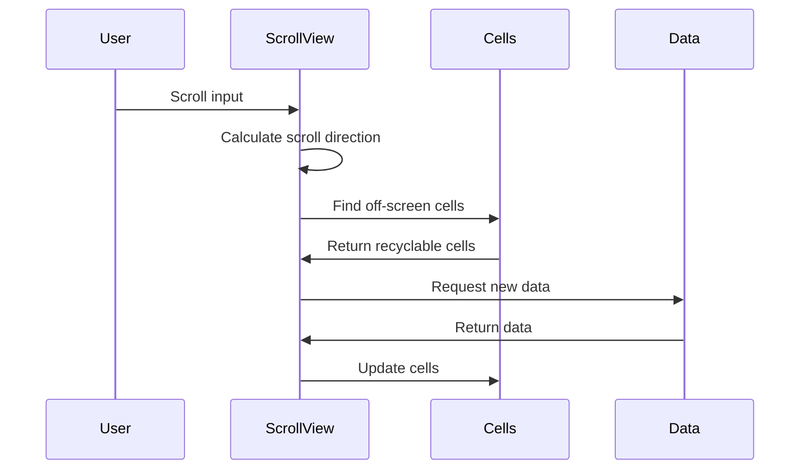

# Large Lists

ChuChu Burger uses a virtualized scrollview system to efficiently display hundreds of items. This system minimizes memory usage while providing smooth scrolling experiences.

## Core System Overview

### RecycleScrollView

The core virtualized scrollview component for large lists.

#### Virtualization Principle



**Basic Concept:**
- Only create actual entities for the portion visible on screen from total items
- On scroll, recycle existing entities and update with new data
- Memory usage doesn't scale with item count

## RecycleScrollView Detailed Structure

### Core Properties

#### Layout Settings
- **Padding**: Content area margins (Vector4)
- **Spacing**: Spacing between items (Vector2)
- **ItemsPerLine**: Number of items per line
- **ScrollingType**: Scroll direction (vertical/horizontal)

#### Performance-related
- **TotalCount**: Total number of items
- **MaxContentSize**: Maximum scrollable size
- **CalcCells**: Calculated cells in current screen

#### Callback System
- **onUpdateCell**: Callback called on cell update
- **onDragEndCallback**: Callback called at end of drag

### Core Methods

#### Initialization and Setup
SetTotalCount() method sets total item count and triggers automatic refresh:

`self.TotalCount = count; self:Refresh(true)`

<details>
<summary>SetTotalCount Method Implementation</summary>

```lua
-- RootDesk/MyDesk/RecycleScrollView/RecycleScrollView.mlua :: SetTotalCount()
method void SetTotalCount(integer count)
    self.TotalCount = count
    self:Refresh(true)
end
```
</details>

#### Cell Creation and Recycling
GetOrCreateItem() method efficiently manages UI items:

1. **Check existing items**: Search for reusable items with GetChildByName()
2. **Create new**: Generate new item with SpawnService if none exists
3. **Memory efficiency**: Maximize reuse of existing items

<details>
<summary>Cell Creation and Recycling Logic</summary>

```lua  
-- RootDesk/MyDesk/RecycleScrollView/RecycleScrollView.mlua :: GetOrCreateItem()
method Entity GetOrCreateItem(integer index, Vector3 pos)
    local result = self.Content:GetChildByName("Item"..index)
    
    if result == nil then
        result = _SpawnService:SpawnByEntity(self.Item, "Item"..index, pos, self.Content)
    end
    
    return result
end
```
</details>

#### Cell Update
UpdateCell() method updates data and position for each cell:

1. **Set index**: Set current data index with cell.CurrentIndex = index
2. **Visibility control**: Only activate cells within TotalCount range
3. **Data binding**: Set actual data through onUpdateCell callback
4. **Position update**: Adjust UI position with anchoredPosition

<details>
<summary>Cell Update Logic</summary>

```lua
-- RootDesk/MyDesk/RecycleScrollView/RecycleScrollView.mlua :: UpdateCell()
method void UpdateCell(ScrollItem cell, Vector2 position, integer index)
    cell.CurrentIndex = index
    
    if self.TotalCount < index then
        cell.Entity:SetEnable(false)
    else
        cell.Entity:SetEnable(true)
        
        if self.onUpdateCell ~= nil then
            self.onUpdateCell(cell.CurrentIndex, cell.Entity)
        end
    end
    
    cell.Entity.UITransformComponent.anchoredPosition = position
end
```
</details>

### ScrollItem Data Structure

Structure managing metadata for each scroll item:

- **CurrentIndex**: Index of currently displayed data
- **RealIndex**: Index of actual UI entity  
- **Entity**: Reference to connected UI entity

<details>
<summary>ScrollItem Structure Definition</summary>

```lua
-- RootDesk/MyDesk/RecycleScrollView/ScrollItem.mlua
struct ScrollItem
    property integer CurrentIndex -- Current data index
    property integer RealIndex    -- Actual entity index  
    property Entity Entity        -- Connected UI entity
end
```
</details>

## Scrolling Algorithm

### Vertical Scrolling



#### Vertical Movement Processing
MoveVertical() method handles cell rearrangement during scroll movement:

1. **Direction calculation**: Adjust actual movement with CalculateOffset()
2. **Cell recycling**: Move invisible cells to opposite side based on scroll direction
3. **Data refresh**: Bind new data to rearranged cells

Core logic: `if dir.y < 0 then -- Upward scroll` / `elseif dir.y > 0 then -- Downward scroll`

<details>
<summary>Vertical Movement Processing Implementation</summary>

```lua
-- RootDesk/MyDesk/RecycleScrollView/RecycleScrollView.mlua :: MoveVertical()
method void MoveVertical(Vector2 dir)
    dir.y += self:CalculateOffset(dir)
    
    if dir.y == 0 then
        return
    end
    
    local tempCells = {}
    if dir.y < 0 then  -- Upward scroll
        -- Recycle bottom cells and place at top
        for i = #self.CalcCells, 1, -1 do
            local cell = self.CalcCells[i]
            table.insert(tempCells, cell)
        end
    elseif dir.y > 0 then  -- Downward scroll
        -- Recycle top cells and place at bottom
        for i = 1, #self.CalcCells, 1 do
            local cell = self.CalcCells[i]
            table.insert(tempCells, cell)
        end
    end
    
    -- Cell rearrangement and data update
    -- ... complex rearrangement logic
end
```
</details>

### Performance Optimization Techniques

#### 1. Viewport Culling
Deactivate items not visible on screen:
`cell.Entity:SetEnable(false)` — Prevent unnecessary rendering

#### 2. Layout Calculation Optimization
Calculate only necessary item count:
`local maxRow = calcRow + 2` — Add 2 buffer to base display count

#### 3. Boundary Check
Limit scroll range with CalculateOffset():
Prevent overscroll and provide smooth boundary handling

<details>
<summary>Performance Optimization Implementation</summary>

```lua
-- Viewport culling
if self.TotalCount < index then
    cell.Entity:SetEnable(false)
else
    cell.Entity:SetEnable(true)
    -- Data update
end

-- Layout calculation optimization
local calcRow = math.tointeger(size.y / (itemSize.y + self.Spacing.y))
local maxRow = calcRow + 2  -- Add buffer

-- Boundary check
method number CalculateOffset(Vector2 dir)
    local offset = 0
    -- Boundary check and offset calculation
    return offset
end
```
</details>

## Badge UI System Implementation

### UIBadgeList

RecycleScrollView-based system for displaying badge lists.

#### Filtering System
SetFilter() method filters badge list by grade and achievement status:

1. **Grade filtering**: Select badges based on filter value (9 for all, others for specific grade)
2. **Achievement status filtering**: Separate completed/incomplete badges based on SelectTab
3. **List refresh**: Update RecycleScrollView with filtered badges

Core logic: `if self.SelectTab == 1 and isAchieved == true then continue end`

<details>
<summary>Badge Filtering System Implementation</summary>

```lua
-- RootDesk/MyDesk/18. Badge/UIBadgeList.mlua :: SetFilter()
method void SetFilter(integer filter)
    self.NowFilter = filter
    
    local drawList = {}
    for id, _ in pairs(_BadgeDataSetLogic.BadgeData) do
        local badgeData = _BadgeDataSetLogic:GetBadgeData(id)
        
        -- Grade filtering
        if self.NowFilter ~= 9 then
            if badgeData.Grade ~= self.NowFilter then
                continue
            end
        end
        
        -- Achievement status filtering
        local isAchieved = _UserService.LocalPlayer.PlayerBadge.BadgeAchieved[id]
        if self.SelectTab == 1 and isAchieved == true then
            continue  -- Exclude completed badges from incomplete tab
        end
        
        table.insert(drawList, id)
    end
    
    self.BadgeList:SetTotalCount(#drawList)
end
```
</details>

#### Sorting System
Sort badges in ascending order based on UISort value:

`return aSort < bSort` — Badges with lower UISort values placed first

<details>
<summary>Badge Sorting Logic</summary>

```lua
-- Badge sorting (based on UISort)
table.sort(drawList, function(a, b)
    local aSort = _BadgeDataSetLogic:GetBadgeData(a).UISort
    local bSort = _BadgeDataSetLogic:GetBadgeData(b).UISort
    return aSort < bSort
end)
```
</details>

#### Tab System
- **Incomplete tab**: Display unachieved badges
- **Complete tab**: Display achieved badges
- **Auto tab switching**: Switch to complete tab when all badges achieved

### UIBadgeSlot

Slot component displaying each badge item.

#### Display Elements
- **Icon**: Badge icon (grayscale applied based on achieved/unachieved status)
- **Grade**: Badge grade distinguished by color
- **Progress**: Slider display for badges with progress
- **Description**: Badge name and description text

#### Status-based Display
Refresh() method varies visual representation based on badge achievement status:

1. **Icon processing**: Color when achieved, grayscale material when unachieved
2. **Grade-based colors**: Basic (black), Gold (orange), Diamond (purple) distinction

Core logic: `local materialId = isAchieved and _IconRuidEnum.EmptyMaterial or _IconRuidEnum.GrayScaleMaterial`

<details>
<summary>Status-based Display Implementation</summary>

```lua
-- RootDesk/MyDesk/18. Badge/UIBadgeSlot.mlua :: Refresh()
local materialId = isAchieved and _IconRuidEnum.EmptyMaterial or _IconRuidEnum.GrayScaleMaterial
self.Icon:ChangeMaterial(materialId)

-- Grade-based colors
local gradeColor = function(g)
    if g == 0 then return _ColorCodeEnum:GetColor("#161615")     -- Basic
    elseif g == 1 then return _ColorCodeEnum:GetColor("#F78029") -- Gold
    elseif g == 2 then return _ColorCodeEnum:GetColor("#5F48D9") -- Diamond
    end
end
```
</details>

## Use Cases

### 1. Recipe List (UIRecipeList)
- Efficiently display dozens of recipes
- Support filtering and sorting functions
- Integration with favorites system

### 2. Ingredient Selection UI (UIIngreCardSetting)
- Display hundreds of ingredient cards
- Grade-based filtering
- Real-time search functionality

### 3. Employee Management UI (UIEmployeeManageList)
- Display hired employee list
- Skill-based sorting functionality
- Detailed information popup integration

## Memory Management Strategy

### 1. Object Pooling
Unused entities are only deactivated, not deleted:
`cell.Entity:SetEnable(false)` — Keep in reusable state

### 2. Lazy Loading
Load data only when needed through callbacks:
`if self.onUpdateCell ~= nil then self.onUpdateCell(cell.CurrentIndex, cell.Entity) end`

<details>
<summary>Memory Management Implementation</summary>

```lua
-- Unused entities are only deactivated
cell.Entity:SetEnable(false)
-- No actual deletion

-- Data loading only when needed
if self.onUpdateCell ~= nil then
    self.onUpdateCell(cell.CurrentIndex, cell.Entity)
end
```
</details>

### 3. Cache Optimization
- Cache frequently used data
- Reuse calculation results
- Prevent unnecessary updates

## Performance Metrics

### 1. Memory Usage
- Constant regardless of total item count
- Memory usage proportional to screen size

### 2. Rendering Performance
- Render only items visible on screen
- Minimize UI updates

### 3. Scroll Responsiveness
- Achieve 60FPS target
- Smooth scrolling experience

## Developer Guide

### RecycleScrollView Setup

1. **Basic setup**: Set item prefab, total count, callback functions
2. **Layout adjustment**: Padding, spacing, items per line
3. **Scroll direction**: Select vertical/horizontal
4. **Scrollbar integration**: Connect scrollbar component if needed

### Custom Item Implementation

1. **Create item prefab**: Prefab repetitive UI elements
2. **Data binding**: Set data in onUpdateCell callback
3. **Interaction handling**: Handle click, hover, etc. events
4. **State management**: Selection state, active state, etc.

### Performance Optimization Tips

1. **Appropriate buffer size**: Set extra item count appropriate to screen size
2. **Minimize updates**: Call Refresh only when data changes
3. **Texture optimization**: Use icon and image compression and atlases
4. **Garbage collection**: Prevent unnecessary object creation

## Code References

### RecycleScrollView Core
- `RootDesk/MyDesk/RecycleScrollView/RecycleScrollView.mlua :: OnUpdate(), Refresh(), UpdateCell()` — Virtualized scrollview core logic
- `RootDesk/MyDesk/RecycleScrollView/ScrollItem.mlua :: Init()` — Scroll item data structure

### Badge UI System  
- `RootDesk/MyDesk/18. Badge/UIBadgeList.mlua :: SetFilter(), Refresh(), SetSelectTab()` — Badge list management and filtering
- `RootDesk/MyDesk/18. Badge/UIBadgeSlot.mlua :: Refresh(), gradeColor()` — Individual badge slot display

**Core Interfaces:**

<details>
<summary>Large Lists Core Interfaces</summary>

```lua
-- RecycleScrollView main methods
method void SetTotalCount(integer count)
method void OnScroll(Vector2 dir)
method void UpdateCell(ScrollItem cell, Vector2 position, integer index)
method Entity GetOrCreateItem(integer index, Vector3 pos)

-- UIBadgeList main methods  
method void SetFilter(integer filter)
method void SetSelectTab(integer selectTab)
method void Refresh()

-- ScrollItem structure
struct ScrollItem
    property integer CurrentIndex
    property integer RealIndex
    property Entity Entity
```
</details>
