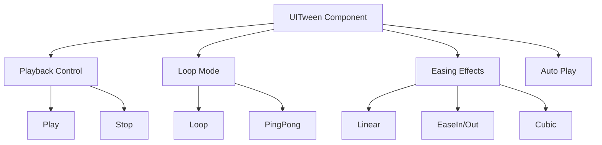
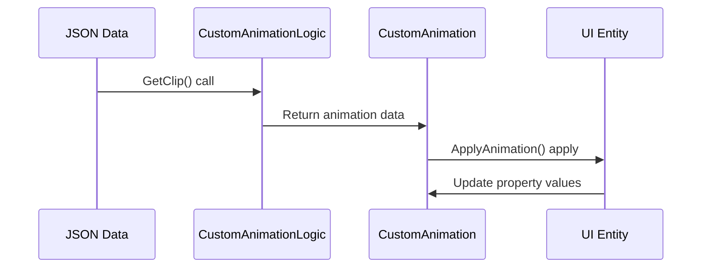
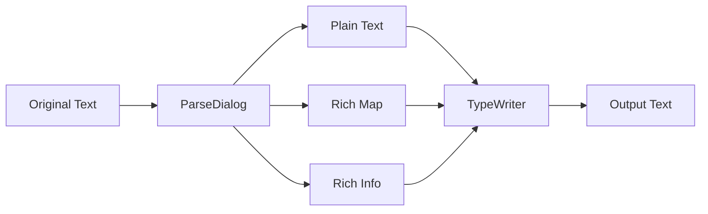

# UI Animation

ChuChu Burger provides rich and engaging user experiences through various UI animation systems. It includes everything from basic tween animations to advanced JSON-based animations and specialized typewriter effects.

## Core Animation Systems

### 1. UITween Series

Component-based system providing the most basic UI animations.

#### Basic Tween Components

##### UITweenAlpha
Handles transparency animations.
- **Properties**: `from`, `to` (alpha values)
- **Modes**: Loop, ping-pong, auto-play
- **Usage**: Fade in/out effects, blinking effects

##### UITweenPosition
Handles position animations.
- **Properties**: `from`, `to` (position vectors)
- **Modes**: Relative/absolute position, delay time support
- **Usage**: Slide effects, movement animations

##### UITweenScale
Handles size animations.
- **Properties**: `from`, `to` (scale vectors)
- **Modes**: RectSize/Scale selectable
- **Usage**: Expand/shrink effects, pulse effects

##### UITweenRotate
Handles rotation animations.
- **Properties**: `from`, `to` (rotation angles)
- **Axis**: Z-axis rotation
- **Usage**: Loading spinner, rotation effects

#### Special Tween Components

##### UITweenPopFade
Complex popup animation.
- **2-stage Y-axis animation**: Rise then fall
- **X-axis parabolic movement**: Natural trajectory
- **Fade out**: Transparency at specific point
- **Random elements**: Randomized delay and position

##### UITweenConfetti
Special animation for confetti effects.
- **Multiple particles**: Multiple confetti simultaneous animation
- **Physics simulation**: Gravity and wind effects
- **Random patterns**: Natural dispersion effects

### 2. Common Tween Features

All UITween components provide the following common functionality:



## Advanced Animation Systems

### 1. CustomAnimation

Advanced animation system based on JSON data, supporting complex multi-object animations.

#### Core Features
- **JSON Data-based**: Animation definition through external data
- **Multi-property**: Simultaneous Transform/Sprite/Text animation
- **Custom curves**: Free animation curve definition
- **Loop/ping-pong**: Various repeat modes
- **Frame rate control**: Precise timing control

#### Operation Principle


### 2. UIAnimation

Frame animation system based on CSV data.

#### Main Features
- **Frame-based**: Keyframe animation
- **Multi-entity**: Control multiple UI elements simultaneously
- **Tween interpolation**: Smooth interpolation between keyframes
- **Position scaling**: Resolution adaptation

## Typewriter Effect System

### 1. IntroOpeningCaption

Dedicated caption system for intro sequences.

#### Core Features
- **Sequential output**: Continuous output of 5 captions
- **Typing sound**: Keyboard typing sound effects
- **Speed control**: Speed reduction in latter half
- **Highlighting**: Special word emphasis
- **Dynamic generation**: Runtime entity creation

#### Typewriter Algorithm

The typewriter effect outputs characters sequentially based on real-time timers:

1. **Length calculation**: `math.ceil(self.PrintingRepeatTimer * self.Const_PrintRepeatVelocity)`
2. **Offset calculation**: UTF-8 safe string offset calculation
3. **Substring**: Extract text by calculated length

<details>
<summary>Typewriter Algorithm Implementation</summary>

```lua
-- RootDesk/MyDesk/15. Intro/Dialog/IntroOpeningCaption.mlua :: OnUpdate()
-- Core typing logic 
local len = math.ceil(self.PrintingRepeatTimer * self.Const_PrintRepeatVelocity)
local offset = utf8.offset(self.TargetText, len) - 1
local text = string.sub(self.TargetText, 1, offset)
```
</details>

### 2. EventDialogManager

Typewriter system for in-game events and dialogs.

#### Main Features
- **Rich text parsing**: HTML-style tag support
- **Skip function**: Instant completion display
- **Callback system**: Event triggers on completion
- **Timing control**: Variable speed adjustment

#### Parsing System


### 3. UIDialogPanel

Handles visual representation and interaction of dialog UI.

#### Component Structure
- **Various portrait types**: Sprite, MSW avatar, custom avatar
- **Choice system**: Branching dialog support
- **Emotion expression**: Avatar reaction system
- **Voice support**: Voice playback per dialog

## Animation Usage Patterns

### 1. Basic UI Effects

#### Button Click Effect
Feedback animation that expands button to 1.1x scale on click:
`scaleUp.to = Vector2(1.1, 1.1)` 

#### Popup Appearance Effect  
Natural popup appearance combining alpha and scale:
- **Fade in**: 0 → 1 alpha change
- **Scale up**: 0.8 → 1.0 size change

<details>
<summary>Basic UI Effects Implementation</summary>

```lua
-- Button scale animation
local scaleUp = UITweenScale:new()
scaleUp.from = Vector2(1, 1)
scaleUp.to = Vector2(1.1, 1.1)
scaleUp.duration = 0.1

-- Alpha + scale combination
local fadeIn = UITweenAlpha:new()
fadeIn.from = 0
fadeIn.to = 1

local popScale = UITweenScale:new() 
popScale.from = Vector2(0.8, 0.8)
popScale.to = Vector2(1, 1)
```
</details>

### 2. Complex Animations

#### Reward Acquisition Effect
Item popup effect using UITweenPopFade:
`popFade:StartTween(targetPosition, 2.0)` — 2-second popup fade animation

#### Confetti Celebration Effect  
Celebration effect using UITweenConfetti with specified particle count:
`confetti:StartEffect(50)` — Generate 50 confetti particles

<details>
<summary>Complex Animation Implementation</summary>

```lua
-- Item popup using PopFade
local popFade = UITweenPopFade:new()
popFade:StartTween(targetPosition, 2.0)

-- Confetti particle effect
local confetti = UITweenConfetti:new()
confetti:StartEffect(50) -- 50 confetti pieces
```
</details>

### 3. Performance Optimization

#### Animation Pooling
- Use object pools for frequently used tweens
- Automatic deactivation after animation completion
- Timer cleanup to prevent memory leaks

#### Conditional Animation
- Animation quality adjustment based on game settings
- Animation simplification in battery save mode
- Animation skip on low-performance devices

## Developer Guide

### UITween Component Usage

1. **Add component**: Attach desired Tween component to UI entity
2. **Set properties**: Configure from, to, duration, tweenType
3. **Select mode**: Set loop, pingpong, autoPlay options
4. **Playback control**: Use Play(), Stop() methods as needed

### CustomAnimation Data Structure

JSON data follows structure consisting of length, frameRate, curves:

- **length**: Total animation length (seconds)
- **frameRate**: Frame rate setting (usually 60fps)
- **curves**: Property animation data for each object

<details>
<summary>CustomAnimation JSON Data Structure</summary>

```json
{
  "length": 2.0,
  "frameRate": 60,
  "curves": [
    {
      "path": "UI/Button",
      "propertyName": "alpha",
      "keyframes": [
        {"time": 0, "value": 0},
        {"time": 1, "value": 1}
      ]
    }
  ]
}
```
</details>

### Typewriter Effect Implementation

1. **Text parsing**: Separate rich text from plain text
2. **Character-by-character output**: UTF-8 safe string processing
3. **Timing control**: Speed adjustment based on delta time
4. **Skip handling**: Instant completion on user input

## Code References

### UITween Series
- `RootDesk/MyDesk/UITween/UITweenAlpha.mlua :: OnUpdate(), Play(), Stop()` — Alpha tween animation
- `RootDesk/MyDesk/UITween/UITweenScale.mlua :: OnUpdate(), useRectSize` — Scale tween animation 
- `RootDesk/MyDesk/UITween/UITweenPosition.mlua :: OnUpdate(), relativeTo` — Position tween animation
- `RootDesk/MyDesk/UITween/UITweenPopFade.mlua :: StartTween(), StartFade()` — Complex popup fade animation

### CustomAnimation System
- `RootDesk/MyDesk/CustomAnimation/CustomAnimation.mlua :: OnUpdate(), InitClipData()` — JSON-based custom animation
- `RootDesk/MyDesk/CustomAnimation/CustomAnimationLogic.mlua :: ApplyAnimation(), GetClip()` — Animation logic processing

### Typewriter Effects
- `RootDesk/MyDesk/15. Intro/Dialog/IntroOpeningCaption.mlua :: OnUpdate(), SetData()` — Intro caption typewriter
- `RootDesk/MyDesk/08. Event/EventDialogManager.mlua :: TypeWriter(), PlayTypeWriter()` — Event dialog typewriter
- `RootDesk/MyDesk/15. Intro/Dialog/UIDialogPanel.mlua :: OnUpdate(), OnPrintEnd()` — Dialog UI typewriter

### UIAnimation System
- `RootDesk/MyDesk/UIAnimation/UIAnimation.mlua :: OnUpdate(), UpdateNextFrame()` — CSV-based frame animation

### Core Interfaces
**Animation System Core Interfaces:**

<details>
<summary>UI Animation Core Method Definitions</summary>

```lua
-- UITween common methods
method void Play()
method void Stop() 
method number PingPong(number t, number length)
method number Repeat(number t, number length)

-- CustomAnimation methods
method void ChangeAnimationClip(string clip)
method boolean InitClipData()

-- Typewriter methods
method void TypeWriter(table plainText, table richMap, table richInfo, number interval, any outputCallback)
method void PlayTypeWriter(TextComponent textComp, string text)
method void SkipTypeWriter()
```
</details>
